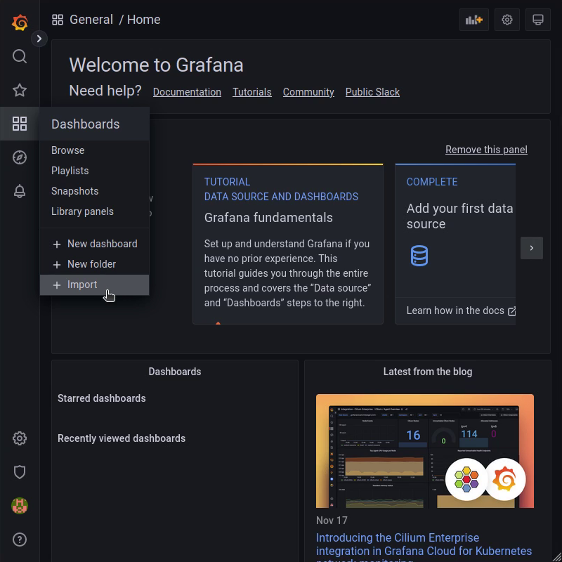
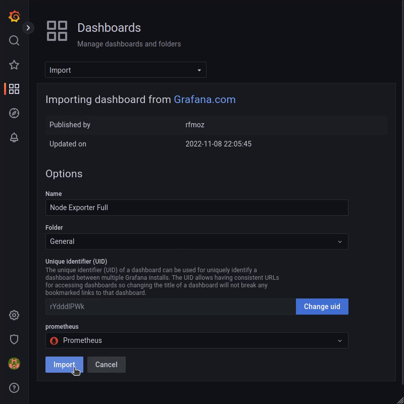
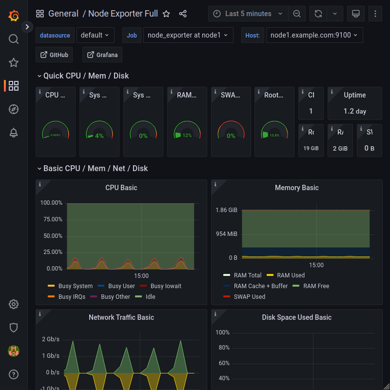

## Introduction

[Prometheus](https://prometheus.io) is a cloud-native metrics and monitoring solution. It can get metrics from any type of data sources for example web servers, system usage or networking equipment.

This tutorial covers the basic steps to query the performance data of a server and show it in a dashboard using [Grafana](https://grafana.com).

**Prerequisites**

* 2 Debian 11 servers
* Allow TCP port 9100 in the [iptables firewall](/tutorials/iptables) or the [Cloud Firewall](https://docs.hetzner.com/cloud/firewalls/overview) for incoming traffic (INPUT chain) on the **monitored node**
* Allow TCP port 3000 in the [iptables firewall](/tutorials/iptables) or the [Cloud Firewall](https://docs.hetzner.com/cloud/firewalls/overview) for incoming traffic (INPUT chain) on the **monitoring server**

**Test Setup**

Below we use **node1.example.com** to refer to **monitored node**, and **prometheus.example.com** to refer to **monitoring server**.

## Step 1 - Install Node Exporter on monitored node

The Prometheus stack consists of multiple components. The metrics storage is Prometheus itself, which scrapes metrics in periodic intervals from http endpoints. These endpoints can be provided by any software. You can find a list of exporters and integrations [here](https://prometheus.io/docs/instrumenting/exporters/).

For this tutorial, we will use [Node Exporter](https://github.com/prometheus/node_exporter) to get basic system metrics such as cpu usage, network throughput or disk I/O metrics.

The following commands install and configure the `node_exporter` on the target (monitored node).

```shell
apt update
apt install prometheus-node-exporter
```

Now, the http endpoint of the exporter should listen at tcp port 9100. Any http client like curl is able to request the metrics.

The following command show current metric values for systemd units.

```shell
root@node1.example.com:~# curl -s http://127.0.0.1:9100/metrics | grep node_systemd_units
# HELP node_systemd_units Summary of systemd unit states
# TYPE node_systemd_units gauge
node_systemd_units{state="activating"} 0
node_systemd_units{state="active"} 146
node_systemd_units{state="deactivating"} 0
node_systemd_units{state="failed"} 0
node_systemd_units{state="inactive"} 70
```

## Step 2 - Install Prometheus server on monitoring server

The Prometheus server is used to collect the exposed metrics of Node Exporter(s) into a time series database called OpenTSDB. It can be installed as follows.

```shell
apt update
apt install prometheus jq
```

The Prometheus server must be configured to know the Node Exporter metrics endpoint address. Add the following job description in `scrape_configs` section in file `/etc/prometheus/prometheus.yml`.

```yaml
scrape_configs:
  - job_name: 'node_exporter at node1'
    static_configs:
      - targets: ['node1.example.com:9100']
```

* `job_name` a human readable name of the job
* `static_configs` contains configuration for the hosts with static IPs
* `targets` contains an array of `<host>:<port>` to connect to

Finally, reload the Prometheus service in order to apply new config.

```shell
systemctl reload prometheus.service
```

Command `systemctl status prometheus` confirms the successful reload of the service.

To view the status of monitoring targets, you can execute the following command:

```shell
root@prometheus.example.com:~# curl --silent 127.0.0.1:9090/api/v1/targets | jq -r '.data.activeTargets[]|.scrapeUrl,.health,.lastError'
```

The output should look as follows:

```shell
http://node1.example.com:9100/metrics
up

```

## Step 3 - Setup Grafana dashboard on monitoring server

Now that the Prometheus server is continuously collecting metrics from our node, the data is stored for 15 days. There are multiple ways to display the metrics. The widely used way is to setup Grafana which is a dashboard server for multiple data sources.

Enable the Grafana repository and install Grafana on **prometheus.example.com** with the following commands:

```shell
apt install apt-transport-https software-properties-common wget
wget -q -O - https://packages.grafana.com/gpg.key | apt-key add -
echo "deb https://apt.grafana.com stable main" > /etc/apt/sources.list.d/grafana.list

apt update
apt install grafana
```

Finally, enable and start the Grafana daemon:

```shell
systemctl enable grafana-server.service
systemctl start grafana-server.service
```

## Step 4 - Configure Grafana data source and dashboard

The Grafana provides a web interface.
Please note that our Grafana setup us not secure at this stage.
Therefore be careful to use only credentials for testing while the connection between your browser and the dashboard server is not secure.

You can access the interface by browsing to

```url
http://prometheus.example.com:3000/
```

The default credentials are as follows:

* Username: **admin**
* Password: **admin**

After login, you are asked to change this password.

In this state, there is no data source or dashboard configured. First, add a data source.


Select data source type `Prometheus` and enter `http://localhost:9090` into the URL field.
After that, click `Save & test` button to create the data source.

There are two ways to create dashboards. You can create every panel individually or import predefined dashboards from the community.
For displaying node_exporter metrics, a good dashboard can be found [here](https://grafana.com/grafana/dashboards/1860).

Copy the ID to import the dashboard into your Grafana.



Press the **+ Import** button, insert the copied ID and click **Load**.
You need to select the Prometheus data source for the dashboard:



Finally, the Dashboard is imported and displays the data of the monitored node.



## Conclusion

You now have configured a Prometheus stack and can monitor a single node. This setup has the capability of monitoring more nodes/services.

Please consider to apply an SSL-enabled reverse proxy in front of the Grafana frontend as described in this [article](/tutorials/server-monitoring-using-grafana-and-influxdb#step-5---install-nginx) in the section "Step 5 - Install Nginx".

Besides static configs Prometheus can get hosts automatically, with a Service Discovery mechanism. For more information about supported Service Discovery providers please see [official documentation](https://prometheus.io/docs/prometheus/latest/configuration/configuration/#scrape_config), and [Prometheus Service Discovery article](/tutorials/prometheus-discovery) for Service Discovery for Hetzner Dedicated and Cloud servers.

##### License: MIT

<!--

Contributor's Certificate of Origin

By making a contribution to this project, I certify that:

(a) The contribution was created in whole or in part by me and I have
    the right to submit it under the license indicated in the file; or

(b) The contribution is based upon previous work that, to the best of my
    knowledge, is covered under an appropriate license and I have the
    right under that license to submit that work with modifications,
    whether created in whole or in part by me, under the same license
    (unless I am permitted to submit under a different license), as
    indicated in the file; or

(c) The contribution was provided directly to me by some other person
    who certified (a), (b) or (c) and I have not modified it.

(d) I understand and agree that this project and the contribution are
    public and that a record of the contribution (including all personal
    information I submit with it, including my sign-off) is maintained
    indefinitely and may be redistributed consistent with this project
    or the license(s) involved.

Signed-off-by: Florian Bauer

-->
