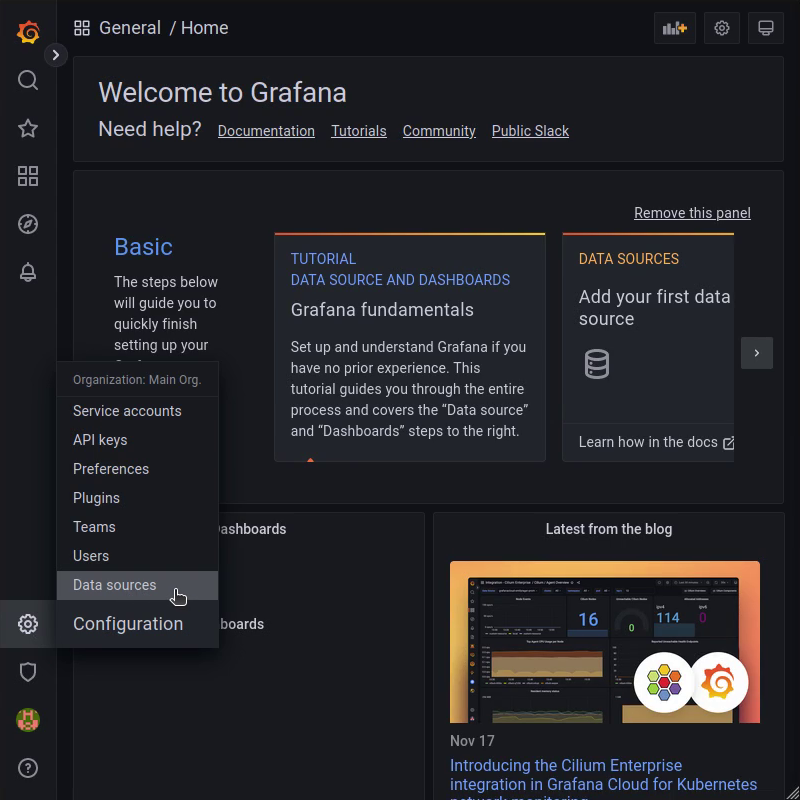

## Введение

[Prometheus](https://prometheus.io) это облачное решение для сбора метрик и мониторинга. Он может получить метрики с любого типа программного обеспечения таких как веб-сервер, системные значения или сетевое оборудование.

Этот туториал покрывает базывае шаги для запроса данных о производительности узла и отображения их на панели инструментов с помощью Grafana.

**Требования к установке**

* 2x Сервера с Debian 10 
* Необходимо разрешить трафик через 9100 порт в [iptables firewall](https://community.hetzner.com/tutorials/iptables) или на облачном фаерволе для входящего трафика (INPUT chain) с узла с которого будут считываться метрики.
* Необходимо разрешить трафик через 3000 порт в [iptables firewall](https://community.hetzner.com/tutorials/iptables) или на облачном фаерволе для входящего трафика (INPUT chain) на узле который будет считываться метрики.

**Тестовая установка**

```conf
2001:db8::1 node1.example.com
2001:db8::2 prometheus.example.com
```

## Шаг 1 - Установка Node Exporter на наблюдаемый узел.

Стек Prometheus состоит из нескольких компонентов. Хранилище метрик - это сам Prometheus, который периодически собирает метрики с конечных точек http. Эти конечные точки могут быть предоставлены любым программным обеспечением. Вы можете ознакомиться со списком экспортеров и интеграцией [здесь](https://prometheus.io/docs/instrumenting/exporters/).

Для этого туториала, мы будем использовать `node_exporter`, чтобы получить основные системные показатели, такие как загрузка процессора, пропускная способность сети или показатели ввода-вывода с диска. Следующие команды устанавливают и настраивают цель (наблюдаемый узел).

```shell
apt update
apt install prometheus-node-exporter
```

Следующие команды используются для автоматического запуска и включения службы node_exporter после перезагрузки.

```shell
systemctl enable prometheus-node-exporter.service
systemctl start prometheus-node-exporter.service
```

Теперь конечная точка http экспортера должна прослушивать tcp-порт 9100. Любой http-клиент, такой как curl, может собирать метрики:

```shell
root@node1.example.com:~# curl [2001:db8::1]:9100/metrics

# HELP apt_upgrades_pending Apt package pending updates by origin.
# TYPE apt_upgrades_pending gauge
apt_upgrades_pending{arch="amd64",origin="Debian-Security:10/stable"} 8
# HELP node_filesystem_size_bytes Filesystem size in bytes.
# TYPE node_filesystem_size_bytes gauge
node_filesystem_size_bytes{device="/dev/sda1",fstype="ext4",mountpoint="/"} 1.9970912256e+10
node_filesystem_size_bytes{device="/dev/sda15",fstype="vfat",mountpoint="/boot/efi"} 1.2594176e+08
# HELP node_forks_total Total number of forks.
# TYPE node_forks_total counter
node_forks_total 90780
# HELP node_intr_total Total number of interrupts serviced.
# TYPE node_intr_total counter
node_intr_total 1.6144664e+07
# HELP node_load1 1m load average.
# TYPE node_load1 gauge
node_load1 0.09
# HELP node_arp_entries ARP entries by device
# TYPE node_arp_entries gauge
node_arp_entries{device="eth0"} 3
```

## Шаг 2 - Установка сервера Prometheus на считывающий узел

Prometheus сервер используется для сбора метриков из Node Exporter(-ов) в временную базу данных называемой OpenTSDB. Его можно установить следуя командам:

```shell
apt update
apt install prometheus jq
```

Сервер Prometheus должен быть настроен так, чтобы знать адрес наблюдаемого узла для получения Node Exporter метриков. Добавьте следующее описание задачи в разделе `scrape_configs` в файле `/etc/prometheus/prometheus.yml`.

```yaml
scrape_configs:
  - job_name: 'node_exporter at node1'
    static_configs:
      - targets: ['node1.example.com:9100']
```

* `job_name` читаемое название для задачи
* `static_configs` содержит настройки для узла с статичными IPs адресами
* `targets` в содержит массив `<host>:<port>` для подключения к наблюдаемым серверам

Наконец перезагрузите сервис Prometheus чтобы принять новые настройки.

```shell
systemctl reload prometheus.service
```

Команда `systemctl status prometheus` подтверждает успешную перезагрузку сервиса.

Чтобы просмотреть статус целей мониторинга, вы можете выполнить следующую команду:

```shell
root@prometheus.example.com:~# curl --silent 127.0.0.1:9090/api/v1/targets | jq -r '.data.activeTargets[]|.scrapeUrl,.health,.lastError'
```

Результат должен выглядеть следующим образом:

```shell
http://node1.example.com:9100/metrics
up
```

## Шаг 3 - Установка панели Grafana на считывающий узел

Prometheus сервер продолжает собирать метрики для нашего сетевого узла, данные храняться 15 дней. Есть несколько способов отображать метрики. Широко используемый способ - настроить Grafana, который представляет собой сервер информационной панели для нескольких источников данных.

Включите репозиторий Grafana и установите Grafana на **prometheus.example.com** с помощью следующих команд:

```shell
apt install apt-transport-https software-properties-common wget
wget -q -O - https://packages.grafana.com/gpg.key | apt-key add -
echo "deb https://apt.grafana.com stable main" > /etc/apt/sources.list.d/grafana.list

apt update
apt install grafana
```

Наконец, включите и запустите службу Grafana:

```shell
systemctl enable grafana-server.service
systemctl start grafana-server.service
```

## Шаг 4 - Настройка источника данных и панели мониторинга в Grafana

Grafana предоставляем веб интерфейс.
Пожалуйста, обратите внимание, что наша настройка Grafana на данном этапе небезопасна.
Поэтому будьте осторожны, чтобы использовать только учетные данные для тестирования, пока соединение между вашим браузером и сервером панели мониторинга не является безопасным.

Вы можете получить доступ к интерфейсу, перейдя по ссылке:

```url
http://prometheus.example.com:3000/
```

Данные для входа по умолчанию следующие:

* Username: **admin**
* Password: **admin**

После входа, вас попросят сменить пароль.

В этом состоянии источник данных или панель мониторинга не настроены. Сначала добавьте источник данных.



Выберите тип источника данных `Prometheus` и введите `http://localhost:9090 ` в поле URL.
После этого нажмите кнопку `Save & test`, чтобы создать источник данных.

Есть два варианта создания информационных панелей. Вы можете создать каждую панель индивидуально или импортировать заданную панель из сообщества.
Хорошую панель для отображения метриков node_exporter вы можете найти [тут](https://grafana.com/grafana/dashboards/1860).

Скопируйте ID для импорта в Grafana.


Нажмите кнопку **+ Import** и вставьте заранее скопированный ID и нажмите **Load**.
Вам необходимо выбрать источник данных Prometheus для панели мониторинга:


Наконец, панель мониторинга импортируется и отображает данные отслеживаемого сервера.


## Вывод

Теперь вы настроили стек Prometheus и можете отслеживать один узел. Эта настройка позволяет отслеживать большее количество узлов/служб.

Пожалуйста, рассмотрите возможность применения обратного прокси-сервера с поддержкой SSL перед интерфейсом Grafana, как описано в этой [статье](/tutorials/server-monitoring-using-grafana-and-influxdb#step-5---install-nginx) в разделе "Шаг 5 - Установка Nginx".

Когда вы редактируете `prometheus.yml` чтобы добавить новое задание в раздел `scrape_configs`, вы можете не только использовать параметр `static_configs` для получения информации с определенного хоста. Вместо этого вы также могли бы использовать один из [официальных механизмов обнаружения служб](https://prometheus.io/docs/prometheus/latest/configuration/configuration/#scrape_config) доступно для Prometheus. С помощью этого метода Prometheus динамически обнаружит все доступные хосты и автоматически добавит их в качестве целевых. Чтобы узнать, как динамически добавлять целевые объекты выделенного и облачного серверов Hetzner из вашей учетной записи Hetzner, обратитесь к нашей статье [Prometheus Service Discovery](/tutorials/prometheus-discovery).

##### License: MIT

<!--

Contributor's Certificate of Origin

By making a contribution to this project, I certify that:

(a) The contribution was created in whole or in part by me and I have
    the right to submit it under the license indicated in the file; or

(b) The contribution is based upon previous work that, to the best of my
    knowledge, is covered under an appropriate license and I have the
    right under that license to submit that work with modifications,
    whether created in whole or in part by me, under the same license
    (unless I am permitted to submit under a different license), as
    indicated in the file; or

(c) The contribution was provided directly to me by some other person
    who certified (a), (b) or (c) and I have not modified it.

(d) I understand and agree that this project and the contribution are
    public and that a record of the contribution (including all personal
    information I submit with it, including my sign-off) is maintained
    indefinitely and may be redistributed consistent with this project
    or the license(s) involved.

Signed-off-by: Florian Bauer

-->
