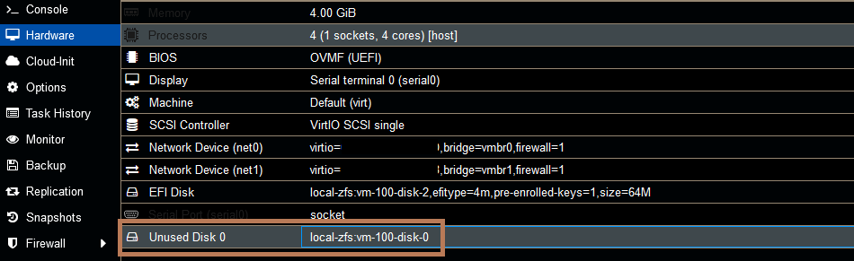

## Einführung

Dieser Artikel beschäftigt sich damit, Proxmox auf einem Arm64 Server zu installieren und mehrere VMs hinter einer Router VM zu betreiben. Hierzu ist nur eine zusätzliche IP mit virtueller MAC notwendig. 

## Schritt 1 - Installation

Es gibt einen Fork von Proxmox, welcher es zur Aufgabe hat auf allen verfügbaren Architekturen zu funktionieren. Aktuell ist unter anderem auch Armv8 (aarch64) verfügbar (siehe [GitHub Repository](https://github.com/jiangcuo/pxvirt)).
Die aktuelle Arm64-Version steht auf folgendem Mirror zur Verfügung: [Mirror](https://download.lierfang.com/isos/).
Die Installation verläuft wie bei jedem normalen Proxmox auch. Auch die Nutzung von ZFS ist ohne Probleme möglich.
Die zuletzt erfolgreich getestete Version ist `8.3.2`.

Bei diesem Fork gibt es einige Dinge zu beachten, um eine funktionsfähige Umgebung zu erhalten. Weitere Informationen findest du auch im offiziellen Wiki des Projekts: [Wiki](https://github.com/jiangcuo/pxvirt/wiki).

## Schritt 2 - Netzwerkkonfiguration

Es sollte jetzt die Bridge für die interne Kommunikation, zwischen den VMs, angelegt werden. Dies kann über die Web Oberfläche von Proxmox geschehen, oder über das Terminal. 

* **Über die Weboberfläche**
  
  Die Bridge kann auf dem entsprechenden Host im Punkt Netzwerk angelegt werden. Im Anschluss muss die Konfiguration noch angewendet werden.

<br>

* **Über das Terminal**
  
  Folgendes muss in die Interfaces Datei hinzugefügt werden.
  
  ```shellsession
  File: /etc/network/interfaces
  [...]
  
  auto vmbr1
  iface vmbr1 inet static
          bridge-ports none
          bridge-stp off
          bridge-fd 0
  ```

Die `vmbr0` wird bei der Installation per ISO automatisch angelegt und muss nicht manuell erstellt werden. 

## Schritt 3 - Erstellen der Router VM

Beim Erstellen einer VM gibt es ein paar Dinge zu beachten:

* **Einstellungen**
  
  |         | Beschreibung |
  | ------- | ------------ |
  | OS      | Wähle in diesem Tab `Do not use any media`, da das RAW Image später direkt eingebunden wird.<ul><li><b>CDROM und Cloud-Init</b><br>Hier sollte ebenfalls nur <kbd style="background-color:#CCCCCC;color:#000;border-radius:6px;">SCSI</kbd> verwendet werden. Andere Optionen werden nicht unterstützt.</li></ul> |
  | System  | <ul><li><b>Graphic Card</b><br>Default ist hier <kbd style="background-color:#CCCCCC;color:#000;border-radius:6px;">virtio-gpu</kbd> und sollte auch genutzt werden. In wenigen Fällen funktioniert die Ausgabe nicht korrekt. In diesem Fall sollte später eine Serielle Console genutzt werden.</li><li><b>BIOS</b><br>Es wird empfohlen die VM mit einem EFI BIOS zu erstellen. Hierzu muss <kbd style="background-color:#CCCCCC;color:#000;border-radius:6px;">OVMF</kbd> ausgewählt werden. </li><li><b>Machine type</b><br>Der Typ sollte immer <kbd style="background-color:#CCCCCC;color:#000;border-radius:6px;">virt</kbd> belassen werden und die Version auf Latest. Dies vermeidet Probleme in der Zukunft.</li><li><b>SCSI controller</b><br>Es ist nur <kbd style="background-color:#CCCCCC;color:#000;border-radius:6px;">VirtIO SCSI</kbd>, <kbd style="background-color:#CCCCCC;color:#000;border-radius:6px;">VirtIO SCSI single</kbd> und <kbd style="background-color:#CCCCCC;color:#000;border-radius:6px;">virtio-blk</kbd> unterstützt. Kein <kbd style="background-color:#CCCCCC;color:#000;border-radius:6px;">SATA</kbd> oder <kbd style="background-color:#CCCCCC;color:#000;border-radius:6px;">IDE</kbd>.</li></ul> |
  | Disks   | Hier kann bei der Router VM einfach die Platte entfernt werden, da diese später per RAW Image hinzugefügt wird.<br>Bei der Installation eines Gasts, sollte bei der Platte nur `SCSI` verwendet werden. |
  | CPU     | Die Anzahl der Kerne kann frei gewählt werden.<ul><li><b>CPU Typ</b><br>Beim CPU Typ sollte <kbd style="background-color:#CCCCCC;color:#000;border-radius:6px;">Host</kbd> oder <kbd style="background-color:#CCCCCC;color:#000;border-radius:6px;">Max</kbd> ausgewählt werden. Default ist hierbei <kbd style="background-color:#CCCCCC;color:#000;border-radius:6px;">Host</kbd>. Wenn spezielle Images verwendet werden sollen, kann auch eine andere Arm CPU emuliert werden. </li></ul> |
  | RAM     | Auch der RAM kann frei zugewiesen werden. |
  | Network | Beim Netzwerk wird nun zuerst vmbr1 hinzugefügt. Dies ist das Netzwerk für die Interne Kommunikation der VMs.<ul><li><b>Netdev</b><br>Hier wird <kbd style="background-color:#CCCCCC;color:#000;border-radius:6px;">virtio</kbd> empfohlen. Das Emulieren von anderen Netzwerkkarten sollte nicht genutzt werden.</li></ul> |

<br>

* **Netzwerk Interfaces**
  
  Das Network Device für die interne Kommunikation sollte `net0` sein und das Device mit der Virtuellen MAC der zusätzlichen IP `net1`. Nur so konfiguriert openWRT das erste Interface direkt als LAN und das zweite als WAN.
  
  Die Virtuelle MAC, welche man im Hetzner Robot für die zusätzliche IP erhält, wird in das zweite Netzwerk Device (`net1`) eingetragen. Als Bridge Interface verwendet man `vmbr0`. Dies ist die Bridge auf welcher auch die Haupt IP konfiguriert ist und stellt im späteren Teil den WAN Port dar. 
  
  Dieses zweite Netzwerkinterface wird nun zur VM hinzugefügt. Hierzu einfach im Punkt "Hardware" ein Netzwerkinterface hinzufügen, die MAC eintragen und `vmbr0` auswählen.
  
  - Erstes Netzwerkdevice `net0` -> `vmbr1` (Internes Netzwerk)
  - Zweites Netzwerkdevice `net1` -> `vmbr0` (Öffentliches Netzwerk mit virtueller MAC)

<br>

* **Serielle Console**
  
  Um die Konfiguration der Router VM auch ohne Weboberfläche vornehmen zu können, sollte noch eine Serielle Console zur Hardware der VM hinzugefügt werden. Dies kann ebenfalls im Punkt "Hardware" geschehen.

<br>

* **Router Image**
  
  Die Optionen für ein Router OS welches auf Armv8 verfügbar sind, ist aktuell limitiert. Die Router VM wird in diesem Fall verwendet um das DHCP, Portweiterleitungen und Firewall Regeln der VMs im Privaten Netzwerk einfacher zu verwalten. Dies ist bei kleinen Setups nicht unbedingt nötig, da Proxmox auch NAT unterstützt. Mehr Informationen hierzu findet man in folgendem Artikel: [Proxmox VE Installieren und Konfigurieren #Masquerading (NAT)](https://community.hetzner.com/tutorials/install-and-configure-proxmox_ve/de#masquerading-nat)
  
  Für die Router VM verwenden wir [openWRT](https://openwrt.org/start). Auf diesem [Mirror](https://archive.openwrt.org/releases/24.10.0-rc7/targets/armsr/armv8/) gibt es eine Version für Armv8. Da die VM im UEFI Modus läuft, benötigen wir auch ein EFI Image. Ein passendes Image findet man [hier (openwrt-24.10.0-rc7-armsr-armv8-generic-ext4-combined-efi.img.gz)](https://archive.openwrt.org/releases/24.10.0-rc7/targets/armsr/armv8/openwrt-24.10.0-rc7-armsr-armv8-generic-ext4-combined-efi.img.gz).
  Hierbei handelt es sich um ein Systemabbild, welches direkt gebootet werden kann.
  
  Mit folgenden Befehlen wird das oben genannte Image heruntergeladen, entpackt und anschließend in die VM mit der ID `100` importiert. `local-lvm` gibt hierbei den Storage an, auf welchem das Disk image gespeichert werden soll. Bei setups mit zfs heißt dies meist `local-zfs`.
  
  ```bash
  wget https://archive.openwrt.org/releases/24.10.0-rc7/targets/armsr/armv8/openwrt-24.10.0-rc7-armsr-armv8-generic-ext4-combined-efi.img.gz
  
  gunzip openwrt-24.10.0-rc7-armsr-armv8-generic-ext4-combined-efi.img.gz
  
  qm importdisk 100 openwrt-24.10.0-rc7-armsr-armv8-generic-ext4-combined-efi.img local-lvm
  ```
  
  Im Anschluss muss die importierte Disk noch in die VM eingebunden werden und auf eine nutzbare Größe erweitert werden.
  Um die Disk hinzuzufügen einfach Doppelklick auf diese und im Anschluss "Add" drücken. Zum Anpassen der Größe, die Disk auswählen und oben unter "Disk Action" auf Resize drücken. Hier kann der Speicher eingetragen werden, welcher hinzugefügt werden soll.
  GGF. muss auch noch die Bootreihenfolge angepasst werden im Punkt "Options".
  
  
  
  Nun kann die VM zum ersten mal gestartet werden.

## Schritt 4 - Erster Login

Per default stellt das WAN interface keine Web GUI zur Verfügung. Dies ist auch gut, da das Image kein Passwort gesetzt hat. 
Zunächst sollte ein Passwort gesetzt werden. Dafür kann eine der folgenden Optionen genutzt werden:

* **Über die Konsole der VM**
  
  In der Konsole der VM muss `passwd` eingegeben werden. **Achtung: Keyboard Layout beachten**

<br>

* **Über die Serielle Console**
  
  Per SSH muss eine Verbindung zum Host hergestellt und  mit folgendem Befehl die Serielle Console gestartet werden:
  
  ```bash
  qm terminal <vm id>
  ```
  Die Serielle Console zeigt zu Beginn keine Ausgabe. Durch Drücken von "Enter" kommt man zum Prompt. Anschließend kann `passwd` eingegeben werden.

<br>

Nachdem ein Passwort gesetzt wurde, kann nun die Web GUI auf dem WAN Port aktiviert werden.

#### Verbinden per WAN (Public IP)

Wenn es nötig ist die GUI direkt über die WAN IP der VM zu erreichen, ist diese auch möglich. Hierzu muss dies in der Firewall freigegeben werden. Folgende Befehle müssen hierzu in der VM eingegeben werden. Dies kann durch die Console in der Proxmox Web GUI geschehen, oder über die Serielle Console in der Proxmox CLI. Um die Serielle Console zu nutzen, muss zunächst ein Serielles Gerät zur VM hinzugefügt werden.

**Proxmox CLI**
    
Mit diesem Befehl kann man auf die Console der VM verbinden:
    
```bash
qm terminal <vm id>
```
    
```shellsession
uci add firewall rule
uci set firewall.@rule[-1].name='Allow-Admin'
uci set firewall.@rule[-1].enabled='true'
uci set firewall.@rule[-1].src='wan'
uci set firewall.@rule[-1].proto='tcp'
uci set firewall.@rule[-1].dest_port='80 443'
uci set firewall.@rule[-1].target='ACCEPT'
uci commit firewall
service firewall restart
```

## Schritt 5 - Erste Gast VM

Sobald die openWRT VM läuft und die Web GUI erreichbar ist, kann die erste Gast VM erstellt werden. Hier ist das Vorgehen ähnlich wie bei der Router VM. Die Einstellungen können wie oben beschrieben angepasst werden. Generell stehen einige Images für Arm zur Verfügung. 
Folgend ein paar Beispiele:

* [Debian](https://cdimage.debian.org/debian-cd/current/arm64/iso-cd/)
* [Ubuntu](https://ubuntu.com/download/server/arm)
* [Fedora](https://fedoraproject.org/server/download)
* [Arch Server](https://release.archboot.com/aarch64/latest/iso/)

Als Netzwerk Interface wird nun immer die `vmbr1` verwendet. Auf dieser Bridge verteilt die Router VM IPs und routet den Traffic ins Internet.

## Ergebnis

Weitere Informationen zur Konfiguration von Proxmox im Netzwerk von Hetzner, findet man auch im folgenden Community Artikel. [Proxmox VE Installieren und Konfigurieren](https://community.hetzner.com/tutorials/install-and-configure-proxmox_ve/de?title=Proxmox_VE)

##### License: MIT

<!--

Contributor's Certificate of Origin

By making a contribution to this project, I certify that:

(a) The contribution was created in whole or in part by me and I have
    the right to submit it under the license indicated in the file; or

(b) The contribution is based upon previous work that, to the best of my
    knowledge, is covered under an appropriate license and I have the
    right under that license to submit that work with modifications,
    whether created in whole or in part by me, under the same license
    (unless I am permitted to submit under a different license), as
    indicated in the file; or

(c) The contribution was provided directly to me by some other person
    who certified (a), (b) or (c) and I have not modified it.

(d) I understand and agree that this project and the contribution are
    public and that a record of the contribution (including all personal
    information I submit with it, including my sign-off) is maintained
    indefinitely and may be redistributed consistent with this project
    or the license(s) involved.

Signed-off-by: [Sebastian Leheis]

-->
