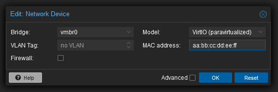
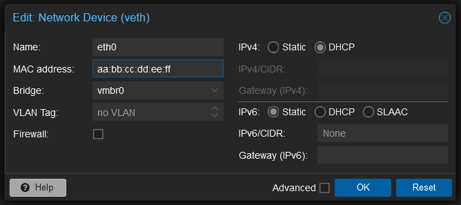
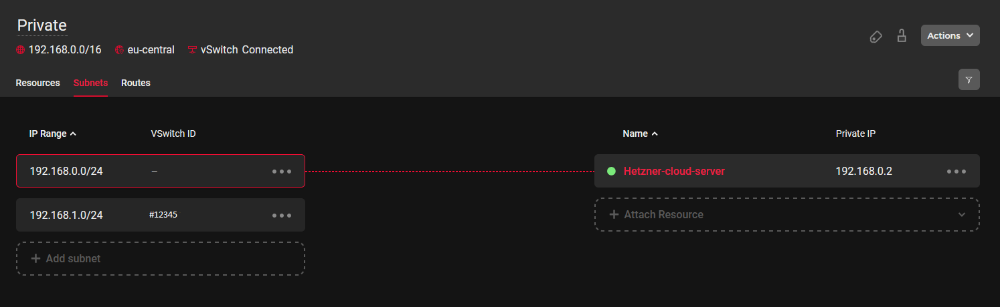

## Einführung

Proxmox Virtual Environment (Proxmox VE) ist eine Open-Source-Virtualisierungsplattform mit Unterstützung für Kernel-based Virtual Machine (KVM) und Linux Containers (LXC). Proxmox bietet eine webbasierte Verwaltungsschnittstelle, CLI-Tools und eine REST-API für Verwaltungszwecke sowie [eine großartige Dokumentation](https://pve.proxmox.com/pve-docs/index.html) mit einem ausführlichen Proxmox VE Guide, Handbuchseiten und API-Viewer.

Dieses Tutorial zeigt, wie man Proxmox VE 8 auf Debian 12 installiert und IP-Adressen auf virtuellen Maschinen konfiguriert.

***Vor der Installation***

Zunächst einige Tipps und Tricks, bevor Sie mit der Einrichtung der neuen Umgebung beginnen:

- Sollen nur Linux-Maschinen verwendet werden? Dann würde unter Umständen LXC ausreichen.
- Soll LXC oder KVM verwendet werden? Beide haben ihre Vor- und Nachteile.

Eine wohlüberlegte Entscheidung und gute Recherche kann in Zukunft für weniger Arbeit/Probleme sorgen.

- KVM ist zwar nicht so leistungsfähig wie LXC, bietet aber eine vollständige Hardwarevirtualisierung und ermöglicht den Betrieb aller gängigen Betriebssysteme (einschließlich Windows).

Eine Konvertierung der virtuellen Festplatten in Formate wie VMDK ist möglich.

## Schritt 1 - Installation

### Schritt 1.1 - Die Grundinstallation auf einem Hetzner-Server

* Booten Sie den Server in das [Rescue System](https://docs.hetzner.com/de/robot/dedicated-server/troubleshooting/hetzner-rescue-system/).
* Führen Sie [installimage](https://docs.hetzner.com/de/robot/dedicated-server/operating-systems/installimage/) aus, wählen Sie das erforderliche Debian 12 (Bookworm) aus und installieren Sie es.
* Konfigurieren Sie den RAID-Level, den Hostnamen und die Partitionierung.
* Speichern Sie die Konfiguration und führen Sie nach Abschluss der Installation einen Neustart durch.

## Schritt 1.2 - Anpassen der APT-Quellen

* GPG-Key hinzuzufügen und APT-Quellen anpassen:
  ```Go
  curl -o /etc/apt/trusted.gpg.d/proxmox-release-bookworm.gpg http://download.proxmox.com/debian/proxmox-release-bookworm.gpg
  echo "deb http://download.proxmox.com/debian/pve bookworm pve-no-subscription" > /etc/apt/sources.list.d/pve-install-repo.list
  ```
* Wenn Sie kein Proxmox VE Enterprise Abonnement haben und unberechtigte Zugriffsfehler vermeiden wollen, können Sie das Proxmox VE Enterprise Repository mit dem folgenden Befehl auskommentieren:
  ```Go
  echo '# deb https://enterprise.proxmox.com/debian/pve bookworm InRelease' > /etc/apt/sources.list.d/pve-enterprise.list
  ```
* Pakete aktualisieren:
  ```Go
  apt update           # Paketlisten aktualisieren
  apt full-upgrade     # System aktualisieren
  ```

## Schritt 1.3 - Proxmox VE installieren

* Proxmox VE installieren
  ```Go
  apt install proxmox-ve
  ```
* Neustart ausführen
* Nach einem Neustart sollte der Proxmox-Kernel geladen sein. Führen Sie den folgenden Befehl aus, um Informationen über die Kernelversion zu erhalten:
  ```Go
  uname -r
  ```
  Die Ausgabe sollte z.B. `pve` enthalten: `6.5.13-1-pve`

Das Webinterface sollte unter `https://<server_ip>:8006` erreichbar sein.

## Schritt 2 - Netzwerkkonfiguration

Zunächst ist es wichtig zu entscheiden, welche Virtualisierungslösung (LXC und/oder KVM) und welche Variante (bridged/routed) verwendet werden soll.

Wenn Sie mit den genannten Technologien nicht vertraut sind, finden Sie nachfolgend einige Vor- und Nachteile.

* Virtualisierungslösung
  
  **LXC-Option**
  
  | Vorteile | Nachteile |
  | -------- | --------- |
  | <ul><li>Leichtgewichtig, schnell, geringer RAM-Bedarf</li><li>Sowohl schnelle Start- und Shutdown-Zeiten, was die Verwaltbarkeit und Skalierbarkeit von containerisierten Anwendungen verbessert</li><li>Ermöglicht die gleichzeitige Ausführung von mehr Containern auf derselben Hardware im Vergleich zu virtuellen Maschinen</li></ul> | <ul><li>Der Kernel des Hostsystems wird verwendet</li><li>Es können nur Linux-Distributionen verwendet werden</li></ul> |

  **KVM-Option**
  
  | Vorteile | Nachteile |
  | -------- | --------- |
  | <ul><li>Jede VM arbeitet mit ihrem eigenen Kernel, was die Sicherheit und Stabilität erhöht</li><li>Es können fast alle Betriebssysteme installiert werden</li><li>Kann die Vorteile der Hardware-Virtualisierungsfunktionen (z. B. Intel VT-x und AMD-V) nutzen, um die Leistung zu verbessern</li></ul> | <ul><li>VMs benötigen ihre eigenen Ressourcen, einschließlich einer vollständigen Kopie des Betriebssystems, was zu einem erhöhten Verbrauch von CPU, RAM und Speicher führt</li></ul> |

--------

* Variante
  
  **Routed Setup**
  
  | Vorteile | Nachteile |
  | -------- | --------- |
  | <ul><li>Mehrere einzelne IP-Adressen und Subnetze können auf einer VM verwendet werden</li></ul> | <ul><li>Es sind zusätzliche Routen auf dem Host erforderlich</li><li>Eine Punkt-zu-Punkt-Verbindung ist erforderlich</li></ul> |

  **Bridged Network Option**
  
  | Vorteile | Nachteile |
  | -------- | --------- |
  | <ul><li>Der Host ist transparent und nimmt nicht am Routing teil.</li><li>VMs können direkt mit dem Gateway der zugewiesenen IP kommunizieren.</li><li>VMs können ihre einzelne IPv4-Adresse vom DHCP-Server von Hetzner beziehen.</li></ul> | <ul><li>VMs können nur über die MAC-Adresse kommunizieren, die der jeweiligen IP-Adresse zugeordnet ist.</li><li>Diese MAC-Adresse muss in Hetzner Robot angefordert werden.</li><li>IP-Adressen aus weiteren Subnetzen können nur auf dem Host-System oder auf einer einzelnen VM mit einer einzigen IP verwendet werden (wenn das Subnetz darauf geroutet ist) (gilt sowohl für IPv4- als auch für IPv6-Subnetze).</li></ul> |

### IP-Weiterleitung auf dem Host aktivieren
    
Bei einem gerouteten Setup sind die Bridges (z.B. `vmbr0`) nicht mit der physikalischen Schnittstelle verbunden. Die IP-Weiterleitung muss auf dem Host-System aktiviert werden. Bitte beachten Sie, dass die Paketweiterleitung zwischen Netzwerkschnittstellen bei der Standardinstallation von Hetzner deaktiviert ist. Um die IP-Weiterleitung über Neustarts hinweg zu aktivieren, verwenden Sie die folgenden Befehle:

* Für IPv4 und IPv6:
  ```bash
  sed -i 's/#net.ipv4.ip_forward=1/net.ipv4.ip_forward=1/' /etc/sysctl.conf
  sed -i 's/#net.ipv6.conf.all.forwarding=1/net.ipv6.conf.all.forwarding=1/' /etc/sysctl.conf
  ```
* Änderungen anwenden:
  ```bash
  sysctl -p
  ```
* Prüfen, ob die Weiterleitung aktiv ist:
  ```bash
  sysctl net.ipv4.ip_forward
  sysctl net.ipv6.conf.all.forwarding
  ```

### Netzwerkkonfiguration hinzufügen

Wählen Sie eine passende Variante:

* [Routed Setup](#routed-setup)
* [Bridged Setup](#bridged-setup)


* [vSwitch mit öffentlichem Subnetz](#vswitch-mit-öffentlichem-subnetz)<br>
  <small>» Zuweisung von IP-Adressen an VMs/Container von vSwitch mit öffentlichem Subnetz.</small>


* [Hetzner Cloud Netzwerk](#hetzner-cloud-netzwerk)<br>
  <small>» Eine Verbindung zwischen den virtuellen Maschinen/LXC in Proxmox herstellen.</small><br>
* [Masquerading (NAT)](#masquerading-nat)<br> 
  <small>» VMs mit pvt IPs den Internetzugang über die öfftl. IP des Hosts ermöglichen.</small><br>

##### Routed Setup

In einer gerouteten Konfiguration dient die Bridge-IP-Adresse des Hostsystems standardmäßig als Gateway. Das manuelle Hinzufügen einer Route zu einer virtuellen Maschine ist erforderlich, wenn die zusätzliche IP nicht zum selben Subnetz gehört. Aus diesem Grund setzen wir die Subnetzmaske auf `/32`, da Geräte wie vmbr0 grundsätzlich den Datenverkehr nur für IP-Adressen weiterleiten, die zum selben Subnetz gehören. Durch die Verwendung einer `/32`-Subnetzmaske wird jede zusätzliche IP-Adresse als eigene Netzwerkeinheit behandelt, wodurch sichergestellt wird, dass der Datenverkehr sein richtiges Ziel erreicht, auch wenn die zusätzliche IP-Adresse nicht aus demselben Subnetz stammt.

* **Hostsystem Routed**
  
  Um ein reales Szenario darzustellen, werden wir die folgenden Beispiel-Adressen verwenden:
  
  - Haupt-IP: `198.51.100.10/24`
  - Gateway der Haupt-IP: `198.51.100.1/24`
  - Zusätzliches Subnetz: `203.0.113.0/24`
  - Zusätzliche Einzel-IP: `192.0.2.20/24`
  - IPv6: `2001:DB8::/64`
  
  ```Go
  # /etc/network/interfaces
  
  auto lo
  iface lo inet loopback
  
  iface lo inet6 loopback
  
  auto enp0s31f6
  iface enp0s31f6 inet static
          address 198.51.100.10/32    #Haupt-IP
          gateway 198.51.100.1        #Gateway
  
  # IPv6 des Main-interface
  iface enp0s31f6 inet6 static
      address 2001:db8::2/128             # /128 auf dem Ethernet, /64 auf der Bridge (um alle anderen Adressen zur Bridge zu routen)
      gateway fe80::1
  
  # Bridge für einzelne IP's (fremdes und gleiches Subnetz)
  auto vmbr0
  iface vmbr0 inet static
          address 198.51.100.10/32     #Haupt-IP
          bridge-ports none
          bridge-stp off
          bridge-fd 0
          up ip route add 192.0.2.20/32 dev vmbr0    # Fremdes Subnetz
          up ip route add 198.51.100.30/32 dev vmbr0 # Zusätzliche IP aus dem gleichen Subnetz
  
  # IPv6 für die bridge
  iface vmbr0 inet6 static
    address 2001:db8::3/64                # Sollte nicht die gleiche Adresse wie das Main-interface sein
  
  # Zusätzliches Subnetz 203.0.113.0/24
  auto vmbr1
  iface vmbr1 inet static
          address 203.0.113.1/24 #  Setzen Sie eine nutzbare IP aus dem Subnetzbereich
          bridge-ports none
          bridge-stp off
          bridge-fd 0
  ```

<br>

* **Gastsystem Routed** (Debian 12)
  
  Als Gateway wird immer die IP der Bridge im Hostsystem verwendet, d.h. die Haupt-IP für einzelne IPs und die IP aus dem im Hostsystem konfigurierten Subnetz für Subnetze.
  
  Gastkonfiguration:
  
  * Mit einer zusätzlichen IP aus dem gleichen Subnetz:
    ```Go
    # /etc/network/interfaces
    
    auto lo
    iface lo inet loopback
    
    
    auto ens18
    iface ens18 inet static
      Adresse 198.51.100.30/32   # Zusätzliche IP
      gateway 198.51.100.10      # Haupt-IP
    
    # IPv6
    iface ens18 inet6 static
      address 2001:DB8::4      # IPv6-Adresse des Subnetzes
      netmask 64               # /64
      gateway 2001:DB8::3      # Bridge Adresse
    ```

  * Mit einer fremden Additional IP:
    ```Go
    # /etc/network/interfaces
    
    auto lo
    iface lo inet loopback
    
    
    auto ens18
    iface ens18 inet static
      address 192.0.2.20/32 # Zusätzliche IP aus einem fremden Subnetz
      gateway 198.51.100.10 # Haupt-IP
    ```
  
  * Mit einer IP aus dem zusätzlichen Subnetz:
    ```Go
    # /etc/network/interfaces
    
    auto lo
    iface lo inet loopback
    
    
    auto ens18
    iface ens18 inet static
      address 203.0.113.10/24 # Subnetz-IP
      gateway 203.0.113.1     # Gateway ist die IP der bridge (vmbr1)
    ```

---------

<br>

##### Bridged Setup

Wenn Sie Proxmox im Bridged-Modus einrichten, müssen Sie unbedingt virtuelle MAC-Adressen für jede IP-Adresse über das Robot Panel anfordern. In diesem Modus fungiert der Host als transparente Brücke und ist nicht Teil des Routing-Pfads. Das bedeutet, dass Pakete, die am Router ankommen, die MAC-Quelladresse der virtuellen Maschinen enthalten. Wenn die MAC-Quelladresse vom Router nicht erkannt wird, wird der Datenverkehr als "Abuse" eingestuft und kann dazu führen, dass der Server blockiert wird. Daher ist es wichtig, virtuelle MAC-Adressen im Robot Panel anzufordern.

* **Hostsystem Bridged**
  
  Wir konfigurieren hier nur die Haupt-IP des Servers. Die zusätzlichen IPs werden in den Gastsystemen konfiguriert.
  
  ```Go
  # /etc/network/interfaces
  
  auto lo
  iface lo inet loopback
  
  auto enp0s31f6
  iface enp0s31f6 inet manual
  
  auto vmbr0
  iface vmbr0 inet static
          address 198.51.100.10/32    # Haupt-IP
          gateway 198.51.100.1        # Gateway
          bridge-ports enp0s31f6
          bridge-stp off
          bridge-fd 0
  ```

<br>

* **Gastsystem Bridged** (Debian 12)
  
  Hier verwenden wir das Gateway der zusätzlichen IP, oder wenn die zusätzliche IP im gleichen Subnetz wie die Haupt-IP liegt, verwenden wir das Gateway der Haupt-IP.
  
  Statische Konfiguration:
  ```Go
  # /etc/network/interfaces
  
  auto ens18
  iface ens18 inet static
    address 192.0.2.20/32   # Zusätzliche IP 
    gateway 192.0.2.1       # Gateway der zusätzlichen IP
  ```
  
  Im Bridged Modus kann DHCP auch zur automatischen Konfiguration der Netzwerkeinstellungen verwendet werden. Es ist jedoch wichtig, die virtuelle Maschine so zu konfigurieren, dass sie die vom Robot Panel erhaltene virtuelle MAC-Adresse für die spezifische IP-Konfiguration verwendet.
  
  
  
  Sie können dies auch manuell in der virtuellen Maschine selbst, in `/etc/network/interfaces`, einstellen:
  
  ```Go
  # /etc/network/interfaces
  
  auto lo
  iface lo inet loopback
  
  
  auto ens18
  iface ens18 inet dhcp
          hwaddress ether aa:bb:cc:dd:ee:ff # Die MAC-Adresse ist nur ein Beispiel
  ```
  
  Dasselbe kann für LXC-Container über die Proxmox-GUI gemacht werden, indem Sie einfach auf den Container klicken, zu "Network" navigieren und dann auf die Bridge klicken. Wählen Sie DHCP und fügen Sie die korrekte MAC-Adresse aus dem Robot Panel hinzu (in unserem Fall wäre das Beispiel `aa:bb:cc:dd:ee:ff`):
  
  

-----------

<br>

##### vSwitch mit öffentlichem Subnetz

Proxmox kann auch so eingerichtet werden, dass es sich direkt mit einem Hetzner vSwitch verbindet, der das Routing für ein öffentliches Subnetz verwaltet, so dass IP-Adressen aus diesem Subnetz direkt an VMs und Container zugewiesen werden können. Das Setup muss ein Bridged-Setup sein und es muss ein virtuelles Interface erstellt werden, damit die Pakete den vSwitch erreichen können. Die Bridge muss nicht VLAN-fähig sein und es muss keine VLAN-Konfiguration innerhalb der VM oder des LXC-Containers vorgenommen werden, das VLAN tagging erfolgt hier über das Subinterface, in unserem Beispiel das `enp0s31f6.4009`. Jedes Paket, das durch das Interface geht, wird mit der entsprechenden VLAN ID getaggt. (Bitte beachten Sie, dass diese Konfiguration für die LXC/VM's gedacht ist. Wenn Sie möchten, dass der Host selbst mit dem vSwitch kommunizieren kann, müssen Sie eine zusätzliche [Routing-Tabelle](https://docs.hetzner.com/robot/dedicated-server/network/vswitch#server-configuration-linux) erstellen). In diesem Fall werden wir `203.0.113.0/24` als Beispielsubnetz verwenden.

* Hostsystem Konfiguration:
  ```Bash
  # /etc/network/interfaces
  
  auto enp0s31f6.4009
  iface enp0s31f6.4009 inet manual
  
  auto vmbr4009
  iface vmbr4009 inet static
          bridge-ports enp0s31f6.4009
          bridge-stp off
          bridge-fd 0
          mtu 1400
  #vSwitch Subnetz 203.0.113.0/24
  ```

<br>

* Gastsystem Konfiguration:
  ```Go
  # /etc/network/interfaces
  
  auto lo
  iface lo inet loopback
  
  
  auto ens18
  iface ens18 inet static
    address 203.0.113.2/24 # Subnetz-IP vom vSwitch
    gateway 203.0.113.1    # vSwitch-Gateway
  ```

---------

<br>

##### Hetzner Cloud Netzwerk

Es ist auch möglich, eine Verbindung zwischen den virtuellen Maschinen/LXC in Proxmox mit dem Hetzner Cloud Netzwerk herzustellen. Für dieses Beispiel nehmen wir an, dass Sie Ihr Cloud Netzwerk bereits eingerichtet haben und den vSwitch mit der folgenden Konfiguration hinzugefügt haben:

- `192.168.0.0/16` - Ihr Cloud Netzwerk (übergeordnetes Netzwerk)
- `192.168.0.0/24` - Subnetz des Cloud Servers
- `192.168.1.0/24` - vSwitch (#12345)

Die Konfiguration sollte in etwa wie folgt aussehen:



Ähnlich wie im Beispiel zuvor erstellen wir zunächst eine virtuelle Schnittstelle und definieren die VLAN ID, in unserem Fall wäre das `enp0s31f6.4000`. Wir müssen die Route zum Cloud Netzwerk `192.168.0.0/16` über den vSwitch hinzufügen. Bitte beachten Sie, dass das Hinzufügen einer Route zum Hetzner-Cloud-Netzwerk und das Zuweisen einer IP-Adresse aus dem privaten Subnetzbereich des vSwitch an die Bridge nur notwendig ist, wenn der Proxmox-Host selbst mit dem Hetzner-Cloud-Netzwerk kommunizieren soll.

* Hostsystem Konfiguration:
  ```Go
  # /etc/network/interfaces
  
  auto enp0s31f6.4000
  iface enp0s31f6.4000 inet manual
  
  auto vmbr4000
  iface vmbr4000 inet static
          address 192.168.1.10/24
          bridge-ports enp0s31f6.4000
          bridge-stp off
          bridge-fd 0
          mtu 1400
          up ip route add 192.168.0.0/16 via 192.168.1.1 dev vmbr4000
          
  #vSwitch-to-cloud Privates Subnetz 192.168.1.0/24
  ```

<br>

* Gastsystem Konfiguration
  ```Go
  # /etc/network/interfaces
  
  auto lo
  iface lo inet loopback
  
  
  auto ens18
  iface ens18 inet static
    address 192.168.1.2/24
    gateway 192.168.1.1
  ```

<br>

##### Masquerading (NAT)
  
  Die Freigabe der virtuellen Maschinen/LXC-Container gegenüber dem Internet ist auch möglich, ohne weitere öffentliche zusätzliche IP-Adressen zu konfigurieren/zu nutzen. Hetzner hat eine strenge IP/MAC-Bindung, d.h. wenn der Datenverkehr nicht richtig geroutet wird, kommt es zu Abuse und kann zu Server-Sperrungen führen. Um dieses Problem zu vermeiden, können wir den Datenverkehr von den LXC/VMs über das Main-Interface des Hosts leiten. Dadurch wird sichergestellt, dass alle Netzwerkpakete die gleiche MAC-Adresse verwenden. Masquerading ermöglicht virtuellen Maschinen mit privaten IP-Adressen den Internetzugang über die öffentliche IP-Adresse des Hosts für ausgehende Kommunikation. Iptables ändert jedes ausgehende Datenpaket so, dass es so aussieht, als käme es vom Host, und eingehende Antworten werden so angepasst, dass sie an den ursprünglichen Absender zurückgeleitet werden können.
  
  ```Go
  # /etc/network/interfaces
  
  auto lo
  iface lo inet loopback
  
  iface lo inet6 loopback
  
  auto enp0s31f6
  iface enp0s31f6 inet static
          address 198.51.100.10/24
          gateway 198.51.100.1/24
          #post-up iptables -t nat -A PREROUTING -i enp0s31f6 -p tcp -m multiport ! --dports 22,8006 -j DNAT --to 172.16.16.2
          #post-down iptables -t nat -D PREROUTING -i enp0s31f6 -p tcp -m multiport ! --dports 22,8006 -j DNAT --to 172.16.16.2
  
  
  auto vmbr4
  iface vmbr4 inet static
          address 172.16.16.1/24
          bridge-ports none
          bridge-stp off
          bridge-fd 0
          post-up   iptables -t nat -A POSTROUTING -s '172.16.16.0/24' -o enp0s31f6 -j MASQUERADE
          post-down iptables -t nat -D POSTROUTING -s '172.16.16.0/24' -o enp0s31f6 -j MASQUERADE
  #NAT/Masq
  ```
<br>
  Bitte beachten Sie, dass diese Regeln (unten) nicht notwendig sind, damit die LXC/VM's Zugang zum Internet haben. Diese Regel ist optional und dient dem Zweck des externen Zugriffs auf eine bestimmte VM/Container. Sie leitet den gesamten eingehenden Datenverkehr, außer auf den Ports 22 und 8006 (22 ist hier ausgenommen, damit Sie sich weiterhin über SSH mit Proxmox verbinden können, und 8006 ist der Port für das Webinterface), an eine bestimmte virtuelle Maschine unter `172.16.16.2` innerhalb des Subnetzes um. Dies ist ein übliches Szenario/Setup für Router-VMs wie pfSense, bei dem der gesamte eingehende Verkehr an die Router-VM umgeleitet und dann entsprechend geroutet wird.
  
  ```Go
  post-up iptables -t nat -A PREROUTING -i enp0s31f6 -p tcp -m multiport ! --dports 22,8006 -j DNAT --to 172.16.16.2
  post-down iptables -t nat -D PREROUTING -i enp0s31f6 -p tcp -m multiport ! --dports 22,8006 -j DNAT --an 172.16.16.2
  ```

## Schritt 3 - Sicherheit

Das Webinterface ist durch zwei verschiedene Authentifizierungsmethoden geschützt:

* Proxmox VE-Standard-Authentifizierung (Proxmox-eigene Authentifizierung)
* Linux PAM-Standard-Authentifizierung

Dennoch wären zusätzliche Schutzmaßnahmen empfehlenswert, um sich vor der Ausnutzung von Sicherheitslücken oder verschiedenen anderen Angriffen zu schützen.

Hier sind einige Möglichkeiten:

- [Zwei-Faktoren-Authentifizierung](https://pve.proxmox.com/wiki/Two-Factor_Authentication)
- [Fail2ban gegen Brute-force-Angriffe](https://pve.proxmox.com/wiki/Fail2ban)
- [Absicherung des SSH-Dienstes](https://community.hetzner.com/tutorials/securing-ssh)

## Ergebnis

Mit diesem Tutorial sollten Sie Proxmox VE als Virtualisierungsplattform auf Ihrem Server installiert und konfiguriert haben.

Proxmox VE unterstützt auch Clustering. Details finden Sie im Tutorial "[Einrichten einer eigenen Public Cloud mit Proxmox auf Hetzner Bare Metal](https://community.hetzner.com/tutorials/hyperconverged-proxmox-cloud)" (EN).
