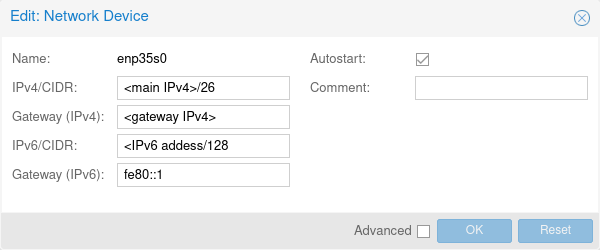
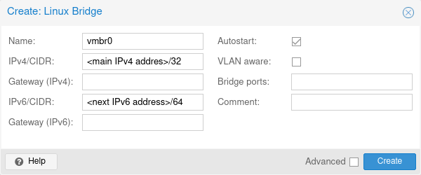
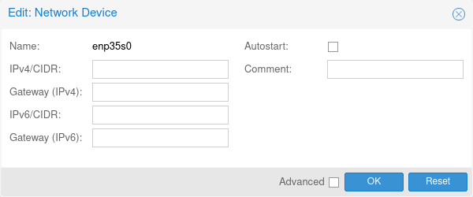
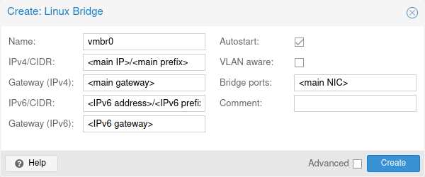

## Introduction

Proxmox Virtual Environment (Proxmox VE) is an open-source virtualization platform with support for Kernel-based Virtual Machine (KVM) and Linux Containers (LXC).
Proxmox provides a web-based management interface, CLI tools, and REST API for management purposes as well as [a great documentation](https://pve.proxmox.com/pve-docs/index.html) including detailed Proxmox VE Administration Guide, manual pages and API viewer.

This tutorial shows how to install Proxmox VE 7 on Debian 11 and configure IP addresses on virtual machines.

## Before the Installation

First, some suggestions and advice before starting to set up the new environment:

* Are only Linux machines going to be used? Then under certain circumstances LXC would be sufficient.
* Should LXC or KVM be used? Both have their advantages as well as disadvantages.
A thoughtful decision and good research can provide less work/trouble in the future.
* Although KVM is not as performant as LXC, it provides a complete hardware virtualization and enables the operation of all the most common operating systems (including Windows).
A conversion of the virtual disks in formats such as VMDK is simple.

## Step 1 - Installation

### Step 1.1 - The Basic Installation on a Hetzner Server

Boot the server into the [Rescue-System](https://docs.hetzner.com/robot/dedicated-server/troubleshooting/hetzner-rescue-system/).

Run [installimage](https://docs.hetzner.com/robot/dedicated-server/operating-systems/installimage/), select and install the required Debian 11 (Bullseye).

Configure the RAID level, hostname, and partitioning.

Save the configuration and after completion of the installation perform a restart.

### Step 1.2 - Adjust the APT Sources

The next step is to add a key and to adjust the APT sources:

```console
curl -o /etc/apt/trusted.gpg.d/proxmox-release-bullseye.gpg http://download.proxmox.com/debian/proxmox-release-bullseye.gpg
echo "deb http://download.proxmox.com/debian/pve bullseye pve-no-subscription" > /etc/apt/sources.list.d/pve-install-repo.list
```

Now update the packages:

```console
apt update        # Update package lists
apt full-upgrade  # Update system
```

### Step 1.3 - Install Proxmox VE

```console
apt install proxmox-ve
```

After a restart, the Proxmox kernel should be loaded.
Run the following command in order to see kernel release information:

```console
uname -r
```

The output should contain **pve**, for example: `5.15.74-1-pve`

Also, you can log in into web interface at `https://<main address>:8006`.

## Step 2 - Network Configuration

First of all, it is important to decide which virtualization solution (`LXC` and/or `KVM`) and which variant (`bridged`/`routed`) will be used.

If you are not familiar with mentioned technologies, please find rough comparison in "Pros and Cons of xxx option" sections below.

### Pros and Cons of LXC Option

* Advantages:
  * Lightweight, fast, lower RAM requirement.

* Disadvantages:
  * The kernel of the host system is used.
  * Only Linux distributions can be used.

### Pros and Cons of KVM Option

* Advantages:
  * Almost any operating systems can be installed.

* Disadvantages:
  * Higher resource usage, since VMs are using their own kernel.

### Pros and Cons of Routed Network Option

* Advantages:
  * Multiple single IP addresses and subnets can be used in one VM.

* Disadvantages:
  * Extra routes on the host are required.
  * Point-to-point setup is required.

### Pros and Cons of Bridged Network Option

* Advantages:
  * The host is transparent and not part of the routing.
  * VMs can directly communicate with the gateway of the assigned IP.
  * VMs can get their single IPv4 address from Hetzner's DHCP server.

* Disadvantages:
  * VMs may only communicate via the MAC address assigned to the respective IP address.
  That MAC address must be requested in the Hetzner Robot.
  * IP addresses from additional subnets can only be used on the host system or on a single VM with a single IP (if the subnet is routed to it) (applies to both IPv4 and IPv6 subnets).

### Example of the Host Configuration in Routed Setup

When using a routed setup, the IP of the bridge in the host system is always used as gateway.

* The main IPv4 is a gateway for additional single IPv4 addresses.
* The main IPv4 is a gateway for additional IPv4 subnet addresses.
* The IPv6 address from the subnet is a gateway for IPv6 subnet.

It is necessary to manually add the route to a virtual machine.
Additionally, existing separate MAC addresses should be removed from the respective IP addresses.
Since a host route is set, IP addresses from other subnets are easily possible.

#### Enable IP Forwarding on the Host

With a routed setup, the bridge `vmbr0` is not connected with the physical interface.
IP forwarding needs to be activated on the host system.
Please note that packet forwarding between network interfaces is disabled for the default Hetzner installation.
Activate it with the following command:

```console
sysctl -w net.ipv4.ip_forward=1
```

Forwarding for IPv6 needs to be activated as well.
This is also available in the Hetzner standard installation and only needs to be activated:

```console
sysctl -w net.ipv6.conf.all.forwarding=1
```

The commands above only changes runtime values.
To make persistent configuration, please adjust `/etc/sysctl.conf` file.

#### Configure IP Addresses on the Host

Let's say you just installed Proxmox and you have the following content in `/etc/network/interfaces` file:

```text
### Hetzner Online GmbH installimage

source /etc/network/interfaces.d/*

auto lo
iface lo inet loopback
iface lo inet6 loopback

auto enp35s0
iface enp35s0 inet static
  address <main IPv4 address>
  netmask <netmask of main IPv4 address>
  gateway <gateway IPv4 address>
  # route <network of main IPv4 address>/26 via <gateway IPv4 address>
  up route add -net <network of main IPv4 address> netmask <netmask of main IPv4 address> gw <gateway IPv4 address> dev enp35s0

iface enp35s0 inet6 static
  address <address from IPv6 subnet>
  netmask 64
  gateway fe80::1
```

Here are two addresses `<main IPv4 address>/26` and `<address from IPv6 subnet>/64`.

Change prefix of IPv6 address to `/128`:



After that, create a new `Linux Bridge` interface with the same IPv4 address and prefix `/32`, and an IPv6 address from the main IPv6 subnet and original IPv6 prefix.



Click the `Apply Configuration` button.

The `/etc/network/interfaces` file will look like that:

```text
# network interface settings; autogenerated
# Please do NOT modify this file directly, unless you know what
# you're doing.
#
# If you want to manage parts of the network configuration manually,
# please utilize the 'source' or 'source-directory' directives to do
# so.
# PVE will preserve these directives, but will NOT read its network
# configuration from sourced files, so do not attempt to move any of
# the PVE managed interfaces into external files!

source /etc/network/interfaces.d/*

auto lo
iface lo inet loopback

iface lo inet6 loopback

auto enp35s0
iface enp35s0 inet static
        address <main IPv4 address>/26
        gateway <gateway IPv4 address>
        up route add -net <network of main IPv4 address> netmask <netmask of main IPv4 address> gw <gateway IPv4 address> dev enp35s0
# route <network of main IPv4 address>/26 via <gateway IPv4 address>

iface enp35s0 inet6 static
        address <address from IPv6 subnet>/128
        gateway fe80::1

auto vmbr0
iface vmbr0 inet static
        address <main IPv4 address>/32
        bridge-ports none
        bridge-stp off
        bridge-fd 0

iface vmbr0 inet6 static
        address <address from IPv6 subnet>/64
```

#### Add Routes on the Host

Proxmox VE recommends to place extra settings (routes in our case) into `/etc/network/interfaces.d/` folder.
Create file `vm-routes` in that folder with the following content:

```text
iface vmbr0 inet static
        up ip route add <single IPv4 address>/32 dev vmbr0
        up ip route add <IPv4 subnet address>/<IPv4 subnet prefix> dev vmbr0

iface vmbr0 inet6 static
        up ip -6 route add <main IPv6 network>/64 dev vmbr0
```

And apply changes with `ifreload` command:

```console
ifreload --all
```

The result is the traffic for additional IPs (except for the addresses configured on the host) will be forwarder to bridge `vmbr0`.

### Example of the Guest Configuration in Routed Setup

The guest's configuration is much simpler than the host's one.
The guest has to use `pointopoint` option for IPv4 addresses in order to reach the host system.

```text
auto lo
iface lo inet loopback

auto ens18
iface ens18 inet static
  address <IPv4 single address or IPv4 subnet>/32
  pointopoint <main IPv4 address>
  gateway <main IPv4 address>

iface ens18 inet6 static
  address <address from IPv6 subnet>/128
  gateway <IPv6 address of vmbr0>
```

### Example of the Host Configuration in Bridged Setup

When using KVM in bridged mode, it is ABSOLUTELY necessary to apply for **separate MAC** addresses for the single IPs in advance.

Subnets have to be routed via the additional single IP, which has the separate MAC address.
For IPv6 subnet, you can change it directly via Robot panel.
For IPv4 subnet, please send a support request in order to route it via the additional single IP.

You have to remove IP addresses from the main NIC and add them to the bridge interface.





Do not forget to add the main NIC name to the `Bridge ports` field in the bridge settings.

Also, it is necessary to explicitly specify MAC address for the bridge.
You can do that by putting the following content to `/etc/network/interfaces.d/vmbr0-extra` file:

```text
iface vmbr0 inet static
        hwaddress <MAC address from the main NIC>
```

Click the `Apply Configuration` button.

`/etc/network/interfaces` file will look like that:

```text
# network interface settings; autogenerated
# Please do NOT modify this file directly, unless you know what
# you're doing.
#
# If you want to manage parts of the network configuration manually,
# please utilize the 'source' or 'source-directory' directives to do
# so.
# PVE will preserve these directives, but will NOT read its network
# configuration from sourced files, so do not attempt to move any of
# the PVE managed interfaces into external files!

source /etc/network/interfaces.d/*

auto lo
iface lo inet loopback

iface lo inet6 loopback

iface enp35s0 inet manual

auto vmbr0
iface vmbr0 inet static
        address <main IPv4 address>/<main IPv4 prefix>
        gateway <gateway IPv4 address>
        bridge-ports enp35s0
        bridge-stp off
        bridge-fd 0

iface vmbr0 inet6 static
        address <address from IPv6 subnet>/<IPv6 prefix>
        gateway <IPv6 gateway address>
```

The result is the main NIC is a member of bridge interface `vmbr0`.

### Example of the Guest Configuration in Bridged Setup

Once you have created a virtual machine for your bridged setup, please set the MAC address on the VM's NIC to the separate MAC address provided by Hetzner.

Here is an example configuration for:

* Additional single IPv4 address.
* Additional IPv4 subnet.
* IPv6 subnet.

```text
source /etc/network/interfaces.d/*

auto lo
iface lo inet loopback

auto ens18
iface ens18 inet static
        address <single IPv4 address>/32
        gateway <gateway of the single IPv4 address>

iface ens18 inet static
        address <address from IPv4 subnet>/<IPv4 subnet prefix>

iface ens18 inet6 static
        address <address from IPv6 subnet>/<IPv6 prefix>
        address <other address from IPv6 subnet>/<IPv6 prefix>
        gateway <IPv6 gateway address>
```

## Step 3 - Security

The web interface is protected by two different authentication methods: Proxmox VE standard authentication (Proxmox proprietary authentication) and Linux PAM standard authentication.

Nevertheless, additional protection measures would be recommended to protect against the exploitation of any security vulnerabilities or various other attacks.

Here are several possibilities:

* [Two-Factor-Authentication](https://pve.proxmox.com/wiki/Two-Factor_Authentication)
* [Fail2ban against Brute-force attacks](https://pve.proxmox.com/wiki/Fail2ban)
* [Securing the SSH Service](/tutorials/securing-ssh)

## Conclusion

By now, you should have installed and configured Proxmox VE as a virtualization platform on your server.

Proxmox VE also support clustering.
Please find details in [tutorial "Setting up your own public cloud with Proxmox on Hetzner bare metal"](/tutorials/hyperconverged-proxmox-cloud).
