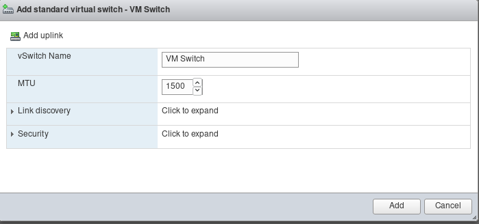
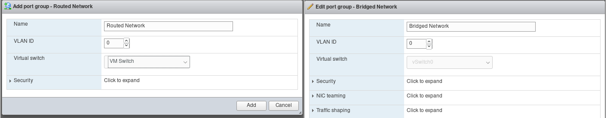
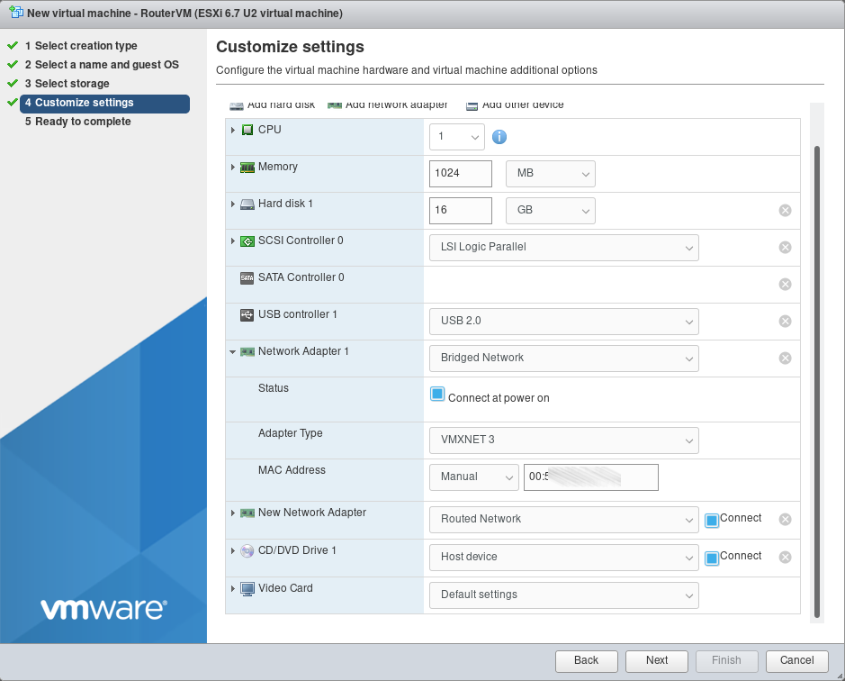

## Introduction

VMware vSphere, formerly known as VMware ESXi, is a virtualization product by VMware which provides a hypervisor to run virtual machines on bare-metal hardware.

This tutorial is a continuation of the [Install and configure VMware vSphere](https://community.hetzner.com/tutorials/install-and-configure-vmware-vsphere) tutorial, and describes how to setup a router VM to be able to use additional subnets, within the Hetzner infrastructure.

It is based on VMware ESXi 6.7 Update 2 (Build 13006603) without any vCenter Server.

## Requirements

* an additional IPv4 address
* a separate MAC address for the additional IPv4 address (can be generated in Robot)
* a subnet (which gets routed over the additional IPv4 address)
* VMware vSphere Web Client

Using a subnet requires at least one additional single IP address which must be set up with a virtual machine that will function as a router for the subnet. When ordering a subnet, **please make sure to add a note to request it should be routed to the additional single IP address.**

### Notes

**IPv6**

All servers come with a /64 IPv6 subnet. To see which IPv6 subnet the server has please check the "IPs" tab of the server in [Hetzner Robot](https://robot.your-server.de).

The IPv6 subnet is routed to the default link-local address (which is derived from the MAC address) of the main IP. Via [Hetzner Robot](https://robot.your-server.de) the routing of the IPv6 subnet can be switched to the link-local address of the virtual MAC (in other words, the additional single IP). This can be using the same symbol which is found next to additional single IPs to request virtual MAC addresses. In this case, the host running vSphere receives no IPv6 address. This is neither necessary not possible because ESXi does not work with an `fe80::1` gateway.

## Step 1 - Creation of Port groups and vSwitch

Go to `Navigator -> Networking -> Virtual switches ` and create a new virtual switch without any uplink.



Go to `Port groups` and rename the port group `VM Network` to something else (e.g. `Bridged Network`) to avoid confusion. Create a new Port Group and name it e.g. `Routed Network` and use the vSwitch `VM Switch`.



## Step 2 - Creation and configuration of Router VM

### Step 2.1 - Creation of Router VM

In this tutorial, Debian 10 Buster will be used as OS for the Router VM.

Go to `Navigator -> Virtual Machines` and create a new VM. Select `Create a new virtual machine` as creation type and go to the next step. Name the machine e.g. `RouterVM` and select `Linux` as Guest OS family and `Debian GNU/Linux 10 (64-bit)` as Guest OS version. Select a datastore and go to the next step. On step 4, select "Bridged Network" on the first network adapter and create a second network adapter and select `Routed Network` as network on it. On the first network adapter, do not forget to set the MAC address of the additional IPv4 address.



When the virtual machine has been created, proceed with the installation of Debian 10.

### Step 2.2 - Configuration of Router VM

First, update and upgrade the VM and install `open-vm-tools`. Then, check the interface name of the virtual subnet NIC with `ip l` and make a note of it (in this tutorial it is `ens192`). Edit the file `/etc/sysctl.conf` as root and un-comment the following lines:

```
net.ipv4.ip_forward=1
net.ipv6.conf.all.forwarding=1
```

Save the file and execute `sysctl -p` as root.

Edit the file `/etc/network/interfaces` and add the following lines (interface names may need to be changed if there are others):

```
iface ens160 inet6 static
  address 2001:db8:1234::2 # IPv6 address for bridged interface
  netmask 128
  gateway fe80::1

auto ens192
iface ens192 inet static
  address 10.0.0.1 # one IPv4 address of the subnet (do not use first and last ip)
  netmask 255.255.255.248 # for CIDR notation /29

iface ens192 inet6 static
  address 2001:db8:1234::1 # one IPv6 address of IPv6 prefix
  netmask 64
  up ip -6 route add 2001:db8:1234::/64 dev ens192
```

Save the file and reboot the server.

## Step 3 - Configuration of Client VM

For the test Client VM, Debian 10 will be used as OS.

**Do not forget to use the `Routed Network` Port group for the Client VM**.

Edit the file `/etc/network/interfaces` and add the following lines (interface names may need to be changed if there are others):

```
auto ens160
iface ens160 inet static
  address 10.0.0.2
  netmask 255.255.255.248
  gateway 10.0.0.1
  dns-nameservers 213.133.98.98 213.133.99.99 213.133.100.100

iface ens160 inet6 static
  address 2001:db8:1234::4
  netmask 64
  gateway 2a01:4f8:1234::1
```

Save the file and reboot the Client VM.

## Conclusion

By following these steps, servers with VMware vSphere will be able to use IPs from both IPv4 and IPv6 subnets.
