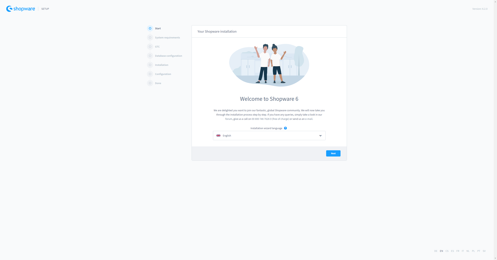
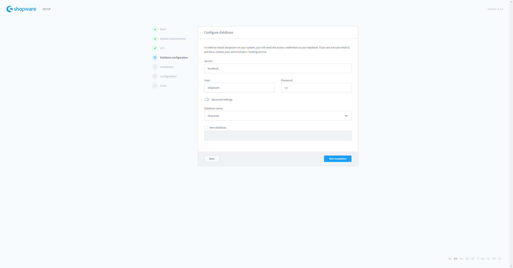
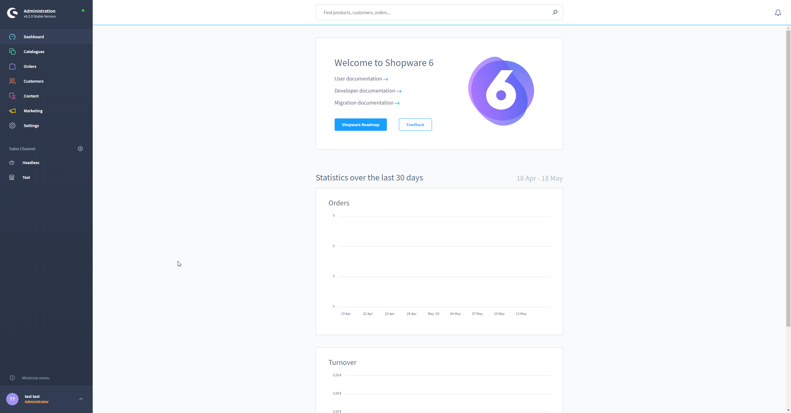

## Introduction

Shopware is a trendsetting ecommerce platform to power your online business. It offers a combination of beauty & brains needed to build and customize a fully responsive online store. In this tutorial, we will learn how to install and configure Shopware 6 with Nginx on Ubuntu 20.04.

**Prerequisites**

* Make sure you are logged in with a user with sudo access to the server.
* A registered domain with the required records as follows:
  * A record with `example.com` and a reference to the server's IP address
  * A record with `www.example.com` and a reference to the server's IP address (optional)

**Note:** `example.com` is your domain address (for example hetzner.com)

## Step 1 - Installing Nginx, MariaDB and PHP-FPM

Before begin installation of packages, we will update the local packages index using the following command:

```bash
sudo apt update
```

We can now install Nginx, MariaDB and PHP-FPM with the following command:

```bash
sudo apt install unzip nginx php7.4-fpm php7.4-mysql php7.4-json php7.4-curl php7.4-gd php7.4-xml php7.4-zip php7.4-opcache php7.4-mbstring php7.4-intl php7.4-cli mariadb-server
```

To confirm the installation, press enter and then all related packages will be installed.

## Step 2 - Creating a database and user for the Shopware database

Shopware will need credentials to connect to the database. We will create a new MySQL user and a new MySQL Database. With the command `mysql` we start a new mysql session. In this MySQL session we create a new database named `shopware` using the following query:

```sql
CREATE DATABASE shopware;
```

Next we will create a new MySQL user `shopware` using the following query:

```sql
CREATE USER 'shopware'@'localhost' IDENTIFIED BY 'my-strong-password-here';
```

As a last step we will need to give the new user priviledge to acces our new database using the follow query:

```sql
GRANT ALL PRIVILEGES ON shopware.* TO 'shopware'@'localhost';
```

## Step 3 - Configuring PHP/PHP-FPM

To match the requirements of Shopware 6, we will need to adjust some `php.ini` settings. The `php.ini` used by PHP-FPM can be found under `/etc/php/7.4/fpm/php.ini`. We can open it with an editor like `nano`:

```bash
sudo nano /etc/php/7.4/fpm/php.ini
```

We then search with `CTRL` + `W` for `memory_limit =` and set the value from 128 to 512.

Next we will change the upload limits for files. Search again, this time for `post_max_size =` and `upload_max_filesize =` using `STRG` + `W` and replace the values with `32M`.

This will allow us to upload larger files to the media manager. We can save the file with `STRG` + `O` and leave the editor with `STRG` + `X`.

After configuring we can restart the PHP-FPM server using the command:

```bash
sudo systemctl restart php7.4-fpm
```

It should be also marked to start on boot:

```bash
sudo systemctl enable php7.4-fpm
```

## Step 4 - Configuring Nginx

The default vhost configuration can be found under `/etc/nginx/sites-enabled/default`. We will edit it to add the Shopware vhost configuration:

```bash
sudo nano /etc/nginx/sites-enabled/default
```

Replace the content with:

```
server {
    listen 80;

    # Handle / to index.php
    index index.php;

    # Our server name
    server_name example.com;

    # Should be equal to post_max_size
    client_max_body_size 128M;

    # Where the code is located
    root /var/www/html/public;

    # Needed for Shopware install / update
    location /recovery/install {
        index index.php;
        try_files $uri /recovery/install/index.php$is_args$args;
    }

    location /recovery/update/ {
        location /recovery/update/assets {
        }
        if (!-e $request_filename){
            rewrite . /recovery/update/index.php last;
        }
    }

    # Foward any not found file to index.php. Allows to have beautiful urls like /homemade-products/
    location / {
        try_files $uri /index.php$is_args$args;
    }

    # Let php-fpm handle .php files
    location ~ \.php$ {
        fastcgi_split_path_info ^(.+\.php)(/.+)$;
        include fastcgi.conf;
        fastcgi_param HTTP_PROXY "";
        fastcgi_buffers 8 16k;
        fastcgi_buffer_size 32k;
        fastcgi_read_timeout 300s;
        client_body_buffer_size 128k;
        fastcgi_pass unix:/run/php/php7.4-fpm.sock;
        http2_push_preload on;
    }
}
```

Now we can restart nginx and mark it to start on boot:

```bash
sudo systemctl restart nginx
sudo systemctl enable nginx
```

## Step 5 - Installing Shopware 6

After configuring MariaDB, PHP and Nginx we start the installation of Shopware. We will install it to `/var/www/html`.

```sudo
cd /var/www/html
```

Remove default file in this folder:

```sudo
sudo rm index.nginx-debian.html
```

Download Shopware 6 (see https://www.shopware.com/en/changelog/ for latest versions):

```sudo
sudo wget https://releases.shopware.com/sw6/install_6.2.0_1589874223.zip
```

Unzip:

```sudo
sudo unzip install_6.2.0_1589874223.zip
```

Remove zip:

```sudo
sudo rm install_6.2.0_1589874223.zip
```

Correct permissions:

```sudo
sudo chown -R www-data:www-data .
```

Now we can access the installation wizard using our domain.



In the Database Configuration we can use the configured credentials:



After finishing the wizard and the first run wizard the Shop is ready for use.



## Step 6 - Configuring background queue worker

In the default configuration Shopware 6 will run a browser worker to consume all background tasks. This will block PHP-FPM processes for 30s. When multiple tabs / users are working at the same time in the administration, it will slow down page speed. To fix these issues we will configure a background worker using systemd.

To disable the current browser worker, we will create a new file `config/packages/shopware.yaml`:

```bash
sudo nano /var/www/html/config/packages/shopware.yaml
```

Then disable it with the following config:

```yaml
shopware:
    admin_worker:
        enable_admin_worker: false
```

To activate the config we need to clear the cache:

```php
sudo -u www-data php bin/console cache:clear
```

Now we can create a new systemd unit which interacts as worker. For that we have to create these two new files:

* `/etc/systemd/system/shopware_consumer.service` - Consumes messages from queue.
* `/etc/systemd/system/shopware_scheduled_task.service` - Runs scheduled tasks

```bash
sudo nano /etc/systemd/system/shopware_consumer.service
```

Add the following unit there:

```
[Unit]
Description=Shopware Consumer
After=mysql.service

[Service]
Type=simple
User=www-data
Restart=always
ExecStart=/usr/bin/php /var/www/html/bin/console messenger:consume --time-limit=60 --memory-limit=512M
```

Now we setup the shopware scheduled tasks runner:

```bash
sudo nano /etc/systemd/system/shopware_scheduled_task.service
```

Add the following unit there:

```
[Unit]
Description=Shopware Scheduled Task
After=mysql.service

[Service]
Type=simple
User=www-data
Restart=always
ExecStart=/usr/bin/php /var/www/html/bin/console scheduled-task:run --time-limit=60 --memory-limit=512M
```

The processes will have a time limit of 60s and memory limit of 512m. After reaching a limit it will stop and the unit will restart the process.
Now we can start the workers with following commands:

```bash
sudo systemctl start shopware_consumer
sudo systemctl start shopware_scheduled_task
sudo systemctl enable shopware_consumer
sudo systemctl enable shopware_scheduled_task
```

## Step 7 - Configuring Letsencrypt

To configure Letsencrypt for our new virtual host in Nginx, please follow the [Install and Secure Nginx with Let's Encrypt](https://community.hetzner.com/tutorials/install-and-secure-nginx-lets-encrypt-debian-10) tutorial.

## Conclusion

By following this tutorial you will have a shop running with Shopware 6. The next steps would be to start adding products and configuring payment providers.

<!---

Contributors's Certificate of Origin

By making a contribution to this project, I certify that:

(a) The contribution was created in whole or in part by me and I have
    the right to submit it under the license indicated in the file; or

(b) The contribution is based upon previous work that, to the best of my
    knowledge, is covered under an appropriate license and I have the
    right under that license to submit that work with modifications,
    whether created in whole or in part by me, under the same license
    (unless I am permitted to submit under a different license), as
    indicated in the file; or

(c) The contribution was provided directly to me by some other person
    who certified (a), (b) or (c) and I have not modified it.

(d) I understand and agree that this project and the contribution are
    public and that a record of the contribution (including all personal
    information I submit with it, including my sign-off) is maintained
    indefinitely and may be redistributed consistent with this project
    or the license(s) involved.

Signed-off-by: Soner Sayakci <s.sayakci@shopware.com>

-->
