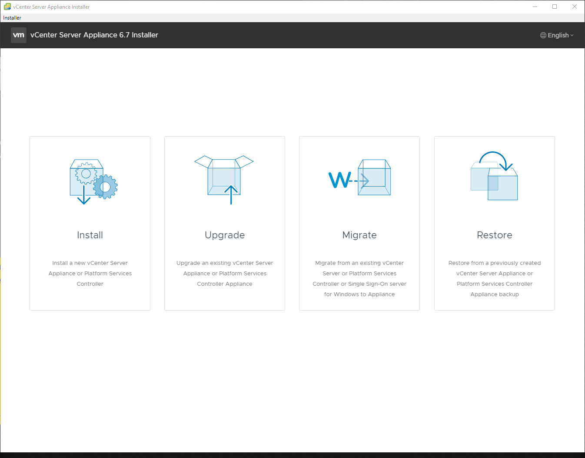

## Introduction

In this tutorial, we will be deploying VMware vCenter, configuring the appliance and adding our vSphere (ESXi) host to a datacenter so we can manage it.

**Prerequisites**

* A server with VMware vSphere (ESXi) installed.
* A VMware account in order to download the ISO required to install the vCenter Server Appliance.
* An IP address for your vCenter server. This can either be a public IP address, or a private IP address from a router VM. (Do keep in mind that if you want to use a private IP, you will have to create a vmkernel NIC with Management access on the ESXi host connected to the same network as your vCenter Server will be.)

**Licensing**

The vCenter Server Appliance is not a free product. It will have a 60 day trial license when installed. If you want to continue to use it after that, you will need to [buy](https://store.vmware.com/store) a license.
More information on licensing can be found [here](https://blogs.vmware.com/vsphere/2018/10/vcenter-server-licensing-options.html).

## Step 1 - Deploying the vCenter Server Appliance

We have to download the vCenter Server Appliance ISO, mount it and install it.

First, download the vCenter Server Appliance ISO. You can download it from [here](https://my.vmware.com/web/vmware/details?productId=742&rPId=22641&downloadGroup=VC67U2).

Select the most up-to-date version on the top, and then click on the blue Download Now button next to "VMware vCenter Server Appliance". You will have to login with your VMware account and click on the blue link to activate your VMware vSphere 6.7 trial.

Once you have downloaded the ISO, you have to mount it. In Windows 10 and Windows Server 2016, simply double click on the ISO to mount it. In other versions, you will have to use a program such as [Virtual CloneDrive](https://www.elby.ch/en/products/vcd.html).

This will open the deployment program.

**Deployment:**
- Click on install.

- Click on next and accept the EULA.
- Select 'Embedded Platform Services Controller' as the deployment type.

- Fill in the IP address of your ESXi server, along with the username and password.

- Accept the SSL certificate warning.
- Fill in a virtual machine name, and set a root password.

- Select a deployment size, use the table as a guide on what size you need.

- Select a datastore to put the appliance on, and choose if you want Thin Disk Mode or not. (Thin Disk Mode creates the data virtual disk as Thin Provisioned, instead of the default Thick Provisioned. Thin Provisioned means that the virtual drive will be as large as the amount of data is stored on it. (For example, a 300GB virtual disk that has 70GB of data on it, will only be about 70 GB in size.) A Thick Provisioned virtual drive means that the drive will take up the full amount of space. (For example, a 300GB virtual disk that has 70GB of data on it, will be 300GB in size.))

- Configure the portgroup that the appliance should be connected to and if it should use a static IP, or a DHCP IP. (In case of a private IP, you can either choose DHCP or a static IP, depending on what you want. In the case of a public IP, you have to select DHCP. (this will help verify that the MAC address is correct later)
- Click on next, review the settings and click on deploy.

If you are using a private IP, continue to Step 2.

If you want to use a public IP for the vCenter Server Appliance, when it has finished deploying you will need to forcefully shutdown the VM, change the MAC address of the NIC to a MAC address that you request through the Robot console, and then have it power on. The catch is that your installer will be stuck at 80%. The solution for this is simple. Open up the console of your VM. After a while, it will give you a screen where it lists the IP address, hostname, CPU and memory. When you have reached that screen, press F2. Setup a root password, then when it has been set, press Escape and go to https://your-ip:5480

It will have no password, so go to the console of the Virtual Machine. Press F2, a prompt will appear and you have to set a password, use the password that you used during deployment. When you have set the password, you can press ESC to log out of the appliance, now to back to the URL that you opened, click on configure and then login with root as the user and the password that you just set.

## Step 2 - Configuring the vCenter Server Appliance

In this step, we are going to configure the vCenter Server Appliance.

We start off by clicking on Next.

Here, we have to configure our appliance. I recommend to synchronize time with the ESXi host, and leave SSH access disabled, unless you are planning to use High Availability. SSH can always be turned on later.

Now we have to create an SSO domain. If you already have a vCenter server running, you could join it to the SSO domain of that server and control both appliances. However, since we are not planning to do that, we are going to create an Single Sign On domain. You can pick what you would like. example.com, corp.local, or use the default, vsphere.local

Type in a password and click next. Now you have to select if you want to enter the Customer Experience Improvement Program. That is up to you, after you have made your decision, click next. Then verify the settings that you chose. If you are happy with them, click finish and the configuration will start. After that has finished, continue to step 3.

## Step 3 - Creating our first datacenter and adding our ESXi host to it

In this step, we will license our assets, create our first datacenter and add our ESXi host to it.

When the configuration is successful, you will have a a message saying that the setup of the appliance was successful. There is a link to a getting started page, click on it. You can also go to https://ip-of-your-vcenter/  
If you get a warning about the SSL certificate not being trusted, ignore it. This is what we expect from a freshly deployed vCenter Server Appliance.

Open up the HTML5 client, and login with your username and password. (If your SSO domain is vsphere.local then the username is administrator@vsphere.local)

Logging in for the first time will take a while. When you have logged in, at the upper side of your screen there will be a warning saying that your vCenter server is running on a trial license. If you have a license, open the license manager and add the license(s). Then assign it to the vCenter server by clicking on Assets and clicking on the vCenter server, followed by Assign License. If you do not have one, then you will get a 60 day trial.

Once you have done that, or you do not have a license and wish to continue with the trial license, click on Menu and then Hosts & Clusters. Right click on your vCenter server on the left and click on New Datacenter. Give it a name and press OK.

If your vCenter server is using a private IP, you have to first create a VMKernel adapter. To do this, login to your ESXi host. Click on Networking, and then VMkernel NICs. Click on Add VMkernel NIC, and select New port group, give it a name and attach it to your LAN virtual switch. Down at Services, check Management, then click on create. Now you may continue with the step below.

If both your ESXi host and your vCenter server is using a public IP, or if you are using a private IP on your vCenter server and you have set up a VMkernel NIC on your ESXI host, continue with the step below:

- Right click and select Add Host.
- Type in the IP or FQDN of your ESXi server, and click on next.

- Enter in the username and password of the ESXi server, and click on next.

- Check the host summary to make sure that you have the correct host.

- Accept the certificate
- Assign a license. (You can add a license, or continue with the license already on the ESXi machine.)

- Choose what level of lockdown mode you want. I recommend Disabled or Normal. I usually go with Disabled as it allows you to remotely log into the ESXi server through SSH when you turn it on and need it. Click on next, specify a VM location and click on next. Review the settings, and then click on finish.

## Conclusion

Congratulations, you have now installed and configured vCenter, made your first datacenter and added your host to it.

This should get you started with vCenter. Have fun exploring!

##### License: MIT

<!---

Contributors's Certificate of Origin

By making a contribution to this project, I certify that:

(a) The contribution was created in whole or in part by me and I have
    the right to submit it under the license indicated in the file; or

(b) The contribution is based upon previous work that, to the best of my
    knowledge, is covered under an appropriate license and I have the
    right under that license to submit that work with modifications,
    whether created in whole or in part by me, under the same license
    (unless I am permitted to submit under a different license), as
    indicated in the file; or

(c) The contribution was provided directly to me by some other person
    who certified (a), (b) or (c) and I have not modified it.

(d) I understand and agree that this project and the contribution are
    public and that a record of the contribution (including all personal
    information I submit with it, including my sign-off) is maintained
    indefinitely and may be redistributed consistent with this project
    or the license(s) involved.

Signed-off-by: Michael Goossens <michaelgoossens@live.be>

-->
