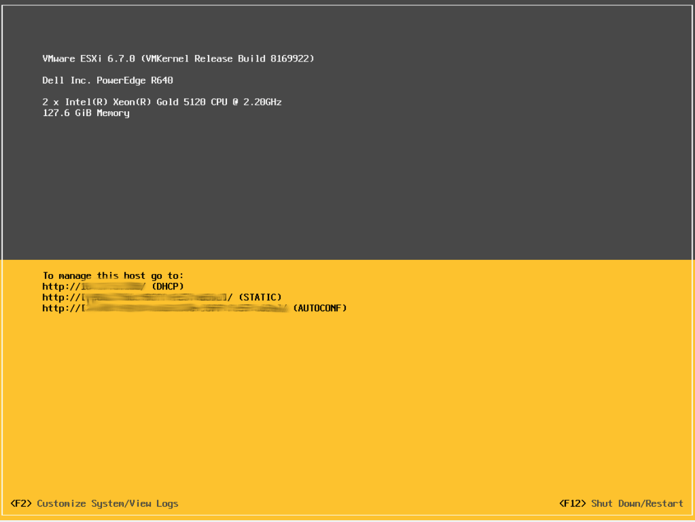
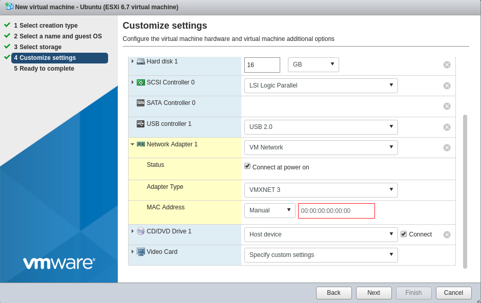

## Introduction

VMware vSphere, formerly known as VMware ESXi, is a virtualization product by VMware which provides a hypervisor to run virtual machines on bare-metal hardware.

This tutorial shows the necessary steps for the installation of VMware vSphere on Hetzner servers.

**Limitations**

* Software RAID is not supported
* NAT and (internal) routing are not supported
* Using a subnet requires setting up a router VM on a additional single IP

**License**

After installation the system has a 60-day test license. For the long-term use an individual license is required. A free single node license can be requested by registering on the [VMware website](https://www.vmware.com/products/vsphere-hypervisor.html)

## Compatibility

The Dell PowerEdge models DX150, DX151, DX290, DX291  and DX141 are certified and compatible with all versions from 5.0 onwards. DX152 and DX292 are compatible from 6.5 onwards.

All other models are not certified by VMware, yet in most cases VMware vSphere/ESXi can be installed.

The following table lists all currently known working models and versions (information subject to change)

| Model                 | VMware vSphere (ESXi) Version                                 |
|-----------------------|---------------------------------------------------------------|
| AX50-SSD/AX60-SSD     | from 6.5a (additional NIC required)                           |
| AX160                 | from 6.5a                                                     |
| PX92                  | from 6.5                                                      |
| PX91/PX121            | from 5.5 Update 1                                             |
| PX90/PX120            | from 5.1                                                      |
| PX61                  | from 5.5 Update 3 / 6.0 Update 2                              |
| PX61-NVMe             | from 6.0 Update 2                                             |
| PX60/PX70             | from 5.5 Update 1                                             |
| EX61/EX61-NVMe        | from 6.5                                                      |
| EX41/EX41S/EX51/EX42  | from 5.5 Update 3 / 6.0 Update 2 (may require additional NIC) |
| EX40/EX60             | 5.0 - 5.1 Update 2, since 5.5 (additional NIC required)       |
| EX6/EX6S/EX8/EX8S     | from 5.0                                                      |
| EX4/EX4S/EX10         | from 5.0 (additional NIC required)                            |
| EQ4/EQ6/EQ8/EQ9       | 5.0 - 5.1 Update 2, since 5.5 (additional NIC required)       |

The models mentioned above should work with the appropriate version. Newer versions may not be compatible.

Using a custom installation ISO with 3rd party / community drivers may allow installation without adding a compatible network card. Creating such an ISO is out of scope for this guide.

## Step 1 - Installation

When ordering the desired server, make sure to select "Rescue System" to ensure no other operating system is present on the drives. If needed a RAID controller can be added on non-NVMe models during the order process.  It must be configured prior to the installation.

After the server has been provisioned, request a KVM console via [Hetzner Robot](https://robot.your-server.de). The KVM Console allows you to connect a virtual DVD drive to the server from which vSphere can be installed.

Insert the ISO into the virtual drive and boot the server from the image.  The installer only requires answers to a few questions like locale, root password and target drive.

Once the installation is completed and the server has booted the installed system, you will be greeted with a welcome screen.

To log in use the password that you entered during the installation. This is the root password for SSH as well as the password for the VMware vSphere Web Client.



## Step 2 - Network configuration

Before installing a virtual machine, additional IP addresses for these instances can be ordered via Hetzner Robot. This can be done either in the form of a limited number of single IP addresses, or for larger quantities in the form of subnets. Please note that using subnets will require setting up a virtual machine to act as a router.

For connectivity between multiple ESXi servers within the same public Hetzner subnet, host routes via gateway are necessary due to network security restrictions.

```bash
# host A
esxcfg-route -a <IP Host B> 255.255.255.255 <gateway IP>

# host B
esxcfg-route -a <IP Host A> 255.255.255.255 <gateway IP>
```

### Using single IP addresses

When using single IP addresses for virtual machines, you must request a dedicated virtual MAC address for each IP via Hetzner Robot. Configure the assigned MAC addresses in the network card settings of the virtual machine. Once this is done, the virtual machine can be installed and will receive its network settings via DHCP from the Hetzner network.



### Using Subnets

For a subnet please see the following tutorial: [Install and configure a Router VM for VMware vSphere](https://community.hetzner.com/tutorials/install-and-configure-routervm-for-vmware-vsphere)

## Conclusion

If you followed the steps your server has VMware vSphere installed on it, with virtual machines using additional IP addresses.
