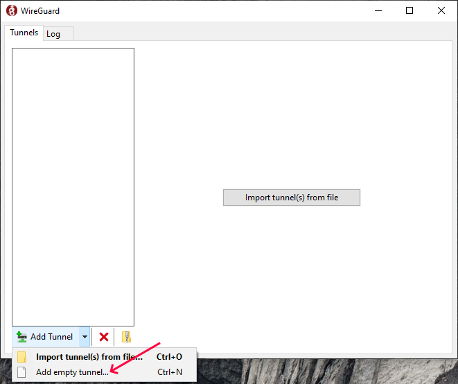
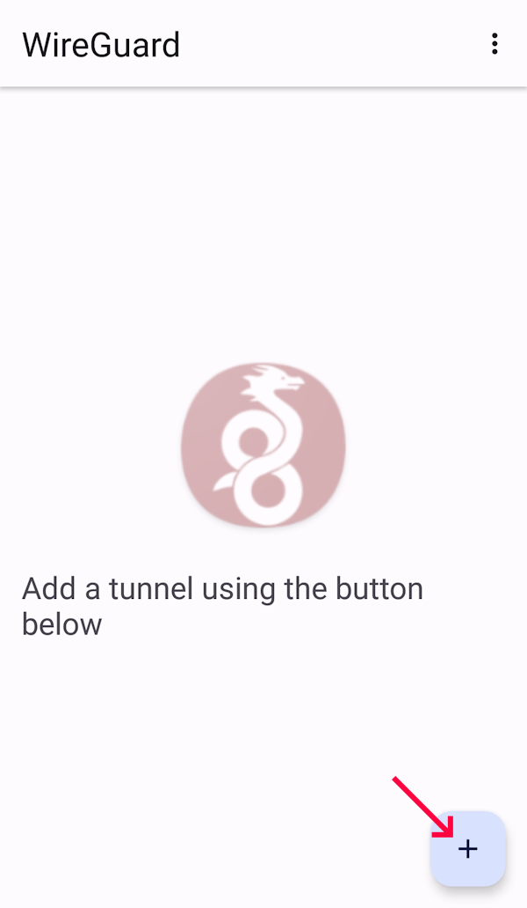
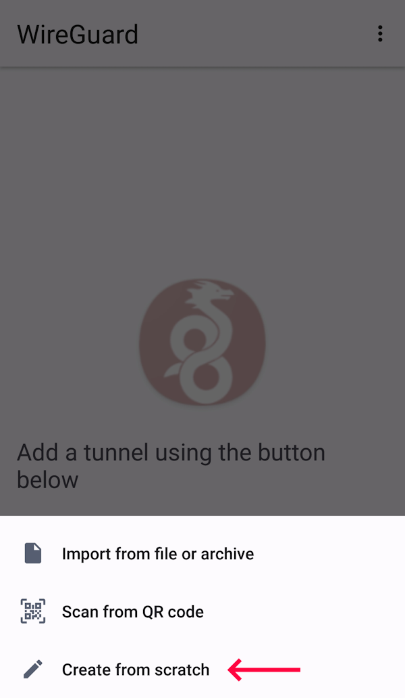
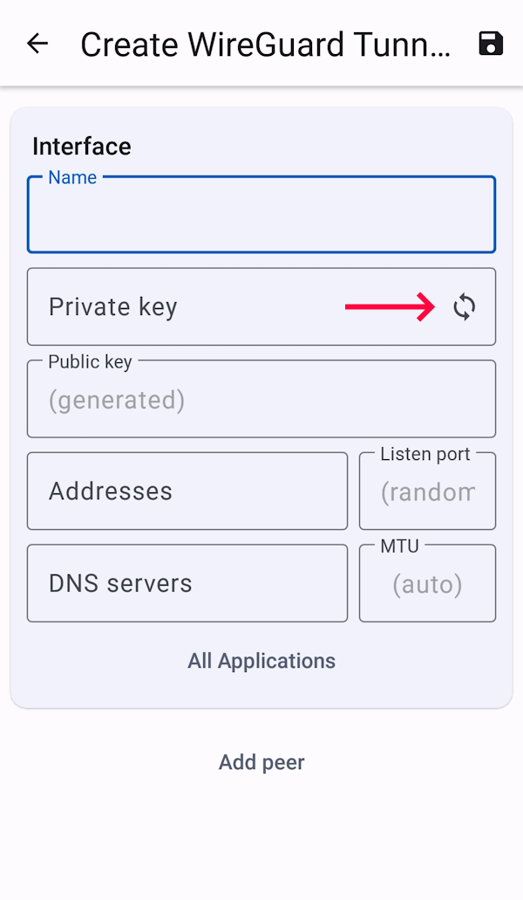

## Introduction

WireGuard is a fast and secure alternative to other VPN software such as IPSec and OpenVPN. The benefit of WireGuard is that it is multithreaded and built into the kernel, meaning you can achieve symmetrical throughputs of 1Gbps even on lower end boxes, something that is not possible with OpenVPN. The server is very lightweight and easy to set up. There are clients for most operating systems including Windows.

Some other benefits of WireGuard include being able to run internal services such as SSH, FTP, and remote desktop, on the VPN IP address instead of the main IP address of the server, which reduces the possible attack vectors on your server. For example, you can enable SSH access for one user on your public IP, and all other users on the VPN IP only.

You can also tunnel part or all of your internet traffic over WireGuard as a VPN, and easily achieve speeds of over 1Gbps. If you are behind NAT and cannot port forward, a simple WireGuard server on a low end VPS is a good way to allow servers running on your computer to be accessible from the internet.

This tutorial will focus on installing WireGuard on a Debian server.

> **Note:** You may find the "[Installing WireGuard VPN on Ubuntu](https://community.hetzner.com/tutorials/install-and-configure-wireguard-vpn/)" tutorial useful if you want to configure a WireGuard server to provide Internet access to various client devices.

**Example terminology**

* Public IP of your server: `203.0.113.1`

  You must change it with your own IP.

* Subnet for the WireGuard tunnel: `10.0.0.0/24`

## Step 1 - Installation

Connect to your server by using SSH.

Run the following command to install WireGuard:

```bash
sudo apt update && sudo apt install wireguard
wg --version
```

## Step 2 - Server configuration

This guide will assume you have a server with a single client. WireGuard supports as many clients as needed, simply add another peer to the `wg0.conf` configuration file, and follow client installation steps again on the client.

First, generate the public and private keys for the server. Your public key will be printed to the terminal:

```bash
wg genkey | sudo tee /etc/wireguard/wg-private.key | wg pubkey | sudo tee /etc/wireguard/wg-public.key
```

You can retrieve your keys later with the following commands:

```bash
sudo cat /etc/wireguard/wg-private.key
sudo cat /etc/wireguard/wg-public.key
```

This tutorial will use `wg-quick` for the running of the server. There are other methods, but this is the easiest to start with.

Create and edit the file `/etc/wireguard/wg0.conf` in your favorite text editor.

Here, `203.0.113.1` is the public IPv4 address of your server, `10.0.0.1` is the private IPv4 address used for the VPN server, and `10.0.0.2` is used for the client. If you need more clients, simply use other IPs (`10.0.0.3`, etc) within the subnet `10.0.0.0/24`.

* The private (`10.0.0.1`) IPv4 will be the VPN IP address of the server. This IP is not accessible from the public internet, and any services listening on it will only be accessible from within clients connected to the VPN.
* This subnet can be changed to other [private networks](https://en.wikipedia.org/wiki/Private_network). Alternatively, you can use and forward public IP addresses if your server has at least 3 public IPv4, but this is outside the scope of the tutorial, and needs careful firewalling.

Add a configuration such as:

```ini
[Interface]
Address = 10.0.0.1/24
ListenPort = 51820
PrivateKey = PRIVATE KEY YOU GENERATED GOES HERE

[Peer]
PublicKey = NOTHING GOES HERE YET
AllowedIPs = 10.0.0.2/32
PersistentKeepalive = 25
```

To explain each configuration parameter:

* `Address` is the aforementioned private IPv4. The /24 subnet indicates that this will handle IPs `10.0.0.1 - 10.0.0.254`.
* `ListenPort` is the listening port of your server. This will need to be opened in your firewall.

  Take a look [here](/tutorials/install-and-configure-wireguard-vpn#step-21---firewall-configuration-optional) for additional notes about how to configure a firewall for the WireGuard server.

* `PrivateKey` is the private key generated for the server. The public key will be given out to each client. The rule of thumb: the private key does not leave the device it was generated on, but the public key does.

Each peer (you can add multiple in the same file) has a public key which will be generated on the client, as well as:

* `AllowedIPs`: Here we place the subnet for our clients, as well as the allowed IP address for the client. Restrict this as needed (for example, remove the `10.0.0.1/24` if you do not want each client to be able to talk to other clients on that subnet).
* `PersistentKeepalive`: Keeps the connection alive by sending a handshake every 25 seconds.

## Step 3 - Client configuration

Repeat [step 1](#step-1---installation), and [step 2](#step-2---server-configuration) up until "configuration" if you are running Linux on the client, otherwise [download the WireGuard client for your device](https://www.wireguard.com/install/) and install it.

You can generate a public and private key for the client in the same way as for the server in [step 2](#step-2---server-configuration). Alternatively, you can generate them on the target device. The Windows and Android client will generate a key pair for you when you try to add a new tunnel configuration.

<details>

<summary><b>Generate key pair on Windows</b></summary>

Click _triangle_ on the _Add Tunnel_ button to open the menu and click _Add empty tunnel_.



The private and public key will be generated for you.

</details>

<details>

<summary><b>Generate key pair on Android</b></summary>

1. Open the WireGuard app and tap _+_:

   

2. Tap _Create from scratch_:

   

3. Tap the regenerate icon:

   

Your new key pair will be created.

</details>

Add the public key you just generated to the server `/etc/wireguard/wg0.conf` file in the peer's `PublicKey` field.

Next, you will need to configure the client. The configuration is very similar to the server. In fact, you can run a client as a server by adding a `ListenPort` directive, and connect multiple servers together that way.

An example client configuration, which only tunnels VPN traffic on `10.0.0.0/24`, and not the entire internet of the client computer:

> Replace `203.0.113.1` with your server IP address.

```ini
[Interface]
Address = 10.0.0.2/24
PrivateKey = PRIVATE KEY OF CLIENT GOES HERE

[Peer]
PublicKey = PUBLIC KEY OF SERVER GOES HERE
AllowedIPs = 10.0.0.0/24
Endpoint = 203.0.113.1:51820
PersistentKeepalive = 25
```

An example configuration, which tunnels all traffic through the server, with IPv6 support:

> Replace `203.0.113.1` with your server IP address.

```ini
[Interface]
# Switch DNS server while connected
DNS = 8.8.8.8
Address = 10.0.0.2/24, 2a01:4f8:1234::2/128
PrivateKey = PRIVATE KEY OF CLIENT GOES HERE

[Peer]
PublicKey = PUBLIC KEY OF SERVER GOES HERE
AllowedIPs = 0.0.0.0/0, ::/0
Endpoint = 203.0.113.1:51820
PersistentKeepalive = 25
```

Remove the IPv6 addresses if you do not want IPv6 support.

If you want IPv6 support, you will also need to add the client's IPv6 address to the server configuration under the peer's `AllowedIPs`. Each server gets a `/64`, so you can allocate an individual IP in there to your client (or a smaller subnet). Keep in mind when forwarding a public IPv6 you will need to firewall it correctly, which is outside the scope of this tutorial (it can either be firewalled on the client with Windows firewall or the server with `iptables`, for example). It is possible to forward public IPv4 in a similar way. The benefit of doing this is you do not need NAT on the server-side for port forwarding.

## Step 4 - Routing all your traffic through VPN

The `AllowedIPs` field in the client configuration will specify what IP ranges go through the tunnel and what do not. You will need to configure `iptables` on the server to enable external internet access if forwarding all traffic (that is `0.0.0.0/0` configuration).

First, run the following command to allow IP forwarding:

```bash
sudo sysctl net.ipv4.ip_forward=1
```

If you want to preserve this change after reboot you need to edit the `sysctl.conf` configuration file:

```bash
sudo nano /etc/sysctl.conf
```

Find the `net.ipv4.ip_forward` configuration option and change it to:

```ini
net.ipv4.ip_forward = 1
```

Now, you need add the following `iptables` rules:

> Replace `enp1s0` with the main interface (you can check it with `ip a`).  
> Replace `203.0.113.1` with your server IP address.

```bash
sudo iptables -t nat -A POSTROUTING -s 10.0.0.0/24 -o enp1s0 -j SNAT --to-source 203.0.113.1
sudo iptables -t nat -A POSTROUTING -s 10.0.0.0/24 -j MASQUERADE
```

To save the rules across reboots you need to install the package `iptables-persistent`:

```bash
sudo apt update && sudo apt install iptables-persistent
```

Run the following command to save the rules in file, which will be loaded at system boot:

```bash
sudo iptables-save -f /etc/iptables/rules.v4
```

## Step 5 - Port forwarding (Optional)

For example, to make a TCP service running on a VPN client at `10.0.0.2:48000` accessible from the internet at `203.0.113.1:45000` run the following command:

> `enp1s0` is your main interface.  
> `203.0.113.1` is the IP address of your server.  
> `10.0.0.2` is the IP address of your VPN client.

```bash
sudo iptables -t nat -A PREROUTING -d 203.0.113.1/32 -i enp1s0 -p tcp -m tcp --dport 45000 -j DNAT --to-destination 10.0.0.2:48000
```

A nginx reverse proxy may also be used as an alternative with the `proxy_pass` directive.

## Step 6 - Start the server

To start the server, run the following command:

> `wg0` is your interface name.

```bash
sudo systemctl start wg-quick@wg0
```

To start the server automatically at system boot:

```bash
sudo systemctl enable wg-quick@wg0
```

The same commands are used to start the Linux client.

To check if things are working, type `sudo wg`. This will display an output such as:

```wg
interface: wg0
  public key: <public key of the server>
  private key: (hidden)
  listening port: 51820

peer: <public key of the client>
  endpoint: <public IP of the client>:31844
  allowed ips: 10.0.0.2/32, 2a01:4f8:1234::1/128
  latest handshake: 11 seconds ago
  transfer: 2.16 TiB received, 1.67 TiB sent
  persistent keepalive: every 25 seconds
```

If your client has connected correctly, you will see last handshake and total transfer.

You can now ping your server/client through the tunnel: `ping 10.0.0.1`. Any services bound to `0.0.0.0` or `10.0.0.1` will also be accessible from your clients over the VPN. Finally, with the `AllowedIPs = 0.0.0.0/0` configuration, all internet traffic will be tunneled over the VPN connection too.

To secure services to the VPN, either set their bind address to the VPN IP (`10.0.0.1`), or limit the access to `10.0.0.0/24` (for example, the `AllowUsers` directive in sshd_config: `AllowUsers root@10.0.0.*`). Avoid locking yourself completely out of the server doing this, and always leave a service open to all IPs while making changes in case something goes wrong. If you do lock yourself out, you will need to request a KVM console in robot and fix your mistakes.

## Step 7 - Reloading configuration file

To reload the configuration file run the following command:

> `wg0` is your interface name.

```bash
sudo systemctl restart wg-quick@wg0
```

### Step 7.1 - Reloading without disrupting active sessions (Optional)

You can add a client and reload configuration without disrupting active sessions. Run the following commands:

```bash
sudo su
wg syncconf wg0 <(wg-quick strip wg0)
```

Press `Ctrl + D` to close the root shell.

## Step 8 - Troubleshooting

<details>

<summary>Can you connect to the server at all?</summary>

Type `sudo wg`. Do you see a handshake having taken place recently? If so, you are connected. If not, check your public and private keys, as well as firewall rules.

</details>

<details>

<summary>Can you connect to the server but not access the internet in a <code>0.0.0.0/0</code> configuration?</summary>

If you can ping the server itself (`10.0.0.1`), it may be an `iptables` issue. Make sure you added the rule correctly, and `cat /proc/sys/net/ipv4/ip_forward` returns 1.

</details>

<details>

<summary>Can't ping a Windows client?</summary>

Windows blocks ICMP by default on the `10.0.0.0/8` range, so you will need to enable it in the Windows firewall. The same applies to any service running on a Windows client.

</details>

<details>

<summary>Slow speeds?</summary>

Check your CPU usage on the client and server. If your CPU is maxing out, that is the problem, but you should have no issue with multi-gigabit speeds on a modern 4-core processor. Try killing or renicing other applications that might be using the CPU. You will not see WireGuard as a process as it runs in the kernel, but you will see its CPU usage as red bars in `htop`.

</details>

<details>

<summary>Can't access a service at <code>https://10.0.0.1:PORT</code>?</summary>

Type `netstat -tulpn` and check it is listening on `0.0.0.0` or `10.0.0.1`, not `127.0.0.1` or `203.0.113.1`.

</details>

<details>

<summary>As a client, cannot access something running on another client?</summary>

Ensure server allows `FORWARD` between the two clients in `iptables` / `ufw`. Also ensure `/proc/sys/net/ipv4/ip_forward = 1`.

</details>

## Conclusion

By now you should have a working VPN server running WireGuard, congratulations!

##### License: MIT

<!---

Contributors's Certificate of Origin

By making a contribution to this project, I certify that:

(a) The contribution was created in whole or in part by me and I have
    the right to submit it under the license indicated in the file; or

(b) The contribution is based upon previous work that, to the best of my
    knowledge, is covered under an appropriate license and I have the
    right under that license to submit that work with modifications,
    whether created in whole or in part by me, under the same license
    (unless I am permitted to submit under a different license), as
    indicated in the file; or

(c) The contribution was provided directly to me by some other person
    who certified (a), (b) or (c) and I have not modified it.

(d) I understand and agree that this project and the contribution are
    public and that a record of the contribution (including all personal
    information I submit with it, including my sign-off) is maintained
    indefinitely and may be redistributed consistent with this project
    or the license(s) involved.

Signed-off-by: Ben G <bene.glvr@gmail.com>

-->
