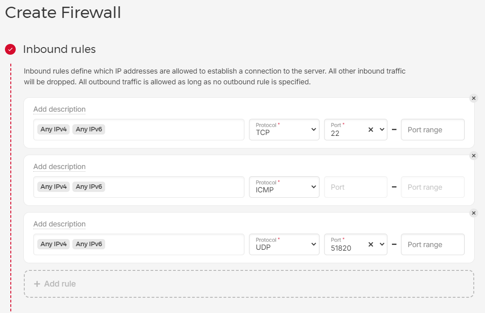
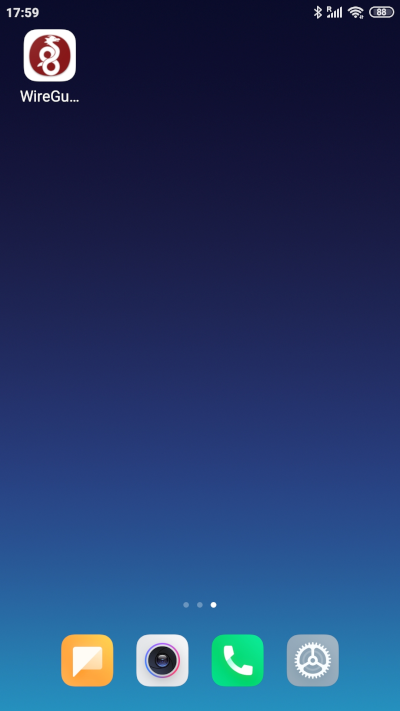
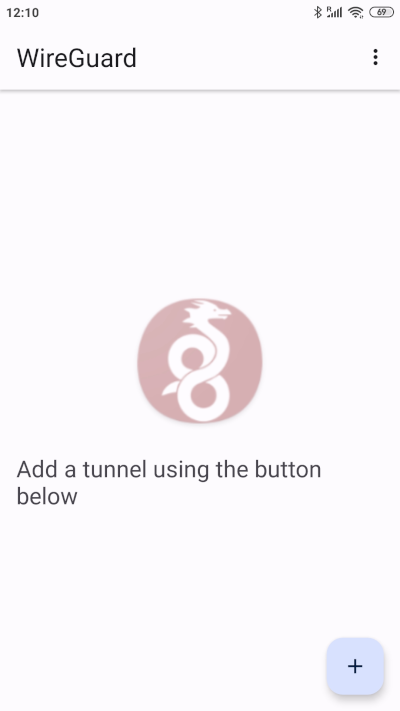
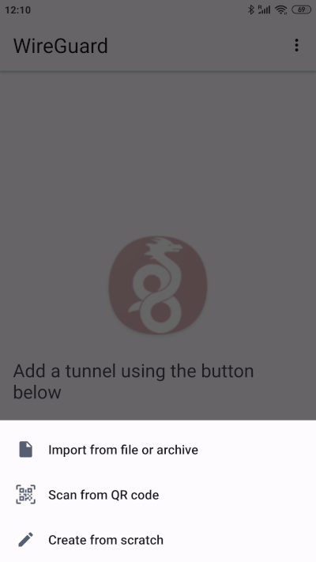
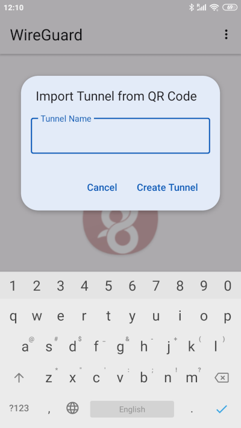
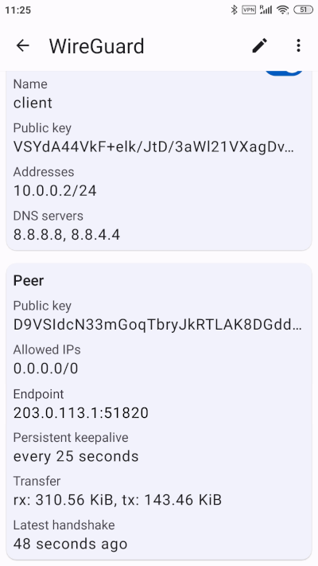
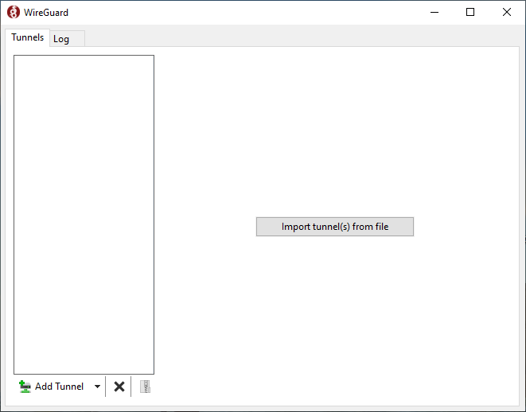
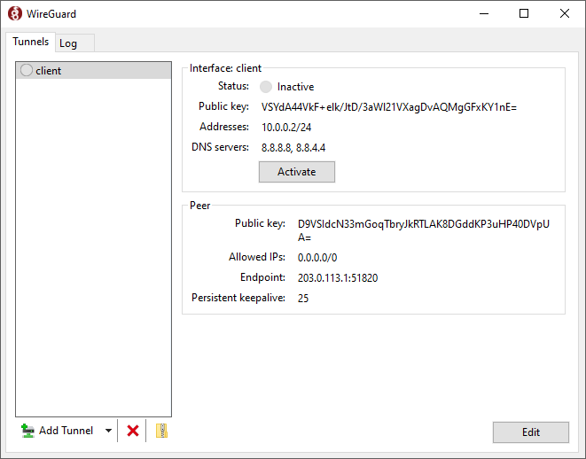
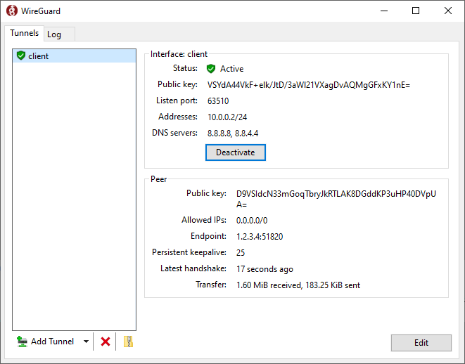
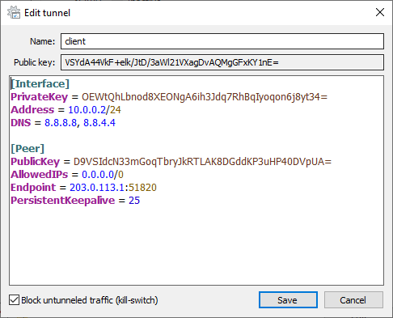

## Introduction

WireGuard is a fast and secure VPN software. It's very lightweight and easy to set up. There are clients for all popular operating systems.

WireGuard can be used to access websites and apps which are blocked in your country. You will need to install WireGuard in a country where those websites and apps are accessible.
Additionally, your real IP will be hidden, which is good for privacy. This tutorial will show you how to do that.

### WireGuard server vs. client

There is no built-in distinction between a server and a client. WireGuard provides a P2P (Peer-to-peer) protocol, which means that all peers are the same.
What makes one peer appear like a server and the other like a client are the configuration options.
The important differences in the configuration between a "server" and a "client" are presented in the table below. The are multiple "clients", but only one "server".

|| Client | Server |
|---|---|---|
| An IP address of the device is private or public. | The IP address is private and the peer is behind a NAT (Network Address Translation). | The IP address is public. |
| An IP address and WireGuard UDP port are static or dynamic. | They're dynamic and change over time. | They're static, and all "client" peers contain an IP address and UDP port of a "server" peer in their configuration. |
| Special configuration is needed. || The peer acts as a router, and provides internet access to "client" peers and connects all "client" peers together.
| What peers are known to the current peer. | The peer knows only about the "server" peer. | The "server" peer has information about all "client" peers in its configuration. |

**Prerequisites**

* an Ubuntu server
* a public IPv4 address attached to the server (most servers have one)
* a user with sudo privileges
  * You can follow [this tutorial](https://community.hetzner.com/tutorials/howto-initial-setup-ubuntu) to learn how to configure your server, including how to create a user with sudo privileges.

**Example terminology**

* Public IP of your server: `203.0.113.1`

  You must change it with your own IP.

* Subnet for the WireGuard tunnel: `10.0.0.0/24`

  This doesn't need to be changed, and I recommend not changing it.
  If you want to change it, make sure to replace all references of this subnet in all commands.

* Private IP of your server in the WireGuard tunnel: `10.0.0.1`

  If you change the subnet above, you should allocate the first IP from it to the server.

## Step 1 - Installation

After logging into your server via SSH, run the following command to install WireGuard:

```bash
sudo apt update && sudo apt install wireguard
```

## Step 2 - Server configuration

The server peer will provide internet access to the client peers and connect the client peers to each other.

First, you need to generate the configuration file for your server. You can do this by using the following command:

```bash
sudo tee /etc/wireguard/wg0.conf <<END
[Interface]
PrivateKey = $(wg genkey)
Address = 10.0.0.1/24
ListenPort = 51820
PostUp = sysctl net.ipv4.ip_forward=1
PostUp = iptables -A FORWARD -i eth0 -o %i -j ACCEPT
PostUp = iptables -A FORWARD -i %i -j ACCEPT
PostUp = iptables -t nat -A POSTROUTING -o eth0 -j MASQUERADE
PostDown = sysctl net.ipv4.ip_forward=0
PostDown = iptables -D FORWARD -i eth0 -o %i -j ACCEPT
PostDown = iptables -D FORWARD -i %i -j ACCEPT
PostDown = iptables -t nat -D POSTROUTING -o eth0 -j MASQUERADE
END
```

* The `PrivateKey` will be generated, every peer needs one. From the `PrivateKey` a `PublicKey` can be created which is given to other peers so that they can identify you.
* The configuration option `Address = 10.0.0.1/24` specifies both the IP and subnet.
  * The IP `10.0.0.1` is used for the server in the WireGuard tunnel.
  * The subnet `10.0.0.0/24` is used for the WireGuard tunnel. The IPs for all peers will be assigned from this subnet. You can use a different subnet, but you will need to adjust all commands below that use `10.0.0.0/24` subnet.
* The `ListenPort` should be specified for the server, `51820` is commonly used for WireGuard.
* The `PostUp` and `PostDown` configuration options are used to set up routing. This is needed to provide internet access to the clients and connect them together.
  * The `eth0` is the name of the network interface connected to the internet. It's often called `eth0`, but if it's not `eth0`, you need to replace all occurrences of `eth0` with your interface name. You can check your interface names and their IP addresses by using the following command: `ip address`.
* Further information about these and other configuration options is available in the man pages: [wg(8)](https://git.zx2c4.com/wireguard-tools/about/src/man/wg.8) and [wg-quick(8)](https://git.zx2c4.com/wireguard-tools/about/src/man/wg-quick.8).
* If you need to edit the configuration, you can re-run the command above or you can manually edit the file `/etc/wireguard/wg0.conf`.

The server configuration will be saved to `/etc/wireguard/wg0.conf`.
It will look like this:

```ini
[Interface]
PrivateKey = wOlrgfTMjTRoI8yMSXuT+h8lJHKmcteFaq7w8yojAnY=
Address = 10.0.0.1/24
ListenPort = 51820
PostUp = sysctl net.ipv4.ip_forward=1
PostUp = iptables -A FORWARD -i eth0 -o %i -j ACCEPT
PostUp = iptables -A FORWARD -i %i -j ACCEPT
PostUp = iptables -t nat -A POSTROUTING -o eth0 -j MASQUERADE
PostDown = sysctl net.ipv4.ip_forward=0
PostDown = iptables -D FORWARD -i eth0 -o %i -j ACCEPT
PostDown = iptables -D FORWARD -i %i -j ACCEPT
PostDown = iptables -t nat -D POSTROUTING -o eth0 -j MASQUERADE
```

Now you can start up WireGuard and configure it to always start up on system boot:

```bash
sudo systemctl start wg-quick@wg0 && sudo systemctl enable wg-quick@wg0
```

You need to create a directory where you will put the configuration files for your client devices.
We use `chmod` to make it readable and writable only by your user.

```bash
mkdir ~/wg-clients && chmod go= ~/wg-clients
```

### Step 2.1 - Firewall configuration (Optional)

You can configure a firewall for your WireGuard server for additional security. For this to work, you need to allow incoming packets to WireGuard's UDP port.
The port on which WireGuard is listening is specified in the `ListenPort` configuration field (`51820` in this tutorial).

* If you are using a Hetzner Cloud server, you can add a firewall to it. Use the [official documentation](https://docs.hetzner.com/cloud/firewalls/getting-started/creating-a-firewall) for a step-by-step guide. You need to add an inbound rule with the following configuration:

  | IP                 | Protocol | Port  |
  | ------------------ | -------- | ----- |
  | Any IPv4, Any IPv6 | UDP      | 51820 |

  After the rule is added, the result should be similar to the image below:

  

* If you are using a Hetzner dedicated root server, you can configure a firewall by following [this guide](https://docs.hetzner.com/robot/dedicated-server/firewall).

  You need to create an incoming rule for WireGuard with the following settings:

  | Name      | IP version | Protocol | Destination port | Action |
  | --------- | ---------- | -------- | ---------------- | ------ |
  | WireGuard | IPv4       | UDP      | 51820            | accept |

  You will also need to create an incoming rule at least for the SSH port 22/TCP, and the [outgoing rule with no restrictions](https://docs.hetzner.com/robot/dedicated-server/firewall/#example).

## Step 3 - Client configuration

### Step 3.1 - Create a client

This is a required step for each new client. The next step will be different depending on the OS of the client.
You need to create a client configuration file for each new physical device you want to connect to WireGuard. You can't use the same configuration file on multiple devices.
The configuration file, which will be created in this step, will be transmitted to the client device.

First, you need to create a configuration file for the client. You can do this by using the following command:

* Replace `client` in `tee ~/wg-clients/client.conf` with a unique name for the client.

  ```bash
  peers_count="$(sudo grep '\[Peer\]' /etc/wireguard/wg0.conf | wc -l)"
  tee ~/wg-clients/client.conf <<END
  [Interface]
  PrivateKey = $(wg genkey)
  Address = 10.0.0.$(( peers_count + 2 ))/24
  DNS = 8.8.8.8,8.8.4.4
  END
  ```

* An IP for the client will be assigned automatically depending on how many clients already exist.
* The `DNS` configuration option uses the Google Public DNS servers.

  If you're a Hetzner user you can use the Hetzner DNS servers by changing the DNS option to this:

  ```ini
  DNS = 185.12.64.1,185.12.64.2
  ```

The client configuration file will be saved to `~/wg-clients/client.conf`, where `client` is your client's name.
It will look like this:

```ini
[Interface]
PrivateKey = OEWtQhLbnod8XEONgA6ih3Jdq7RhBqIyoqon6j8yt34=
Address = 10.0.0.2/24
DNS = 8.8.8.8,8.8.4.4
```

Next you need to link the client and server together. The client and server need to know about each other to be able to communicate. In other words, the client needs a `PublicKey` of the server, and vice versa.

1. Add the `PublicKey` of the client to the server:

    * replace `client` in both occurrences of `~/wg-clients/client.conf` with the client's name that you chose above

    ```bash
    sudo tee -a /etc/wireguard/wg0.conf <<END
    [Peer]
    PublicKey = $(grep PrivateKey ~/wg-clients/client.conf | awk '{print $3}' | wg pubkey)
    AllowedIPs = $(grep Address ~/wg-clients/client.conf | awk '{print $3}' | sed 's/\/.*//')/32
    END
    ```

    After you have added a client to a server, you need to restart WireGuard:

    ```bash
    sudo systemctl stop wg-quick@wg0 && sudo systemctl start wg-quick@wg0
    ```

2. Add the `PublicKey` of the server to the client:

    * replace `client` in `~/wg-clients/client.conf` with the client's name that you chose above
    * replace `eth0` with your interface name, as described in [Step 2](#step-2---server-configuration)

    ```bash
    wgservip="$(ip -4 -br address show dev eth0)" &&
    tee -a ~/wg-clients/client.conf <<END

    [Peer]
    PublicKey = $(sudo grep PrivateKey /etc/wireguard/wg0.conf | awk '{print $3}' | wg pubkey)
    Endpoint = $(awk '{print $3}' <<<"$wgservip" | sed 's/\/.*//'):51820
    AllowedIPs = 0.0.0.0/0
    PersistentKeepalive = 25
    END
    ```

    The configuration will be printed to the terminal. For example:

    ```ini
    [Peer]
    PublicKey = D9VSIdcN33mGoqTbryJkRTLAK8DGddKP3uHP40DVpUA=
    Endpoint = 203.0.113.1:51820
    AllowedIPs = 0.0.0.0/0
    PersistentKeepalive = 25
    ```

    You need to check the line that starts with `Endpoint` to contain the public IP of your server and port `51820`. If it's not the case, you need to manually modify the file: `nano ~/wg-clients/client.conf`, where `client.conf` is your client configuration.

Last, you need to install and set up the WireGuard app on your client device. This process will be different depending on the client OS:

* [Android client](#step-32---android-client)
* [Windows client](#step-33---windows-client)
* [Linux client](#step-34---linux-client)

### Step 3.2 - Android client

This step will show you how to configure WireGuard on an Android device. You will need the configuration file created in [Step 3.1](#step-31---create-a-client).

Install [WireGuard from Google Play](https://play.google.com/store/apps/details?id=com.wireguard.android).

Now you need to generate a QR code for the configuration created previously, and scan it using the WireGuard app. Follow these steps:

1. Run the following command on your server:

    * replace `client.conf` with your client configuration created in [Step 3.1](#step-31---create-a-client)

    ```bash
    qrencode -t ansiutf8 < ~/wg-clients/client.conf
    ```

    The QR code will be generated and will be displayed in your terminal. It will look like this:

    

    Don't close the terminal with the QR code.

2. Scan the QR code with your Android phone / tablet.

    2.1 Open the WireGuard app.

    

    2.2 Press the plus button to add the configuration.

    

    2.3 Choose "Scan from QR code" and point your phone / tablet at the QR code in your terminal to scan it.

    

    2.4 Choose a name for your tunnel and press "Create Tunnel".

    

Activate the tunnel and press on its name. Check the "Transfer" field, both numbers should be non-zero. The "Latest handshake" field should be present with the time of the latest handshake.



Test the internet connection on your Android device, it should be working now. Your IP will be equal to the IP of your server.

You can verify that the client is successfully connected by running the following command on your server:

```bash
sudo wg
```

Output should be like this:

```
interface: wg0
  public key: D9VSIdcN33mGoqTbryJkRTLAK8DGddKP3uHP40DVpUA=
  private key: (hidden)
  listening port: 51820

peer: VSYdA44VkF+elk/JtD/3aWl21VXagDvAQMgGFxKY1nE=
  endpoint: 198.51.100.1:53091
  allowed ips: 10.0.0.2/32
  latest handshake: 34 seconds ago
  transfer: 2.13 MiB received, 22.13 MiB sent
```

* `198.51.100.1` is the public IP of your client and `53091` is a randomly chosen port
* `peer:` line contains the public key of the client
* `latest handshake:` line should be present, and transfer numbers should not be zero

### Step 3.3 - Windows client

You need to transfer the client configuration file that you created in [Step 3.1](#step-31---create-a-client) to your Windows computer.

Open PowerShell and run the following commands to copy the client configuration to your Windows computer.

* replace `holu` with your user that you used to configure the WireGuard server
* replace `203.0.113.1` with a public IP of your server
* replace `client.conf` with your client configuration created in [Step 3.1](#step-31---create-a-client)

```bash
cd ~
scp holu@203.0.113.1:wg-clients/client.conf .
```

The configuration file will be saved to your Windows user's home directory.

[Install WireGuard](https://download.wireguard.com/windows-client/wireguard-installer.exe) and run it. The main window appears.



Click on "Import tunnel(s) from file" and choose the file saved previously to your Windows home directory.

The tunnel is not active now, click the "Activate" button to activate it.




Take a look at the "Peer" section and check if the "Latest handshake:" line is present. If it is, it means that the connection is successful. Next, look at the "Transfer:" line. Both the received and sent numbers should be non-zero.

> **Note!**
> By default, when a tunnel is active all local connections are blocked. For example, you will not be able to open your router's web management page or to access your printer over a local network.
>
> You can fix it by right clicking on your tunnel name on the left, and clicking "Edit selected tunnel...". Uncheck the checkbox "Block untunneled traffic (kill-switch)" and click "Save". Local connections should be unblocked now.
>
> 

### Step 3.4 - Linux client

You need to transfer the client configuration file that you created in [Step 3.1](#step-31---create-a-client) from your server to your Linux client.

Run the following command on your Linux client to copy the client configuration from your server to `/etc/wireguard/wg0.conf` on the client.

* replace `holu` with your user that you used to configure the WireGuard server
* replace `203.0.113.1` with a public IP of your server
* replace `client.conf` with your client configuration created in [Step 3.1](#step-31---create-a-client)

```bash
sudo scp holu@203.0.113.1:wg-clients/client.conf /etc/wireguard/wg0.conf
```

Install WireGuard as shown in [Step 1](#step-1---installation).

Run the `systemctl` commands from the end of [Step 2](#step-2---server-configuration) to start WireGuard.

Verify that the client is connected to the server by following the instructions from the end of [Step 3.2](#step-32---android-client). You can run the `sudo wg` command on both the client and server.

## Conclusion

As you can see it's not very hard to set up your own WireGuard VPN. I hope you enjoy the improved privacy that comes with it, and that you are able to access websites and apps that were inaccessible before.

##### License: MIT

<!--

Contributor's Certificate of Origin

By making a contribution to this project, I certify that:

(a) The contribution was created in whole or in part by me and I have
    the right to submit it under the license indicated in the file; or

(b) The contribution is based upon previous work that, to the best of my
    knowledge, is covered under an appropriate license and I have the
    right under that license to submit that work with modifications,
    whether created in whole or in part by me, under the same license
    (unless I am permitted to submit under a different license), as
    indicated in the file; or

(c) The contribution was provided directly to me by some other person
    who certified (a), (b) or (c) and I have not modified it.

(d) I understand and agree that this project and the contribution are
    public and that a record of the contribution (including all personal
    information I submit with it, including my sign-off) is maintained
    indefinitely and may be redistributed consistent with this project
    or the license(s) involved.

Signed-off-by: wpdevelopment11 wpdevelopment11@gmail.com

-->
