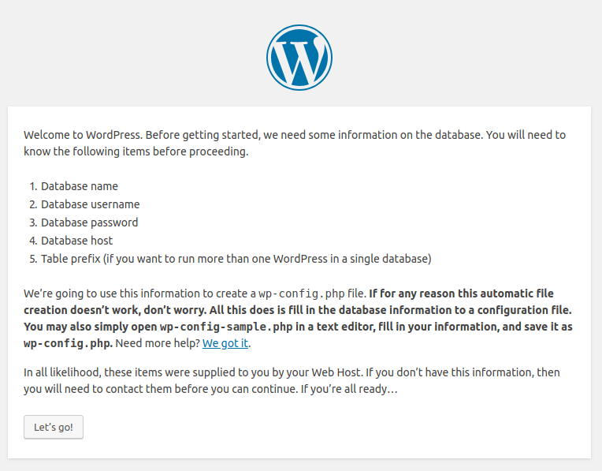
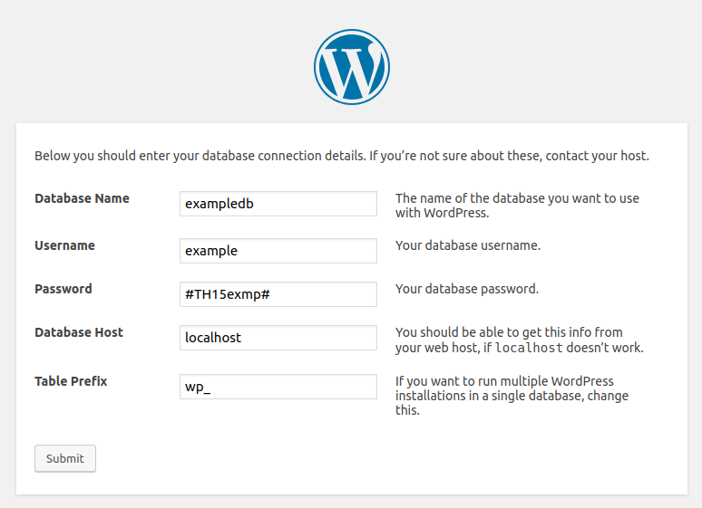
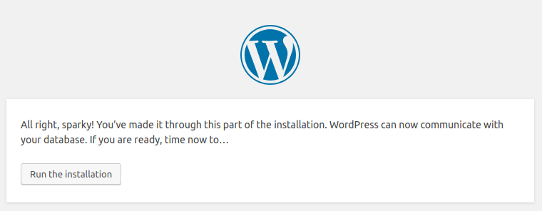
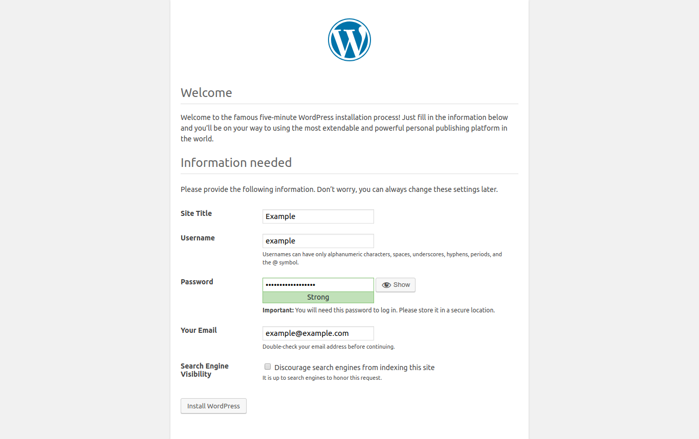
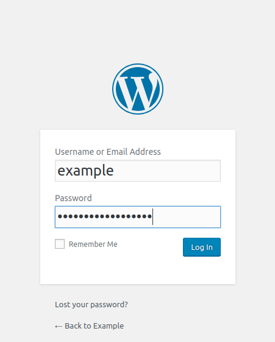

## Introduction

Before you start installing the WordPress CMS on the server, you must meet the following conditions:

**Prerequisites**

* Server with Operating System Linux CentOS 7 [Minimal Installation ISO](http://isoredirect.centos.org/centos/7/isos/x86_64/CentOS-7-x86_64-Minimal-1810.iso)
* LAMP Stack (Linux, Apache, MySQL, PHP), [if you don't have it installed, please follow this tutorial](https://community.hetzner.com/tutorials/install-lamp-on-centos-7)
* Root access
* SSH Tools
  * [Putty For Windows](https://www.chiark.greenend.org.uk/~sgtatham/putty/latest.html)
  * OpenSSH in Linux/macOS (available by default)

In the previous [LAMP Stack tutorial](https://community.hetzner.com/tutorials/install-lamp-on-centos-7), we created the domains example.com and holu.example.com. In this tutorial, we will install WordPress on both the main domain and the sub-domain.

**Information from the LAMP Stack that will be used**

* Main Domain: example.com
* Sub Domain: holu.example.com
* MySQL root password: holuP455##

## Step 1 - Create a MySQL database with an user and password

### Step 1.1 - Login to MySQL (with root)

```bash
mysql -u root -p
```

### Step 1.2 - Create users (and passwords)

* For example.com:

```sql
CREATE USER 'example'@'localhost' IDENTIFIED BY '#TH15exmp#';
```

* For holu.example.com:

```sql
CREATE USER 'holu'@'localhost' IDENTIFIED BY '#TH15holu#';
```

Example output of the command:

```sql
mysql> CREATE USER 'example'@'localhost' IDENTIFIED BY '#TH15exmp#';
Query OK, 0 rows affected (0.02 sec)

mysql> CREATE USER 'holu'@'localhost' IDENTIFIED BY '#TH15holu#';
Query OK, 0 rows affected (0.02 sec)
```

### Step 1.3 - Create the database

```sql
CREATE DATABASE exampledb;
CREATE DATABASE holudb;
```

Example output of the command:

```sql
mysql> CREATE DATABASE exampledb;
Query OK, 1 row affected (0.01 sec)

mysql> CREATE DATABASE holudb;
Query OK, 1 row affected (0.01 sec)
```

### Step 1.4 - Give the user access rights

This command will give the user full access to the database:

```sql
GRANT ALL PRIVILEGES ON exampledb.* TO 'example'@'localhost' WITH GRANT OPTION;
GRANT ALL PRIVILEGES ON holudb.* TO 'holu'@'localhost' WITH GRANT OPTION;
```

To save all changes, run the following command:

```
FLUSH PRIVILEGES;
```

Note:
In the example above, we gave both users full access to the database. I suggest giving full access if this is on the production server. If you want to provide other access, please check the list below:

* ALL PRIVILEGES: Account will get full access to a MySQL database or table. (Grant all privileges at specified access level except GRANT OPTION and PROXY.)
* GRANT OPTION: Enable privileges to be granted to or removed from other accounts. Levels: Global, database, table, routine, proxy.
* CREATE: Enable database and table creation. Levels: Global, database, table.
* DELETE: Enable use of DELETE. Level: Global, database, table.
* DROP: Enable databases, tables, and views to be dropped. Levels: Global, database, table.
* INSERT: Enable use of INSERT. Levels: Global, database, table, column.
* SELECT: Enable use of SELECT. Levels: Global, database, table, column.
* UPDATE: Enable use of UPDATE. Levels: Global, database, table, column.

If you want other access levels, please check the reference directly [from MySQL](https://dev.mysql.com/doc/refman/8.0/en/grant.html#grant-privileges)

Example output of the command:

```sql
mysql> GRANT ALL PRIVILEGES ON exampledb.* TO 'example'@'localhost' WITH GRANT OPTION;
Query OK, 0 rows affected (0.00 sec)

mysql> GRANT ALL PRIVILEGES ON holudb.* TO 'holu'@'localhost' WITH GRANT OPTION;
Query OK, 0 rows affected (0.00 sec)

mysql> FLUSH PRIVILEGES;
Query OK, 0 rows affected (0.00 sec)
```

Then exit mysql with the command: `quit`

## Step 2 - Install and configure WordPress

### Step 2.1 - Download and extract WordPress

```bash
cd /tmp
wget https://wordpress.org/latest.tar.gz
tar -xvf latest.tar.gz
cd wordpress
```

### Step 2.2 - Copy the WordPress files to the public_html and grant Apache access

* For example.com:

```bash
mkdir -p /var/www/html/example.com/public_html
cp -r * /var/www/html/example.com/public_html
chown -R apache:apache /var/www/html/example.com/public_html
find /var/www/html/example.com/public_html -type d -exec chmod 755 {} \;
find /var/www/html/example.com/public_html -type f -exec chmod 644 {} \;
```

* For holu.example.com:

```bash
mkdir -p /var/www/html/holu.example.com/public_html
cp -r * /var/www/html/holu.example.com/public_html
chown -R apache:apache /var/www/html/holu.example.com/public_html
find /var/www/html/holu.example.com/public_html -type d -exec chmod 755 {} \;
find /var/www/html/holu.example.com/public_html -type f -exec chmod 644 {} \;
```

### Step 2.3 - Configure WordPress

Now access your website from the browser. If example.com and holu.example.com displays the standard wordpress page, this means the installation was successful.



Click `Let's go` to continue to the next page.





On this page you have to set the website details, username and password.



The following page will appear if everything was setup correctly:


You will now be redirected to the login page. There you can enter the data according to your configuration on the previous page.



Repeat step 2.3 for the website holu.example.com and any other websites you want to add.

## Fixes for potential Errors (Optional)

### Database Error

If you get an error as below:


If you use the same MySQL version as in the [LAMP STACK tutorial](https://community.hetzner.com/tutorials/install-lamp-on-centos-7), follow the steps below to fix it.

Edit your MySQL configuration:

```bash
nano /etc/my.cnf
```

Add this line, under `[mysqld]`:

```bash
[mysqld]
default_authentication_plugin = mysql_native_password
```

Restart the MySQL service:

```bash
systemctl restart mysqld
```

Login to MySQL and force MySQL to use native password for your user:

```sql
mysql -u root -p
ALTER USER 'example'@'localhost' IDENTIFIED WITH mysql_native_password BY '#TH15exmp#';
```

Now it should be fixed, repeat the database configuration in your WordPress setup.

### Cannot write wp-config.php Error


This will be a serious problem because wordpress can't write any file to the server. To fix it, check the apache users access to your public_html directory:

```bash
ls -lha /var/www/html/example.com/public_html
```

Example output of the command:

```bash
total 1.6M
drwxr-xr-x 3 root root 4.0K Mar 17 00:27 .
drwxr-xr-x 4 root root 4.0K Mar 14 08:43 ..
-rw-r--r-- 1 root root 385K Mar 20 10:51 error.log
drwxr-xr-x 5 root root 4.0K Mar 20 10:53 public_html
-rw-r--r-- 1 root root 1.2M Mar 20 11:14 requests.log
```

Run the following command to grant the apache user access:

```bash
chown -R apache:apache /var/www/html/example.com/public_html
```

Example output of the command:

```bash
total 1.6M
drwxr-xr-x 3 root   root   4.0K Mar 17 00:27 .
drwxr-xr-x 4 root   root   4.0K Mar 14 08:43 ..
-rw-r--r-- 1 root   root   385K Mar 20 10:51 error.log
drwxr-xr-x 5 apache apache 4.0K Mar 20 10:53 public_html
-rw-r--r-- 1 root   root   1.2M Mar 20 11:14 requests.log
```

All files in the public_html folder will be owned by the apache user. So WordPress can write and upload files.

## Conclusion

Your server is now ready for use with the WordPress CMS website. You can also add other websites using the same steps.

##### License: MIT

<!---

Contributors's Certificate of Origin

By making a contribution to this project, I certify that:

(a) The contribution was created in whole or in part by me and I have
    the right to submit it under the license indicated in the file; or

(b) The contribution is based upon previous work that, to the best of my
    knowledge, is covered under an appropriate license and I have the
    right under that license to submit that work with modifications,
    whether created in whole or in part by me, under the same license
    (unless I am permitted to submit under a different license), as
    indicated in the file; or

(c) The contribution was provided directly to me by some other person
    who certified (a), (b) or (c) and I have not modified it.

(d) I understand and agree that this project and the contribution are
    public and that a record of the contribution (including all personal
    information I submit with it, including my sign-off) is maintained
    indefinitely and may be redistributed consistent with this project
    or the license(s) involved.

Signed-off-by: [Juni Yadi <juniyadi@protonmail.com>]

-->
