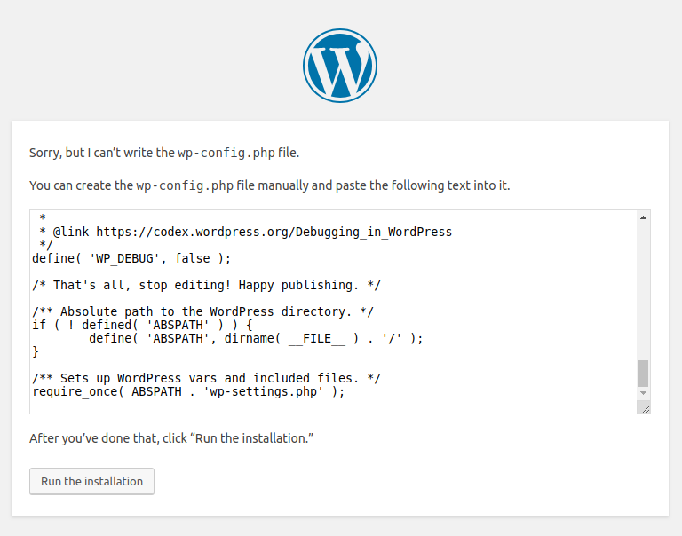

## Введение

Перед началом установки CMS WordPress на сервер необходимо выполнить следующие условия:

**Требования**

* Сервер с операционной системой Linux CentOS 7 [Образ минимальной установки](http://isoredirect.centos.org/centos/7/isos/x86_64/CentOS-7-x86_64-Minimal-1810.iso)
* LAMP Stack (Linux, Apache, MySQL, PHP), [если он у вас еще не установлен, можете использовать указанное ниже руководство](https://community.hetzner.com/tutorials/install-lamp-on-centos-7)
* Root доступ
* SSH инструменты
  * [Putty для Windows](https://www.chiark.greenend.org.uk/~sgtatham/putty/latest.html)
  * OpenSSH в Linux/macOS (присутствует по-умолчанию)

В предыдущем [руководстве по установке LAMP Stack](https://community.hetzner.com/tutorials/install-lamp-on-centos-7), мы создали домены example.com и holu.example.com. В этом руководстве мы установим WordPress и на основной домен и на поддомен.

**Будет использована следующая информация из статьи LAMP Stack**

* Основной домен: example.com
* Поддомен: holu.example.com
* Пароль суперпользователя MySQL: holuP455##

## Шаг 1 - Создание базы данных MySQL с использованием указанных имени пользователя и пароля

### Шаг 1.1 - Войдите в MySQL (под суперпользователем)

```bash
mysql -u root -p
```

### Шаг 1.2 - Создание пользователей (и паролей)

* Для example.com:

```sql
CREATE USER 'example'@'localhost' IDENTIFIED BY '#TH15exmp#';
```

* Для holu.example.com:

```sql
CREATE USER 'holu'@'localhost' IDENTIFIED BY '#TH15holu#';
```

Пример вывода команды:

```sql
mysql> CREATE USER 'example'@'localhost' IDENTIFIED BY '#TH15exmp#';
Query OK, 0 rows affected (0.02 sec)

mysql> CREATE USER 'holu'@'localhost' IDENTIFIED BY '#TH15holu#';
Query OK, 0 rows affected (0.02 sec)
```

### Шаг 1.3 - Создание базы данных

```sql
CREATE DATABASE exampledb;
CREATE DATABASE holudb;
```

Пример вывода команды:

```sql
mysql> CREATE DATABASE exampledb;
Query OK, 1 row affected (0.01 sec)

mysql> CREATE DATABASE holudb;
Query OK, 1 row affected (0.01 sec)
```

### Шаг 1.4 - Назначение прав пользователю

Эта команда даст пользователю полный доступ к базе данных:

```sql
GRANT ALL PRIVILEGES ON exampledb.* TO 'example'@'localhost' WITH GRANT OPTION;
GRANT ALL PRIVILEGES ON holudb.* TO 'holu'@'localhost' WITH GRANT OPTION;
```

Для сохранения всех изменений выполните следующую команду:

```
FLUSH PRIVILEGES;
```

Примечание:
В примере выше мы назначили обоим пользователям полные права на базу данных. Я предлагаю дать полный доступ, если вы настраиваете это на рабочем сервере. Если вы хотите назначить другой уровень доступа, можете использовать информацию ниже:

* ALL PRIVILEGES: Учетная запись получит полный доступ к базе MySQL или таблице. (Назначает все права указанного уровня доступа исключая GRANT OPTION и PROXY).
* GRANT OPTION: Назначение прав которые будут предоставлены или удалены у учетных записей. Уровни: Глобальный, база данных, таблица, routine, proxy.
* CREATE: Дает право на создание базы данных и таблиц. Уровни: Глобальный, база данных, таблица.
* DELETE: Дает право на DELETE. Уровень: Глобальный, база данных, таблица.
* DROP: Дает право на удаление баз данных, таблиц и представлений. Уровни: Глобальный, база данных, таблица.
* INSERT: Дает право на использование INSERT. Уровни: Глобальный, база данных, таблица, столбец.
* SELECT: Дает право на использование SELECT. Уровни: Глобальный, база данных, таблица, столбец.
* UPDATE: Дает право на использование UPDATE. Уровни: Глобальный, база данных, таблица, столбец.

Если вам необходимо настроить другие уровни доступа, обратитесь к следующей статье [от MySQL](https://dev.mysql.com/doc/refman/8.0/en/grant.html#grant-privileges)

Пример вывода команды:

```sql
mysql> GRANT ALL PRIVILEGES ON exampledb.* TO 'example'@'localhost' WITH GRANT OPTION;
Query OK, 0 rows affected (0.00 sec)

mysql> GRANT ALL PRIVILEGES ON holudb.* TO 'holu'@'localhost' WITH GRANT OPTION;
Query OK, 0 rows affected (0.00 sec)

mysql> FLUSH PRIVILEGES;
Query OK, 0 rows affected (0.00 sec)
```

Выйдите из mysql командой: `quit`

## Шаг 2 - Установка и настройка WordPress

### Шаг 2.1 - Скачиваем и распаковываем WordPress

```bash
cd /tmp
wget https://wordpress.org/latest.tar.gz
tar -xvf latest.tar.gz
cd wordpress
```

### Шаг 2.2 - Копируем файлы WordPress в public_html и назначаем права доступа для Apache

* Для example.com:

```bash
mkdir -p /var/www/html/example.com/public_html
cp -r * /var/www/html/example.com/public_html
chown -R apache:apache /var/www/html/example.com/public_html
find /var/www/html/example.com/public_html -type d -exec chmod 755 {} \;
find /var/www/html/example.com/public_html -type f -exec chmod 644 {} \;
```

* Для holu.example.com:

```bash
mkdir -p /var/www/html/holu.example.com/public_html
cp -r * /var/www/html/holu.example.com/public_html
chown -R apache:apache /var/www/html/holu.example.com/public_html
find /var/www/html/holu.example.com/public_html -type d -exec chmod 755 {} \;
find /var/www/html/holu.example.com/public_html -type f -exec chmod 644 {} \;
```

### Шаг 2.3 - Настройка WordPress

Теперь откройте сайт через браузер. Если example.com и holu.example.com отображают стандартную страницу wordpress, значит установка прошла успешно.


Кликните на `Let's go` чтобы продолжить настройку.


На этой странице вы должны настроить детали веб-сайта, указать имя пользователя и пароль.


Если все было сделано правильно, то должна появиться следующая страница:


После этого вы будете перенаправлены на страницу авторизации. Здесь вы должны ввести данные, которые указали на предыдущей странице.


Повторите шаг 2.3 для holu.example.com и других веб-сайтов, которые вы хотите добавить.

## Устранение возможных проблем (Опционально)

### Ошибка базы данных

Если вы получаете ошибку:


Если вы используете такую же версию MySQL как в [руководстве по установке LAMP Stack](https://community.hetzner.com/tutorials/install-lamp-on-centos-7), следуйте инструкциям ниже для ее устранения.

Изменение конфигурации MySQL:

```bash
nano /etc/my.cnf
```

Добавьте следующую строку, идущую после `[mysqld]`:

```bash
[mysqld]
default_authentication_plugin = mysql_native_password
```

Перезапустите службу MySQL:

```bash
systemctl restart mysqld
```

Войдите в MySQL, и установите пароль для вашего пользователя:

```sql
mysql -u root -p
ALTER USER 'example'@'localhost' IDENTIFIED WITH mysql_native_password BY '#TH15exmp#';
```

Это должно помочь в устранении проблемы. Соответствующие изменения также необходимо сделать и в настройках базы данных в WordPress.

### Ошибка записи в файл wp-config.php



Это может оказаться серьезной проблемой, так как wordpress не может изменять никакие файлы на сервере. Для устранения проблемы, проверьте доступ пользователей apache к вашей директории public_html:

```bash
ls -lha /var/www/html/example.com/public_html
```

Пример вывода команды:

```bash
total 1.6M
drwxr-xr-x 3 root root 4.0K Mar 17 00:27 .
drwxr-xr-x 4 root root 4.0K Mar 14 08:43 ..
-rw-r--r-- 1 root root 385K Mar 20 10:51 error.log
drwxr-xr-x 5 root root 4.0K Mar 20 10:53 public_html
-rw-r--r-- 1 root root 1.2M Mar 20 11:14 requests.log
```

Выполните следующую команду для назначения прав пользователю apache:

```bash
chown -R apache:apache /var/www/html/example.com/public_html
```

Пример вывода команды:

```bash
total 1.6M
drwxr-xr-x 3 root   root   4.0K Mar 17 00:27 .
drwxr-xr-x 4 root   root   4.0K Mar 14 08:43 ..
-rw-r--r-- 1 root   root   385K Mar 20 10:51 error.log
drwxr-xr-x 5 apache apache 4.0K Mar 20 10:53 public_html
-rw-r--r-- 1 root   root   1.2M Mar 20 11:14 requests.log
```

Владелец всех файлов в папке public_html теперь пользователь apache. WordPress теперь может записывать и загружать файлы.

## Заключение

Ваш сервер готов к размещению веб-сайтов с CMS WordPress. Вы также можете добавить и другие веб-сайты, используя те же шаги.

##### License: MIT

<!---

Contributors's Certificate of Origin

By making a contribution to this project, I certify that:

(a) The contribution was created in whole or in part by me and I have
    the right to submit it under the license indicated in the file; or

(b) The contribution is based upon previous work that, to the best of my
    knowledge, is covered under an appropriate license and I have the
    right under that license to submit that work with modifications,
    whether created in whole or in part by me, under the same license
    (unless I am permitted to submit under a different license), as
    indicated in the file; or

(c) The contribution was provided directly to me by some other person
    who certified (a), (b) or (c) and I have not modified it.

(d) I understand and agree that this project and the contribution are
    public and that a record of the contribution (including all personal
    information I submit with it, including my sign-off) is maintained
    indefinitely and may be redistributed consistent with this project
    or the license(s) involved.

Signed-off-by: [Juni Yadi <juniyadi@protonmail.com>]

-->
