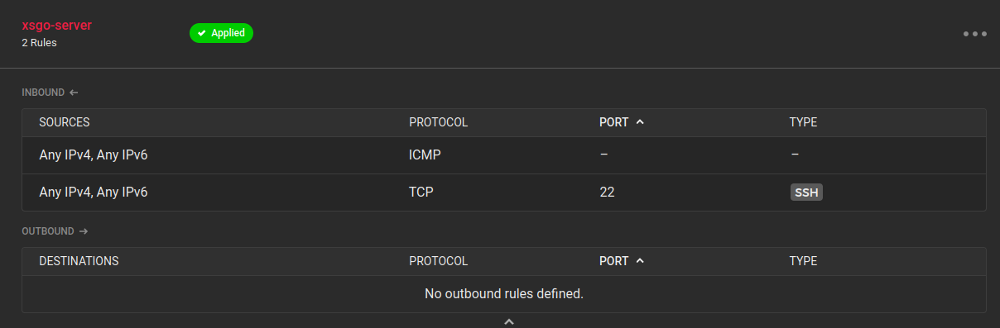
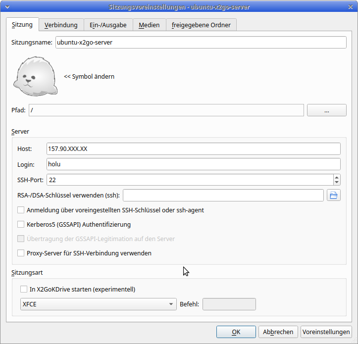
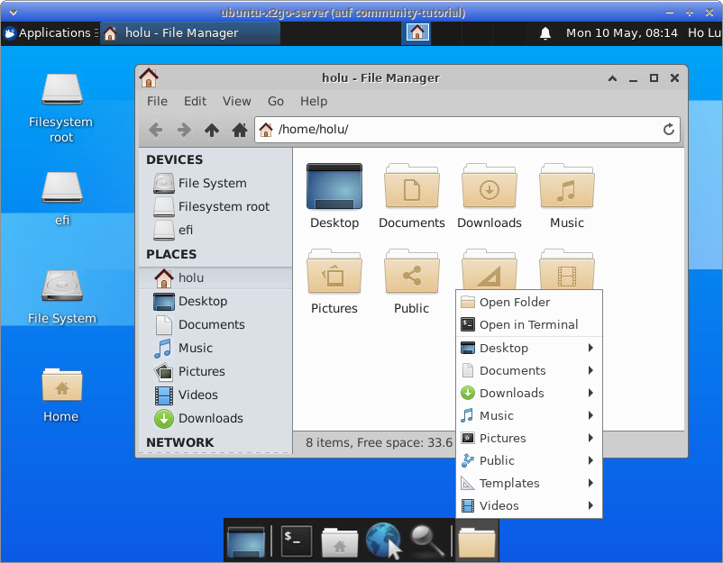

## Einführung

Dieses Tutorial erklärt, wie man einen Remote-Desktop auf einem Hetzner Cloud Server mit Ubuntu 20.04 erstellt.

Es wird ein xubuntu-Desktop installiert. Außerdem wird ein neuer Benutzer angelegt, der über [X2GO](https://wiki.x2go.org/doku.php) verschlüsselt auf seinen Desktop zugreifen kann.

X2Go ist eine kostenlose Terminalserver-Lösung für die Verbindung zu verschiedenen Desktop-Umgebungen wie XFCE, LXDE, Mate usw.

**Voraussetzungen**

 - ein neu installierter Server, der in der Hetzner Cloud Console mit dem Basis-Image von ubuntu 20.04 erstellt wurde
 - IP-Adresse
 - Rootpasswort

## Schritt 1 - Aktivieren der Firewall

Öffnen Sie Ihren neu angelegten Server im betreffenden Projekt in der Hetzner Cloud Console.

Legen Sie eine neue Firewall an. Die Grundeinstellungen in Ihrer Firewall sind in Ordnung. Damit öffnen Sie den ssh-Port 22 zu Ihrem Server und schließen die anderen, nicht benötigten Ports.



## Schritt 2 - Konfiguration am Server

### Schritt 2.1 - Aktualisierung des Betriebssystems und installieren der erforderlichen Pakete

Einlesen der Paketquellen und Systemupgrade durchführen:

`apt update && apt upgrade`

```Shell
Do you want to continue? [Y/n] y
```

Installieren der benötigten Pakete xubuntu und x2go:

`apt install xubuntu-desktop x2goserver x2goserver-xsession`

```Shell
Do you want to continue? [Y/n] y
```

### Schritt 2.2 - Erstellen des neuen x2go-Benutzer

Für die Verbindung zu unserem Remote-Desktop werden wir nicht root verwenden. Wir legen einen neuen Benutzer an. In diesem Beispiel wird der Benutzer _holu_ genannt

`adduser holu`

```Shell
Adding user `holu' ...
Adding new group `holu' (1000) ...
Adding new user `holu' (1000) with group `holu' ...
Creating home directory `/home/holu' ...
Copying files from `/etc/skel' ...
New password: 
Retype new password: 
passwd: password updated successfully
Changing the user information for holu
Enter the new value, or press ENTER for the default
	Full Name []: Ho Lu       
	Room Number []:  
	Work Phone []: 
	Home Phone []: 
	Other []: 
Is the information correct? [Y/n] Y
```

Zum Schluss entfernen wir auf unserem Server das Passwort von root. Der neu angelegte Benutzer hat sudo-Rechte.

`passwd -d root`

```Shell
passwd: password expiry information changed.
```

### Schritt 2.3 - Neustart des Servers

`reboot`

# Schritt 3 - Konfigurieren der Client-Software

Um sich mit dem xubuntu-Desktop zu verbinden, müssen wir den [x2go-client](https://wiki.x2go.org/doku.php/doc:installation:x2goclient) auf der lokalen Workstation installieren.

Bitte benutzen Sie die Anleitung auf der Projekt-Webseite, wie Sie den Client auf Ihrem Rechner installieren.

Wenn die Installation abgeschlossen ist, können wir die Clientsoftware einrichten.

Erstellen Sie eine neue Sitzung im Client und fügen Sie die Parameter für Ihren Server ein.

 - Login: holu
 - Host: 157.90.XXX.XX (replace with your server IP)
 - Sitzungsart: XFCE



Jetzt können Sie Ihre Sitzungseinstellungen speichern und eine Verbindung zu Ihrem Server herstellen.



## Fazit

Wenn Sie alle Schritte in dieser Anleitung befolgt haben, können Sie eine Verbindung zum Server über eine SSH-verschlüsselte Verbindung herstellen und einen Remote-Desktop mit einer XFCE-Oberfläche verwenden.

##### License: MIT

<!--

Contributor's Certificate of Origin

By making a contribution to this project, I certify that:

(a) The contribution was created in whole or in part by me and I have
    the right to submit it under the license indicated in the file; or

(b) The contribution is based upon previous work that, to the best of my
    knowledge, is covered under an appropriate license and I have the
    right under that license to submit that work with modifications,
    whether created in whole or in part by me, under the same license
    (unless I am permitted to submit under a different license), as
    indicated in the file; or

(c) The contribution was provided directly to me by some other person
    who certified (a), (b) or (c) and I have not modified it.

(d) I understand and agree that this project and the contribution are
    public and that a record of the contribution (including all personal
    information I submit with it, including my sign-off) is maintained
    indefinitely and may be redistributed consistent with this project
    or the license(s) involved.

Signed-off-by: Oliver Müller, oliver.mueller@hetzner.com

-->
