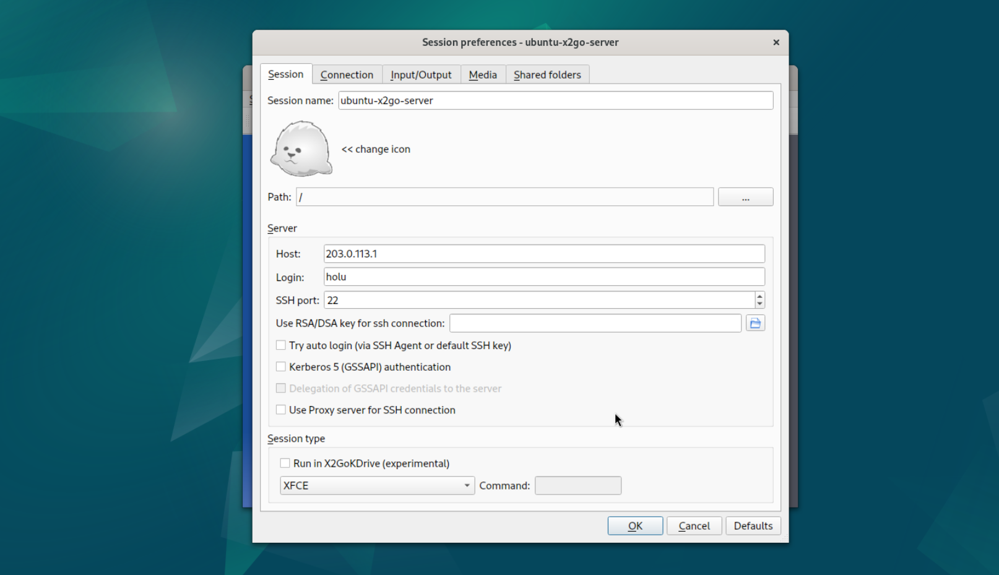
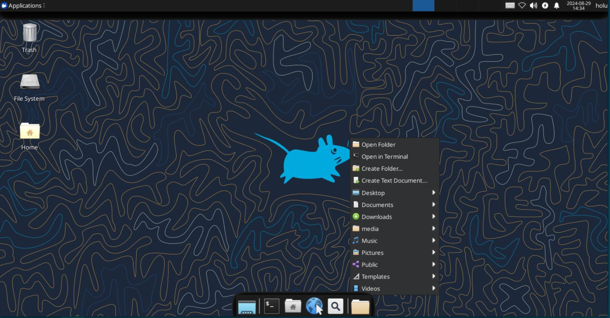

## Einführung

Dieses Tutorial erklärt, wie man einen Remote-Desktop auf einem Hetzner Cloud Server mit Ubuntu erstellt. Dieses Tutorial wurde anhand von Ubuntu 24.04 erstellt, es sollte aber auch mit anderen Versionen funktionieren.

Es wird ein xubuntu-Desktop installiert. Außerdem wird ein neuer Benutzer angelegt, der über [X2Go](https://wiki.x2go.org/doku.php) verschlüsselt auf seinen Desktop zugreifen kann.

X2Go ist eine kostenlose Terminalserver-Lösung für die Verbindung zu verschiedenen Desktop-Umgebungen wie XFCE, LXDE, Mate usw.

**Voraussetzungen**

* Einen neuen Server (z.B. bei [Hetzner Cloud](https://console.hetzner.cloud/)
   * Mit Ubuntu 24.04 
   * Mit öffentlicher IP
* Zugriff auf den Root-Nutzer oder einen Benutzer mit sudo-Rechten

<br>

**Beispiel-Benennungen**

Benutzername: `holu`
Öffentliche IP: `203.0.113.1`

## Schritt 1 - Aktivieren der Firewall

Richte eine Firewall ein und erlaube SSH-Verbindungen (z.B. mit ufw oder der Hetzner Cloud Firewall).

* **ufw**
  
  ```bash
  sudo ufw allow OpenSSH
  sudo ufw enable
  sudo ufw status
  ```

* **Hetzner Cloud Firewall**
  
  Öffne den neu angelegten Server im betreffenden Projekt in der Hetzner Cloud Console.
  
  Lege eine neue Firewall an. Die Grundeinstellungen der Firewall sind in Ordnung. Damit wird der SSH-Port 22 zum Server geöffnet und alle anderen Ports, die nicht benötigt werden, blockiert.

  | Sources                              | Protocol | Port |
  | ------------------------------------ | -------- | ---- |
  | <kbd>0.0.0.0/0</kbd> <kbd>::/0</kbd> | TCP      | 22   |
  | <kbd>0.0.0.0/0</kbd> <kbd>::/0</kbd> | ICMP     |      |

## Schritt 2 - Konfiguration am Server

### Schritt 2.1 - Aktualisierung des Betriebssystems und installieren der erforderlichen Pakete

Einlesen der Paketquellen und Systemupgrade durchführen:

```shell
sudo apt update && sudo apt upgrade -y
```

Installieren der benötigten Pakete xubuntu und X2Go:

```shell
sudo apt install xubuntu-desktop x2goserver x2goserver-xsession
```

```shell
Do you want to continue? [Y/n] y
```

Während der Installation muss eventuell zwischen `gdm3` und `lightdm` gewählt werden. Hier kann `lightdm` ausgewählt werden.

### Schritt 2.2 - Erstellen des neuen X2Go-Benutzer

Für die Verbindung zu unserem Remote-Desktop werden wir nicht root verwenden. Wir legen einen neuen Benutzer an. In diesem Beispiel wird der Benutzer _holu_ verwendet.

```shell
sudo adduser holu
```

```shell
Adding user `holu' ...
Adding new group `holu' (1000) ...
Adding new user `holu' (1000) with group `holu' ...
Creating home directory `/home/holu' ...
Copying files from `/etc/skel' ...
New password: 
Retype new password: 
passwd: password updated successfully
Changing the user information for holu
Enter the new value, or press ENTER for the default
	Full Name []: Ho Lu       
	Room Number []:  
	Work Phone []: 
	Home Phone []: 
	Other []: 
Is the information correct? [Y/n] Y
```

Nun fügen wir den neuen Benutzer _holu_ der sudo-Gruppe hinzu.

```shell
sudo usermod -aG sudo holu
```

### Schritt 2.3 - Neustart des Servers

```shell
sudo reboot
```

## Schritt 3 - Konfigurieren der Client-Software

Um sich mit dem xubuntu-Desktop zu verbinden, müssen wir den [X2Go-Client](https://wiki.x2go.org/doku.php/doc:installation:x2goclient) auf der lokalen Workstation installieren.

Bitte benutze die Anleitung auf der Projekt-Webseite, wie der Client auf dem lokalen Rechner installiert werder kann.

Wenn die Installation abgeschlossen ist, können wir die Clientsoftware einrichten.

Erstelle eine neue Sitzung im Client und füge die Parameter für deinen Server ein.

 - Login: holu
 - Host: 203.0.113.1 (ersetze die IP mit der öffentlichen IP deines Servers)
 - Sitzungsart: XFCE



Jetzt kannst du deine Sitzungseinstellungen speichern und eine Verbindung zum Server herstellen. Nachdem die Verbindung zum Server hergestellt wurde, sollte so ein Fenster erscheinen:



## Ergebnis

Wenn alle Schritte in dieser Anleitung befolgt wurden, kann eine Verbindung zum Server über eine SSH-verschlüsselte Verbindung hergestellt und ein Remote-Desktop mit einer XFCE-Oberfläche verwendet werden.

##### License: MIT

<!--

Contributor's Certificate of Origin

By making a contribution to this project, I certify that:

(a) The contribution was created in whole or in part by me and I have
    the right to submit it under the license indicated in the file; or

(b) The contribution is based upon previous work that, to the best of my
    knowledge, is covered under an appropriate license and I have the
    right under that license to submit that work with modifications,
    whether created in whole or in part by me, under the same license
    (unless I am permitted to submit under a different license), as
    indicated in the file; or

(c) The contribution was provided directly to me by some other person
    who certified (a), (b) or (c) and I have not modified it.

(d) I understand and agree that this project and the contribution are
    public and that a record of the contribution (including all personal
    information I submit with it, including my sign-off) is maintained
    indefinitely and may be redistributed consistent with this project
    or the license(s) involved.

Signed-off-by: Oliver Müller, oliver.mueller@hetzner.com

-->
