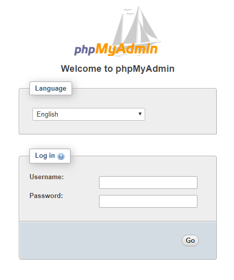
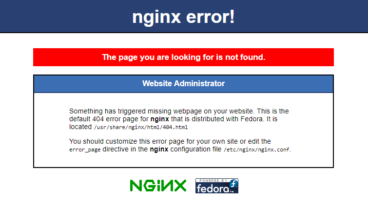
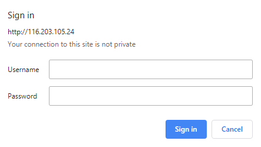

## Introduction

phpMyAdmin is a free and open source administration tool for MySQL and MariaDB. As a portable web application written primarily in PHP, it has become one of the most popular MySQL administration tools, especially for web hosting services. This tutorial gives a basic overview of how to secure phpmyadmin with Nginx on CentOS 7.

**Prerequisites**

- Make sure you are logged into your server with a `sudo` user.

- Install LEMP Stack on CentOS 7. Follow the tutorial on [Install LEMP Stack on CentOS 7](https://community.hetzner.com/tutorials/install-lemp-stack-on-centos-7).

## Step 1 - Install phpMyAdmin

phpMyAdmin is not available in the default CentOS 7 repository, so we will use the EPEL repositories. To add the CentOS 7 EPEL repository, use the following command:

```bash
yum install epel-release
```

Now that you have access to the EPEL repository, install phpMyAdmin with:

```bash
yum install phpmyadmin
```

The installation will now complete.

On the Nginx web server, we will create a symbolic link of the phpMyAdmin installation files to our Nginx web document root directory to find and serve the phpMyAdmin files correctly (i.e. **/usr/share/nginx/html**) by running the following command:

```bash
ln -s /usr/share/phpMyAdmin /usr/share/nginx/html
```

Finally, restart Nginx and PHP-FPM to apply changes.

```bash
systemctl restart nginx
systemctl restart php-fpm
```

Our phpMyAdmin installation is now operational. To access the interface, go to your server's domain name or public IP address followed by `/phpMyAdmin`, in your web browser:

```bash
http://server_domain_or_IP/phpMyAdmin
```



## Step 2 - Change Login URL

On the Nginx web server, we created a symbolic link of the phpMyAdmin installation files to our Nginx document root directory (i.e. `/usr/share/nginx/html`) in an earlier step.

To change the URL where our phpMyAdmin interface can be accessed, we simply need to rename the symbolic link by typing the following command:

Note: in this guide, we will name our access location `/my`.

```bash
cd /usr/share/nginx/html
mv phpMyAdmin my
```

Now, if you go to the previous location of your phpMyAdmin installation, you will get a 404 error:

```bash
http://server_domain_or_IP/phpMyAdmin
```



However, your phpMyAdmin interface will be available at the new location we selected:

```bash
http://server_domain_or_IP/my
```


## Step 3 - Setup a Web Server Authentication Gate

To provide an additional layer of security, we can set up authentication in Nginx.

Before we do this, we will create a password file that will store our authentication credentials.

We can generate the `.htpasswd` file. Simply change `holu` to the username you require.

```bash
htpasswd -c /etc/nginx/.htpasswd holu
```

Sample Output:

```bash
# htpasswd -c /etc/nginx/.htpasswd holu
New password:
Re-type new password:
Adding password for user holu
```

There should now be a .htpasswd file containing your username and encrypted password. You can check with:

```bash
cat /etc/nginx/.htpasswd
```

Sample Output:

```bash
username:$apr1$vXURQ.rv$f6S86nCX.fKfjbYNTUPzV.
```

Now we are ready to modify our Nginx configuration file. Open this file in your text editor to get started:

```bash
vi /etc/nginx/conf.d/default.conf
```

Within this file, we need to add a new location section. This will target the location we chose for our phpMyAdmin interface (we selected `/my` in this tutorial).

Create this section within the `server` block, but outside of any other blocks. We will put our new location block below the `location /` block in our example.

Within this block, we need to set the value of a directive called `auth_basic` to an authentication message that our prompt will display to users. We do not want to indicate to unauthenticated users what we are protecting, so do not give specific details. We will just use "Admin Login" in our example.

We then need to use a directive called `auth_basic_user_file` to point our web server to the authentication file that we created. Nginx will prompt the user for authentication details and check that the inputted values match what it finds in the specified file.

After we are finished, the file should look like this:

```bash
server {
    ...
    location /my {
        auth_basic "Admin Login";
        auth_basic_user_file /etc/nginx/.htpassword;
    }
    ...
}
```

Save and close the file when you are finished.

To implement our new authentication gate, we must restart the web server:

```bash
systemctl restart nginx
```

Now, if we visit our phpMyAdmin location in our web browser. you should be prompted for the **username** and **password** you added to the .`htpassword` file:

```bash
http://server_domain_or_IP/my
```



Once you enter your credentials, you will be taken to the normal phpMyAdmin login page and you can login to phpMyAdmin.

## Conclusion

Congratulations, you have successfully installed and secured phpMyAdmin with nginx on CentOS 7.

##### License: MIT

<!---

Contributors's Certificate of Origin

By making a contribution to this project, I certify that:

(a) The contribution was created in whole or in part by me and I have
    the right to submit it under the license indicated in the file; or

(b) The contribution is based upon previous work that, to the best of my
    knowledge, is covered under an appropriate license and I have the
    right under that license to submit that work with modifications,
    whether created in whole or in part by me, under the same license
    (unless I am permitted to submit under a different license), as
    indicated in the file; or

(c) The contribution was provided directly to me by some other person
    who certified (a), (b) or (c) and I have not modified it.

(d) I understand and agree that this project and the contribution are
    public and that a record of the contribution (including all personal
    information I submit with it, including my sign-off) is maintained
    indefinitely and may be redistributed consistent with this project
    or the license(s) involved.

Signed-off-by: [MohammadHossein Fakhraei eng.fakhraei@gmail.com]

-->
