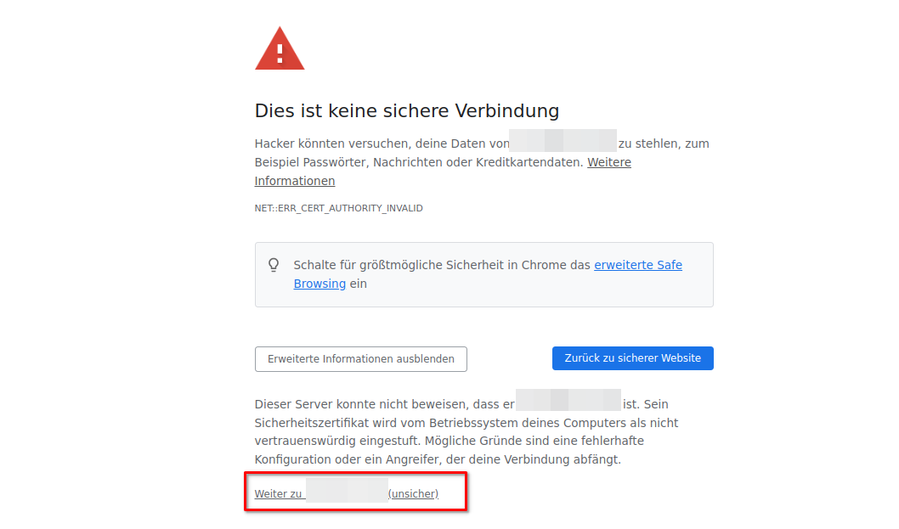
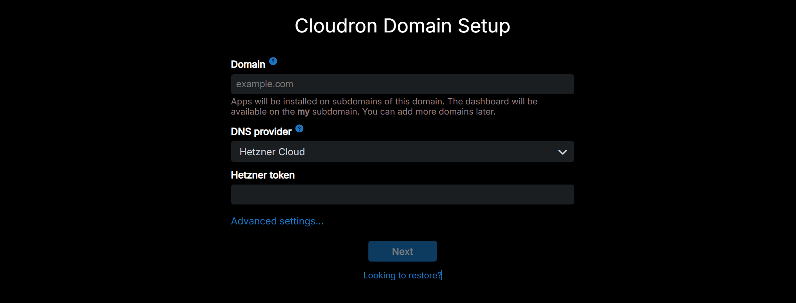
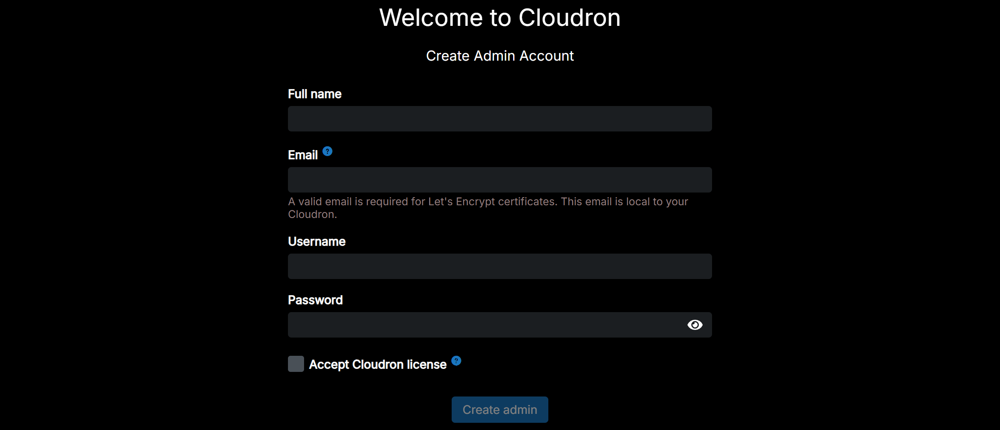
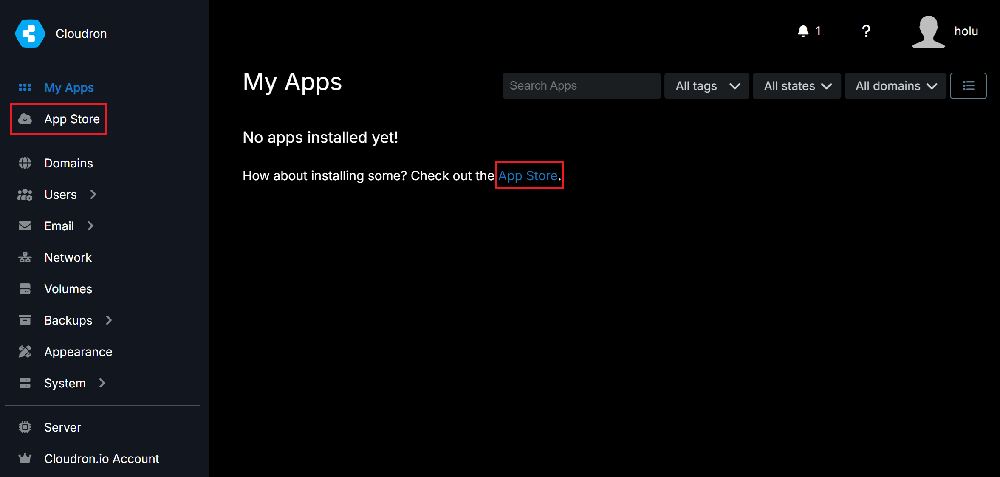
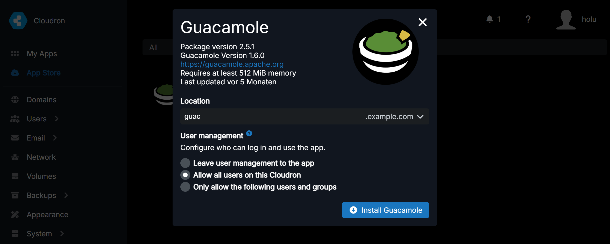
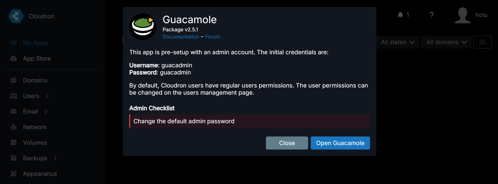
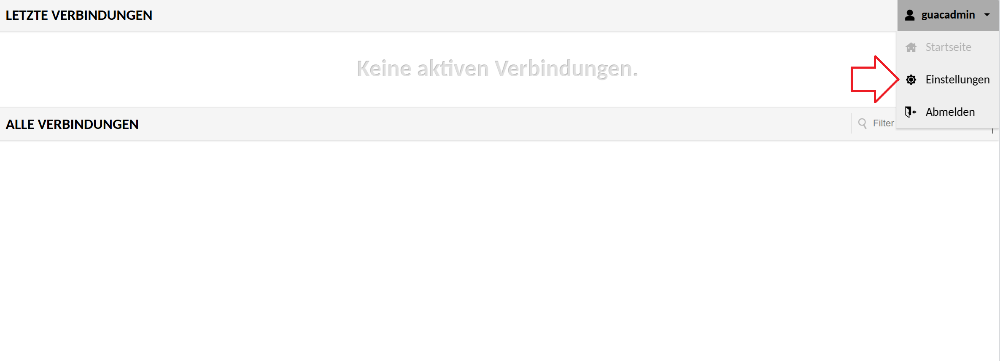
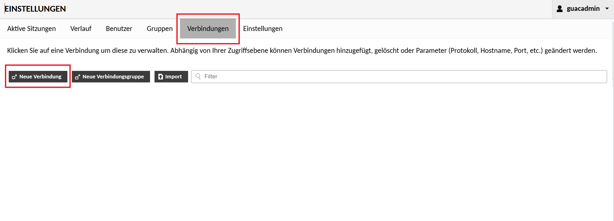

## Einführung

Du willst auf all deine remote Desktops und Co einfach von all deinen Geräten zugreifen?
Das ist mit Apache Guacamole ganz einfach.
In diesem Beitrag wird erklärt, wie man Apache Guacamole installiert und die Verbindungen einrichtet.

**Voraussetzungen**

* Eine Top-Level-Domain, z.B. `example.com`
* Eine E-Mail-Adresse
* Einen Server (mindestens CPX22, besser mit mehr Ressourcen)
* Eine öffentliche IP-Adresse (IPv4 empfohlen)
* Betriebssystem: Ubuntu 22.04 LTS oder neuer
* Eine Verbindung zur Server-Befehlszeile

**Beispiel-Benennungen**

* IPv4: `<203.0.113.1>`

Beachte, dass in allen Beispiel-Befehlen `<203.0.113.1>` mit der eigenen IP-Adresse ersetzt werden muss.

## Schritt 1 - Installation von Cloudron

Um dafür zu sorgen, dass die grafische Oberfläche über den Browser aufrufbar und bedienbar ist, muss zunächst [Apache Guacamole](https://guacamole.apache.org/) installiert werden. Da die Konfiguration von Guacamole aber etwas kompliziert ist, werde ich in diesem Tutorial eine vorkonfigurierte Version nutzen. So eine sehr gut vorkonfigurierte Variante gibt es bei "Cloudron", einer grafischen Weboberfläche für Docker, die von der gleichnamigen Firma betrieben wird.

Um die Installation zu beginnen, verbinde dich über SSH mit deinem Server:

```bash
ssh holu@<203.0.113.1>
```

> **Hinweis:** Beachte, dass `holu` mit dem eigenen Namen und `<203.0.113.1>` mit der eigenen IP-Adresse ersetzt werden muss.

Akzeptiere den neuen Fingerprint, indem du `yes` eingibst.

Du bist nun mit deinem Server verbunden.

Bevor du Cloudron installieren kannst, musst du erst einmal deinen Server aktualisieren. Führe dafür folgenden Befehl aus:

```bash
sudo apt full-upgrade
```

Um  Cloudron anschließend auf dem Server zu installieren, führe folgende Befehle aus:

- Ein Installationsskript herunterladen
  
  ```bash
  wget https://cloudron.io/cloudron-setup
  ```

- Das Skript ausführbar machen
  
  ```bash
  chmod +x ./cloudron-setup
  ```

- Das Skript ausführen
  
  ```bash
  sudo ./cloudron-setup 
  ```

> **Hinweis:** Die Installation kann einige Zeit in Anspruch nehmen.

Wenn die Installation erfolgreich war, starte das System neu.

## Schritt 2 - Cloudron einrichten

Rufe nun die IP-Adresse des Servers im Browser auf. Du gelangst auf eine Webseite, auf der einige Einstellungen vorgenommen werden müssen.

> Wenn der Browser eine Warnung anzeigt, dass es sich um eine unsichere Webseite handelt, kann diese ignoriert werden. Klicke dazu auf `Erweitert` und dann auf `Weiter zu ... (unsicher)`
> 
> 

Cloudron benötigt eine Domain. Gebe diese in das obere Feld ein (z.B. `example.com`).



Wähle `Hetzner Cloud` als DNS-Provider. Nun benötigst du ein API-Token. Dieses Token erhältst du in der [Hetzner Console](console.hetzner.com/) wie in diesem Getting Started erklärt:

* [API-Token hinzufügen](https://docs.hetzner.com/de/cloud/api/getting-started/generating-api-token)

Kopiere das Token in die Zwischenablage und füge es in das Feld bei Cloudron ein. Fahre dann fort (dies kann einen Moment dauern).

Erstelle nun das Benutzerkonto. Fülle dazu die Felder aus:



Herzlichen Glückwunsch! Du bist jetzt stolzer Administrator einer Cloudron-Instanz.

## Schritt 3 - Installation von Apache Guacamole

Nachdem dem Einloggen in der Cloudron-Instanz, sollte ein Hinweis angezeigt werden, dass noch keine Apps installiert sind. Besuche den App Store, um dies zu ändern.



Suche in der oberen Suchleiste im App Store nach "Guacamole". Klicke auf die Guacamole-Karte in den Suchergebnissen. Klicke auf "Install Guacamole", um auf die nächste Seite zu wechseln.

Gebe auf der Seite die Subdomain ein, auf der die Guacamole-Instanz erreichbar sein soll (gebe `guac` ein, um auf die Domain `guac.example.com` zuzugreifen). Bestimme zusätzlich, wer alles Zugriff haben soll.



Wenn die Anwendung im initialen Dashboard den Status `Running` hat, klicke darauf. Lese die angezeigten Informationen und klicke auf `Open Guacamole`.



Logge dich bei Guacamole ein:

* **Benutzername:** guacadmin
* **Passwort:** guacadmin

Änder sofort (!) das Passwort. Klicke dazu auf `guacadmin` in der rechten oberen Ecke. Wähle dann Einstellungen. Wähle anschließend den Reiter Einstellungen. Tippe unter `PASSWORT ÄNDERN` das alte und das neue Passwort ein und bestätige die Eingabe. 



Herzlichen Glückwunsch! Du hast erfolgreich Guacamole installiert! Wie man eine Verbindung hinterlegt, erkläre ich im nächsten Schritt.

## Schritt 4 - Einrichten einer neuen Verbindung

Am Beispiel der SSH-Verbindung des Servers, auf dem Cloudron + Guacamole läuft, möchte ich das Anlegen einer neuen Verbindung demonstrieren.

Um eine neue Verbindung anzulegen, öffne die Einstellungen.

Wähle nun den Reiter `Verbindungen`, klicke auf `Neue Verbindung`.



Im Untermenü von `Neue Verbindung` lege zunächst einen Namen für den Eintrag fest (z.B. _Server - Guacamole_). Wähle bei Protokoll _SSH_ aus. Wenn du planst, mehreren Personen Zugriff auf die Instanz zu geben, solltest du dir das Menü `Verbindungslimite` anschauen. Wenn du der einzige Nutzer bist, kannst du die nächsten Kategorien bis `Parameter` ignorieren.

Die Kategorie `Parameter` ist hingegen wieder sehr wichtig.
Trage unter der Überschrift **Netzwerk** in das Feld _Hostname_ die IP des Servers ein. Falls du den Standardport verwendest, kannst du die anderen Parameter ignorieren.
**Authentifizierung** ist auch relevant. In diesen Feldern können die Login-Daten eingetragen werden. Die Felder können auch leer gelassen werden, dann muss man sich aber bei jeder Verbindung manuell einloggen.
Unter **Bildschirm** kann man noch das Aussehen ein wenig ändern, wenn man möchte. Ich empfehle einfach etwas herumzuprobieren.

## Ergebnis

In diesem Tutorial hast du gelernt, wie man eine Guacamole-Instanz ganz einfach mit Docker und Cloudron aufsetzt.

Man kann natürlich nicht nur SSH-Verbindungen managen, sondern auch z.B. RDP und VNC. Damit kann man sich ganz einfach einen Cloud-PC aufsetzen. Für weitere Informationen über die Konfiguration, empfehle ich die offizielle [Dokumentation](https://guacamole.apache.org/doc/gug/index.html) sehr.
Ich hoffe aber trotzdem, dass ich mit meinem kleinen Tutorial ein wenig weiterhelfen konnte.

##### License: MIT

<!--

Contributor's Certificate of Origin

By making a contribution to this project, I certify that:

(a) The contribution was created in whole or in part by me and I have
    the right to submit it under the license indicated in the file; or

(b) The contribution is based upon previous work that, to the best of my
    knowledge, is covered under an appropriate license and I have the
    right under that license to submit that work with modifications,
    whether created in whole or in part by me, under the same license
    (unless I am permitted to submit under a different license), as
    indicated in the file; or

(c) The contribution was provided directly to me by some other person
    who certified (a), (b) or (c) and I have not modified it.

(d) I understand and agree that this project and the contribution are
    public and that a record of the contribution (including all personal
    information I submit with it, including my sign-off) is maintained
    indefinitely and may be redistributed consistent with this project
    or the license(s) involved.

Signed-off-by: Martin <m6prca02w@mozmail.com>

-->
