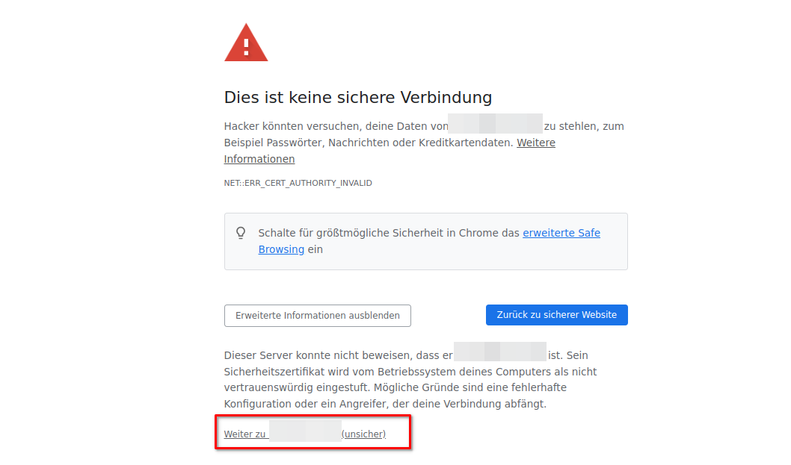
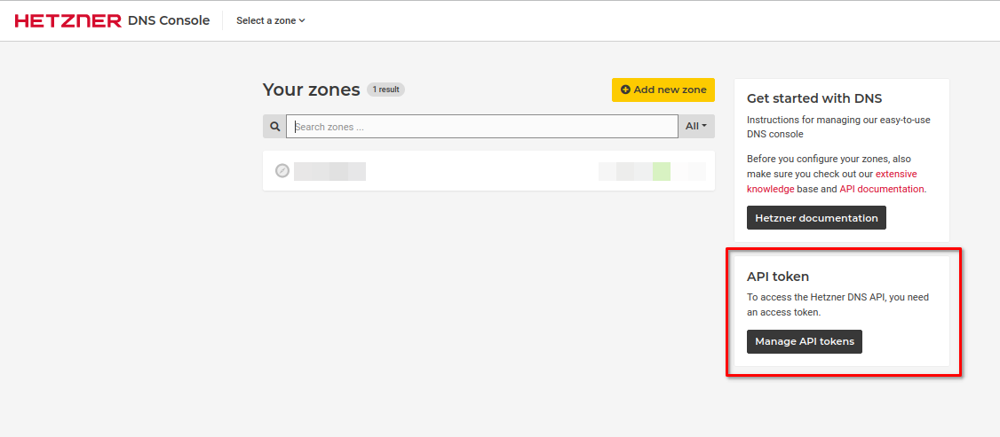
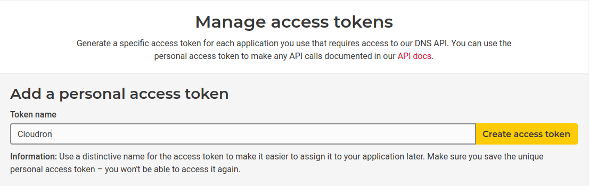
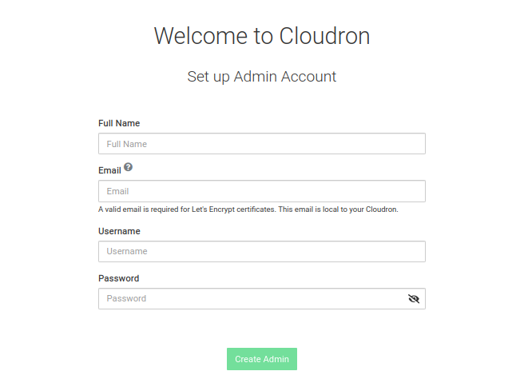
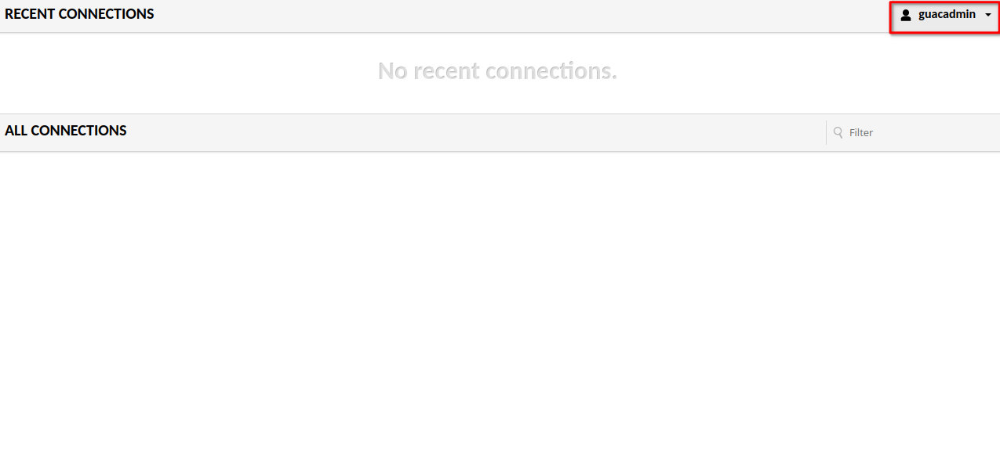

# Remote Desktop im Browser - Apache Guacamole

## Einleitung

Sie wollen auf all ihre remote Desktops und Co einfach von all ihren Geräten zugreifen?  <br>
Das ist mit Apache Guacamole ganz einfach. <br>
In diesem Beitrag wird erklärt, wie man Apache Guacamole installiert und die Verbindungen einrichtet. 

<br>

### Voraussetzungen

+ eine Top-Level-Domain, z.B. `example.com`
+ eine E-Mail-Adresse
+ einen Server (mindestens CPX11, besser mit mehr Ressourcen)
+ eine öffentliche IP-Adresse (IPv4 empfohlen)
+ Betriebssystem: Ubuntu 22.04 LTS oder neuer
+ eine Verbindung zur Server-Befehlszeile

<br>

## Schritt 1 - Installation von Cloudron

Um dafür zu sorgen, dass Sie die grafische Oberfläche über den Browser aufrufen und bedienen kann, muss zunächst [Apache Guacamole](https://guacamole.apache.org/) installiert werden. Da die Konfiguration von Guacamole aber etwas kompliziert ist, werde ich in diesem Tutorial eine vorkonfigurierte Version nutzen. So eine sehr gut vorkonfigurierte Variante gibt es bei "Cloudron", einer grafischen Weboberfläche für Docker, die von der gleichnamigen Firma betrieben wird. 

Um die Installation zu beginnen, verbinden sie sich mit SSH zu ihrem Server:

````bash
ssh root@[ihre IP-Adresse hier]
````
Akzeptieren Sie den neuen fingerprint, indem sie `yes` eingeben.

Sie sind nun mit ihrem Server verbunden.

Bevor Sie Cloudron installieren können, müssen Sie erst einmal ihren Server aktualisieren. Führen sie dafür folgenden Befehl aus: 

````bash
sudo apt-get full-upgrade
````

Um  Cloudron anschließend auf ihrem Server zu installieren, führen Sie folgende Befehle aus:

````bash
# lädt ein Installationsskript herunter
wget https://cloudron.io/cloudron-setup
# macht das Skript ausführbar
chmod +x ./cloudron-setup
# führt das Skript aus
./cloudron-setup 
````

(Hinweis: Die Installation kann einige Zeit in Anspruch nehmen).

Wenn die Installation erfolgreich war, starten Sie das System neu.

## Schritt 2 - Cloudron einrichten 
Rufen Sie nun die IP-Adresse Ihres Servers in Ihrem Browser auf. Sie gelangen auf eine Webseite, auf der sie einige Einstellungen vornehmen müssen (Wenn ihr Browser eine Warnung anzeigt, dass es sich um eine unsichere Webseite handelt, können sie diese ignorieren. Klicken Sie dazu auf erweitert und dann auf weiter zu ... (unsicher)): 




Cloudron benötigt eine Domain. Geben Sie diese in das obere Feld ein (z.B. `example.com`).

Wählen Sie `Hetzner` als DNS-Provider. Nun benötigen Sie ein API-Token. Dieses Token erhalten Sie in der [DNS Console] (https://dns.hetzner.com). 

Klicken Sie in der DNS Console auf `Mange API tokens`.


Im Untermenü vergeben Sie einen Namen (z.B. Cloudron) und klicken auf `Create access token`. 


Kopieren Sie das Token in die Zwischenablage und fügen Sie es in das Feld bei Cloudron ein. Fahren Sie dann fort (dies kann einen Moment dauern). 

Erstellen Sie nun das Benutzerkonto. Füllen Sie dazu die Felder aus:



Herzlichen Glückwunsch! Sie sind jetzt stolzer Administrator einer Cloudron-Instanz. 

## Schritt 3 - Installation von Apache Guacamole

Nachdem Sie sich in Ihre Cloudron-Instanz eingeloggt haben, sollten Sie einen Hinweis erhalten, dass noch keine Apps installiert sind. Besuchen Sie den App Store, um dies zu ändern. 


Wenn Sie den App Store besuchen, werden Sie aufgefordert, ein Konto bei Cloudron.io zu erstellen. Tun sie dies, indem sie den Dialog ausfüllen. (Oder loggen Sie sich ein, wenn Sie bereits ein Konto besitzen).


Wenn Sie dies getan haben, können Sie auf den App Store zugreifen. Suchen Sie in der Suchleiste oben nach "Guacamole". Klicken Sie auf den Eintrag, scrollen Sie nach unten und klicken Sie auf `Install`. 

Im nächsten Fenster geben sie die Subdomain ein, auf der sie ihre Guacamole-Instanz erreichen wollen (geben sie `guac` ein, wenn sie auf die Domain `guac.example.com` zugreifen wollen).

Wenn sie in ihrem initialen Dashboard sehen, dass die Anwendung den Status `Running` hat, klicken sie darauf. Lesen Sie die angezeigten Informationen, setzen Sie das Häkchen und klicken Sie auf `Open Guacamole`. 


Loggen Sie sich bei Guacamole ein (Benutzername + Passwort = guacadmin). 

Ändern Sie sofort (!) das Passwort. Klicken Sie dazu auf `guacadmin` in der rechten oberen Ecke. Wählen Sie dann Einstellungen und klicken Sie auf `Preferences`. Tippen Sie unter `Change Password` das alte und das neue Passwort ein und bestätigen Sie die Eingabe. 



Herzlichen Glückwunsch! Sie haben erfolgreich Guacamole installiert! Wie man eine Verbindung hinterlegt, erkläre ich im nächsten Schritt. 

## Schritt 3 - Einrichten einer neuen Verbindung

Am Beispiel der SSH-Verbindung des Servers, auf dem Cloudron + Guacamole läuft, möchte ich das Anlegen einer neuen Verbindung demonstrieren. 

Um eine neue Verbindung anzulegen, öffnen Sie die Einstellungen (siehe Schritt 2). 

Wählen Sie nun den Reiter `Connections`, klicken Sie auf `New Connection`. 


Im Untermenü von `New Connection` legen Sie zunächst einen Namen für den Eintrag fest (z.B. _Server - Guacamole_). Wählen Sie bei Protokoll _SSH_ aus. Wenn Sie planen, dass sie mehrere Personen Zugriff auf ihre Instanz zu geben, sollten sie sich das Menü `Concurrency Limits` anschschauen. Wenn sie der einzige Nutzer sind, können sie die nächsten Kategorien bis `Parameters` ignorieren. 

Die Kategorie `Parameters` ist hingegen wieder sehr wichtig. <br> 
Tragen Sie unter der Überschrift **Network** in das Feld _Hostname_ die IP ihres Servers ein. Falls sie den Standardport verwenden, können sie die anderen Parameter ignorieren.<br>
**Authentication** ist auch relevant. In diesen Feldern können sie ihre Login-Daten eintragen. Sie können die Felder auch leer lassen, dann müssen sie sich aber bei jeder Verbindung manuell einloggen. <br>
Unter **Display** können Sie noch das Aussehen, ein wenig ändern, wenn Sie möchten. Ich empfehle einfach etwas herumzuprobieren. 

## Schluss

In diesem Tutorial haben Sie gelernt, wie man eine Guacamole-Instanz ganz einfach mit Docker und Cloudron aufsetzt. <br>

Man kann natürlich nicht nur SSH-Verbindungen managen, sondern auch z.B. RDP und VNC. Damit können Sie sich ganz einfach einen Cloud-PC aufsetzen. Falls sie weitere Informationen über die Konfiguration möchten, empfehle ich die offizielle [Dokumentation](https://guacamole.apache.org/doc/gug/index.html) sehr. <br>
Ich hoffe aber trotzdem, dass ich Ihnen mit meinem kleinen Tutorial ein wenig weiterhelfen konnte.


<!--

Contributor's Certificate of Origin

By making a contribution to this project, I certify that:

(a) The contribution was created in whole or in part by me and I have
    the right to submit it under the license indicated in the file; or

(b) The contribution is based upon previous work that, to the best of my
    knowledge, is covered under an appropriate license and I have the
    right under that license to submit that work with modifications,
    whether created in whole or in part by me, under the same license
    (unless I am permitted to submit under a different license), as
    indicated in the file; or

(c) The contribution was provided directly to me by some other person
    who certified (a), (b) or (c) and I have not modified it.

(d) I understand and agree that this project and the contribution are
    public and that a record of the contribution (including all personal
    information I submit with it, including my sign-off) is maintained
    indefinitely and may be redistributed consistent with this project
    or the license(s) involved.

Signed-off-by: Martin <m6prca02w@mozmail.com>

-->

