## Introduction

In this tutorial we will install am minimal Arch Linux system on a server using archinstall. 
According to Arch Wiki 
> [archinstall](https://wiki.archlinux.org/title/archinstall) is a helper library to install Arch Linux. It is packaged with different pre-configured installers, such as a "guided" installer.

The guided installer is an Terminal UI installer for archlinux which gives an simple menu interface to install archlinux. This tutorial has images for most of the menu options for reference.

If you want to install ArchLinux with maximum customization Look into this tutorial [How to install Arch Linux on a Hetzner Cloud server](https://community.hetzner.com/tutorials/how-to-install-archlinux-on-a-hetzner-cloud-server)

**Prerequisites**

For this tutorial I will be using a Hetzner Cloud server mounted with ArchLinux ISO image which is available in ISO images menu in Hetzner Cloud Console.Reboot the server after mounting the ISO image.

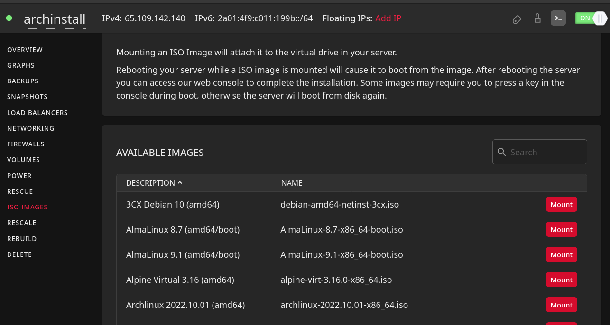

It is better to better to access the from Hetzner console rather than SSH.

## Cleaning the Disk

After reboot the server will boot into ArchIso image we mounted. However the host OS is still installed on the server disk, to clean that disk we will use an utility `cfdisk` which comes with ArchLinux ISO image. So simply type `cfdisk in your terminal` You will see an interface listing all the partitions in our disk `\dev\sda`.

``` 
root@archinstall ~ # cfdisk
```
1.  Free all the used space by the Host OS. We can move the selection `<UP>|<DOWN>` to select devices and `<RIGHT>|<LEFT>` to perform an operation.

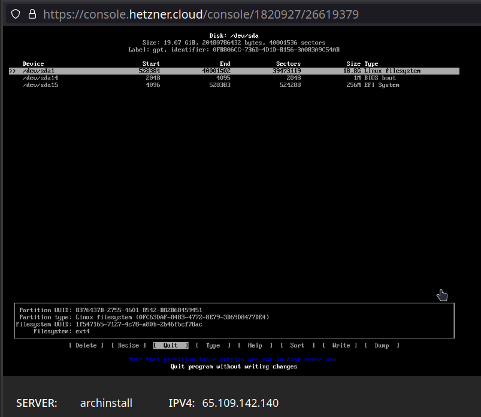

2. Write the partition table to save the changes. you will see color change to green for freed memory in disk.

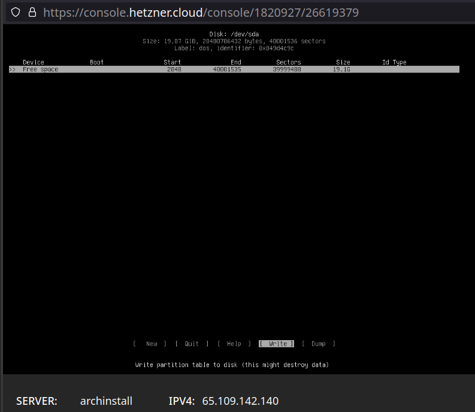

3. Exit the cfdisk utility

## Install ArchLinux using archinstall

Now we have all the disk freed up for archinstall to use. We start the arch linux installation by executing the archinstall guided installer

``` 
root@archinstall ~ # archinstall
```

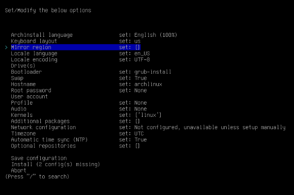

#### Configuring Basic Options

We can configure basic options including 
- Installation Language
- Keyboard Layout
- ArchLinux Mirrors/Regions
- Locale
- Timezone
- NTP

#### Configuring Disk

This option can automatically partition the disk we freed in the first step in a way better suited for running archlinux according to the available space, filesystem type. It also provides an option to manually partition the disk if needed.

- Choose the disk for partition. We will use the defauly `/dev/sda`

	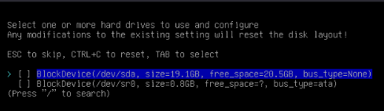
	
- Select the second option which erases and partitions the disk according default layout preferred by archlinux. The first option better suitable if you want to manually partition the disk

	
	
- Now select any of the filesystem according to your preference, I prefer `ext4`
- Now it will enable an option for disk encryption. Choose the Disk Encryption option and provide the password to encrypt the disk.
	+ Note: Remember the Disk Encryption password it required after every reboot. Its very hard to recover any type of data from encrypted drive
	
#### Configuring System Options

The System specific option include

- Bootloader (Default: GRUB)
- Swap (Default: True)
- Hostname (Default: archlinux)
- Root Password
	+ Its advised to disable root access to the system after you have completed your setup
- User Account
	+ We aren't doing that in this tutorial, however its advised to create at least one super user account other than root.
- Profile (Default : None) - These are simple lists archinstall has which will install the necessary packages depending on how we use our system

	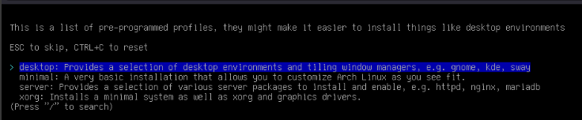

- Audio Server(Default: None)
- Linux Kernel(Default: Linux)
	+ It also has other options `linux-lts`, `linux-zen`, `linux-hardened`
- Additional Packages(Default : empty) - These can be any package included in ArchLinux Official Repositories

#### Configuring Network

Manual installations require manual configuration of network. archinstall provides us with simple way of manually configuring the network link

- Select the Network Configuration option and choose Manual Configuration

	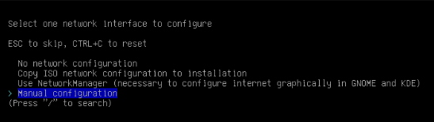

- Select the Default interface an then select `IP(static)` option and provide the necessary information, confirm and exit the interface
	
	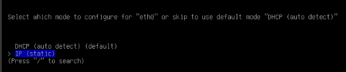
	
	```
	<IP Address> : <IPv4 of your server, visible in Hetzner Cloud Console>
	<Default Gateway> : 172.31.1.1
	<DNS server> : <DNS server of your choice>
	```
	
	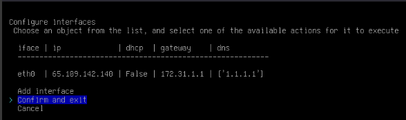

#### Install Option

- After choosing all the above option the archinstall menu should look something like below figure

 	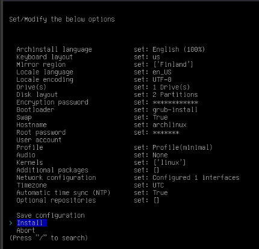
	
- Selecting Install option will ask us for the partition to encrypt with root partition being default

 	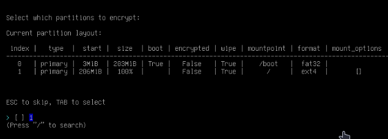
	
Now archinstall will install ArchLinux and the specified and required packages and after successful installation it will ask for reboot. Unmount the ISO image from Hetzner console so that server will boot into disk

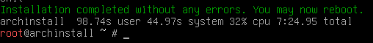

## Logging into ArchLinux server

- Accessing server after successful reboot will prompt for Disk Encryption password
	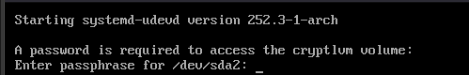

- Now we will be able to login into the ArchLinux Installation using the root user credentials we have setup during the installation
	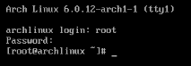
	

## Conclusion

Congratulations! Now we have a minimal Arch Linux installation on your server, you can start installing additional services like ssh, nginx, docker, etc.

##### License: MIT

<!--

Contributor's Certificate of Origin

By making a contribution to this project, I certify that:

(a) The contribution was created in whole or in part by me and I have
    the right to submit it under the license indicated in the file; or

(b) The contribution is based upon previous work that, to the best of my
    knowledge, is covered under an appropriate license and I have the
    right under that license to submit that work with modifications,
    whether created in whole or in part by me, under the same license
    (unless I am permitted to submit under a different license), as
    indicated in the file; or

(c) The contribution was provided directly to me by some other person
    who certified (a), (b) or (c) and I have not modified it.

(d) I understand and agree that this project and the contribution are
    public and that a record of the contribution (including all personal
    information I submit with it, including my sign-off) is maintained
    indefinitely and may be redistributed consistent with this project
    or the license(s) involved.

Signed-off-by: [kushwanth and hello@kushwanth.in]

-->
