## Introduction

In this tutorial, we will use "archinstall" to install a minimal Arch Linux system on a server. 

According to the Arch Linux wiki:

> [archinstall](https://wiki.archlinux.org/title/archinstall) is a helper library to install Arch Linux. It is packaged with different pre-configured installers, such as a "guided" installer.

The guided installer is a terminal UI installer for Arch Linux which gives a simple menu interface to install Arch Linux. For reference, this tutorial has screenshots for most of the menu options.

If you want to install Arch Linux with maximum customization, look into this tutorial: [How to install Arch Linux on a Hetzner Cloud server](https://community.hetzner.com/tutorials/how-to-install-archlinux-on-a-hetzner-cloud-server)

**Prerequisites**

For this tutorial, I will be using a Hetzner Cloud server mounted with an Arch Linux ISO image which is available in the menu item "ISO Images" of a server in Hetzner Cloud Console. Reboot the server after mounting the ISO image.

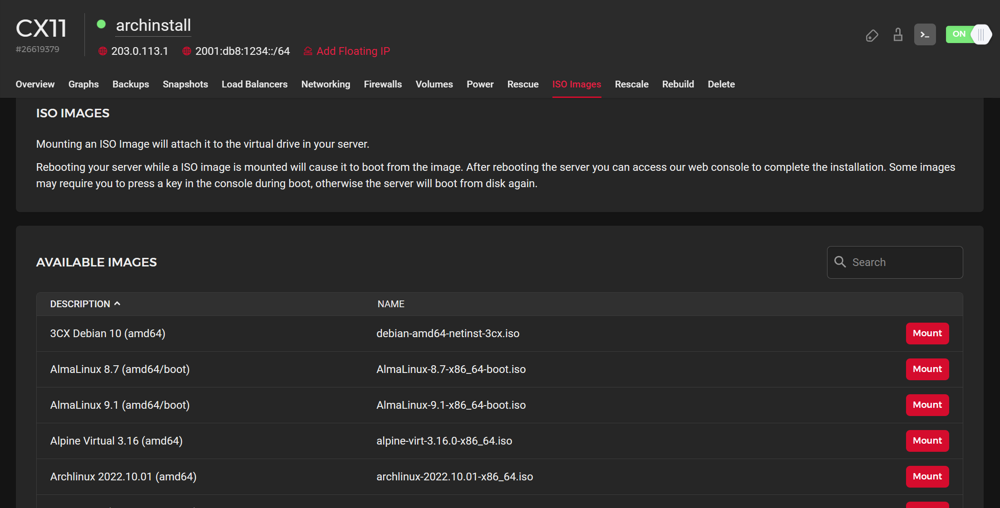

It is better to access the server via the [Hetzner Cloud Console](https://docs.hetzner.com/cloud/servers/getting-started/vnc-console) rather than SSH.

## Step 1 - Cleaning the Disk

After reboot, the server will boot into the Arch ISO image we mounted. However, the host OS is still installed on the server disk. To clean that disk, we will use the `cfdisk` utility which comes with the Arch Linux ISO image. So simply type `cfdisk` in your terminal. You will see an interface listing all the partitions of your disk `\dev\sda`.

``` 
root@archinstall ~ # cfdisk
```

1. Free all the space used by the host OS. We can move the selection `<UP>|<DOWN>` to select devices and `<RIGHT>|<LEFT>` to perform an operation.

   > **Important note:** When you delete those partitions, this will also delete all data on them.

   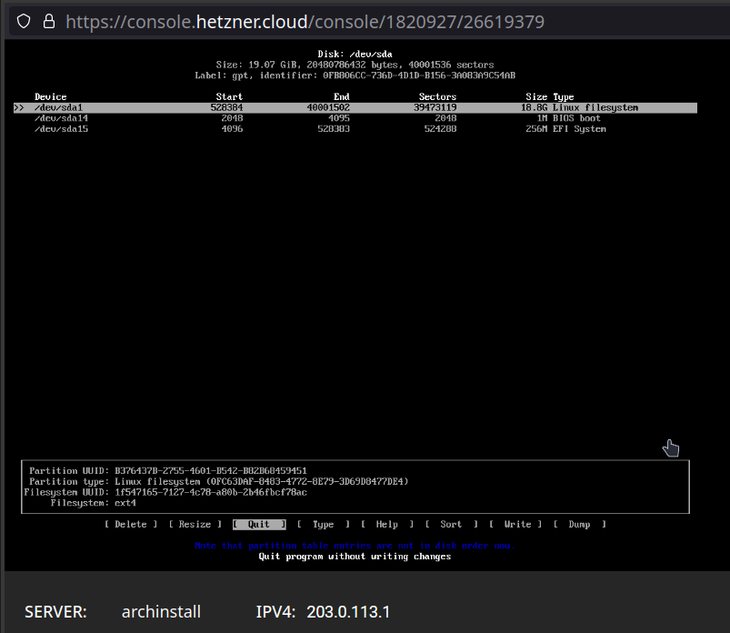

   You will see the color change to green for "free space".

2. Write the partition table to save the changes. 

   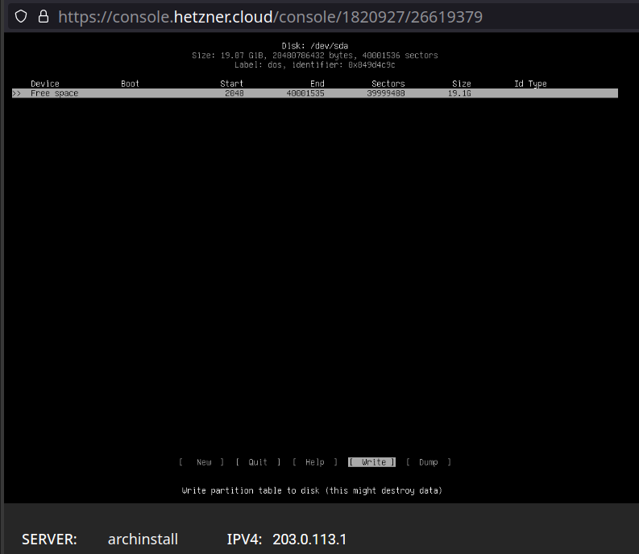

3. Exit the `cfdisk` utility

   To exit, you can use the key combination `CTRL`+`Z`

## Step 2 - Install Arch Linux using archinstall

Now, the entire disk is free for archinstall to use. We start the Arch Linux installation by executing the archinstall guided installer.

``` 
root@archinstall ~ # archinstall
```

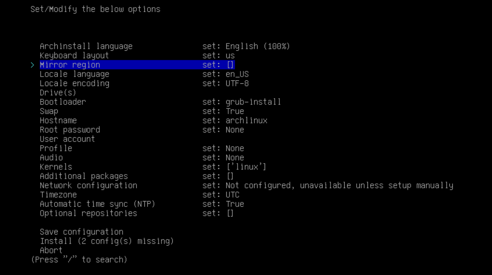

**Configuring Basic Options**

We can configure basic options including:

- Installation language
- Keyboard layout
- Arch Linux mirrors / regions
- Locale
- Timezone
- NTP

### Step 2.1 - Configuring The Disk

This option can automatically partition the disk we freed in the first step in a way that is better suited for running Arch Linux according to the available space and filesystem type. It also provides an option to manually partition the disk if needed.

- "Drives" option

  Choose the disk for partitioning. We will use the default `/dev/sda`.
  
  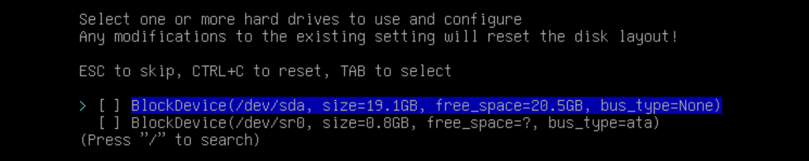

- "Disk layout" option

  Select the second option which erases and partitions the disk according to the default layout preferred by Arch Linux. The first option is better suitable if you want to manually partition the disk.
  
  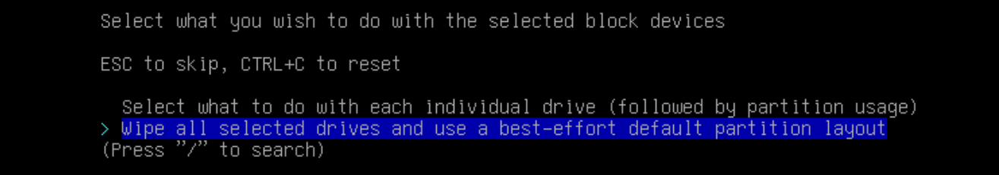

  Now select the filesystem of your preference. My preference is `ext4`.

  Now it will enable an option for disk encryption. 
  
- Choose the "Encryption password" option and provide a password to encrypt the disk.

  > **Note:** Remember the password you chose for disk encryption. It is required after every reboot. It's very hard to recover any type of data from an encrypted drive.
	
### Step 2.2 - Configuring System Options

The system specific options include:

- Bootloader (Default: `grub`)

- Swap (Default: `True`)

- Hostname (Default: `archlinux`)

- Root password

  > It's advised to disable root access to the system after you have completed your setup.

- User account

  > We aren't doing that in this tutorial. However, it is advised to create at least one super user account other than root.

- Profile (Default : `None`)

  > These are simple archinstall lists which will install the necessary packages depending on how we use our system.
  
  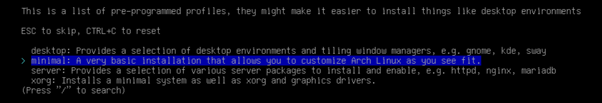

- Audio server (Default: `None`)

- Linux Kernel (Default: `linux`)

  > There are also the options `linux-lts`, `linux-zen`, and `linux-hardened`

- Additional Packages (Default : empty)

  > This can be any package included in an official Arch Linux repository.

### Step 2.3 - Configuring the Network

Manual installations require a manual configuration of the network. archinstall provides us with a simple way to configure the network link manually.

- Select the "Network configuration" option, choose "Manual configuration", and select "Add interface".

  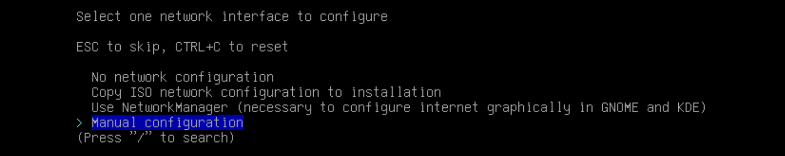

- Select the default interface `eth0`. Then, select the option "IP (static)" and provide the necessary information. Confirm and exit the interface.

  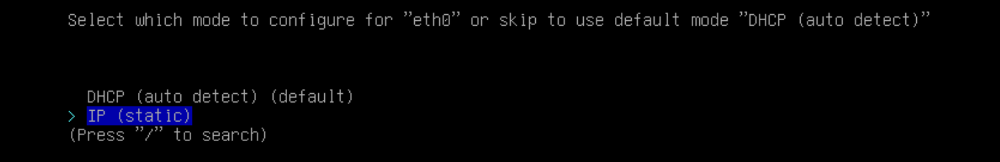

  ```
  <IP Address> : <IPv4 of your server, visible in Hetzner Cloud Console>
  <Default Gateway> : 172.31.1.1
  <DNS server> : <DNS server of your choice>
  ```

  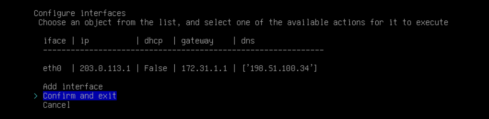

### Step 2.4 - Install Option

- After choosing all of the options above, the archinstall menu should look something like the figure below:
  
  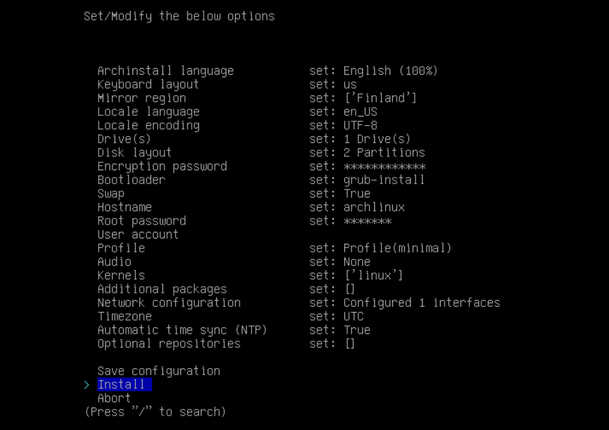
	
- Selecting the "Install" option will ask us for the partition to encrypt. By default, the root (`/`) partition gets encrypted.
  
  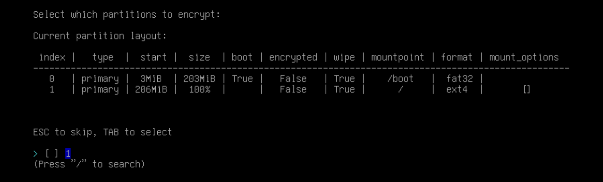
	
Now archinstall will install Arch Linux along with the specified and required packages. After successful installation, it will ask for reboot. Before you reboot your server, unmount the ISO image in Hetzner Cloud Console so that the server will boot into the disk.

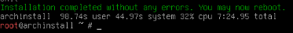

## Step 3 - Logging into the Arch Linux server

- Accessing the server after a successful reboot will prompt for the disk encryption password.

  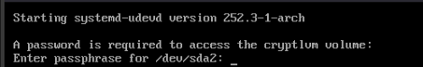

- Now we will be able to login into the Arch Linux installation using the root user credentials we have setup during the installation.

  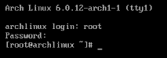
	
## Conclusion

Congratulations! You now have a minimal Arch Linux installation on your server and you can start installing additional services like SSH, nginx, Docker, etc.

##### License: MIT

<!--

Contributor's Certificate of Origin

By making a contribution to this project, I certify that:

(a) The contribution was created in whole or in part by me and I have
    the right to submit it under the license indicated in the file; or

(b) The contribution is based upon previous work that, to the best of my
    knowledge, is covered under an appropriate license and I have the
    right under that license to submit that work with modifications,
    whether created in whole or in part by me, under the same license
    (unless I am permitted to submit under a different license), as
    indicated in the file; or

(c) The contribution was provided directly to me by some other person
    who certified (a), (b) or (c) and I have not modified it.

(d) I understand and agree that this project and the contribution are
    public and that a record of the contribution (including all personal
    information I submit with it, including my sign-off) is maintained
    indefinitely and may be redistributed consistent with this project
    or the license(s) involved.

Signed-off-by: [kushwanth and hello@kushwanth.in]

-->
