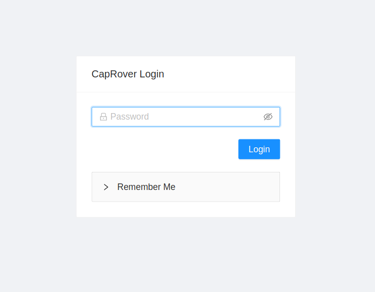
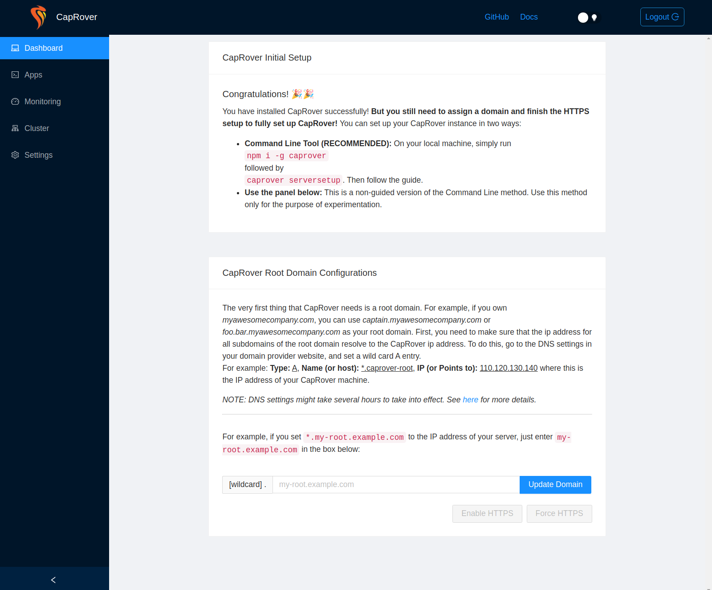

> This tutorial was updated by [jtrugman](https://github.com/jtrugman)
 
## Introduction

CapRover is a sleek new way to easily deploy your own apps, or prebuilt one-click apps to a Cloud Server. CapRover provides a nice web panel to manage your installation, view metrics, and launch new apps. That being said, CapRover only provides one user account, so it will not work for installations with multiple users.

**Prerequisites**

- A fresh Hetzner Cloud server running Ubuntu 20.04 or Ubuntu 22.04 that you have shell access to
- Any domain

> CapRover's recommended stack is Ubuntu 20.04 and Docker 19.03, but has been tested for Ubuntu 22.04

## Step 1 - Install Docker

Since CapRover runs on Docker, we'll need to install it.

First, update your server and install the required packages by running these commands: (make sure you're logged into the `root` user, as this tutorial assumes you are)

```bash
apt-get update
apt-get upgrade -y
apt-get install curl apparmor -y
```

Now we can proceed to installing Docker,

```bash
curl -fsSL https://get.docker.com -o get-docker.sh
sh ./get-docker.sh --dry-run # Verify the script's changes before performing them  
sh ./get-docker.sh
```

This will install the latest version of Docker. You could now move on to running CapRover.

## Step 2 - Connect your domain

CapRover can run on both a root domain (EX: `*.example.com`) and a subdomain (EX: `*.foo.example.com`).

Go to your domain's DNS management panel and create a new `A` record pointing to your server's IP address:

- **TYPE:** `A` record
- **HOST:** `*` (If you're using a subdomain set this to `*.<subdomain_name>`)
- **POINTS TO:** (IP address of your server)
- **TTL:** (Use the default TTL, or set it to `3600`)

To verify that you correctly configured your domain, visit <https://mxtoolbox.com/DNSLookup.aspx>, input `foobar.<your_domain.com>` (`foobar.<subdomain_name>.<your_domain.com>` if you used a subdomain) and check if the domain resolves to the IP address you configured in your DNS settings. **DNS propagation can take a few minutes, so if it doesn't work, just wait some more.** It should take under 30 minutes for DNS to fully propagate.

> **Note:** It is critical that a wildcard (`*`) is assigned to the host in the `A` record. This allows CapRover to create unique addresses for each application on your server.

## Step 3 - Run CapRover

CapRover simply runs inside of Docker, making it very modular, and can be installed with one command:

```bash
docker run -p 80:80 -p 443:443 -p 3000:3000 -e ACCEPTED_TERMS=true -v /var/run/docker.sock:/var/run/docker.sock -v /captain:/captain caprover/caprover
```

Do not change the port mappings, as CapRover will not be able to run on different ports.

## Step 4 - Setup CapRover

Once the previous command has completed, and CapRover was installed, you could proceed to the dashboard and setup your CapRover instance.

The dashboard could be found at `http://captain.<your_domain.com>:3000/` (`http://captain.<subdomain_name>.<your_domain.com>:3000/` if you used a subdomain), and **this endpoint will only be valid for the for the initial setup**. Note that it could sometimes take up to a minute for CapRover to start and that URL to be accessible.



The default password is `captain42` - **you should change it later**

When you login you'll be greeted by the dashboard:



Enter your domain (or subdomain) and press "Update Domain". You'll be redirected to `http://captain.<your_domain.com>` - this is where you can now access your dashboard. Press "Enable HTTPS". Enter your email address in the popup (this will be shared with Let's Encrypt, and is required for generating SSL certificates). Once it's done you can press "Force HTTPS" to make sure every request is redirected to `https://`.

Lastly, **do not forget to set a new password by going to "Settings" and filling out the "Change Password" form!**

## Conclusion

You now have a working CapRover instance 🎉! You can use their docs to learn how to deploy their prebuilt One-Click Apps, or your own:

**Enabling NetData Monitoring:** <https://caprover.com/docs/resource-monitoring.html>

**Deploying a OneClick App:** <https://caprover.com/docs/one-click-apps.html>

**Deployment Methods:** <https://caprover.com/docs/deployment-methods.html>

##### License: MIT

<!--

Contributor's Certificate of Origin

By making a contribution to this project, I certify that:

(a) The contribution was created in whole or in part by me and I have
    the right to submit it under the license indicated in the file; or

(b) The contribution is based upon previous work that, to the best of my
    knowledge, is covered under an appropriate license and I have the
    right under that license to submit that work with modifications,
    whether created in whole or in part by me, under the same license
    (unless I am permitted to submit under a different license), as
    indicated in the file; or

(c) The contribution was provided directly to me by some other person
    who certified (a), (b) or (c) and I have not modified it.

(d) I understand and agree that this project and the contribution are
    public and that a record of the contribution (including all personal
    information I submit with it, including my sign-off) is maintained
    indefinitely and may be redistributed consistent with this project
    or the license(s) involved.

Signed-off-by: Mia Pigal <kedas@yarn.network>
Signed-off-by: Justin Trugman <jtrugman14@gmail.com>

-->
