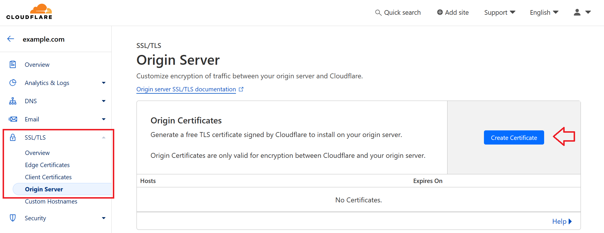

## Introduction

In this tutorial, I will guide you through the process of installing Dify, an open-source LLMOps platform, on a Linux server (Ubuntu, Debian, or CentOS). I will also set up automated backups using Restic and S3-compatible object storage (e.g. [Cloudflare R2](https://www.cloudflare.com/developer-platform/products/r2/)). By the end of this tutorial, you'll have a fully functional Dify instance running on your server with regular backups.

Dify is a powerful tool that allows you to create, deploy, and manage AI applications. It provides a user-friendly interface for building AI applications without extensive coding knowledge, integrating various AI models and services.

This setup will give you a robust environment for developing and running AI applications.

**Prerequisites**

Before we begin, you'll need:

- A Linux server (Ubuntu, Debian, or CentOS) and access to a user with sudo permissions.
- A domain name pointed to your server's IP address.
- An SSL certificate for your domain name (e.g. with [Cloudflare](https://www.cloudflare.com/))  
  
  To generate an SSL certificate with Cloudflare, sign up and:
  
  1. Buy a domain or point your existing domain to Cloudflare nameservers.
  2. Generate an SSL certificate by selecting your domain and navigating to SSL/TLS » Origin Server » Create Certificate.
  
  

We'll use Ubuntu as the example operating system, but the steps should be similar for Debian and CentOS.

## Step 1 - Preparing the Server

First, we'll update the system, install Docker and Docker Compose, and set up Git. This single command will do all of that for us:

```bash
sudo apt update -y && \
sudo apt upgrade -y && \
sudo apt-get install -y apt-transport-https ca-certificates curl software-properties-common gnupg lsb-release && \
curl -fsSL https://download.docker.com/linux/ubuntu/gpg | sudo gpg --dearmor -o /usr/share/keyrings/docker-archive-keyring.gpg && \
echo "deb [arch=$(dpkg --print-architecture) signed-by=/usr/share/keyrings/docker-archive-keyring.gpg] https://download.docker.com/linux/ubuntu $(lsb_release -cs) stable" | sudo tee /etc/apt/sources.list.d/docker.list > /dev/null && \
sudo apt-get update -y && \
sudo apt-get install -y docker-ce && \
sudo usermod -aG docker $USER && \
sudo curl -L https://github.com/docker/compose/releases/download/v2.26.1/docker-compose-`uname -s`-`uname -m` -o /usr/local/bin/docker-compose && \
sudo chmod +x /usr/local/bin/docker-compose && \
sudo apt install git -y
```

This command does the following:
- Updates the system package list and upgrades installed packages
- Installs necessary dependencies
- Adds Docker's official GPG key and repository
- Installs Docker and Docker Compose
- Adds your user to the Docker group
- Installs Git

To check, you can run:

```bash
docker --version && docker compose version && git version
```

You might need to log out and back in to update your groups.

## Step 2 - Cloning the Dify Repository

Now, let's clone the Dify repository:

```bash
cd ~ && git clone https://github.com/langgenius/dify.git
```

This command downloads the Dify source code to your server.

## Step 3 - Configuring Dify

Next, we'll set up the configuration file:

```bash
cd ~/dify/docker
cp .env.example .env
nano .env
```

These commands:
- Change to the Dify docker directory
- Create a copy of the example environment file
- Open the new `.env` file in the nano text editor

In the `.env` file, customize the following variables:

* **Update domain variables**
  ```env
  APP_WEB_URL=your_domain_name
  NGINX_HTTPS_ENABLED=true
  ```

<br>

* **Update certificate variables**
  
  If you want to use your own certificate, you can keep the default values and add the respective key files in the next step.
  
  If you want to use the Cloudflare certificate, update the values of the certificate variables like this:
  ```env
  NGINX_SSL_CERT_FILENAME=cert.pem
  NGINX_SSL_CERT_KEY_FILENAME=key.pem
  ```

<br>

* **Update additional variables**
  
  Review other variables in the `.env` file as well, and adjust them according to your needs.

After making changes, press `Ctrl`+`S` to save and `Ctrl`+`X` to exit the nano editor.

## Step 4 - Setting Up SSL Certificates

Let's add the SSL certificate.

If you use your own certificate, you can add it in `dify.crt` and `dify.key`.

If you use the Cloudflare certificate, you should add it in `cert.pem` and `key.pem`.

* **Own certificate**
  
  Create two new files:
  ```bash
  nano ~/dify/docker/nginx/ssl/dify.crt
  nano ~/dify/docker/nginx/ssl/dify.key
  ```
  Copy and paste your certificate and key into those files. Save and exit (`Ctrl`+`S`, `Ctrl`+`X`).

<br>

* **Cloudflare certificate**
  ```bash
  nano ~/dify/docker/nginx/ssl/cert.pem
  ```
  
  Copy and paste the Cloudflare certificate content into this file. Save and exit (`Ctrl`+`S`, `Ctrl`+`X`).
  
  ```bash
  nano ~/dify/docker/nginx/ssl/key.pem
  ```
  
  Copy and paste the Cloudflare SSL key content into this file. Save and exit (`Ctrl`+`S`, `Ctrl`+`X`).

## Step 5 - Deploying Dify

We're now ready to deploy Dify:

```bash
cd ~/dify/docker
docker compose up -d
```

This command starts all the necessary Docker containers for Dify. The `-d` flag runs the containers in detached mode (in the background).

After a minute or so, you should be able to access your Dify instance by visiting your domain in a web browser.

You can run `docker ps -a` to check the status of the containers.

## Step 6 - Setting Up Automated Backups

After deploying Dify, let's set up automated backups using Restic and S3-compatible object storage (e.g. Cloudflare R2). First, we need to switch to the root user:

```bash
sudo su
cd ~
```

### Step 6.1 - Install Restic

The commands above bring us to the root directory. Now, let's install Restic:

```bash
sudo apt update
sudo apt install restic
```

### Step 6.2 - Prepare Your s3-compatible Bucket

If you haven't already, create a new bucket with your preferred provider or an R2 bucket in your Cloudflare account. Note down the following information:

- Bucket Name
- Access Key ID
- Secret Access Key
- Endpoint URL

With Cloudflare, you can find this information in your Cloudflare dashboard under R2 » Overview and R2 » Manage R2 API Tokens.

### Step 6.3 - Create the Backup Script

Create a new directory and backup script:

```bash
mkdir -p /root/restic
nano /root/restic/backup.sh
```

Copy and paste the following content into the file:

```bash
#!/bin/bash

# Set environment variables for Restic
export RESTIC_REPOSITORY="s3:YOUR_S3_ENDPOINT_URL/YOUR_BUCKET_NAME"
export AWS_ACCESS_KEY_ID="YOUR_ACCESS_KEY_ID"
export AWS_SECRET_ACCESS_KEY="YOUR_SECRET_ACCESS_KEY"
export RESTIC_PASSWORD_FILE="/etc/restic-password"

# Set the backup source
# Replace "YOUR_USER" with the user that installed Dify
BACKUP_SOURCE="/home/YOUR_USER/dify/docker/volumes"

# Perform the backup
restic backup $BACKUP_SOURCE

# Prune old snapshots (keep last 7 daily, last 4 weekly, and last 12 monthly backups)
restic forget --keep-daily 7 --keep-weekly 4 --keep-monthly 12 --prune

# Check the repository for errors
restic check
```

Replace the first three placeholders with your actual S3 bucket information, and "YOUR_USER" with the user that installed Dify. Save and exit the editor (`Ctrl`+`S`, `Ctrl`+`X`).

Make the script executable and secure:

```bash
chmod +x /root/restic/backup.sh
chmod 700 /root/restic/backup.sh
```

### Step 6.4 - Initialize the Restic Repository

Set the environment variables and initialize the repository:

```bash
export RESTIC_REPOSITORY="s3:YOUR_S3_ENDPOINT_URL/YOUR_BUCKET_NAME"
export AWS_ACCESS_KEY_ID="YOUR_ACCESS_KEY_ID"
export AWS_SECRET_ACCESS_KEY="YOUR_SECRET_ACCESS_KEY"
restic init
```

Save the password in a new file for the cron job:

```bash
echo "YOUR_PASSWORD" > /etc/restic-password
chmod 600 /etc/restic-password
```

These commands:
- Save the restic password in a new file
- Restrict the file's access to only your user

### Step 6.5 - Set Up Daily Backups

Open the crontab file:

```bash
crontab -e
```

Add the following line at the end of the file:

```cron
0 3 * * * /root/restic/backup.sh > /root/restic/backup.log 2>&1
```

This sets up a daily backup at 3 AM. Save and exit the editor.

## Step 7 - Verifying the Setup

To ensure everything is set up correctly:

1. Run the backup script manually:
   ```bash
   /root/restic/backup.sh
   ```

2. Check the Restic repository for snapshots:
   ```bash
   restic snapshots
   ```

## Step 8 - Upgrading Dify in the Future

To upgrade Dify in the future, run these commands:

```bash
cd ~/dify/docker
docker compose down
git pull origin main
docker compose pull
docker compose up -d
```

This will stop the current containers, pull the latest changes, download updated images, and start the new containers.

## Conclusion

Congratulations! You've successfully installed Dify on your Linux server, set up SSL certificates, and configured automated backups. Your Dify instance is now ready for use, with daily backups ensuring your data is safe.

To list available snapshots:

```bash
restic snapshots
```

To restore from a backup if needed:

```bash
restic restore latest --target /path/to/restore
```

Replace `/path/to/restore` with the directory where you want to restore the data.

Make sure to securely store your Restic repository password, as it's crucial for accessing your backups.

Remember to regularly check your backups and keep your system updated for optimal performance and security.

##### License: MIT

<!--

Contributor's Certificate of Origin

By making a contribution to this project, I certify that:

(a) The contribution was created in whole or in part by me and I have
    the right to submit it under the license indicated in the file; or

(b) The contribution is based upon previous work that, to the best of my
    knowledge, is covered under an appropriate license and I have the
    right under that license to submit that work with modifications,
    whether created in whole or in part by me, under the same license
    (unless I am permitted to submit under a different license), as
    indicated in the file; or

(c) The contribution was provided directly to me by some other person
    who certified (a), (b) or (c) and I have not modified it.

(d) I understand and agree that this project and the contribution are
    public and that a record of the contribution (including all personal
    information I submit with it, including my sign-off) is maintained
    indefinitely and may be redistributed consistent with this project
    or the license(s) involved.

Signed-off-by: Tao Wang taowang@riverhill.ai

-->
