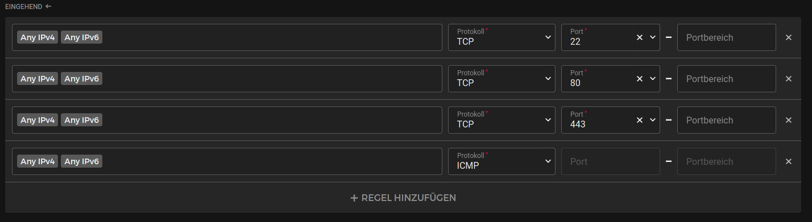
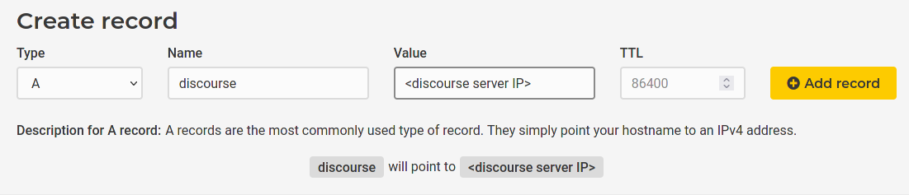
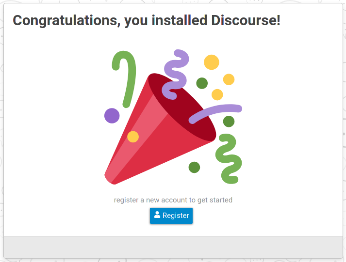
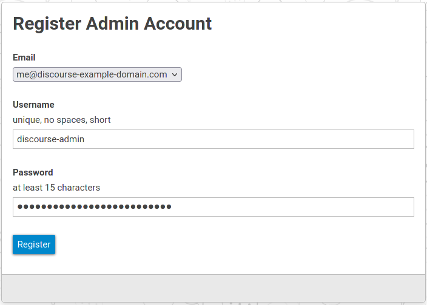
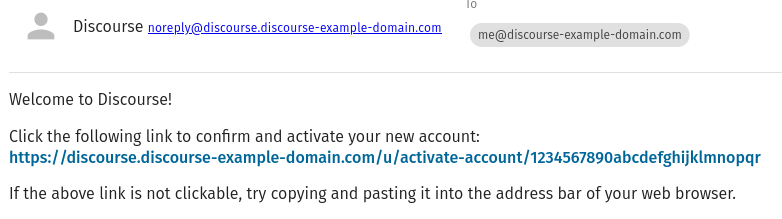

## Introduction

[Discourse](https://github.com/discourse/discourse) is a forum software aiming for good discussion quality. You can find a sandbox installation at [try.discourse.org](https://try.discourse.org/).

This tutorial covers the basic steps to set up the free community edition on a cloud server running Ubuntu 20.04.

### Prerequisites

- a cloud server
- a domain
- an email account

The [minimum hardware requirements for Discourse](https://github.com/discourse/discourse/blob/master/docs/INSTALL.md#hardware-requirements) state one CPU core, 1 GB RAM and 10GB disk space. Therefore a Hetzner CX11 will suffice for the initial setup. Depending on what your plans with the installation are, you can rescale the server later to fit your needs.

Basic docker knowledge is helpful.

## Step 1 - Setup the server

### Step 1.1 - Firewall

After ordering a server with Ubuntu 20.04 preinstalled, I recommend to add a simple firewall. This limits incoming traffic to SSH and general HTTP and HTTPS traffic.



### Step 1.2 - Update the system and install the required packages

Check for available updates and install them:

```console
apt update && apt upgrade
[...]
Do you want to continue? [Y/n] Y                                                          
```

Install the packages `docker.io` and `git`:  

```console
apt install docker.io git
[...]
Do you want to continue? [Y/n] Y                                                          
```

## Step 2 - Get Discourse

### Step 2.1 - Checkout the Discourse Docker repository

Now we clone the repository that contains helper scripts and definitions for our Discourse installation:

```console
git clone https://github.com/discourse/discourse_docker.git /git/discourse
cd /git/discourse
```

### Step 2.2 - Have a domain? Have a mail server?

You **must** have an email account and a domain to continue. If you don't, go get one!

You can find inexpensive combos of domain and hosted email service e.g. through [Hetzner's webhosting packages](https://www.hetzner.com/webhosting)

Or you get the domain via the [domain registration Robot](https://www.hetzner.com/registrationrobot) and host the mail server yourself. If you want to host a mail server yourself, the [mailcow tutorial](https://community.hetzner.com/tutorials/setup-mailserver-with-mailcow) is an easy way to get started.

### Step 2.3 - Prepare configuration

From here on we assume that you have a working email account and a domain, that is pointed to the server, that you run Discourse on.



Now run the helper script:

```console
./discourse-setup
```

You will be asked some questions during this.

Answer them with the information that you have.

In the example below, it is assumed, that you have the domain `discourse-example-domain.com`, your personal email account `me@discourse-example-domain.com` and a generic email account `discourse@discourse-example-domain.com` that is used by Discourse to authenticate against your mail server.

Please ensure that the email account is allowed to send mails for the address `noreply@discourse.discourse-example-domain.com`.

```console
Hostname for your Discourse? [discourse.example.com]: discourse.discourse-example-domain.com
Email address for admin account(s)? [me@example.com,you@example.com]: me@discourse-example-domain.com
SMTP server address? [smtp.example.com]: mail.discourse-example-domain.com
SMTP port? [587]: 587
SMTP user name? [user@example.com]: discourse@discourse-example-domain.com
SMTP password? [pa$$word]: supersecret!password123
notification email address? [noreply@discourse.example.com]: noreply@discourse.discourse-example-domain.com
Optional email address for Let's Encrypt warnings? (ENTER to skip) [me@example.com]: me@discourse-example-domain.com

[...]

Does this look right?                                                 

[...]

ENTER to continue, 'n' to try again, Ctrl+C to exit:
```

There are some checks in the script like ensuring that the domain is actually pointed to the server and that the email account can authenticate against your mail server. If the script exits before you are asked if the information looks right, you might need to revise your domain and mail setup.

After confirming the information, the script will continue to set up the docker container for your Discourse. This may take a few minutes.

The docker container is an all in one. It includes webserver, application, database and a few other things. It also manages the SSL certificate for itself.

## Step 3 - Finish installation

After the script is done, you should have a docker container up and running.

```console
docker ps
CONTAINER ID   IMAGE                 COMMAND        CREATED         STATUS         PORTS                                      NAMES
989d351d5d61   local_discourse/app   "/sbin/boot"   2 minutes ago   Up 2 minutes   0.0.0.0:80->80/tcp, 0.0.0.0:443->443/tcp   app
```

Now it is time to visit the website. From example from above this would be `discourse.discourse-example-domain.com`.

You should see a welcome screen, where you are prompted for registering. This will create your initial administrator account.



Provide the initial credentials for your administrator account.



Now take a look into your mailbox.

You should find a mail with a link to confirm your administrator account creation.



Click on the link to finalize the setup.

## Conclusion

Congratulations! You created a Discourse installation that you can now can log into with the previously provided credentials. This is where this guide ends.

As a next step, you might want to customize the installation to your needs.

Discourse displays various helpful links right up front such as the "READ ME FIRST: Admin Quick Start Guide" article or the wizard.

Depending on how your community grows, you might want to consider using a larger cloud instance or even move the components of Discourse (e.g. database, webserver) to separate machines.

##### License: MIT

<!--

Contributor's Certificate of Origin

By making a contribution to this project, I certify that:

(a) The contribution was created in whole or in part by me and I have
    the right to submit it under the license indicated in the file; or

(b) The contribution is based upon previous work that, to the best of my
    knowledge, is covered under an appropriate license and I have the
    right under that license to submit that work with modifications,
    whether created in whole or in part by me, under the same license
    (unless I am permitted to submit under a different license), as
    indicated in the file; or

(c) The contribution was provided directly to me by some other person
    who certified (a), (b) or (c) and I have not modified it.

(d) I understand and agree that this project and the contribution are
    public and that a record of the contribution (including all personal
    information I submit with it, including my sign-off) is maintained
    indefinitely and may be redistributed consistent with this project
    or the license(s) involved.

Signed-off-by: [Andreas Schwarz]

-->
