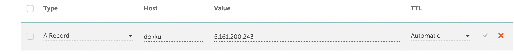
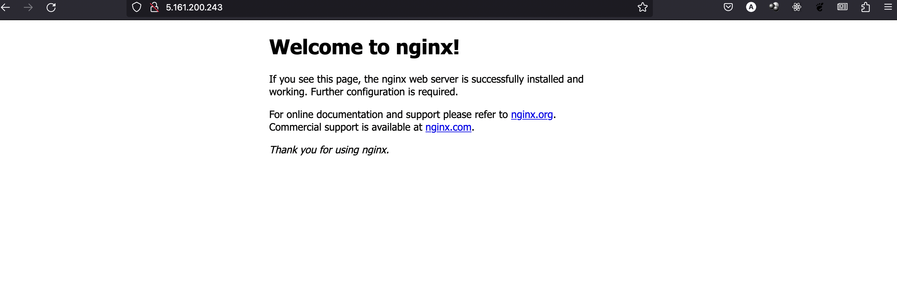

## Introduction

Dokku, an open-source tool inspired by Heroku, lets you deploy apps effortlessly on your own server. Imagine having your own mini app hosting platform like Heroku, but on a single server you control. This guide will show you how to set it up on Hetzner Cloud, perfect for personal projects or smaller ventures.

**Prerequisites**

- A fresh Hetzner Cloud server running Ubuntu 20.04 or Ubuntu 22.04 with shell access
- A domain

> Dokku's recommended stack includes Ubuntu 20.04 and Docker 19.03

## Step 1 - Initial Server Setup and Docker Installation

Start by updating your server's package index and upgrading any existing packages to their latest versions. Then, proceed to install Docker and any other necessary dependencies. Log in to your server as the root user and execute the following commands:

Begin by updating your server and installing the necessary packages. Log in as the `root` user:

```bash
apt-get update
apt-get upgrade -y
apt-get install curl -y
```

With the prerequisites handled, you can now download and execute the Dokku installation script. The script will handle the installation of Dokku and its dependencies, including Docker:

```bash
wget -NP . https://dokku.com/install/v0.33.6/bootstrap.sh
sudo DOKKU_TAG=v0.33.6 bash bootstrap.sh
```
After the installation, you'll need to add your SSH key to Dokku to enable secure deployments. If you're using the default setup, your SSH key should already be in the ` ~/.ssh/authorized_keys ` file of the current user. Add the key to Dokku with the following command:

```bash
cat ~/.ssh/authorized_keys | dokku ssh-keys:add admin
```

## Step 2 - Connect your domain

With Dokku installed, the next step is to associate your domain with the Dokku instance. This will allow you to access your deployed applications using your own domain name. Set the global domain for Dokku using the following command, replacing dokku.me with your actual domain:

```bash 
dokku domains:set-global dokku.yourwebsite.com
```

By setting a global domain, all apps deployed to Dokku will automatically be accessible under subdomains of your specified domain. For example, an app named myapp would be available at `dokku.yourwebsite.com`.
Navigate to the DNS settings for your domain and add a new A record that directs to the IP address of your server, I am using Namecheap for this:



You can visit your connected domain and you should see an NGINX welcome page, notice that there isn't any ssl certificate yet, you can use Let's encrypt or buy an ssl from any Hosting/Domain provider



## Conclusion

You've now successfully installed Dokku on your Hetzner Cloud server and connected your domain. With this setup, you're ready to start deploying applications just as you would on Heroku, but with the added benefits of cost savings and control over your hosting environment. Enjoy the simplicity of app deployment and management with your new, self-hosted PaaS solution.

##### License: MIT

<!--

Contributor's Certificate of Origin

By making a contribution to this project, I certify that:

(a) The contribution was created in whole or in part by me and I have
    the right to submit it under the license indicated in the file; or

(b) The contribution is based upon previous work that, to the best of my
    knowledge, is covered under an appropriate license and I have the
    right under that license to submit that work with modifications,
    whether created in whole or in part by me, under the same license
    (unless I am permitted to submit under a different license), as
    indicated in the file; or

(c) The contribution was provided directly to me by some other person
    who certified (a), (b) or (c) and I have not modified it.

(d) I understand and agree that this project and the contribution are
    public and that a record of the contribution (including all personal
    information I submit with it, including my sign-off) is maintained
    indefinitely and may be redistributed consistent with this project
    or the license(s) involved.

Signed-off-by: Smyja <akposlive59@gmail.com>

-->
