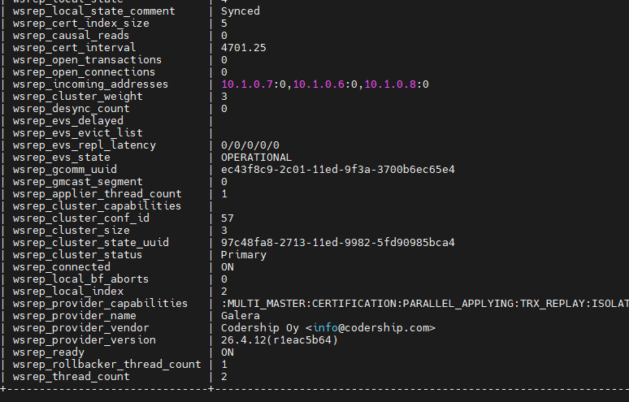

## Einleitung

Manchmal ist es hilfreich, eine hoch verfügbare MariaDB - mit Galera - zu haben. Für dieses Szenario setzen wir vor das Cluster einen Load Balancer, um die Anfragen noch besser zu verteilen.


**Voraussetzungen**

- Einen Load Balancer (öffentliches Netzwerk ist deaktiviert)
- 3 Hetzner Cloud Server (Debian 11) - oder mehr
- Ein privates Netzwerk, dem der Load Balancer und die Datenbank-Server hinzugefügt wurden

Terminologie, die in diesem Tutorial verwendet wird:

* Domain: `example.com`
* IP Adressen (IPv4) und Hostnamen:
   * Load Balancer: `10.1.0.5`
   * MariaDB Node 1: `10.1.0.2` and `db01.example.com`
   * MariaDB Node 2: `10.1.0.3` and `db02.example.com`
   * MariaDB Node 3: `10.1.0.4` and `db03.example.com`

## Schritt 1 - Vorbereiten der Cloud Server

Nach der Bereitstellung eines neuen Cloud Servers (zum Beispiel CX11) mit dem Standard-Image Debain 11, logge dich als root in eine Shell ein und führe zuerst die Updates der Repo-Listen aus:

```shell
apt update
apt upgrade
```

## Schritt 2 - Software-Installation auf den Datenbank-Nodes

Das MariaDB Projekt macht es uns einfach die Repo-URLs und Abhängigkeiten für eine Installation hinzuzufügen und stellt ein kleines Shell-Skript bereit.

```shell
curl -sS https://downloads.mariadb.com/MariaDB/mariadb_repo_setup | sudo bash
```

Nachdem durch das Shell-Skript die MariaDB Repo-URLs hinzugefügt wurden, können wir mit der Installation der MariaDB-Server, -Client, Galera4 und der Backup Binaries starten.

```shell
apt install mariadb-server mariadb-client galera-4 libmariadb3 mariadb-backup -y
```

## Schritt 3 - Konfiguration von MariaDB auf allen Datenbank-Nodes

Auf allen Datenbank-Nodes muss die gleiche Konfiguration ausgeführt werden.

Die `/etc/mysql/mariadb.conf.d/50-server.cnf` File bearbeiten, neue Parameter einfügen und Vorhandene auskommentieren:

```shell
[server]
# Der Proxy-Protokoll-Parameter ist notwendig, damit der Load Balancer auf die Datenbank-Instanzen zugreifen kann:
proxy-protocol-networks=10.1.0.0/24, localhost  # Ersetze hier das private Subnetz mit deinem eigenen!

# Auf den Datenbank-Nodes werden die Load Balancer Health Checks als unauthentifizierte Verbindungen erkannt.
# Nach 2-3 Tagen kann dadurch bereits das Limit der "max_connect_errors" erreicht werden. Das Cluster wird weiter funktionieren,
# auf Grund von "Black-Listing" werden aber keine neuen Verbindungen vom Web-Server oder Application-Server angenommen.
max_connect_errors    = 4294967295
max_connections       = 100000

# ----------------------- 8< --------------------------
## Damit nicht nur Localhost-Verbindungen möglich sind, muss der "bind-address" Parameter auskommentiert werden.
## Vorerst erlauben wir Verbindungen der eth0 Adresse (10.1.0.x).
# bind-address        = 127.0.0.1
# ----------------------- >8 --------------------------
```

## Schritt 4 - Konfiguration von Galera auf allen Datenbank-Nodes

Der einfachste Weg für die Galera Konfig ist das vorhandene File zu leeren und nur die notwendigen Infos neu einzufügen.

- File leeren:
  ```shell
  echo > /etc/mysql/mariadb.conf.d/60-galera.cnf
  ```

- Bearbeiten des Files mit nano/vim/....
  ```shell
  nano /etc/mysql/mariadb.conf.d/60-galera.cnf
  ```

- Hinzufügen der Zeilen und Ändern der Parameter auf die eigenen Gegebenheiten:
  ```
  # Galera related Settings
  # Weitere Informationen zu den Parametern: https://mariadb.com/kb/en/galera-cluster/
  
  [galera]
  wsrep_provider            = /usr/lib/galera/libgalera_smm.so
  wsrep_on                  = ON                                    # Setze die Replikation auf diesem Node als ON
  wsrep_cluster_name        = "MariaDB Galera Cluster"              # Ein Name für das Cluster
  wsrep_cluster_address     = gcomm://10.1.0.2,10.1.0.3,10.1.0.4    # IPs aller Datenbank-Nodes, inkl. der eigenen IP
  wsrep_node_address        = 10.1.0.2                              # Die eigene IP-Adresse im privaten Netwerk
  wsrep_node_name           = db01                                  # Der eigene Hostname
  binlog_format             = row
  default_storage_engine    = InnoDB
  innodb_autoinc_lock_mode  = 2
  
  # Erlaube dem Server, Verbindungen aus allen Netzwerken anzunehmen:
  # Siehe Parameter, der in der "50-server.cnf"-Datei auskommentiert wurde!
  bind-address              = 0.0.0.0
  ```

Bitte beachte, dass die Konfiguration auf allen Nodes gemacht werden muss.

## Schritt 5.1 - Start des Cluster-Masters

Das Starten des ersten Nodes unterscheidet sich von allen weiteren Nodes.

Um den ersten Node zu starten, muss er als Cluster-Master gekennzeichnet sein. Dies wird in einer root Shell ausgeführt:

```shell
galera_new_cluster
```

Wenn der erste Node gestartet ist, kann der Status des Masters geprüft werden:

```shell
service mariadb status
```

## Schritt 5.2 - Start der anderen Cluster-Member

Um alle anderen Member im Cluster zu starten, reicht ein normaler Systemneustart des Dienstes:

```shell
systemctl restart mariadb
```

Wenn das Cluster das erste Mal gestartet wurde, ist es nicht mehr länger nötig, den Master-Node im Master-Modus laufen zu lassen. 
Alle neuen Nodes fragen ihre Nachbarn in der Liste der Cluster Nodes aus der Konfig-Datei `60-galera.cnf` ab und bekommen auch nicht aufgelistete Nachbarn mitgeteilt.
Sollte es also nötig sein, kann auf dem Master-Node auch ein normaler Service-Neustart mit `service mariadb restart` durchgeführt werden und er startet als Member.

## Schritt 6 - Prüfen des Replikations-Status auf dem Cluster

Bei der Installation von MySQL in Schritt 2 wurden noch keine Benutzer erstellt oder Passwörter festgelegt. Daher kann nun ohne weitere Angaben in die MySQL-CLI gewechselt werden.

```shell
mysql
```

Um den Status des Clusters nach dem Start aller Members zu prüfen, setzt man in der MySQL-CLI folgendes Kommando ab:

```shell
# mysql SHOW GLOBAL STATUS LIKE 'wsrep_%';
```



## Schritt 7 - Hinzufügen der Nodes zum Load Balancer

Nun fügen wir die Cloud Server als Ziel (Target) zum Load Balancer hinzu.

<blockquote>

<details>

<summary>Hinweis zum Load Balancer Algorithmus</summary>

Mit "Round Robin" können die Verbindungen gleichmäßig über das Cluster verteilt werden. Bei diesem Algorithmus wird die aktuelle Last der einzelnen Nodes allerdings nicht berücksichtigt. Dadurch kann es passieren, dass einzelne Nodes stärker ausgelastet sind als andere. "Least Connections" ist daher im Allgemeinen die bessere Wahl für die Lastverteilung in einem MariaDB Galera Cluster.

</details>

</blockquote>


## Schritt 8 - Hinzufügen des Service und Health Check am Load Balancer

Nach dem Hinzufügen der Ziele (Targets), kann der Service am Load Balancer erstellt werden.


Editiere die Parameter für Intervall, Timeout und Retries für die eigenen Bedürfnisse.


## Schritt 9 - Testen der Verbindung zur Datenbank

Nachdem alle Einstellungen am Load Balancer gemacht wurden, kann eine erste Verbindung getestet werden. Dies kann mit einem MySQL-Client oder einem Script-File (php, python, ...) von einem neuen leeren Cloud Server gemacht werden, welcher ebenfalls dem privaten Netzwerk hinzugefügt wurde und auf den Load Balancer zugreifen kann.
Der Datenbank-Server ist hier die IP des Load Balancers.
Vorher muss eine Datenbank im Cluster erstellt worden sein und eventuell ein entsprechender User mit Berechtigungen.

## Schritt 10 - Gut zu Wissen und Fehlerbehebung / bekannte Probleme

- Wie in Schritt 3 in der Konfiguration als Kommentar vermerkt, meldet sich der Health Check vom Load Balancer als nicht authentifizierte Verbindung an den Nodes.
  Hierdurch kann schnell das Limit der Variable `max_error_connect` erreicht werden.
  Um dieses Problem zu lösen, kann man einen Cronjob einrichten, der periodisch das folgende Kommando ausführt und die Liste der gesperrten Hosts leert:
  ```shell
  mariadb-admin flush-hosts
  ```

- Wenn weitere Server vorbereitet werden und dem bestehenden Cluster hinzugefügt werden sollen, reicht es in die Konfiguration in der `cnf`-File von Galera die IP-Adressen der ersten 3 Nodes einzufügen.
  Über das interne Cluster-Kommunikations-Protokoll werden alle Nachbarn mit einem Broadcast bekanntgegeben und die Replikation beginnt.

- Wenn Du in MariaDB einen neuen User erstellst und diesem Rechte auf eine Datenbank gewährst, wird dieser durch die Replikation auf allen Nodes angelegt.
  Andere Änderungen, die an der MySQL-Datenbank durchgeführt werden, werden NICHT synchronisiert. Nur die Rechte und User/Passwörter werden repliziert.

- Ein mögliches Backup-Konzept könnte so gestaltet sein: Erstelle einen weiteren Cloud Server und füge ihn zum privaten Netzwerk hinzu, installiere die MariaDB und Galera Pakete wie oben beschrieben, aber füge diesen Node NICHT zum Load Balancer hinzu. Dieser Node bekommt alle Daten aus dem Cluster, wird aber nicht mit Anfragen der Applikation konfrontiert. So kann zum Beispiel ein MySQL Dump erstellt werden, ohne dass die Performance beeinträchtigt wird. Die Datenbank hat aber dennoch den aktuellen Stand.

## Ergebnis

Nun haben wir ein funktionierendes Galera-Cluster, welches erlaubt, alle bis auf einen Node herunterzufahren und in welchem sich die Nodes nach einem Neustart selbst wieder synchronisieren.
Durch den vorgeschalteten Load Balancer werden Anfragen auf alle Nodes verteilt und nicht mehr funktionierende Nodes werden nicht angesprochen.

##### License: MIT

<!--

Contributor's Certificate of Origin

By making a contribution to this project, I certify that:

(a) The contribution was created in whole or in part by me and I have
    the right to submit it under the license indicated in the file; or

(b) The contribution is based upon previous work that, to the best of my
    knowledge, is covered under an appropriate license and I have the
    right under that license to submit that work with modifications,
    whether created in whole or in part by me, under the same license
    (unless I am permitted to submit under a different license), as
    indicated in the file; or

(c) The contribution was provided directly to me by some other person
    who certified (a), (b) or (c) and I have not modified it.

(d) I understand and agree that this project and the contribution are
    public and that a record of the contribution (including all personal
    information I submit with it, including my sign-off) is maintained
    indefinitely and may be redistributed consistent with this project
    or the license(s) involved.

Signed-off-by: Thomas Pieger pieger.tom@gmail.com

-->
