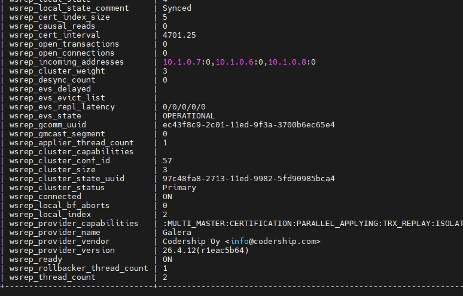
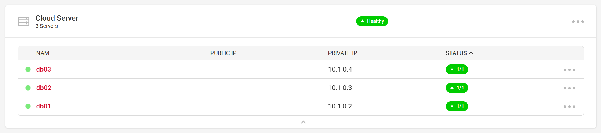
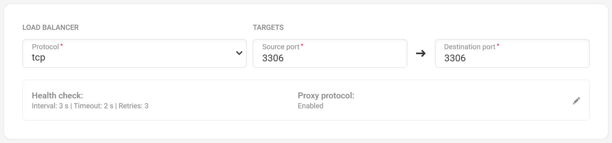
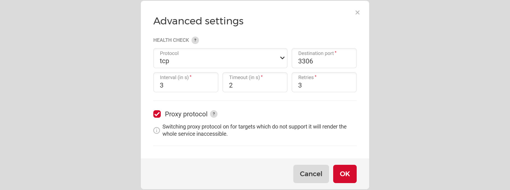

## Introduction

Sometimes it is useful to have a highly available MariaDB - with a Galera cluster. For this scenario, we put the cluster behind a private Load Balancer in Hetzner Cloud and make the cluster accessible from other cloud servers.


**Prerequisites**

- A Load Balancer (public network is disabled)
- 3 Hetzner cloud servers (Debian 11) - or more
- A private Network that has the Load Balancer and the MariaDB nodes attached to it

Terminology used in this tutorial:

* Domain: `example.com`
* IP addresses (IPv4) and hostnames:
   * Load Balancer: `10.1.0.5`
   * MariaDB Node 1: `10.1.0.2` and `db01.example.com`
   * MariaDB Node 2: `10.1.0.3` and `db02.example.com`
   * MariaDB Node 3: `10.1.0.4` and `db03.example.com`

## Step 1 - Prepare Cloud Servers

After ordering a new cloud server (CX11) with a standard OS Debian 11, first log in to the shell as root user and update the repo lists:
```shell
apt update
apt upgrade
```

## Step 2 - Install software on the database nodes

The MariaDB project makes it easy to add the MariaDB repo and dependencies with a small shell script.

```shell
curl -sS https://downloads.mariadb.com/MariaDB/mariadb_repo_setup | sudo bash
```

After the shell script has added the MariaDB repository URLs, we can start installing the MariaDB server, client, backups, and Galera4.

```shell
apt install mariadb-server mariadb-client galera-4 libmariadb3 mariadb-backup -y
```

## Step 3 - Configure MariaDB on the database nodes

You have to do the same configuration on all database nodes.

Edit the  `/etc/mysql/mariadb.conf.d/50-server.cnf` file, add the parameters and comment one out:

```shell
[server]
# The Proxy Protocoll Parameter is needed to grant the Load Balancer access to the database instances:
proxy-protocol-networks=10.1.0.0/24, localhost  # Replace the private subnet used here with your own!

# The database nodes recognize the Load Balancer health checks as unauthenticated connections.
# After 2-3 days, the limit for error connections could be reached. The cluster will still work but 
# because of "Black-Listing", new connections from our web server or application server won't be accepted.
max_connect_errors    = 4294967295
max_connections       = 100000

# ----------------------- 8< --------------------------
## To allow connections not only on the localhost, comment out the bind-address parameter.
## For now, we accept connections for the eth0 address (10.1.0.x).
# bind-address        = 127.0.0.1
# ----------------------- >8 --------------------------
```

## Step 4 - Configure Galera on the database nodes

The easiest way to configure Galera is to clear the `cnf` file and to then add only the most important information:

- Clear the file:
  ```shell
  echo > /etc/mysql/mariadb.conf.d/60-galera.cnf
  ```

- Now edit the file with nano/vim/....
  ```shell
  nano /etc/mysql/mariadb.conf.d/60-galera.cnf
  ```

- Copy and paste the config below and add your own parameters where needed:
  ```
  # Galera related Settings
  # Read more about the parameters at https://mariadb.com/kb/en/galera-cluster/
  
  [galera]
  wsrep_provider            = /usr/lib/galera/libgalera_smm.so
  wsrep_on                  = ON                                    # Set the replication on this node to ON
  wsrep_cluster_name        = "MariaDB Galera Cluster"              # A Name for the Cluster
  wsrep_cluster_address     = gcomm://10.1.0.2,10.1.0.3,10.1.0.4    # IPs of all database nodes, incl. the own IP
  wsrep_node_address        = 10.1.0.2                              # The own IP address on the private interface
  wsrep_node_name           = db01                                  # The own hostname
  binlog_format             = row
  default_storage_engine    = InnoDB
  innodb_autoinc_lock_mode  = 2
  
  # Allow the server to accept connections on all interfaces:
  # See parameter that was commented out in the "50-server.cnf" file!
  bind-address              = 0.0.0.0
  ```

Please have in mind that you have to do this configuration on ALL nodes that you want to start in the cluster.

## Step 5.1 - Start the cluster master

Here, we have a difference in starting the first node and all other nodes.

To start the first node as cluster master, you have to execute this in a root shell:

```shell
galera_new_cluster
```

After the first node was started, you can check the status of the cluster master:

```shell
service mariadb status
```

## Step 5.2 - Start the other cluster members

To start all other members, you just have to execute:

```shell
systemctl restart mariadb
```

After a cluster was started for the first time, the master node no longer has to run in the master mode.
New nodes automatically ask the cluster nodes listed in the `60-galera.cnf` file if there are any neighbors. Those listed cluster nodes return all nodes that are in the cluster including unlisted ones (if you have more than 3 nodes).
On the master node, you could execute `service mariadb restart` to start it as a "member".

## Step 6 - Check the replication state of the cluster

During the installation of MySQL in step 2, we did not create any users or passwords. Therefore, you can now open the MySQL CLI without specifying a user.

```shell
mysql
```

In the MySQL CLI, you can use this command to check the status of your cluster:

```shell
# mysql SHOW GLOBAL STATUS LIKE 'wsrep_%';
```



## Step 7 - Add nodes to the Load Balancer

Now, add the cloud servers as targets to your Load Balancer.



## Step 8 - Add target services and health checks to the Load Balancer

After adding the targets, add the service to your Load Balancer and create the health check.



Edit the parameters for interval, timeout and retries to your needs.



## Step 9 - Test the connection to the database

As soon as the Load Balancer settings are saved, you can test the connection of the Load Balancer IP with a script file (php, python, ...) or with a MySQL client from a new cloud server that is also in the private Network.
Your database server has the IP of the Load Balancer.
Before you test the connection, you have to create a database and a user with the necessary permissions.

## Step 10 - Nice to know and troubleshooting / known problems

- As mentioned in Step 3, the cluster nodes treat the Load Balancer health checks as unauthenticated connections. As a result, the limit of the `max_error_connect` parameter can be reached quite quickly.
  To solve this issue, you can create a cronjob with the mariadb-admin command to flush the banned hosts.
  ```shell
  mariadb-admin flush-hosts
  ```

- When you add new servers to the up and running cluster, it is enough to save the node IPs of the original 3 servers in the `cnf` file for Galera.
   All neighbors are broadcasted to the new machines via the cluster communication protocol, and the replication automatically begins.

- New MariaDB users, passwords, and permissions are automatically replicated on all nodes.
  Other changes in the MySQL database are NOT in sync!

- A backup setup could look like this: Create a new cloud server and add it to the private Network. Install MariaDB and Galera binaries as explained above, but DON'T add the node as a target to the Load Balancer. No request will be forwarded to that node but it will still receive and save all cluster data. This way, you can create a MySQL dump without affecting the performance, and the database is always up-to-date.

## Conclusion

Now we have a working Galera cluster in which nodes automatically resync after they have been stopped and restarted again. The Load Balancer distributes requests across all nodes, and automatically stops forwarding requests to nodes that failed their health check for any reason.

##### License: MIT

<!--

Contributor's Certificate of Origin

By making a contribution to this project, I certify that:

(a) The contribution was created in whole or in part by me and I have
    the right to submit it under the license indicated in the file; or

(b) The contribution is based upon previous work that, to the best of my
    knowledge, is covered under an appropriate license and I have the
    right under that license to submit that work with modifications,
    whether created in whole or in part by me, under the same license
    (unless I am permitted to submit under a different license), as
    indicated in the file; or

(c) The contribution was provided directly to me by some other person
    who certified (a), (b) or (c) and I have not modified it.

(d) I understand and agree that this project and the contribution are
    public and that a record of the contribution (including all personal
    information I submit with it, including my sign-off) is maintained
    indefinitely and may be redistributed consistent with this project
    or the license(s) involved.

Signed-off-by: Thomas Pieger pieger.tom@gmail.com

-->
