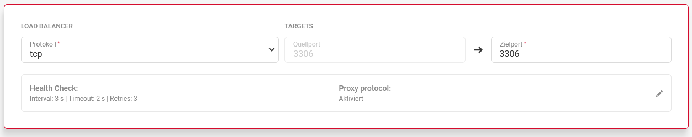
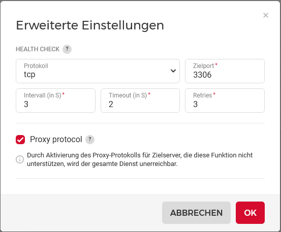

## Introduction

Sometimes it is useful to have a high available MariaDB - with a Galera Cluster. For this Scenario we put the Cluster behind a private Loadbalancer inside the Hetzner Cloud and make the Cluster accessible from other Cloud Servers.


**Prerequisites**

- a LoadBalancer (public IP is disabled)
- 3 Hetzner Cloud Servers (Debian 11) - or more
- a private Network, attached to the LoadBalancer and the MariaDB Nodes

Terminology that we use in the tutorial:

* Domain: `example.com`
* IP addresses (IPv4) and Hostnames:
   * LoadBalancer: `10.1.0.1`
   * MariaDB Node 1: `10.1.0.2` and `db01.example.com`
   * MariaDB Node 2: `10.1.0.3` and `db02.example.com`
   * MariaDB Node 3: `10.1.0.4` and `db03.example.com`


## Step 1 - Prepare Cloud Servers

After ordering a new Cloud Server (CX11) with Standard-OS Debian 11 login to the Shell as root User and do a first update of the Repo-Lists:
```shell
apt update
apt upgrade
```


## Step 2 - Install Software on the DB-Nodes

The MariaDB Project makes it easy to add the MariaDB Repo and Dependencys with a small Shell Script.
```shell
curl -sS https://downloads.mariadb.com/MariaDB/mariadb_repo_setup | sudo bash
```

After the Shell Script has added the MariaDB Repo-Url we could start with the Installation of MariaDB-Server, -Client, Galera4 and some Backup Stuff.
```shell
apt install mariadb-server mariadb-client galera-4 libmariadb3 mariadb-backup -y
```


## Step 3 - Configure MariaDB on the Database Nodes
On each Database-Node you have to do the same configuration.

Edit the File `/etc/mysql/mariadb.conf.d/50-server.cnf` and put the parameter or comment it out:
```shell
[server]
# Proxy Protokoll Parameter is needed for Access via the Loadbalancer to the Database Instances:
proxy-protocol-networks=10.1.0.0/24, localhost  # Be aware to set your own private Subnet if other than here!

# While we do a Health Check from the LoadBalancer our Database Nodes are in mind, that this checks are unauthenticated Connections.
# After 2-3 Days the Limit Counter for Error-Connections is raised and the Cluster is working but don´t accept new Connections from our 
# Web-Servers or Application-Servers because of "Black-Listing".
max_connect_errors    = 4294967295
max_connections       = 100000

# ----------------------- 8< --------------------------
## To allow Connections not only on localhost skip off the bind-address parameter.
## For now we accept Connections on the eth0 Address (10.1.0.x)
# bind-address        = 127.0.0.1
# ----------------------- >8 --------------------------
```


## Step 4 - Configure Galera on the Database Nodes
The easy Way is to clear the cnf File for the Galera and put only the needed informations inside an empty File:
```shell
echo > /etc/mysql/mariadb.conf.d/60-galera.cnf
```

Now edit the File with nano/vim/....
```shell
nano /etc/mysql/mariadb.conf.d/60-galera.cnf
```

Add the Config and put your own Parameters if needed:
```
# Galera related Settings
# Read more about the Parameters at https://mariadb.com/kb/en/galera-cluster/

[galera]
wsrep_provider            = /usr/lib/galera/libgalera_smm.so
wsrep_on                  = ON                                    # Put the Replication on this Node ON.
wsrep_cluster_name        = "MariaDB Galera Cluster"              # a Name for the Cluster
wsrep_cluster_address     = gcomm://10.1.0.2,10.1.0.3,10.1.0.4    # All IP-Addresses of the Database Nodes including my own Address
wsrep_node_address        = 10.1.0.2                              # my own IP-Address on the private Interface
wsrep_node_name           = db01                                  # my Hostname
binlog_format             = row
default_storage_engine    = InnoDB
innodb_autoinc_lock_mode  = 2

# Allow the Server to accept Connections on all Interfaces:
# See removed Parameter on 50-server.cnf!
bind-address              = 0.0.0.0
```
Please have in mind to do this Configuration on ALL Nodes that you would start in the Cluster.


## Step 5.1 - Start the Cluster-Master
Here we have a Difference in starting the first Node and all other Nodes.

To start the first Node and make the Cluster-Master you have to do in a root Shell:
```shell
galera_new_cluster
```

After the first Node have been started you could check the State of the Cluster Master:
```shell
service mariadb status
```


## Step 5.2 - Start the other Cluster-Members
To start all other Members you only have to type:
```shell
service mariadb start
```

When a Cluster the first time has started it is no longer important, that the Master-Node runs in a Master-Mode. 
All new Nodes are asking for Neighboors on the Cluster Nodes listed in the 60-Galera.cnf and get unlisted Nodes back (if you have more than 3 Nodes).
On the Master-Node you could also do a service mariadb restart and it starts as a "Member". 


## Step 6 - Check the Replication-State of the Cluster
To check the State of your Cluster fire the Statement in a mysql cli:
```shell
# mysql SHOW GLOBAL STATUS LIKE 'wsrep_%';
```


## Step 7 - Add Nodes to the Loadbalancer
Now add the Cloud-Servers as Target to your LoadBalancer. 


## Step 8 - Add Target-Services and Health Monitor to the Loadbalancer
After adding the Targets add the Service to your LoadBalancer and create the Health-Check.



Edit the Parameters for Intervall, Timeout and Retries to your needs.



## Step 9 - Try a Connection to Database
After you have finished the LoadBalancer Preparement you could try a connection to the LoadBalancer-IP with a mysql Client from a new Cloud Server that is also added to the private Network or with a Script-File (php, python, ...). 
Your Database Server ist the IP of the Loadbalancer. 
Choose a User/Password that you have granted Rights on a Database.


## Step 10 - Nice to know and Troubleshooting / Known Problems
- Since mentioned in Step 3 the LoadBalancer Health-Check is marked as unauthenticated Connection to the Cluster Nodes the Error Counter could be reached. 
  To solve this it´s possible to create a cronjob with the mariadb-admin command to flush the hosts that banned.
  ```shell
  mariadb-admin flush-hosts
  ```

- If you build up one or more new Servers and the Cluster is up and running, you could put the Node-IPs from the other 3 Servers in the cnf File for Galera. 
  Over the Cluster-Communication Protocol all Neighboors are broadcasted to the new Machines and all are in Replication.

- If you add a new User to MariaDB for Database Access the User is in Replication to the other Nodes. Also Permissions and Password is in Replication. 
  Other Changes in the MySQL Database are not in Sync! Only Users and Permissions.

- A Backup-Concept could looks like: Deploy a new Cloud Server and add it to the private Network, install the MariaDB and Galera Binarys as before but don´t add this Node to the Loadbalancer and only start a mysqldump in any intervall. So your Cluster isn´t under load while we do a dump but also get all Rows a backedup Database.

## Conclusion

Now we have a working Galera Cluster that allows to take offline one or more Nodes the same time and resync after come back. 
All Connections to the Cluster are routed at the LoadBalancer. 

##### License: MIT

<!--

Contributor's Certificate of Origin

By making a contribution to this project, I certify that:

(a) The contribution was created in whole or in part by me and I have
    the right to submit it under the license indicated in the file; or

(b) The contribution is based upon previous work that, to the best of my
    knowledge, is covered under an appropriate license and I have the
    right under that license to submit that work with modifications,
    whether created in whole or in part by me, under the same license
    (unless I am permitted to submit under a different license), as
    indicated in the file; or

(c) The contribution was provided directly to me by some other person
    who certified (a), (b) or (c) and I have not modified it.

(d) I understand and agree that this project and the contribution are
    public and that a record of the contribution (including all personal
    information I submit with it, including my sign-off) is maintained
    indefinitely and may be redistributed consistent with this project
    or the license(s) involved.

Signed-off-by: Thomas Pieger pieger.tom@gmail.com

-->
