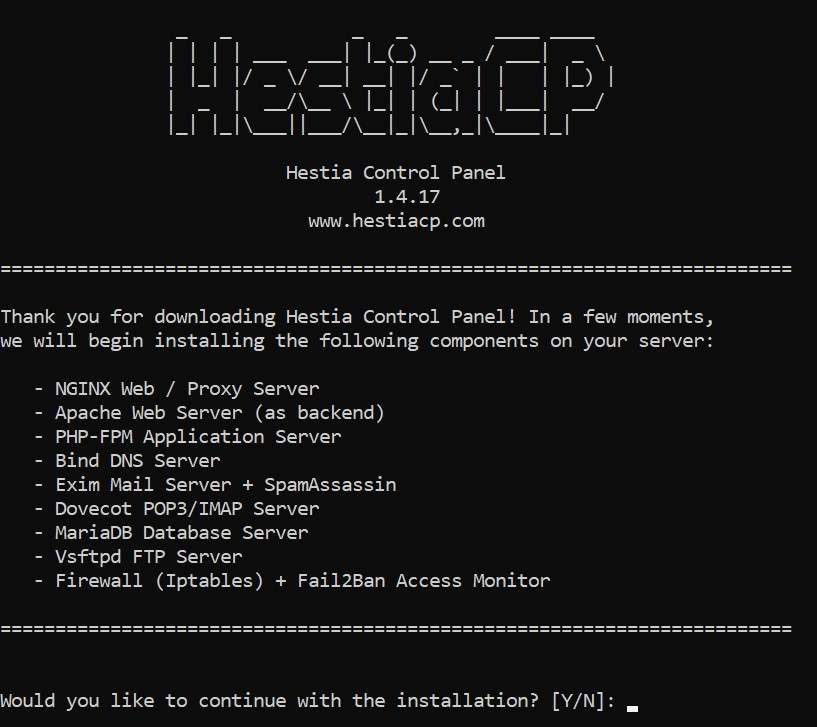
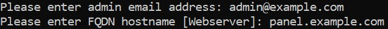
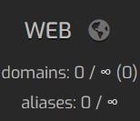
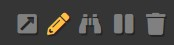

## Introduction

This is a tutorial on how to install [Hestia Control Panel](https://hestiacp.com). It's an easy dashboard to manage all your websites, mail servers and more.
It has many one-click apps to install such as WordPress, making starting a new website easy. You can see a demo [here](https://demo.hestiacp.com:8083/).

**Prerequisites**

* A brand new server with one of the following operating systems:
  * Debian 9
  * Debian 10
  * Debian 11
  * Ubuntu 18.04
  * Ubuntu 20.04
* (Optional, but recommended) A domain name  

## Step 1 - Starting installation

First, you need to get access to the command line of your server by typing `ssh username@hostname`. If you aren't already logged in as root, type `sudo su` and enter your password.

Next, run the following commands:

```bash
wget https://raw.githubusercontent.com/hestiacp/hestiacp/release/install/hst-install.sh
bash hst-install.sh
```

It will install the dependencies, then you should see this screen:



Type 'y' for 'yes', then press enter.

## Step 2 - Installation Steps

Next, it will ask you for the admin email address, and the Fully Qualified Domain Name (FQDN):



The admin email address will be the email you use for the admin account of the panel. You will also get notified of some other things via this address such as SSL Certificate Expiry notifications.

The FQDN is the domain name you will use to access the panel. If you don't have a domain name, enter your server's IP address. If you do have a domain name, create an A record in your domain provider's DNS settings for your domain name, and point it to your server's IP address.

Now, after you've entered these details, sit back and wait for the installation to finish. It's usually pretty quick, but can sometimes take up to 15 minutes or longer.

## Step 3 - Logging into the panel

Congratulations! You've installed the panel. To login, visit panel.example.com:8083 (replacing panel.example.com with the FQDN you entered earlier, or your IP address).

Login with the credentials printed in the console.

## Step 4 - Creating a website (Optional)

To make a new website, log on to your panel and click the 'Web' tab at the top:



Now, click on the Add Web Domain. If it warns you about creating websites on an admin account, it is safe to ignore. Now, enter the domain name (make sure there is an A record in your DNS settings with this domain pointing to your webserver).

Hover over your new domain and press the pencil to edit it.



Here, we can change some settings. To ensure that your website is found when someone visits the address, check Enable Domain Redirection. You can select if you want to redirect users to www.example.com, just example.com or another address. The third option would be used if you wanted to redirect someone from, perhaps, shortcut.example.com to example.com/... so the URL is easier to type. You will need to select one of these options so that people can visit your website.

If you want to enable SSL (HTTPS) on your website, check Enable SSL and ensure Enable automatic HTTPS Redirection is also checked.

### Step 4.1 - Installing external applications (e.g. WordPress)

If you wanted to install WordPress, or some other external application, on your domain, go to your domain and click the pencil to edit it.


Next, in the top right, click 'Quick Install App'. Now, you can select the app you want to install.

Now, enter all the required details to setup your app. This will differ between apps.

Now, your app should be installed. You can configure it how you like.

## Conclusion

Congratulations! You've installed Hestia and, if you followed steps 4 and 4.1, you learned how to create a website and install external applications. There are many other things you can do with the panel. If you have any trouble installing the panel, you can ask a question in their [Forum](https://forum.hestiacp.com/) or their [Discord server](https://discord.gg/SmVuXXK8Qs)

##### License: MIT

<!--

Contributor's Certificate of Origin

By making a contribution to this project, I certify that:

(a) The contribution was created in whole or in part by me and I have
    the right to submit it under the license indicated in the file; or

(b) The contribution is based upon previous work that, to the best of my
    knowledge, is covered under an appropriate license and I have the
    right under that license to submit that work with modifications,
    whether created in whole or in part by me, under the same license
    (unless I am permitted to submit under a different license), as
    indicated in the file; or

(c) The contribution was provided directly to me by some other person
    who certified (a), (b) or (c) and I have not modified it.

(d) I understand and agree that this project and the contribution are
    public and that a record of the contribution (including all personal
    information I submit with it, including my sign-off) is maintained
    indefinitely and may be redistributed consistent with this project
    or the license(s) involved.

Signed-off-by: UppishBuzzard87 <business@uppishbuzzard87.ga>

-->
