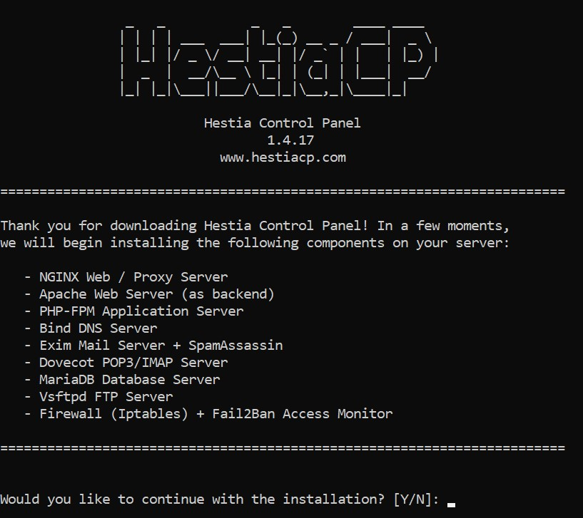
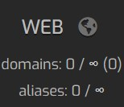
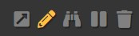

## Введение

Это туториал об установке [панели управления Hestia](https://hestiacp.com). Это простая панель управления для управления всеми вашими веб-сайтами, почтовыми серверами и многим другим.
В нем есть множество приложений для установки в один клик, таких как WordPress, что упрощает запуск нового веб-сайта. Вы можете посмотреть демо-версию [здесь](https://demo.hestiacp.com:8083/).

**Требования к установке**

* Новый сервер с одной из следующих операционных систем:
  * Debian 9
  * Debian 10
  * Debian 11
  * Ubuntu 18.04
  * Ubuntu 20.04
* (Не обязательно, но рекомендовано) Доменное имя

## Шаг 1 - Начало установки

Первое что вам нужно так это доступ к командной строке вашего сервера с помощью команды `ssh username@hostname`. Если еще не вошли в систему как root, введите `sudo su` и введите ваш пароль.

Далее, введите следующие команды:

```bash
wget https://raw.githubusercontent.com/hestiacp/hestiacp/release/install/hst-install.sh
bash hst-install.sh
```

Он установит зависимости, после чего вы должны увидеть этот экран:



Введите "y" для "yes", затем нажмите enter.

## Шаг 2 - Установочные шаги

Далее, вас попросят ввести почтовый адрес для администратора и ввести Fully Qualified Domain Name (FQDN):


Адрес электронной почты администратора - это адрес электронной почты, который вы используете для учетной записи администратора панели. Вы также будете получать уведомления о некоторых других вещах по этому адресу, таких как уведомления об истечении срока действия SSL-сертификата.

Fully Qualified Domain Name - это доменное имя, которое вы будете использовать для доступа к панели. Если у вас нет доменного имени, введите IP-адрес вашего сервера. Если у вас есть доменное имя, создайте запись A в настройках DNS вашего провайдера домена для вашего доменного имени и укажите ее на IP-адрес вашего сервера.

Теперь, после того как вы ввели эти данные, сядьте поудобнее и дождитесь завершения установки. Обычно это происходит довольно быстро, но иногда может занять до 15 минут или дольше.

## Шаг 3 - Вход в панель

Поздравляю! Вы установили панель. Чтобы войти в систему, посетите cpanel.example.com:8083 (замена panel.example.com с полным доменным именем, которое вы ввели ранее, или вашим IP-адресом).

Войдите в систему, используя учетные данные, напечатанные в консоли.

## Шаг 4 - Создание сайта (опционально)

Чтобы создать новый веб-сайт, войдите в свою панель управления и перейдите на вкладку 'Web' вверху:



Теперь нажмите на кнопку 'Add Web Domain'. Если он предупреждает вас о создании веб-сайтов с учетной записью администратора, его можно смело игнорировать. Теперь введите доменное имя (убедитесь, что в настройках вашего DNS есть запись A, в которой этот домен указывает на ваш веб-сервер).

Наведите курсор на ваш новый домен и нажмите карандаш, чтобы отредактировать его.



Тут, мы можем изменить настройки. Чтобы убедиться, что ваш веб-сайт будет найден, когда кто-то посетит адрес, установите флажок 'Enable Domain Redirection'. Вы можете выбрать, хотите ли вы перенаправлять пользователей на www.example.com , просто example.com или по другому адресу. Третий вариант был бы использован, если бы вы хотели перенаправить кого-то, возможно, из shortcut.example.com чтобы example.com /... таким образом, URL-адрес легче вводить. Вам нужно будет выбрать один из этих вариантов, чтобы люди могли посещать ваш веб-сайт.

Если вы хотите использовать SSL (HTTPS) на вашем сайте, включите 'Enable SSL' и также убедитесь что 'Enable automatic HTTPS Redirection' включен.

### Шаг 4.1 - Установка дополнительных приложений (к примеру WordPress)

Если вы хотите установить WordPress или другое дополнительное приложение на ваш домен, перейдите к своему домену и нажмите на карандаш, чтобы отредактировать его.


Далее, в правом верхнем углу, нажмите 'Quick Install App'. Теперь вы можете выбрать приложение, которое хотите установить.

Теперь введите все необходимые данные для настройки вашего приложения. Это будет отличаться в разных приложениях.

Теперь ваше приложение должно быть установлено. Вы можете настроить его так, как вам нравится.

## Вывод

Поздравляю! Вы установили Hestia и, выполнив шаги 4 и 4.1, узнали, как создать веб-сайт и установить дополнительные приложения. Есть много других вещей, которые вы можете сделать с помощью панели. Если у вас возникли какие-либо проблемы с установкой панели, вы можете задать вопрос на их [форуме](https://forum.hestiacp.com/) или их [сервер Discord](https://discord.gg/SmVuXXK8Qs)

##### License: MIT

<!--

Contributor's Certificate of Origin

By making a contribution to this project, I certify that:

(a) The contribution was created in whole or in part by me and I have
    the right to submit it under the license indicated in the file; or

(b) The contribution is based upon previous work that, to the best of my
    knowledge, is covered under an appropriate license and I have the
    right under that license to submit that work with modifications,
    whether created in whole or in part by me, under the same license
    (unless I am permitted to submit under a different license), as
    indicated in the file; or

(c) The contribution was provided directly to me by some other person
    who certified (a), (b) or (c) and I have not modified it.

(d) I understand and agree that this project and the contribution are
    public and that a record of the contribution (including all personal
    information I submit with it, including my sign-off) is maintained
    indefinitely and may be redistributed consistent with this project
    or the license(s) involved.

Signed-off-by: UppishBuzzard87 <business@uppishbuzzard87.ga>

-->
