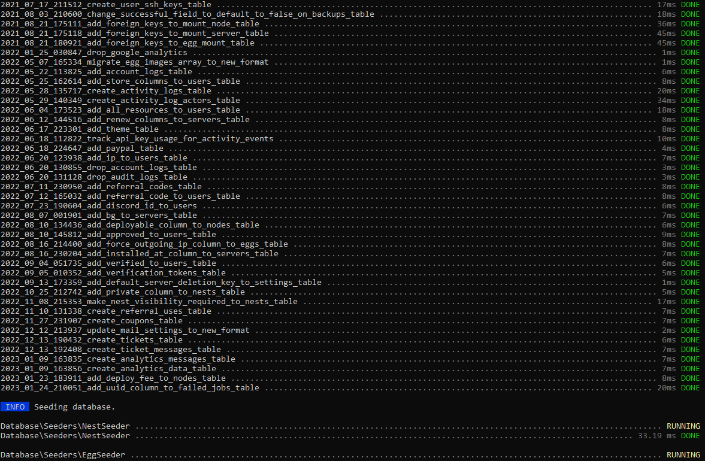

## Introduction

This tutorial will teach you how to install the Jexactyl Panel using the official installation steps.
**WARNING: Currently, there is no official way to uninstall it completely without wiping your server.**

**Disclaimer 1: I do not own this game panel nor do I take resposibility for any damage done to your system. I recommend you take a backup of your server.**

**Disclaimer 2: This tutorial is for installing only the panel!**

**Prerequisites**

* Root access to a server with one of the following operating systems: Ubuntu 18.04/20.04/22.04, CentOS 7/8 or Debian 10/11 (I will be using Ubuntu 22.04)
   * You cannot have had Pterodactyl/Jexactyl or anything related to it installed to this system before.

## Step 1 - Installing the panel

SSH into your server and make sure you are logged in as root. If you aren't, type `sudo su` and enter your root password. Now, the following commands will setup the dependencies of Jexactyl on your server, they are very similar to Pterodactyl. **These may vary per operating system!**

```bash
apt -y install software-properties-common curl apt-transport-https ca-certificates gnupg

LC_ALL=C.UTF-8 add-apt-repository -y ppa:ondrej/php
add-apt-repository ppa:redislabs/redis -y

# The command below is not needed if you are using Ubuntu 22.04 or higher.
curl -sS https://downloads.mariadb.com/MariaDB/mariadb_repo_setup | sudo bash

apt update
apt -y install php8.1 php8.1-{cli,gd,mysql,pdo,mbstring,tokenizer,bcmath,xml,fpm,curl,zip} mariadb-server nginx tar unzip git redis-server
curl -sS https://getcomposer.org/installer | sudo php -- --install-dir=/usr/local/bin --filename=composer
```

### Step 1.1 - Downloading the files

You will have to create the required directories which can be done like this:

```bash
mkdir -p /var/www/jexactyl
cd /var/www/jexactyl
```

Now, you can download and extract the files using the following commands:

```bash
curl -Lo panel.tar.gz https://github.com/jexactyl/jexactyl/releases/latest/download/panel.tar.gz
tar -xzvf panel.tar.gz
chmod -R 755 storage/* bootstrap/cache/
```

### Step 1.2 - Setting up the database

Next, you will have to configure the database, which will most likely be MariaDB. You can do so by running the following commands. **Replace "yourPassword" with a secure password!**

```bash
# Login to MySQL/MariaDB
mysql -u root -p

# Remember to change 'yourPassword' below to be a unique password
CREATE USER 'jexactyl'@'127.0.0.1' IDENTIFIED BY 'yourPassword';
CREATE DATABASE panel;
GRANT ALL PRIVILEGES ON panel.* TO 'jexactyl'@'127.0.0.1' WITH GRANT OPTION;
exit
```

Make sure you note down the password as you will need it for later parts!

### Step 1.3 - Environment setup

Next, you will have to configure basic settings such as creating the first user.

To start off, you have to copy the example file using the following command:
```bash
cp .env.example .env
```

Now, you have to setup the `Composer` dependencies, you can do so by running the following command:
```bash
composer install --no-dev --optimize-autoloader
```



You now have to generate the encryption key. If you lose it, you will not be able to access the Panel data anymore, be careful. You can generate it using:
```
php artisan key:generate --force
```

### Step 1.4 - Panel setup and user creation

Next, you have to setup the database on the panel. You can also optionally setup the email service if you have a custom service that is not PHP.
```
php artisan p:environment:setup
php artisan p:environment:database
php artisan p:environment:mail # Not required to run the Panel.
```

You now have to migrate the database as this will apply all required patches.
```
php artisan migrate --seed --force
```

Creating the first user is easy, you can do so by running the following command and responding to the questions:
```bash
php artisan p:user:make
```

You have to give your webserver permission to access the directory, copy one of these depending on your operating system.
```bash
# If using NGINX or Apache (not on CentOS):
chown -R www-data:www-data /var/www/jexactyl/*

# If using NGINX on CentOS:
chown -R nginx:nginx /var/www/jexactyl/*

# If using Apache on CentOS:
chown -R apache:apache /var/www/jexactyl/*
```

### Step 1.5 - System Queue Worker

In this step, you will have to setup the queue worker which handles background tasks.
Create the file `jexactyl.service` in `/etc/systemd/system` with the following content:
```bash
# Jexactyl Queue Worker File
# ----------------------------------

[Unit]
Description=Jexactyl Queue Worker

[Service]
User=www-data
Group=www-data
Restart=always
ExecStart=/usr/bin/php /var/www/jexactyl/artisan queue:work --queue=high,standard,low --sleep=3 --tries=3
StartLimitInterval=180
StartLimitBurst=30
RestartSec=5s

[Install]
WantedBy=multi-user.target
```

## Step 2 - Setting up the webserver
In this tutorial, I will be using the NGINX web server with SSL. First you will have to download certbot and it's NGINX plugin. You can do so using the following commands:
```bash
apt install -y certbot python3-certbot-nginx
```

Once it is downloaded, run the following command (Replace the domain with your own!):
```bash
certbot certonly --standalone -d domain.com
```

Next, you will have to install NGINX and remove the default config so it can be replaced with the new one. First you can delete the default config using this command:
```bash
rm /etc/nginx/sites-available/default; rm /etc/nginx/sites-enabled/default
```

Now, create the following file, `/etc/nginx/sites-available/panel.conf` and add the following content (Replace `<domain>` with your own!):
```
server {
    listen 80;
    server_name <domain>;
    return 301 https://$server_name$request_uri;
}

server {
    listen 443 ssl http2;
    server_name <domain>;

    root /var/www/jexactyl/public;
    index index.php;

    access_log /var/log/nginx/jexactyl.app-access.log;
    error_log  /var/log/nginx/jexactyl.app-error.log error;

    # allow larger file uploads and longer script runtimes
    client_max_body_size 100m;
    client_body_timeout 120s;

    sendfile off;

    # SSL Configuration
    ssl_certificate /etc/letsencrypt/live/<domain>/fullchain.pem;
    ssl_certificate_key /etc/letsencrypt/live/<domain>/privkey.pem;
    ssl_session_cache shared:SSL:10m;
    ssl_protocols TLSv1.2 TLSv1.3;
    ssl_ciphers "ECDHE-ECDSA-AES128-GCM-SHA256:ECDHE-RSA-AES128-GCM-SHA256:ECDHE-ECDSA-AES256-GCM-SHA384:ECDHE-RSA-AES256-GCM-SHA384:ECDHE-ECDSA-CHACHA20-POLY1305:ECDHE-RSA-CHACHA20-POLY1305:DHE-RSA-AES128-GCM-SHA256:DHE-RSA-AES256-GCM-SHA384";
    ssl_prefer_server_ciphers on;

    add_header X-Content-Type-Options nosniff;
    add_header X-XSS-Protection "1; mode=block";
    add_header X-Robots-Tag none;
    add_header Content-Security-Policy "frame-ancestors 'self'";
    add_header X-Frame-Options DENY;
    add_header Referrer-Policy same-origin;

    location / {
        try_files $uri $uri/ /index.php?$query_string;
    }

    location ~ \.php$ {
        fastcgi_split_path_info ^(.+\.php)(/.+)$;
        fastcgi_pass unix:/run/php/php8.1-fpm.sock;
        fastcgi_index index.php;
        include fastcgi_params;
        fastcgi_param PHP_VALUE "upload_max_filesize = 100M \n post_max_size=100M";
        fastcgi_param SCRIPT_FILENAME $document_root$fastcgi_script_name;
        fastcgi_param HTTP_PROXY "";
        fastcgi_intercept_errors off;
        fastcgi_buffer_size 16k;
        fastcgi_buffers 4 16k;
        fastcgi_connect_timeout 300;
        fastcgi_send_timeout 300;
        fastcgi_read_timeout 300;
        include /etc/nginx/fastcgi_params;
    }

    location ~ /\.ht {
        deny all;
    }
}
```

Create a link and restart NGINX using the following commands:
```bash
ln -s /etc/nginx/sites-available/panel.conf /etc/nginx/sites-enabled/panel.conf
systemctl restart nginx
```

## Step 3 - Login

You can now go to your domain and login!

## Conclusion

Good job, you've successfully installed the panel!


If you have any issues with the panel, join the [panel's discord server](https://discord.gg/qttGR4Z5Pk).

##### License: MIT

<!--

Contributor's Certificate of Origin

By making a contribution to this project, I certify that:

(a) The contribution was created in whole or in part by me and I have
    the right to submit it under the license indicated in the file; or

(b) The contribution is based upon previous work that, to the best of my
    knowledge, is covered under an appropriate license and I have the
    right under that license to submit that work with modifications,
    whether created in whole or in part by me, under the same license
    (unless I am permitted to submit under a different license), as
    indicated in the file; or

(c) The contribution was provided directly to me by some other person
    who certified (a), (b) or (c) and I have not modified it.

(d) I understand and agree that this project and the contribution are
    public and that a record of the contribution (including all personal
    information I submit with it, including my sign-off) is maintained
    indefinitely and may be redistributed consistent with this project
    or the license(s) involved.

Signed-off-by: Ssmidge (adrian.trifonov@gmail.com)

-->