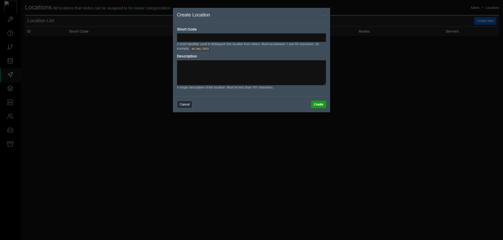

## Introduction

This tutorial will teach you how to install the Jexactyl Panel using the official installation steps.
**WARNING: Currently, there is no official way to uninstall it completely without wiping your server.**

**Disclaimer 1: I do not own this game panel nor do I take resposibility for any damage done to your system. I recommend you take a backup of your server.**

**Disclaimer 2: This tutorial is for installing only the panel!**

**Prerequisites**

* Root access to a server with one of the following operating systems: Ubuntu 18.04/20.04/22.04, CentOS 7/8 or Debian 11/12 (I will be using Ubuntu 22.04)
   * You cannot have had Pterodactyl/Jexactyl or anything related to it installed to this system before.

## Step 1 - Installing the panel

SSH into your server and make sure you are logged in as root. If you aren't, type `sudo su` and enter your root password. Now, the following commands will setup the dependencies of Jexactyl on your server, they are very similar to Pterodactyl. **These will be completely different if you are using a different OS or version**

These commands install the Redis and MariaDB repositories, then php version 8.1, the required extensions for it and finally, NGINX (Engine-X!!) as the web server.

```bash
apt -y install software-properties-common curl apt-transport-https ca-certificates gnupg

LC_ALL=C.UTF-8 add-apt-repository -y ppa:ondrej/php
add-apt-repository ppa:redislabs/redis -y

# The command below is not needed if you are using Ubuntu 22.04 or higher.
curl -sS https://downloads.mariadb.com/MariaDB/mariadb_repo_setup | sudo bash

apt update
apt -y install php8.1 php8.1-{cli,gd,mysql,pdo,mbstring,tokenizer,bcmath,xml,fpm,curl,zip} mariadb-server nginx tar unzip git redis-server
curl -sS https://getcomposer.org/installer | sudo php -- --install-dir=/usr/local/bin --filename=composer
```

### Step 1.1 - Downloading the files

You will have to create the required directory and enter it to install and extract the panel:

```bash
mkdir -p /var/www/jexactyl
cd /var/www/jexactyl
```

Now, you can download and extract the files using the following commands:

```bash
curl -Lo panel.tar.gz https://github.com/jexactyl/jexactyl/releases/latest/download/panel.tar.gz
tar -xzvf panel.tar.gz
chmod -R 755 storage/* bootstrap/cache/
```

### Step 1.2 - Setting up the database

Next, you will have to configure the database, which will most likely be MariaDB. You can do so by running the following commands. **Replace "yourPassword" with a secure password!**

These commands will only allow the `jexactyl` user to be accessed by localhost, aka the current server. You can also rename `panel` to something like `gamepanel`, `jexactyl`, anything! Just make sure to change it in the configuration earlier and in the GRANT command as it's very important.

```bash
# Login to MySQL/MariaDB
mariadb -u root -p

# Remember to change 'yourPassword' below to be a unique password
CREATE USER 'jexactyl'@'127.0.0.1' IDENTIFIED BY 'yourPassword';
CREATE DATABASE panel;
GRANT ALL PRIVILEGES ON panel.* TO 'jexactyl'@'127.0.0.1' WITH GRANT OPTION;
exit
```

Make sure you note down the password as you will need it for later parts!

### Step 1.3 - Environment setup

Next, you will have to configure basic settings such as creating the first user.

The .env.example file contains the skeleton of the configuration, mainly just empty values, we'll fill them later.

To start off, you have to copy the example configuration file using the following command:
```bash
cp .env.example .env
```

Now, you have to setup the `Composer` dependencies, you can do so by running the following command:
Composer is a dependency manager for PHP, it's used a lot for Laravel applications, which Jexactyl, Pterodactyl and the new Pelican panel are built in.
```bash
composer install --no-dev --optimize-autoloader
```


You now have to generate the encryption key. **If you lose it, you will not be able to access the Panel data anymore, be careful!** You can generate it using:
```
php artisan key:generate --force
```

### Step 1.4 - Panel setup and user creation

Next, you have to setup the database on the panel. You can also optionally setup the email service if you have a custom service that is not PHP.
```
php artisan p:environment:setup
php artisan p:environment:database
php artisan p:environment:mail # Not required to run the Panel.
```

**For the database one:**
If you changed the database name/username when you were creating the username and database in MySQL, you will need to enter it here!

You now have to migrate the database as this will apply all required patches.
These patches will also add the default Game Eggs, such as Minecraft, Rust, etc.
```
php artisan migrate --seed --force
```

Creating the first user is easy, you can do so by running the following command and responding to the questions:
Make sure you set admin as `yes`, the default is `no`, however you will need to be able to login and create other users somehow!
```bash
php artisan p:user:make
```

You have to give your webserver permission to access the directory, copy one of these depending on your operating system.
Since this guide only covers Ubuntu LTS 22.04, this is the command for Apache or NGINX. If you're using CentOS, the user will either be `nginx` or `apache`.
```bash
chown -R www-data:www-data /var/www/jexactyl/*
```

### Step 1.5 - System Queue Worker

In this step, you will have to setup the queue worker which handles background tasks.
It also handle scheduling, such as running commands in a game server, or having a restart schedule. 
Maybe even a Rust Wipe script!

The service will be placed in `/etc/systemd/system` as it's the folder for services created by the user.

Create the file `jexactyl.service` in `/etc/systemd/system` with the following content:
```bash
# Jexactyl Queue Worker File
# ----------------------------------

[Unit]
Description=Jexactyl Queue Worker

[Service]
User=www-data
Group=www-data
Restart=always
ExecStart=/usr/bin/php /var/www/jexactyl/artisan queue:work --queue=high,standard,low --sleep=3 --tries=3
StartLimitInterval=180
StartLimitBurst=30
RestartSec=5s

[Install]
WantedBy=multi-user.target
```

To ensure it starts on boot and to start it right now, you can use `systemctl enable jexactyl --now`. `--now` Makes sure it gets started too.

## Step 2 - Setting up the webserver
In this tutorial, I will be using the NGINX web server with SSL. First you will have to download certbot and it's NGINX plugin. You can do so using the following commands:
Certbot uses LetsEncrypt SSL, which is a free Certificate Authority as TLS certificates a quite pricy normally!

```bash
apt install -y certbot python3-certbot-nginx
```

Once it is downloaded, run the following command (Replace the domain with your own!):
We'll use `certonly --standalone` as our configuration has it's own SSL parameters which would be deleted if we used the NGINX without SSL configuration and then had Certbot add the SSL server directive.
```bash
certbot certonly --standalone -d domain.com
```

Next, you will have to install NGINX and remove the default config so it can be replaced with the new one. First you can delete the default config using this command:
```bash
rm /etc/nginx/sites-available/default; rm /etc/nginx/sites-enabled/default
```

Now, create the following file, `/etc/nginx/sites-available/panel.conf` and add the following content (Replace `<domain>` with your own!):

The guide would be too long to explain every directive in the NGINX configuration, so you can refer to the [nginx documentation](https://nginx.org/en/docs/) for more information.
```
server {
    listen 80;
    server_name <domain>;
    return 301 https://$server_name$request_uri;
}

server {
    listen 443 ssl http2;
    server_name <domain>;

    root /var/www/jexactyl/public;
    index index.php;

    access_log /var/log/nginx/jexactyl.app-access.log;
    error_log  /var/log/nginx/jexactyl.app-error.log error;

    # allow larger file uploads and longer script runtimes
    client_max_body_size 100m;
    client_body_timeout 120s;

    sendfile off;

    # SSL Configuration
    ssl_certificate /etc/letsencrypt/live/<domain>/fullchain.pem;
    ssl_certificate_key /etc/letsencrypt/live/<domain>/privkey.pem;
    ssl_session_cache shared:SSL:10m;
    ssl_protocols TLSv1.2 TLSv1.3;
    ssl_ciphers "ECDHE-ECDSA-AES128-GCM-SHA256:ECDHE-RSA-AES128-GCM-SHA256:ECDHE-ECDSA-AES256-GCM-SHA384:ECDHE-RSA-AES256-GCM-SHA384:ECDHE-ECDSA-CHACHA20-POLY1305:ECDHE-RSA-CHACHA20-POLY1305:DHE-RSA-AES128-GCM-SHA256:DHE-RSA-AES256-GCM-SHA384";
    ssl_prefer_server_ciphers on;

    add_header X-Content-Type-Options nosniff;
    add_header X-XSS-Protection "1; mode=block";
    add_header X-Robots-Tag none;
    add_header Content-Security-Policy "frame-ancestors 'self'";
    add_header X-Frame-Options DENY;
    add_header Referrer-Policy same-origin;

    location / {
        try_files $uri $uri/ /index.php?$query_string;
    }

    location ~ \.php$ {
        fastcgi_split_path_info ^(.+\.php)(/.+)$;
        fastcgi_pass unix:/run/php/php8.1-fpm.sock;
        fastcgi_index index.php;
        include fastcgi_params;
        fastcgi_param PHP_VALUE "upload_max_filesize = 100M \n post_max_size=100M";
        fastcgi_param SCRIPT_FILENAME $document_root$fastcgi_script_name;
        fastcgi_param HTTP_PROXY "";
        fastcgi_intercept_errors off;
        fastcgi_buffer_size 16k;
        fastcgi_buffers 4 16k;
        fastcgi_connect_timeout 300;
        fastcgi_send_timeout 300;
        fastcgi_read_timeout 300;
        include /etc/nginx/fastcgi_params;
    }

    location ~ /\.ht {
        deny all;
    }
}
```

Create a link and restart NGINX using the following commands:
```bash
ln -s /etc/nginx/sites-available/panel.conf /etc/nginx/sites-enabled/panel.conf
systemctl restart nginx
```

## Step 3 - Login

You can now go to your domain and login!

## Step 4 - Setting up a node

This installation will be on the same machine as the node, however this may not be what you always want, so make sure you run the commands on the right machine!

## Step 4.1 - Creating the location

Click on the icon that looks like an arrow, it should be named `Locations`, on the top right, there's a `Create New` button, click it and it should look like this:



Enter a short code, I usually go for the ISO 3166-1 alpha-2 (2 letter country code) name, then the state/province (if applicable), then three letters from the city (HEL for Helsinki, ASH for Ashburn, etc).

The description can and probably should be the full location name, to avoid issues!


## Step 4.2 - Creating the node

Once it's created, head over to the `Nodes` tab, directly under the Locations. Then click `Create New`. Don't get intimidated! I will cover every part of the node creation!


For the name, I usually use the location and then a number, like 01, 10, 20, etc.
The description can be anything but I recommend having the specifications of the server inside.
The FQDN can be a new subdomain, or the same one as the panel, it must be a domain, though.

If you followed the first part of the guide, you should be restricted to SSL connections only, which is what I recommend for a proper experience!

In the right part, you need to set the memory and disk space of your server, if you want to assign more ram and storage than you have, you can add an Overallocation percentage. The ports can be changed but you need to make sure that they're open in the firewall!

## Step 4.3 - Adding ports

After creating the node, you need to add ports. For the IP address, just set it to the node's IP, the IP Alias should be the subdomain, but you can set it to anything, some people set it to `private` to try to hide the IP, however you can always just find the IP in the `Network` tab of the server.

Ports can be entered in ranges, like 25565-25585, or singular ports such as `25565,25577,25599`. I usually just add 25565-25585 to start off, then go up by 10-20.


## Step 4.4 - Downloading and creating

Once the ports are added, go into the configuration tab at the top and click `Generate token`. Keep the command safe for now.


As of the creation of this guide, Jexactyl uses the Pterodactyl Wings daemon, so we can just use these commands to install it:

```bash
# Install docker so that we can create the containers for each server
curl -sSL https://get.docker.com/ | CHANNEL=stable bash
# Enable it on boot so that we don't need to do anything to it
sudo systemctl enable --now docker
# Create the directory, download the file and mark it as executable
sudo mkdir -p /etc/jexactyl
curl -L -o /usr/local/bin/wings "https://github.com/pterodactyl/wings/releases/latest/download/wings_linux_$([[ "$(uname -m)" == "x86_64" ]] && echo "amd64" || echo "arm64")"
sudo chmod u+x /usr/local/bin/wings
```

Then run the command you saved earlier, you should get this at the end of the output:
```
Successfully configured wings.
```

## Step 4.5 - Creating the service

To be able to run it on startup, we need to create a service, like the jexactyl one.

Create a file in `/etc/systemd/system/` named `wings.service`.

Enter the following content in it:

```
[Unit]
Description=Pterodactyl Wings Daemon
After=docker.service
Requires=docker.service
PartOf=docker.service

[Service]
User=root
WorkingDirectory=/etc/pterodactyl
LimitNOFILE=4096
PIDFile=/var/run/wings/daemon.pid
ExecStart=/usr/local/bin/wings
Restart=on-failure
StartLimitInterval=180
StartLimitBurst=30
RestartSec=5s

[Install]
WantedBy=multi-user.target
```

Then run `systemctl enable --now wings`, to run it on startup

You should see a green heart beating on the left side of the name, if you don't, you should check the JavaScript console and the Network tab to see what's causing the issue.


## Conclusion

Good job, you've successfully installed the panel and setup a node on the same server!
You can now create servers!


If you have any issues with the panel, join the [panel's discord server](https://discord.gg/qttGR4Z5Pk).

##### License: MIT

<!--

Contributor's Certificate of Origin

By making a contribution to this project, I certify that:

(a) The contribution was created in whole or in part by me and I have
    the right to submit it under the license indicated in the file; or

(b) The contribution is based upon previous work that, to the best of my
    knowledge, is covered under an appropriate license and I have the
    right under that license to submit that work with modifications,
    whether created in whole or in part by me, under the same license
    (unless I am permitted to submit under a different license), as
    indicated in the file; or

(c) The contribution was provided directly to me by some other person
    who certified (a), (b) or (c) and I have not modified it.

(d) I understand and agree that this project and the contribution are
    public and that a record of the contribution (including all personal
    information I submit with it, including my sign-off) is maintained
    indefinitely and may be redistributed consistent with this project
    or the license(s) involved.

Signed-off-by: Ssmidge (adrian.trifonov@gmail.com)

-->
