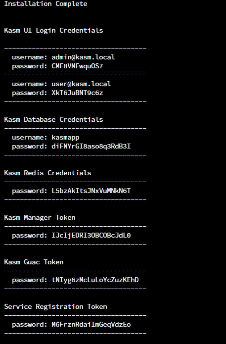
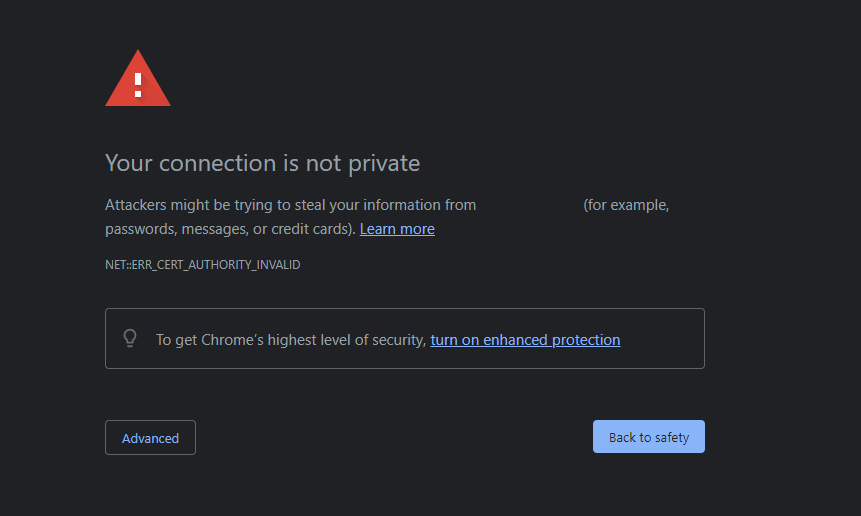

## Introduction

This tutorial will show you how to install [Kasm Workspaces](https://kasmweb.com/) with the official install script and how to set up SSL with Let’s Encrypt. I recommend you to install this on a clean, freshly installed server to avoid any problems.

> **Disclaimers:** I do not own Kasm Workspaces or this script, I don't take any responsibility for anything that happens to your server. Taking a backup is recommended, or just using a fresh system. This script is subject to change in the future by the Kasm Workspaces team, I will attempt to keep this up-to-date with the current changes.

**Prerequisites**

* Root access to a server running Ubuntu 18.04, 20.04, 22,04 or Debian 9, 10, or 11. You can use virtual machines with Arm64 architecture or x86 architecture. There are other supported operating systems, but I will be using Ubuntu 22.04 in this tutorial.
  * You need port 80 and 443 open. Using a reverse proxy is possible but not recommended.
* A CX21, CAX11, CCX12, or higher Hetzner Cloud server.
  * Any of Hetzner's dedicated servers should also work.
* If you want to add your own SSL certificates to replace self-signed:
  * You need a domain with record access.
  * The domain must be pointed to your server before starting the tutorial.

## Step 1 - Downloading and installing Kasm

SSH into your server and make sure you are the root user. If you are not, run `sudo -s`. Once you are the root user, run this command:

```bash
cd /tmp && curl -O https://kasm-static-content.s3.amazonaws.com/kasm_release_1.13.1.421524.tar.gz && tar -xf kasm_release_1.13.1.421524.tar.gz && bash kasm_release/install.sh
```

### Agreeing to the EULA

You should see the EULA appear on your screen, something like this:

```text
End User License Agreement
__________________________


KASM WORKSPACES END USER LICENSE AGREEMENT

BY DOWNLOADING, INSTALLING, OR USING THE SOFTWARE, YOU AGREE TO THE TERMS OF
THIS END USER LICENSE AGREEMENT (“EULA”). IF YOU DO NOT AGREE TO THESE TERMS, YOU
MUST NOT DOWNLOAD, INSTALL, OR USE THE SOFTWARE, AND YOU MUST DELETE THE
SOFTWARE AND REQUEST A REFUND OF THE LICENSE FEE.

{...}

I have read and accept End User License Agreement (y/n)? y
```

Read through it and type "y". Then, press enter to agree. If you don't agree, please exit this guide. Kasm will begin to install.

## Step 2 - Testing it out!

You are pretty much done! Within your terminal, you should see something like this:



Copy the "Admin Kasm UI Login Credentials" and head to your server's IP in your browser with HTTPS. To do this, take your server IP and add `https://` to the start, like `https://10.0.0.1` or `https://<server-ip>`, for example. After that, you should see a screen like this:



Press "Advanced", then "Proceed to `<server-ip>` (unsafe)". It is said to be unsafe due to the self-signed SSL certificates but in-reality they are okay. Take the credentials provided in the terminal and log-in. Once you are logged in, head to the "Workspaces" tab and you're done! You can get to using your Kasm Workspaces instance.

## Step 3 - Setting up SSL with Let’s Encrypt (Optional)

After you've setup your Kasm Workspaces instance, you may want to remove the pesky unsafe warning to make it easier to use. It's easy! Here's how.

First off, you need to turn off Kasm so you can insert the SSL certificates. You could do that with this command:

```bash
/opt/kasm/bin/stop
```

Once you're done with that, install Let’s Encrypt and head into the Kasm SSL certificate directory with this set of commands:

```bash
apt -y install letsencrypt && cd /opt/kasm/current/certs
```

Once Let’s Encrypt is installed, you need to create your SSL certificates. You could do that with this command:

```bash
certbot certonly --standalone --agree-tos --preferred-challenges http -d example.com
```

Make sure to replace `example.com` with your domain name that's pointed to your server. You should be asked for your email address, provide it. If you'd like to have your email shared, type "y". If not, type "n". Once your SSL certificates are created, make sure to backup your self-signed certificates in case anything goes wrong. In the current directory `/opt/kasm/current/certs`, you can do that with:

```bash
mv kasm_nginx.crt kasm_nginx.crt.bk && mv kasm_nginx.key kasm_nginx.key.bk
```

Now, you need to setup symlinks so you can renew your SSL certificates without having to replace them. Still in the directory `/opt/kasm/current/certs`, run these commands:

```bash
ln -s /etc/letsencrypt/live/example.com/privkey.pem kasm_nginx.key
ln -s /etc/letsencrypt/live/example.com/fullchain.pem kasm_nginx.crt
```

Make sure to replace `example.com` with your domain name from earlier. Now, the last step, start Kasm back up! Run:

```bash
/opt/kasm/bin/start
```

Once you're done with that, you should be able to visit your domain and have SSL!

## Conclusion

Well done, you now have a usable install of Kasm Workspaces!

If you have any issues, you could reach out on the [KasmWeb subreddit](https://reddit.com/r/kasmweb). It's a good place to get help with this.

##### License: MIT

<!--

Contributor's Certificate of Origin

By making a contribution to this project, I certify that:

(a) The contribution was created in whole or in part by me and I have
    the right to submit it under the license indicated in the file; or

(b) The contribution is based upon previous work that, to the best of my
    knowledge, is covered under an appropriate license and I have the
    right under that license to submit that work with modifications,
    whether created in whole or in part by me, under the same license
    (unless I am permitted to submit under a different license), as
    indicated in the file; or

(c) The contribution was provided directly to me by some other person
    who certified (a), (b) or (c) and I have not modified it.

(d) I understand and agree that this project and the contribution are
    public and that a record of the contribution (including all personal
    information I submit with it, including my sign-off) is maintained
    indefinitely and may be redistributed consistent with this project
    or the license(s) involved.

Signed-off-by: Logan Furgason <furgasonlogan+hetzner@gmail.com>

-->