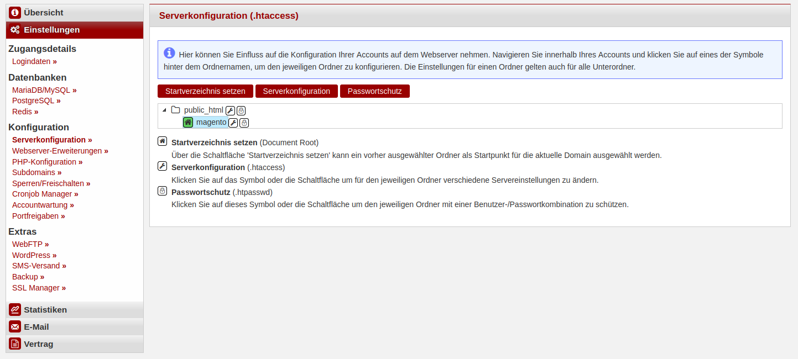
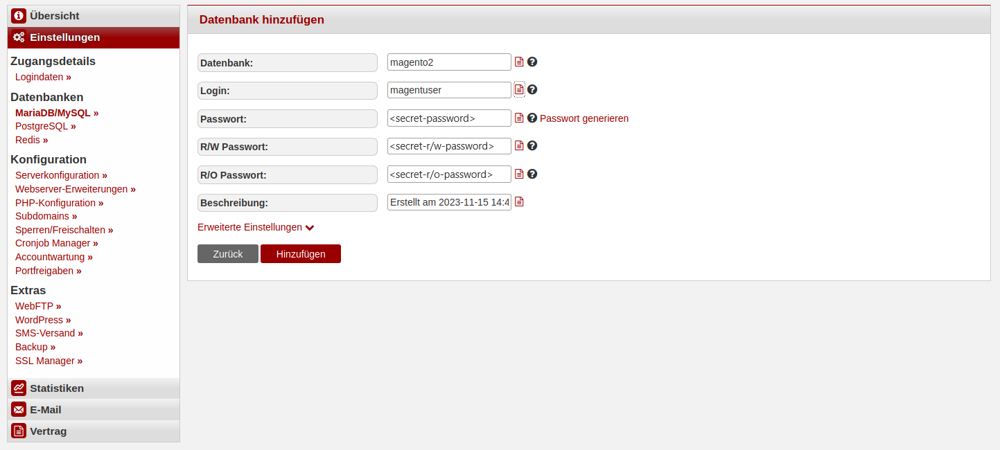

In diesem Tutorial wird erklärt wie man das kostenlose E-Commerce-Management-System **Magento2** installieren kann. Magento bietet Online-Händlern ein flexibles Warenkorbsystem sowie die Kontrolle über das Aussehen, den Inhalt und die Funktionalität Ihres Online-Shops.
Es bietet leistungsstarke Marketing-, Suchmaschinenoptimierungs- und Katalogverwaltungs-Tools.

**Wichtiger Hinweis**: Diese Anleitung ist für eine Installation auf einem [Managed Server](https://www.hetzner.com/de/managed-server) konzipiert.  
Da OpenSearch als Suchmaschine benötigt wird, um Magento installieren und nutzen zu können, ist die volle Funktionalität auf [Webhosting](https://www.hetzner.com/de/webhosting) nicht gegeben.


## Vorraussetzungen

Vor der Installation benötigt:

* [Composer](/de/konsoleh/server-management/faq/installation-of-common-software/#composer)
* Prozessfreigabe für Java via Supportanfrage
* SSH-Verbindung zu Ihrem Managed Server


**Beispiel-Benennungen**

* Benutzername: `magenh` 
* Databankname: `magento2`
* Databankbenutzername: `magentuser`
* Hostname / Datenbankhost: `<dediXXX.your-server.de>`
* Domain: `<example.com>`
* Subdomain: `<magento.example.com>`

## OpenSearch installieren

> Prozessfreigabe "java" sollte im Vorhinein über eine Supportanfrage angefragt werden.

OpenSearch muss vor der Installation von Magento installiert, konfiguriert und gestartet werden.

### Schritt 1 - Download
1. Lade dir [OpenSearch](https://opensearch.org/downloads.html) herunter
   ```bash
   cd ~
   curl -o opensearch.tar.gz https://artifacts.opensearch.org/releases/bundle/opensearch/2.12.0/opensearch-2.12.0-linux-x64.tar.gz
   ```

2. Entpacke die heruntergeladenen Dateien
   ```bash
   mkdir opensearch
   tar xzf opensearch.tar.gz -C opensearch --strip-components 1
   ```

### Schritt 2 - Konfiguration
1. Füg der Konfiguration unter `~/opensearch/config/opensearch.yml` folgende Zeilen am Ende hinzu:
   ```yaml
   network.host: 127.0.0.1
   plugins.security.disabled: true
   discovery.type: 'single-node'
   ```

### Schritt 3 - Starten von OpenSearch
1. Starte OpenSearch über folgenden Befehl
   ```
   nohup ~/opensearch/bin/opensearch &
   ```

2. Prüfe mit folgendem Befehl, ob OpenSearch korrekt läuft
   ```
   curl http://localhost:9200/
   ```
   Der Befehl sollte folgende Ausgabe anzeigen:
   ```json5
   {
   "name" : "dediXXX.your-server.de",
   "cluster_name" : "opensearch",
   "cluster_uuid" : "fDyOCQuIRSGpWoD7adY0Qw",
   "version" : {
      "distribution" : "opensearch",
      "number" : "2.12.0",
      "build_type" : "tar",
      "build_hash" : "2c355ce1a427e4a528778d4054436b5c4b756221",
      "build_date" : "2024-02-20T02:18:49.874618333Z",
      "build_snapshot" : false,
      "lucene_version" : "9.9.2",
      "minimum_wire_compatibility_version" : "7.10.0",
      "minimum_index_compatibility_version" : "7.0.0"
   },
   "tagline" : "The OpenSearch Project: https://opensearch.org/"
   }
   ```

### Schritt 4 - @reboot Cronjob einrichten
1. Damit OpenSearch nach einem Serverneustart automatisch gestartet wird, muss folgender [Cronjob](https://docs.hetzner.com/de/managed/administration-on-konsoleh/cronmanager) angelegt werden:
   ```
   @reboot ~/opensearch/bin/opensearch
   ```

## Magento2 installieren

### Schritt 1 - Account- und Webserverkonfiguration

Lege ein Konto und ein Installationsverzeichnis an, das auch das `document_root` Ihrer Website sein wird.

1. Log dich in deinen [Account](https://konsoleh.hetzner.com/) ein und navigiere zur konsoleH
2. Wähle entweder einen bestehenden Account auf deinem Managed Server aus oder erstelle einen Neuen
3. Erstelle ein neues Unterverzeichnis in Ihrem `public_html` Ordner, in welches Magento installiert werden soll:
   ```shellsession
   magenh@dediXXX:~/public_html$ mkdir ./magento
   ```
4. Wähle das neue Verzeichnis aus und ernenne es zum `document_root` von Ihrer Seite ("Einstellungen" » "Serverkonfiguration").   
   

#### Schritt 1.1 - PHP-Konfiguration

Setze die PHP-Version auf 8.2 oder 8.3 (**ohne Gewähr**) und setze folgende Werte ("Einstellungen" » "PHP-Konfiguration"):

* `allow_url_fopen = Ein`
* `memory_limit = 512M`
* `upload_max_filesize = 128M`
* `max_execution_time = 3600`

### Schritt 2 - Datenbank-Konfiguration

Erstelle die Datenbank für dein Magento2 E-Commerce:

1. In der konsoleH, navigiere zu "Einstellungen" » "Datenbanken" » "MariaDB/MySQL"
2. Wähle "Hinzufügen" und vergib einen Namen für die Datenbank und den Benutzer.  
   


### Schritt 3 - Magento herunterladen

Nachdem nun die Voraussetzungen erfüllt sind, kann Magento mit folgendem Befehl installiert werden:

```bash
composer create-project --repository-url=https://repo.magento.com/ magento/project-community-edition <IHR-INSTALLATIONSVERZEICHNIS>
```

> Erstetze `<IHR-INSTALLATIONSVERZEICHNIS>` mit deinem Magento-Ordner, oder mit einem `.`, wenn du den Befehl in dem besagtem Ordner ausführst.

1. Melde dich im [Adobe Marketplace](https://commercemarketplace.adobe.com/) an
2. Gehe anschließend oben rechts auf dein Profil und wähle "My Profile" aus
3. Klicke auf "Access Keys" im Register "Marketplace"
4. Wähle "Create A New Access Key". Vergib einen Namen und klicke auf `OK`
   
5. Um sich in der Command Line zu authentifizieren, nutzen: `Username = <public_key>` und `Password = <private_key>`
   

### Schritt 4 - Magento installieren

Führe die folgenden Befehle im Magento-Ordner aus:

1. Damit Magento mit MariaDB 10.11 verwendet werden kann, muss folgender Befehl im Installationsverzeichnis ausgeführt werden
   ```bash
   sed -i '/MariaDB-(10./a\\t\t<item name="MariaDB-10.11" xsi:type="string">^10\\.11\\.</item>' app/etc/di.xml
   ```

2. Installationsbefehl mit **angepassten** Optionen ausführen
   ```bash
   php bin/magento setup:install \
   --base-url='http://magento.example.com/' \
   --db-host='dedixxx.your-server.de' \
   --db-name='magento2' \
   --db-user='magentuser' \
   --db-password='<secret-password>' \
   --admin-firstname='FNAME' \
   --admin-lastname='LNAME' \
   --admin-email='mail@example.com' \
   --admin-user='admin' \
   --admin-password='<secure-password>' \
   --language=de_DE \
   --currency=EUR \
   --timezone=Europe/Berlin \
   --use-rewrites=1 \
   --search-engine=opensearch \
   --opensearch-host=localhost \
   --opensearch-port=9200 \
   --opensearch-index-prefix=magento2 \
   --opensearch-timeout=15 \
   --disable-modules=Magento_TwoFactorAuth,Magento_AdminAdobeImsTwoFactorAuth
   ```

Ersetze die Beispielbegriffe durch deine Daten sowie den Wert von "--admin-password" durch ein sichereres Passwort.

`--disable-modules=Magento_TwoFactorAuth,Magento_AdminAdobeImsTwoFactorAuth` wird verwendet, um 2FA bei der Anmeldung im Backend zu deaktivieren. Kann später wieder aktiviert werden.

Die Konfigurationsdatei liegt unter `<IHR-INSTALLATIONSVERZEICHNIS>/app/etc/env.php`:
```php
<?php
return [
    'backend' => [
        'frontName' => 'admin_d43s'
    ],
...
```

*Verändern Sie* den Wert von `frontName` auf ein beliebiges Verzeichnis auf Ihrer Website, unter dem das Admin-Panel erreichbar sein soll: http://magento.example.com/admin

## Nächste Schritte

Wenn alles wie erwartet funktioniert hat, kannst du jetzt mit Magento loslegen! Öffne zum Prüfen deine Website:

- **Frontend:** `http://magento.example.com/`
- **Backend:** `http://magento.example.com/admin`
  > *Benutzername:* admin<br>
  > *Passwort:* `<secure-password>`

So sollte die Admin-Seite aussehen:


> Falls die Systemmeldung "invalid indexers" erscheint:
> 
> 
> Führe diesen Befehl aus:
> ```bash
> php bin/magento indexer:reindex
> ```

Die erfolgreiche Installation von Magento für dein E-Commerce-Projekt kann den Weg für einen robusten Online-Shop ebnen.

Denk daran, deine Installation zu pflegen und aktuell zu halten, um Sicherheitslücken zu vermeiden.

Viel Erfolg bei deinem E-Commerce-Projekt!

##### License: MIT

<!--
Contributor's Certificate of Origin
By making a contribution to this project, I certify that:
(a) The contribution was created in whole or in part by me and I have
    the right to submit it under the license indicated in the file; or
(b) The contribution is based upon previous work that, to the best of my
    knowledge, is covered under an appropriate license and I have the
    right under that license to submit that work with modifications,
    whether created in whole or in part by me, under the same license
    (unless I am permitted to submit under a different license), as
    indicated in the file; or
(c) The contribution was provided directly to me by some other person
    who certified (a), (b) or (c) and I have not modified it.
(d) I understand and agree that this project and the contribution are
    public and that a record of the contribution (including all personal
    information I submit with it, including my sign-off) is maintained
    indefinitely and may be redistributed consistent with this project
    or the license(s) involved.
Signed-off-by: Vincent Paßler <vincent.passler@hetzner.com>
-->