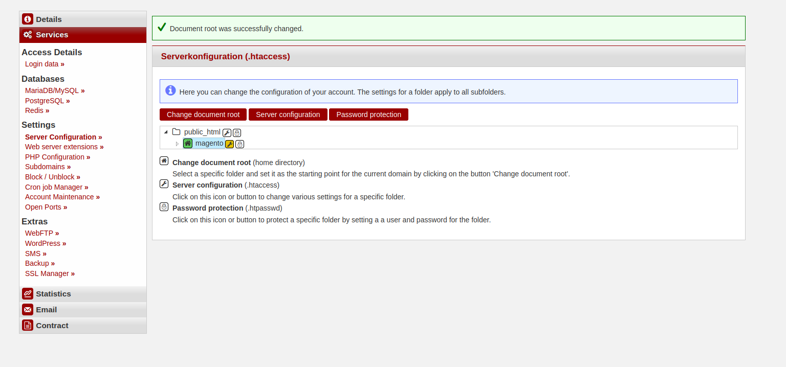
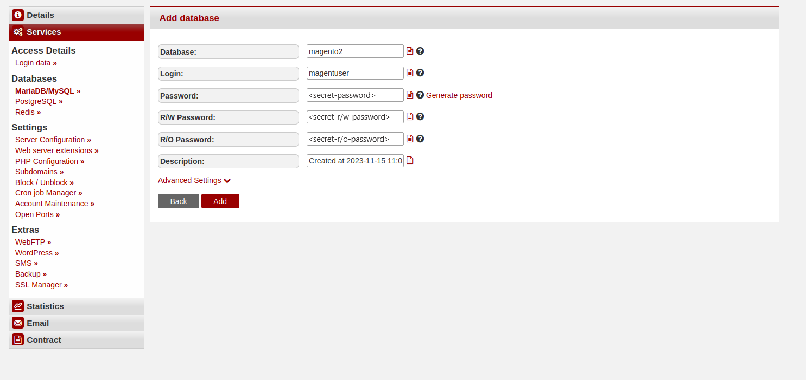
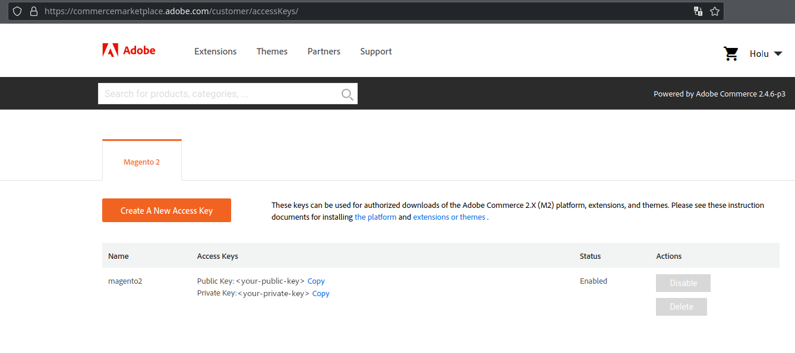
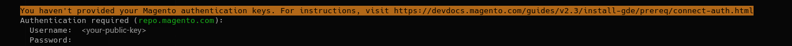
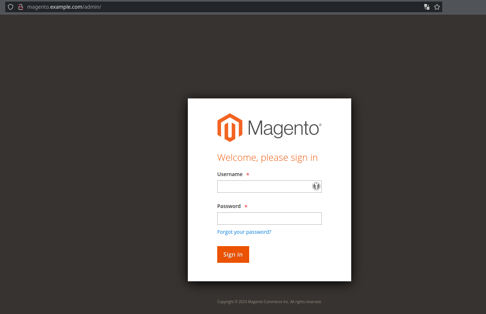
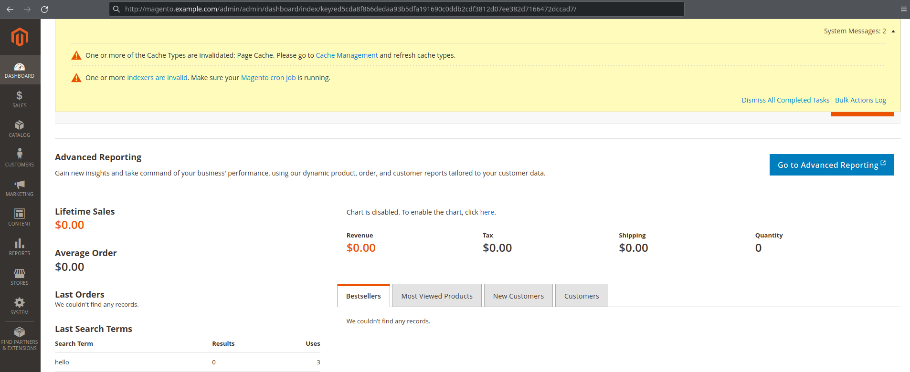

This tutorial explains how to install the free e-commerce management system **Magento2**. Magento provides online merchants with a flexible shopping cart system, as well as control over the look, content and functionality of their online store.
It offers users powerful marketing, search engine optimization, and catalog-management tools.

**Important note:** This tutorial is designed for an installation on a [Managed Server](https://www.hetzner.com/managed-server). Since OpenSearch is required as the search engine in order to be able to install and use Magento, the full functionality is not available for [web hosting](https://www.hetzner.com/webhosting) products.

## Prerequisites

Required before installation:

* [Composer](/konsoleh/server-management/faq/installation-of-common-software/#composer)
* Process release for Java.
* SSH connection to your managed server


**Example terminology**

* Username: `magenh` 
* Database name: `magento2`
* Database user: `magentuser`
* Hostname / database host: `<dediXXX.your-server.de>`
* Domain: `<example.com>`
* Subdomain: `<magento.example.com>`

## Install OpenSearch

> You should request the process release "java" in advance via a support request.

You need to first install, configure and start OpenSearch before installing Magento.

### Step 1 - Download
1. Download [OpenSearch](https://opensearch.org/downloads.html)
   ```bash
   cd ~
   curl -o opensearch.tar.gz https://artifacts.opensearch.org/releases/bundle/opensearch/2.12.0/opensearch-2.12.0-linux-x64.tar.gz
   ```

2. Extract the downloaded files
   ```bash
   mkdir opensearch
   tar xzf opensearch.tar.gz -C opensearch --strip-components 1
   ```

### Step 2 - Configuration
Add the following lines to the end of the configuration under `~/opensearch/config/opensearch.yml`:
   ```yaml
   network.host: 127.0.0.1
   plugins.security.disabled: true
   discovery.type: 'single-node'
   ```

### Step 3 - Start OpenSearch
1. Start OpenSearch with the following command
   ```
   nohup ~/opensearch/bin/opensearch &
   ```

2. Use the following command to check whether OpenSearch is running correctly
   ```
   curl http://localhost:9200/
   ```
   The command should display the following output:
   ```json5
   {
   "name" : "dediXXX.your-server.de",
   "cluster_name" : "opensearch",
   "cluster_uuid" : "fDyOCQuIRSGpWoD7adY0Qw",
   "version" : {
      "distribution" : "opensearch",
      "number" : "2.12.0",
      "build_type" : "tar",
      "build_hash" : "2c355ce1a427e4a528778d4054436b5c4b756221",
      "build_date" : "2024-02-20T02:18:49.874618333Z",
      "build_snapshot" : false,
      "lucene_version" : "9.9.2",
      "minimum_wire_compatibility_version" : "7.10.0",
      "minimum_index_compatibility_version" : "7.0.0"
   },
   "tagline" : "The OpenSearch Project: https://opensearch.org/"
   }
   ```

### Step 4 - Setup a @reboot Cronjob
1. To start OpenSearch automatically after a server restart, you need to create the following [cronjob](https://docs.hetzner.com/de/managed/administration-on-konsoleh/cronmanager)
   ```
   @reboot ~/opensearch/bin/opensearch
   ```

## Install Magento2

### Step 1 - Account and webserver configuration

Create an account and an installation directory, which will also be the `document_root` of your website.

1. Log onto your [account](https://konsoleh.hetzner.com/) and navigate to konsoleH.
2. Select an existing account or create a new one.
3. Create a new directory in your `public_html` directory. Later, you will install Magento in this directory:
   ```shellsession
   magenh@dediXXX:~/public_html$ mkdir ./magento
   ```
4. Set the newly created directory as `document_root` of your site ("Services" » "Server Configuration").
   

#### Step 1.1 - PHP configuration

Set the PHP version to 8.2 or 8.3 (**no warranty**) and set the following values ("Services" » "PHP Configuration"):

* `allow_url_fopen = On`
* `memory_limit = 512M`
* `upload_max_filesize = 128M`
* `max_execution_time = 3600`

### Step 2 - Database setup

Create the database for your Magento2 ecommerce:

1. On konsoleH, navigate to "Services" » "Databases" » "MariaDB/MySQL".
2. Select "Add" and assign a name to the database and the user.
   

### Step 3 - Download Magento

Now that the prerequisites are installed, you can install Magento:

```bash
composer create-project --repository-url=https://repo.magento.com/ magento/project-community-edition <YOUR-INSTALLATION-DIR>
```

> Replace `<YOUR-INSTALLATION-DIR>` with your magento directory, or just a `.` if you are executing the command directly within the magento directory.

1. Log into [Adobe Marketplace](https://commercemarketplace.adobe.com/).
2. Click on your profile name in the top right and select "My Profile"
3. Click on "Access Keys" on the register "Marketplace"
4. Select "Create A New Access Key". Give it a name and click "OK"
   
1. Log onto [Adobe Marketplace](https://commercemarketplace.adobe.com/).
2. Click on your profile name in the top right and select "My Profile".
3. Click on "Access Keys" on the register "Marketplace".
4. Select "Create A New Access Key". Give it a name and click "OK".
   
5. In order to authenticate yourself use: `Username = <public_key>` and `Password = <private_key>`.
   

### Step 4 - Install Magento

Run the following commands in the magento directory.

1. In order to use Magento with MariaDB 10.11, you need to execute the following command in the installation directory
   ```bash
   sed -i '/MariaDB-(10./a\\t\t<item name="MariaDB-10.11" xsi:type="string">^10\\.11\\.</item>' app/etc/di.xml
   ```

2. Run the installation command with **customized** options
  ```bash
  php bin/magento setup:install \
  --base-url='http://magento.example.com/' \
  --db-host='dedixxx.your-server.de' \
  --db-name='magento2' \
  --db-user='magentuser' \
  --db-password='<secret-password>' \
  --admin-firstname='FNAME' \
  --admin-lastname='LNAME' \
  --admin-email='mail@example.com' \
  --admin-user='admin' \
  --admin-password='<secure-password>' \
  --language=en_US \
  --currency=USD \
  --timezone=America/Chicago \
  --use-rewrites=1 \
  --search-engine=opensearch \
  --opensearch-host=localhost \
  --opensearch-port=9200 \
  --opensearch-index-prefix=magento2 \
  --opensearch-timeout=15 \
  --disable-modules=Magento_TwoFactorAuth,Magento_AdminAdobeImsTwoFactorAuth
  ```

Replace the example values with your own data. You should also replace the value of '--admin-password' with a more secure password.

`--disable-modules=Magento_TwoFactorAuth,Magento_AdminAdobeImsTwoFactorAuth` is used to disable 2FA when logging into the admin panel. You can re-enabled it later.

You can find the configuration of the installation in `<installation_dir>/app/etc/env.php`:
```php
<?php
return [
    'backend' => [
        'frontName' => 'admin_d43s'
    ],
...
```

*Change* the `frontName` value to any directory on your website where the admin panel is accessible: http://magento.example.com/admin

## Further steps

If everything works as expected, you can now get started with Magento! Check if your website is available:

- **Frontend**: `http://magento.example.com/`
- **Backend**: `http://magento.example.com/admin`
  > *Username:* admin<br>
  > *Password:* `<secure-password>`

This is how the admin page should look:


> If you see a system message like "invalid indexers":
> 
> 
> Execute this command:
> ```bash
> php bin/magento indexer:reindex
> ```

Successfully installing Magento for your e-commerce venture can pave the way for a robust online store.

Remember to keep your installation maintained and up-to-date in order to prevent security gaps.


##### License: MIT

<!--
Contributor's Certificate of Origin
By making a contribution to this project, I certify that:
(a) The contribution was created in whole or in part by me and I have
    the right to submit it under the license indicated in the file; or
(b) The contribution is based upon previous work that, to the best of my
    knowledge, is covered under an appropriate license and I have the
    right under that license to submit that work with modifications,
    whether created in whole or in part by me, under the same license
    (unless I am permitted to submit under a different license), as
    indicated in the file; or
(c) The contribution was provided directly to me by some other person
    who certified (a), (b) or (c) and I have not modified it.
(d) I understand and agree that this project and the contribution are
    public and that a record of the contribution (including all personal
    information I submit with it, including my sign-off) is maintained
    indefinitely and may be redistributed consistent with this project
    or the license(s) involved.
Signed-off-by: Vincent Paßler <vincent.passler@hetzner.com>
-->