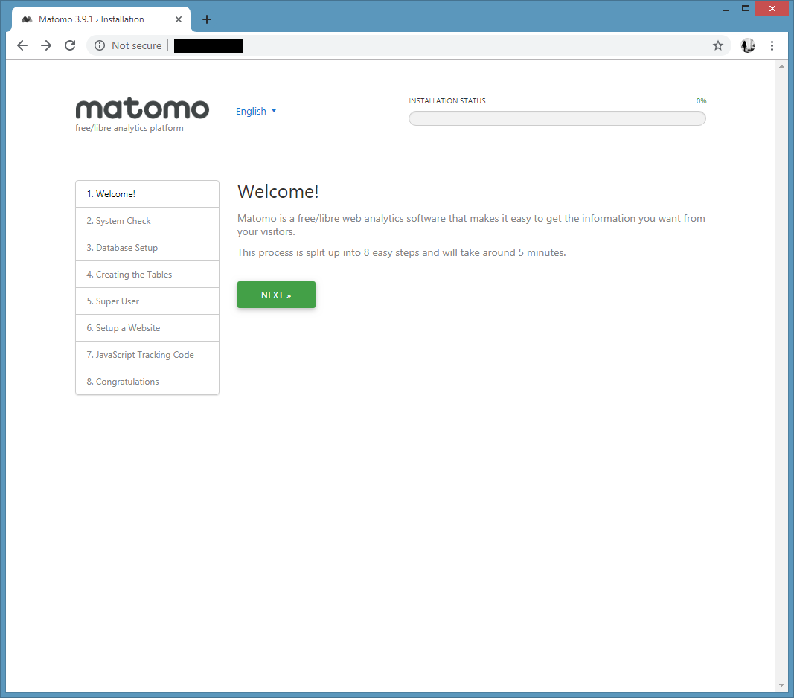
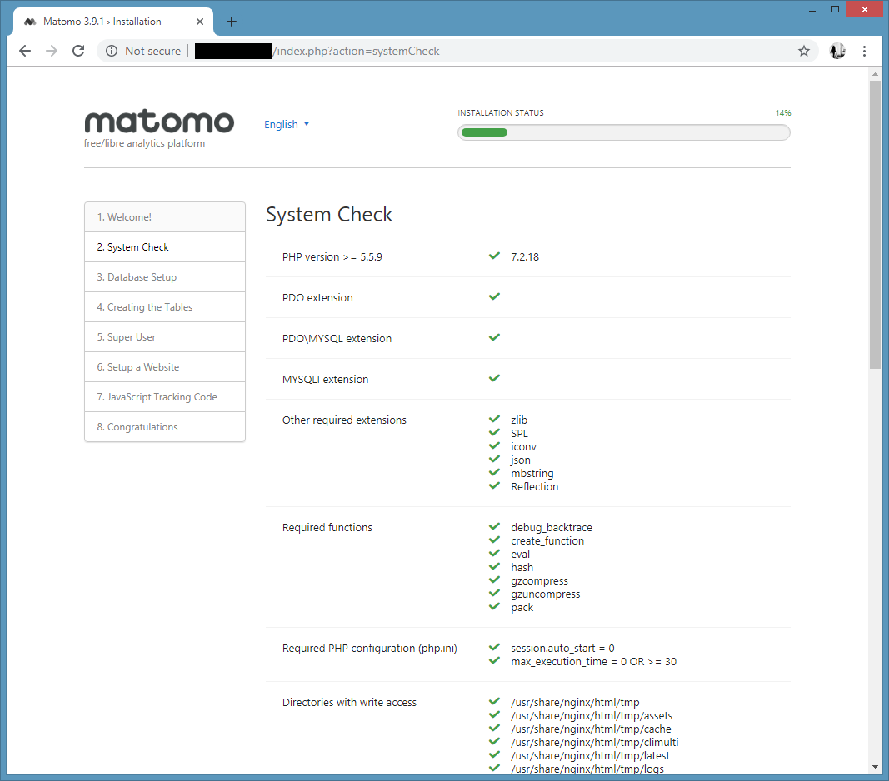
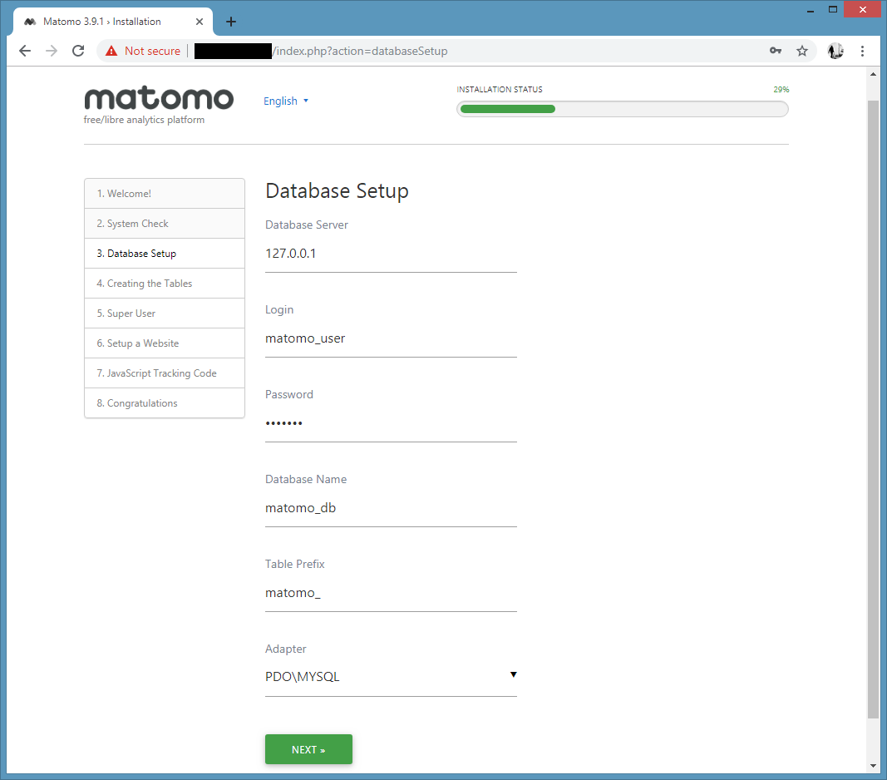
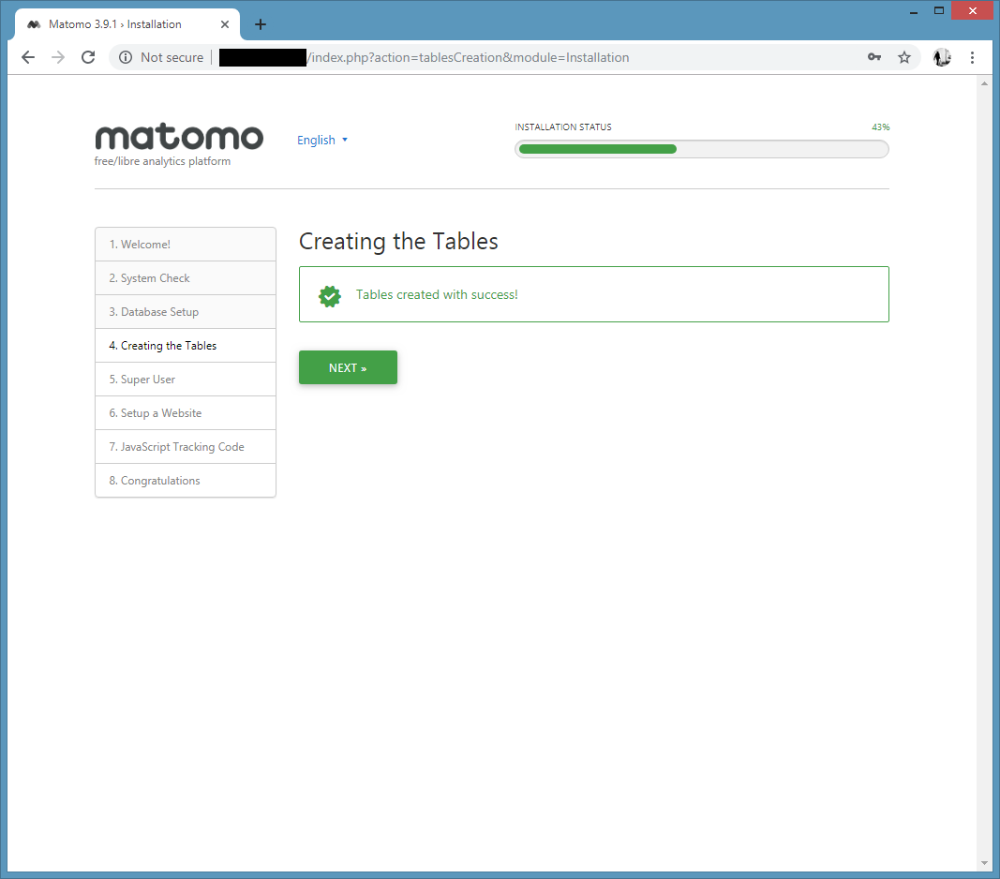
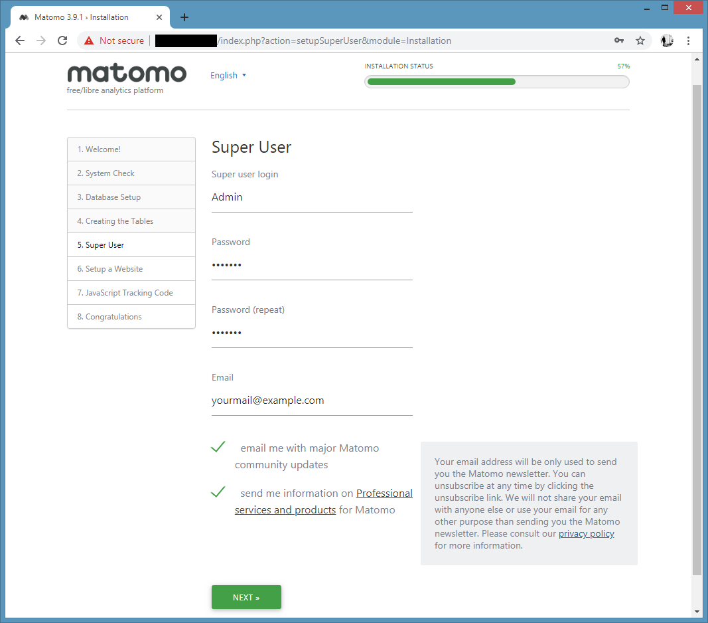
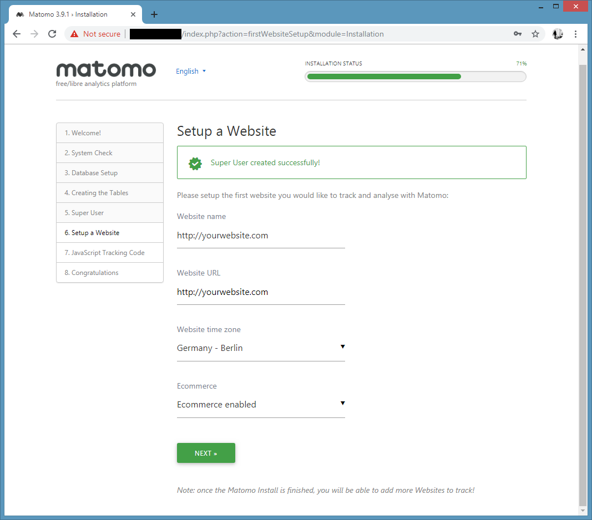
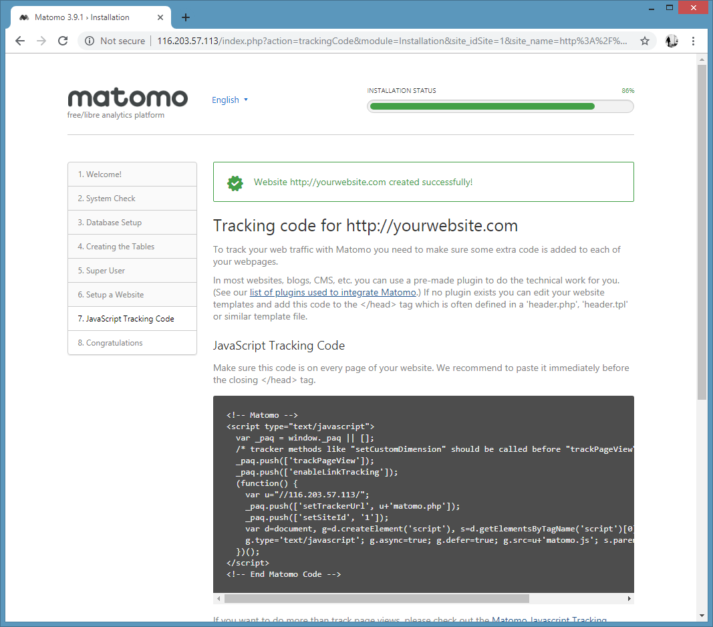
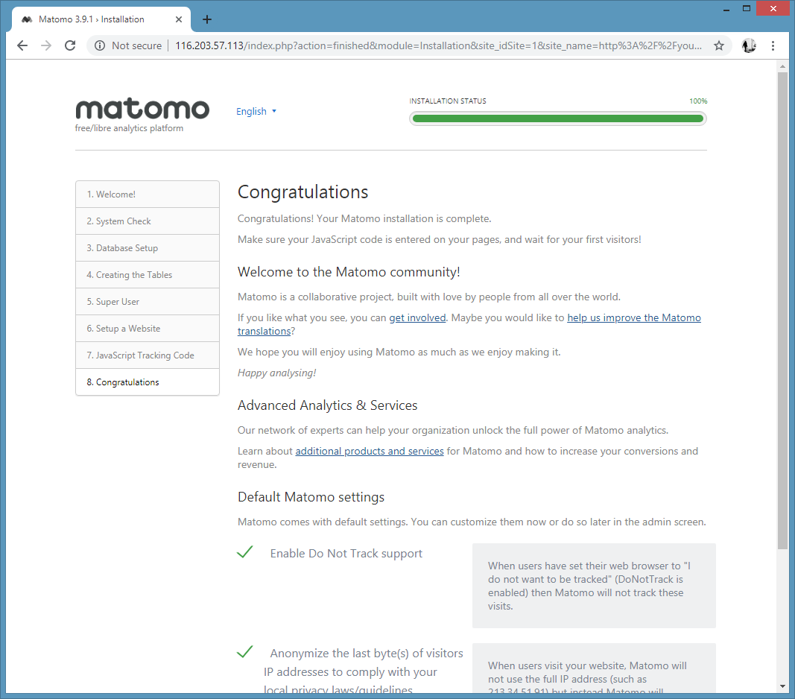
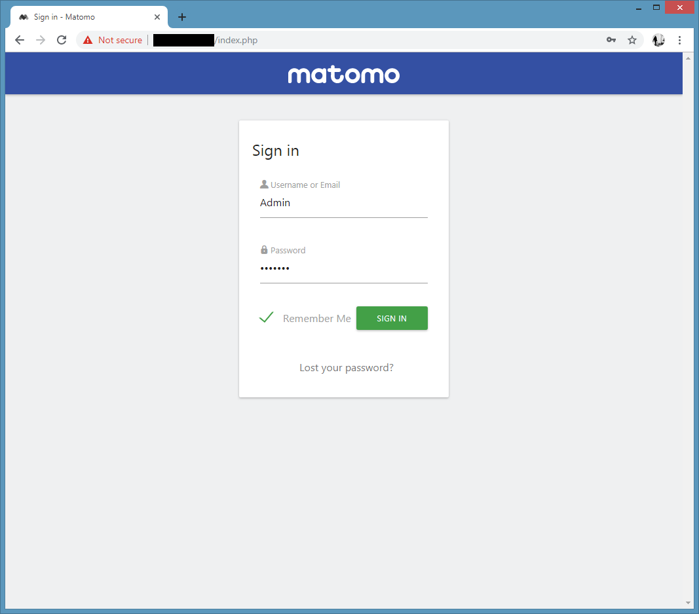
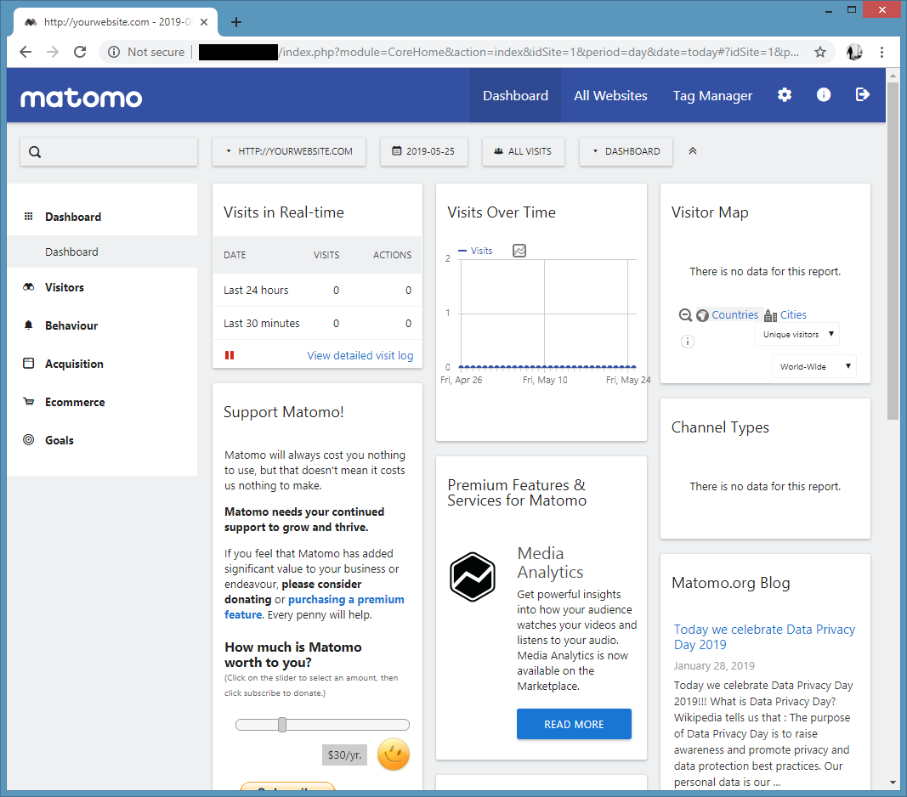

## Introduction

Matomo, formerly Piwik, is a free and open source web analytics application developed by a team of international developers, that runs on a PHP/MySQL webserver. It tracks online visits to one or more websites and displays reports on these visits for analysis.

**Prerequisites**

To run Matomo on your server, you need:

- Webserver such as Apache, Nginx, etc.

- PHP version 5.5.9 or greater

- MySQL version 5.5 or greater, or MariaDB

- (enabled by default) PHP extension pdo and pdo_mysql, or the mysqli extension.

According to the [Matomo Requirements](https://matomo.org/docs/requirements/) using PHP 7.x, MariaDB and PHP Extension such as "PHP GD Extension" is recommended.

## Step 1 - Installing LEMP Stack

As mentioned in the requirements section of the tutorial, a LEMP stack (Linux, Nginx, MySQL/MariaDB and PHP) is required to run Matomo on the server. We will start with installing Nginx web server:

```bash
yum install epel-release
yum install nginx
```

Start and enable Nginx on boot:

```bash
systemctl start nginx
systemctl enable nginx
```

Install MariaDB database server using the following command:

```bash
yum install mariadb-server mariadb
```

After finish installation, start and enable MariaDB service:

```bash
systemctl start mariadb
systemctl enable mariadb
```

Secure MariaDB with this command:

```bash
mysql_secure_installation
```

The prompt asks you for your current MYSQL root password. At this stage you won’t have one yet, so just leave it blank by hitting enter. When you are prompted to set a root password, just type `Y` and follow the instructions to set up your root password and make note of it.

Output:

```bash
$ sudo mysql_secure_installation

NOTE: RUNNING ALL PARTS OF THIS SCRIPT IS RECOMMENDED FOR ALL MariaDB
      SERVERS IN PRODUCTION USE!  PLEASE READ EACH STEP CAREFULLY!

In order to log into MariaDB to secure it, we'll need the current
password for the root user.  If you've just installed MariaDB, and
you haven't set the root password yet, the password will be blank,
so you should just press enter here.

Enter current password for root (enter for none):
OK, successfully used password, moving on...

Setting the root password ensures that nobody can log into the MariaDB
root user without the proper authorisation.

Set root password? [Y/n] y
New password:
Re-enter new password:
Password updated successfully!
Reloading privilege tables..
 ... Success!
```

PHP version 7.x is not available in the default CentOS 7 repositories so we will use the Remi repository.

```bash
yum install http://rpms.remirepo.net/enterprise/remi-release-7.rpm
yum install yum-utils
yum-config-manager --enable remi-php72
```

Install PHP and the required PHP extensions using the following command:

```bash
yum install php php-mysql php-fpm php-mbstring php-xml php-gd
```

To configure the PHP processor, open the main php-fpm configuration file:

```bash
vi /etc/php.ini
```

Find this line:

```bash
;cgi.fix_pathinfo=1
```

And replace with:

```bash
cgi.fix_pathinfo=0
```

Save and quit.

Next, open the php-fpm configuration file `www.conf`:

```bash
vi /etc/php-fpm.d/www.conf
```

Find the line that specifies the `listen` parameter, and change it so it looks like the following:

```bash
listen = /var/run/php-fpm/php-fpm.sock
```

Next, find the lines that set the `listen.owner` and `listen.group` and uncomment them. They should look like this:

```bash
listen.owner = nginx
listen.group = nginx
```

Lastly, find the lines that set the `user` and `group` and change their values from "apache" to "nginx":

```bash
user = nginx
group = nginx
```

After you save and quit the `wwww.conf` file, enable and start the PHP-FPM service with:

```bash
systemctl enable php-fpm
systemctl start php-fpm
```

To configure Nginx to process PHP pages, edit `/etc/nginx/conf.d/default.conf` to:

```bash
vi /etc/nginx/conf.d/default.conf
```

```bash
server {
    listen       80;
    server_name  server_domain_name_or_IP;
    root   /usr/share/nginx/html;
    index index.php index.html index.htm;
    location / {
        try_files $uri $uri/ =404;
    }
    error_page 404 /404.html;
    error_page 500 502 503 504 /50x.html;
    location = /50x.html {
        root /usr/share/nginx/html;
    }
    location ~ \.php$ {
        try_files $uri =404;
        fastcgi_pass unix:/var/run/php-fpm/php-fpm.sock;
        fastcgi_index index.php;
        fastcgi_param SCRIPT_FILENAME $document_root$fastcgi_script_name;
        include fastcgi_params;
    }
}
```

Replace the value of `server_domain_name_or_IP` with the appropriate domain name or IP address.

Save and quit, and restart Nginx:

```bash
systemctl restart nginx
```

## Step 2 - Installing Matomo

Matomo is not available in the official CentOS 7 repositories, so we will have to download Matomo from the [official website](https://matomo.org/download/) and extract the Matomo archive to a directory on the server by executing the following commands:

```bash
cd /usr/share/nginx/html/
wget https://builds.matomo.org/matomo-latest.zip
unzip matomo-latest.zip
rm matomo-latest.zip -y
mv matomo/* .
rmdir matomo
```

Change ownership of the `/usr/share/nginx/html/` directory to `nginx`:

```bash
chown -R nginx:nginx /usr/share/nginx/html/
```

## Step 3 - Create a Database for Matomo

Log into MySQL with the root:

```bash
mysql -u root -p
```

This installation uses MariaDB as the backend of Matomo, so we need to create a MySQL database and user for the Matomo installation.

```bash
MariaDB [(none)]> CREATE DATABASE matomo_db;
MariaDB [(none)]> GRANT ALL ON matomo_db.* TO matomo_user@localhost IDENTIFIED BY 'YOUR-MATOMO-MYSQL-PASSWORD';
MariaDB [(none)]> FLUSH PRIVILEGES;
MariaDB [(none)]> quit;
```

## Step 4 - Complete Matomo Web Installer Wizzard

Open web browser and access the Matomo Installation at `http://YOUR-IP`.

#### Matomo Setup Welcome Screen

This is the welcome screen of Matomo web installer. Go forward by clicking on the **Next** button.



#### Matomo System Check

Check if your system has all the required packages, if everything is ok click **Next**.



#### Matomo Database Setup

Enter your database information and click **Next**.



#### Creating the Tables

After importing the database, click **Next**.



#### Super User

Enter your Username, Password and Email to login to the web interface. Go forward by clicking on the **Next** button.



#### Setup a Website

Set your website and timezone in this step and click **Next**.



#### Javascript Tracking code

Get javascript tracking code for your website here and click on the **Next** button.



#### Congratulation

Your matomo installation is complete. Click **Next** to go to the login page.



#### Sign in

Enter your username and password (Set in "Super User" step) and click on **SIGN IN** to login to the admin web interface.



After successful login, you will see a Matomo dashboard like below.



## Conclusion

That's it, now you should have successfully installed Matomo on your CentOS 7 server.

You can now check the [Matomo Documentation](https://matomo.org/docs/) and learn more about how to use Matomo.

##### License: MIT

<!---

Contributors's Certificate of Origin

By making a contribution to this project, I certify that:

(a) The contribution was created in whole or in part by me and I have
    the right to submit it under the license indicated in the file; or

(b) The contribution is based upon previous work that, to the best of my
    knowledge, is covered under an appropriate license and I have the
    right under that license to submit that work with modifications,
    whether created in whole or in part by me, under the same license
    (unless I am permitted to submit under a different license), as
    indicated in the file; or

(c) The contribution was provided directly to me by some other person
    who certified (a), (b) or (c) and I have not modified it.

(d) I understand and agree that this project and the contribution are
    public and that a record of the contribution (including all personal
    information I submit with it, including my sign-off) is maintained
    indefinitely and may be redistributed consistent with this project
    or the license(s) involved.

Signed-off-by: [MohammadHossein Fakhraei eng.fakhraei@gmail.com]

-->
