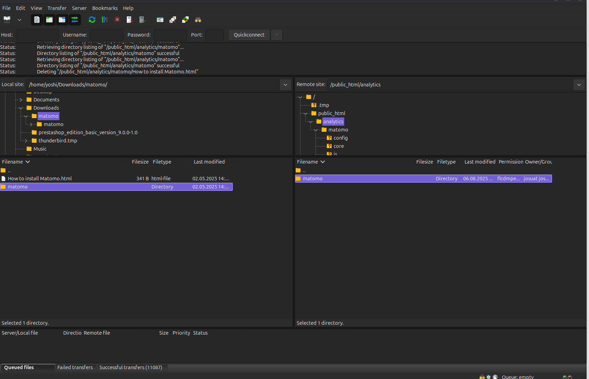
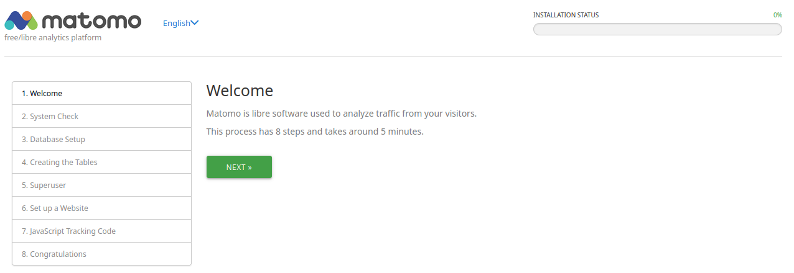
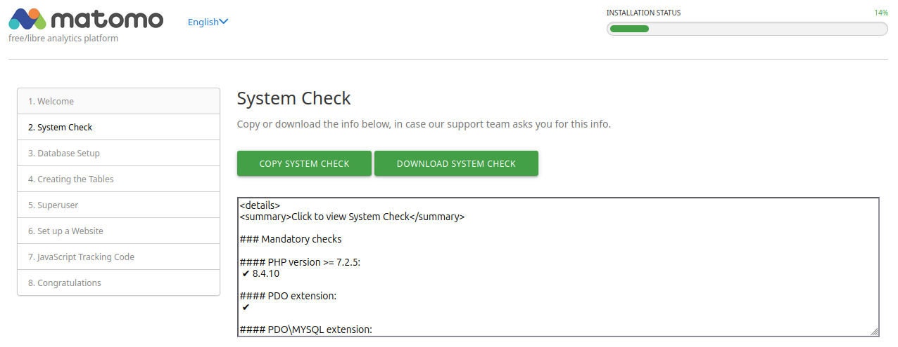
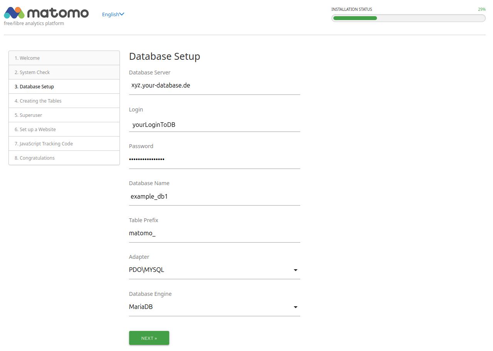
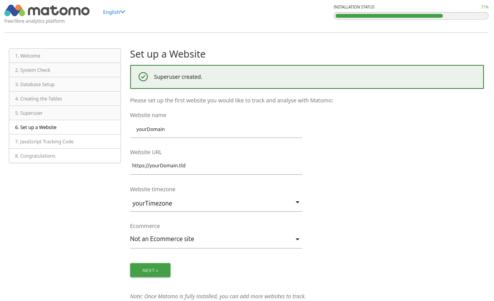

In diesem Tutorial wird erklärt wie man die Analytik-Plattform Matomo installieren kann.

**Was ist Matomo?**

Matomo ist eine weitverbreitete Open-Source-Webanalytik-Plattform ähnlich wie Google Analytics. Es ermöglicht Betreibern von Webseiten & Webshops verschiedenste Daten der Besucher auszuwerten wie z.B.: Herkunftsregion, welche Webseiten vorher besucht wurden, welchen Umsatz der Kunde verantwortet usw....

**Hinweis**

Wir stellen Dir lediglich die technische Möglichkeit zur Installation von Matomo zur Verfügung. Da es sich um eine sogenannte Drittanbieter-Software (3rd Party Application) handelt, können wir keine Gewährleistung für deren Funktionalität übernehmen und bieten keinen Support zu inhaltlichen oder technischen Fragen innerhalb von Matomo an.
Weitere Informationen und Hilfe erhältst Du unter: <https://matomo.org>

**Beispiel-Benennungen**

* Benutzername: `matomo`
* Datenbankname: `matomo_db`
* Datenbanknutzername: `matomouser`
* Datenbankpasswort: `abcde*1234#XYZ`
* Hostname / Datenbankhost: `<xyz.your-database.de>`
* Domain: `<example.com>`
* Subdomain: `<matomo.example.com>`
* FTP-Client: `FileZilla`
* FTP/SSH-Nutzer: `exampleuser`
* Public SSH-Key: `id_<type>.pub`
* Speichermenge: `256M`
* Verzeichnisse: `public_html`
* Terminal Commands: `SSH`

**Voraussetzungen**

* Mindestens einen Level 4 Webhosting Account
* Aktiviertes SSL-Zertifikat für Deine Domain
* PHP-Version 8 oder höher für die neueste Version von Matomo mit deaktiviertem `mod_pagespeed`
* Aktivierten FTP oder SSH-Zugang
* Gesetztes `PHP-Memory-Limit` von mindestens 256 MB
* Ggf. einen SSH-Key nach folgenden [Vorgaben](https://docs.hetzner.com/de/konsoleh/account-management/access-details/login-data#ssh-schlussel)
* Ggf. einen FTP-Client wie z.B. FileZilla

## Matomo installieren

### Schritt 1 - Vorbereitung für die Installation

**1.1 Datenbank in der konsoleH anlegen**

* Melde Dich mit deinen Zugangsdaten in der [konsoleH](https://konsoleh.hetzner.com/) an
* Gehe zu `Einstellungen` -> `Datenbanken` -> `MariaDB/MySQL »`
* Klicke unter `MariaDB/MySQL Datenbanken` auf `Hinzufügen`
  
* Falls Du möchtest, kannst Du nun den Namen der `Datenbank`, den `Login` und das Passwort anpassen
  
* Klicke auf `speichern` und oberhalb der Zugangsdaten zur Datenbank sollte nun die `Verbindungskennung` angezeigt werden
* Kopiere dir diese nun z.B. in eine Notiz auf Deinem Computer, Du benötigst sie Später für das Setup

**1.2 PHP-Einstellungen in der konsoleH**

* In der konsoleH navigiere zu `Einstellungen` -> `Konfiguration` -> `Webserver-Erweiterungen »`
  
* Ganz rechts muss wie im Screenshot unter dem Punkt `mod_pagespeed` ein rotes Kreuz angezeigt werden, falls dort ein grüner Haken ist, klicke ein mal darauf und dann links unter deinem `Domainnamen` auf `speichern`
* Navigiere nun einen Punkt drunter zu `PHP-Konfiguration`
  
* Wähle dort unter `PHP-Version` die aktuellste PHP-Version aus, ab `Version 5.0` benötigt Matomo mindestens `PHP 8.0`
* Klicke auf `speichern`
* Navigiere in derselben Seite zu den `PHP-Einstellungen` und überprüfe ob bei `memory_limit` mindestens `256M`steht
* Falls dort ein niedrigerer Wert steht, wähle im Feld rechts daneben `256` aus und klicke unten links in der Seite auf `speichern`

**1.3 SSH-Key generieren**

* Generiere nach den Angaben unter [https://docs.hetzner.com/de/konsoleh/account-management/access-details/login-data#sftp-mit-key-authentifizierung](https://docs.hetzner.com/de/konsoleh/account-management/access-details/login-data#sftp-mit-key-authentifizierung) und [https://community.hetzner.com/tutorials/howto-ssh-key/de](https://community.hetzner.com/tutorials/howto-ssh-key/de) ein SSH-Key-Paar
* Navigiere in der konsoleH zu `Einstellungen` -> `Zugangsdetails` -> `Logindaten »`
  

**Für die Installation über einen FTP-Client gehe nun wie folgt vor:**

* Lade dort unter `Öffentliche SFTP-Schlüssel` deinen Publickey `id_<type>.pub` hoch, indem du auf `Hinzufügen` klickst und im nachfolgenden Fenster den Inhalt reinkopierst
* Klicke dann auf `Hinzufügen` - nun sollte unter `Öffentliche SFTP-Schlüssel` -> `Schlüsseltyp` dein Publickey mit Kommentar erscheinen

**Für die Installation über SSH-Zugang gehe nun wie folgt vor:**

* Lade dort unter `Öffentliche SSH-Schlüssel` deinen Publickey `id_<type>.pub` hoch indem du auf `Hinzufügen` klickst und im nachfolgenden Fenster den Inhalt reinkopierst
* Klicke dann auf `Hinzufügen` - nun sollte unter `Öffentliche SSH-Schlüssel` -> `Schlüsseltyp` dein Publickey mit Kommentar erscheinen

### Schritt 2 - Matomo ins Webverzeichnis hochladen

* **Option 1 - Über SSH-Verbindung**

* Navigiere in der konsoleH zu `Einstellungen` -> `Zugangsdetails` -> `Logindaten` und kopiere dir das `SSH-Verbindungskommando` per klick auf das rote Seiten Symbol
* Verbinde Dich mit Deinem Account auf dem Webhosting-Server indem Du Dein lokales Terminal öffnest und den kopierten command einfügst:

  ```bash
  ssh exampleUser@wwwxyz.your-server.de -p 222
  ```

* Eventuell musst Du hier noch auf Deinen zuvor erstellten privaten SSH-Key verweisen. Füge dazu einfach die folgende Zeile an Deinen SSH Command an:

  ```bash
  -i <PfadZuDeinemSSH-Key/id_<type>
  ```

* Wechsle in Dein `public_html` Verzeichnis, lade Dir Matomo mit folgendem Befehl herunter und entpacke die Datei:

  ```bash
  example@<wwwxyz>:~$ cd public_html/
  example@<wwwxyz>:~$ wget https://builds.matomo.org/matomo.zip && unzip matomo.zip
  ```
  
* **Option 2 - Über FTP-Client**

* Lade Dir die aktuellste Version von Matomo von der offiziellen Webseite herunter: [https://builds.matomo.org/matomo.zip](https://builds.matomo.org/matomo.zip)
  
* Unter Linux kannst Du die ZIP-Datei über Dein Terminal per `unzip` oder einem Doppelklick in Deinem Dateimanager entpacken
* Unter Windows kannst Du die ZIP-Datei per Doppelklick im Dateiexplorer entpacken
* Öffne nun Deinen FTP-CLient, wir haben die Installation mit `FileZilla` durchgeführt
* Klicke auf `Datei` -> `Servermanager` -> `Neuer Server` und benenne den Server. Zum Beispiel: `MatomoTest`
  
* Unter `Protokoll` wählst Du `SFTP-SSH File Transfer Protocol` aus, unter `Server` trägst Du den Webhosting-Server `wwwxyz.your-server.de` ein und unter `Port`: die `22`
* Unter `Verbindungsart` wälst Du `Schlüsseldatei` und unter `Benutzer` trägst Du Deinen Loginnamen aus der konsoleH ein
* Unter `Schlüsseldatei`klickst Du nun auf `Durchsuchen`
* Navigiere im folgenden Fenster nun zu dem Verzeichnis, in dem Du Dein SSH-Key-Paar abgelegt hast
* Wähle nun Deinen privaten Schlüssel aus:

  ```bash
  id_<type>
  ```

* Füge Diesen per Doppelklick zu dem Eintrag in `FileZilla` hinzu und verbinde dich mit deinem Verzeichnis auf dem Webhostingserver durch ein Klick auf `verbinden`
* Navigiere in `FileZilla` nun auf der linken Seite zu dem Verzeichnis, in dem Du die `matomo.zip` Datei enpackt hast, und auf der rechten Seite in dein `public_html` Verzeichnis
* Ziehe nun den Ordner `matomo` aus dem linken Fenster in das rechte Fenster und warte bis FileZilla die Übertragung abgschlossen hat
  
  
### Schritt 3 - Matomo Installations-Assistent

* Navigiere in deinem Browser zu Deiner Domain-Adresse und gebe dabei den Matomo Ordner mit an: `https://example.de/matomo/`
  
* Nun solltest Du auf der Willkommensseite des Installers landen, die Sprache kannst Du oben rechts neben dem Matomo Logo ändern.
* Klicke auf `NÄCHSTE` und du landest auf der Systemprüfung: hier werden Dir alle Vorraussetzungen, die für Matomo benötigt werden, aufgelistet
  
* Mit einem Klick auf `NÄCHSTE` landest Du in der Einrichtung der Datenbank. Hier musst Du die Daten aus der konsoleH eingeben:
  
* Klicke auf `NÄCHSTE` um zu überprüfen ob die Daten richtig sind und eine Verbindung zur Datenbank hergestellt werden kann:
  
* Lege nun auf der nächsten Seite Deine Logindaten für die Weboberfläche von Matomo fest. Beachte hierbei bitte die [best practices von Matomo](https://matomo.org/faq/on-premise/how-to-configure-matomo-for-security/)
  
* Auf der folgenden Seite musst Du nun Deinen Webseitennamen sowie die URL und die Zeitzone angeben.
  
* Unter 7. findest Du nun den Tracking Code von Matomo, den Du in den Seiten Deiner Webseite oder Deines Webshops einfügen musst. Für einige Webseiten, Blogs, CMS und Webshops existiert bereits ein sog. Plugin dafür. Eine Liste der verfügbaren Plugins findest Du unter: [https://matomo.org/guide/tracking-data/integrations/](https://matomo.org/guide/tracking-data/integrations/)
  
* Auf der letzen Seite findest Du eine Übersicht über weitere mögliche Schritte und kannst mit einem Klick auf `WEITER ZU MATOMO` in die Administrationsoberfläche Deiner Matomo Installation gelangen.
  
* Nun solltest Du die Installation und Einrichtung von Matomo abgeschlossen haben.
