This tutorial explains how to install the Matomo analytics platform.

# What is Matomo?

Matomo is a widely used open-source web analytics platform similar to Google Analytics. It lets website and online store operators evaluate a wide range of visitor data, such as: region of origin, which websites were visited previously, how much revenue the customer is responsible for, etc...

For further information and help, please visit: <https://matomo.org>

## Example-Terminology
* Username: `matomo`
* Database name: `matomo_db`
* Database username: `matomouser`
* Database password: `abcde*1234#XYZ`
* Hostname / Database host: `<xyz.your-database.de>`
* Domain: `<example.com>`
* Subdomain: `<matomo.example.com>`
* FTP client: `FileZilla`
* FTP/SSH user: `exampleuser`
* Public SSH key: `id_<type>.pub`
* Storage amount: `256M`
* Directories: `public_html`
* Terminal Commands: `SSH`

## Prerequisites

* A Web Hosting plan M or higher at Hetzner
* Activated SSL certificate for your domain
* PHP version 8 or higher for the latest version of Matomo with deactivated `mod_pagespeed`
* Activated FTP or SSH access
* Set `allow_url_fopen` to "On" `PHP-Memory-Limit` to at least 256 MB.
* If necessary, generate an SSH key with the following [specifications](https://docs.hetzner.com/de/konsoleh/account-management/access-details/login-data#ssh-schlussel)
* If necessary use an FTP client, like FileZilla.

# Install Matomo

## Step 1 - Preparing for installation

### 1.1 Create a database on konsoleH

* Log onto [konsoleH](https://konsoleh.hetzner.com/).
* Navigate to `Services` -> `Databases` -> `MariaDB/MySQL »`.
* Go to `MariaDB/MySQL Databases` and click on `Add`.
  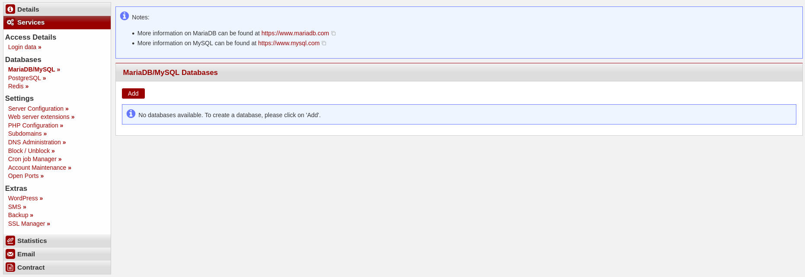
* If you want, you can now customize the name of the `database`, the `login`, and the `password`.
  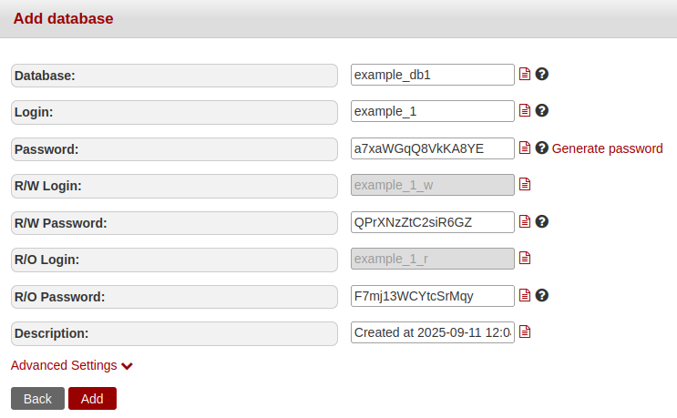
* Click on `Save`. The `Connection ID` should now be displayed above the database access data.
* Now copy these into a text file on your computer, for example. You will need them later for the setup.

### 1.2 PHP settings on konsoleH

* On konsoleH, navigate to `Services` -> `Settings` -> `Web server extensions »`.
  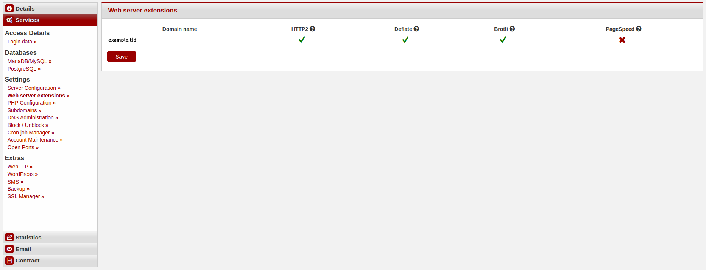
* On the far right, a red cross should be displayed under `mod_pagespeed` as shown in the screenshot. If there is a green check mark there, click on it once and then click `Save` under your domain name on the left.
* Now navigate to `PHP configuration` below.
  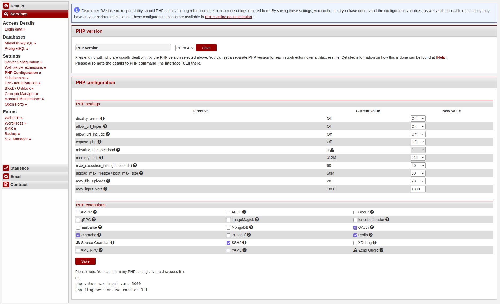
* Go to `PHP version` and select the latest PHP version. From `version 5.0` onwards, Matomo requires at least `PHP 8.0`.
* Click on `Save`.
* Navigate to `PHP Settings` on the same page and check that `memory_limit` is set to at least `256M`.
* If the value is lower, select `256` in the field to the right and click on `Save` at the bottom left of the page.

### 1.3 Generate an SSH key

* Generate an SSH key pair with the following specifications [https://docs.hetzner.com/konsoleh/account-management/access-details/login-data#additional-ftp-users](https://docs.hetzner.com/konsoleh/account-management/access-details/login-data#additional-ftp-users) and [https://community.hetzner.com/tutorials/howto-ssh-key](https://community.hetzner.com/tutorials/howto-ssh-key).
* On konsoleH, navigate to `Services` -> `Access Details` -> `Login data ».`
  

#### Install your public key via an FTP client:

* Upload your public key `id_<type>.pub` there under `Public SSH Keys` by clicking on `Add`. Then copy the content into the window that you see after that.
* Then click on `Add`. Your public key and a comment should now appear under `Public SSH Keys` -> `Key Type`.

#### Install your public key via an SSH connection:

* Upload your public key `id_<type>.pub` there under `Public SSH Keys` by clicking on `Add`. Then copy the content into the window that you see after that.
* Then click on `Add`. Your public key and a comment should now appear under `Public SSH Keys` -> `Key Type`.

## Step 2 - Upload Matomo into your web directory

### 2.1 Option 1 - Via an SSH connection

* Navigate to `Settings` -> `Access Details` -> `Login Details` on konsoleH and copy the `SSH connection command` by clicking on the red page icon.
* Connect to your account on the web hosting server by opening your local terminal and pasting the copied command:

  ```bash
  ssh exampleUser@wwwxyz.your-server.de -p 222
  ```

* You may need to refer to your previously created private SSH key here. To do this, simply add the following line to your SSH command:

  ```bash
  -i <PathToYourSSH-Key/id_<type>
  ```

* Go to your `public_html` directory, download Matomo using the following command, and unzip the file:

  ```bash
  example@<wwwxyz>:~$ cd public_html/
  example@<wwwxyz>:~$ wget https://builds.matomo.org/matomo.zip && unzip matomo.zip
  ```
  
### 2.2 Option 2 - Via a FTP client

* Download the latest version of Matomo from the official website: [https://builds.matomo.org/matomo.zip](https://builds.matomo.org/matomo.zip).
  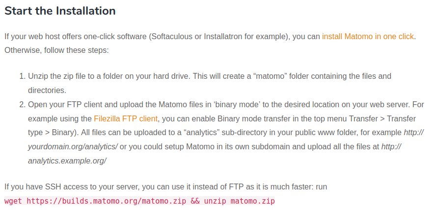
* On Linux, you can unzip the ZIP file using `unzip` in your terminal or by double-clicking it in your file manager.
* On Windows/macOS, you can unzip the ZIP file by double-clicking it in your file manager.
* Now open your FTP client. We used `FileZilla` for the installation.
* Click on `File` -> `Site Manager` -> `New site` and name the server, for example: `MatomoTest`.
  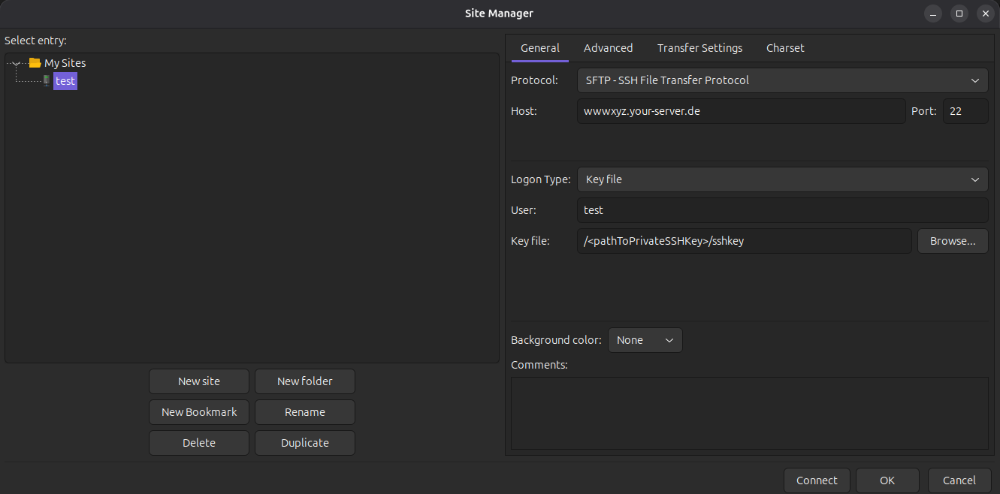
* Go to `Protocol` and select `SFTP-SSH File Transfer Protocol`; the go to `Host` and enter your web hosting server `wwwxyz.your-server.de`. Then go to `Port` and select `22`.
* Go to`Logon Type` and select `Key file`. Then go to `User` and enter your login name from konsoleH.
* Under `Key file`, click on `Browse`.
* In the now-open window, navigate to the directory where you saved your SSH key pair.
* Now select your private key:

  ```bash
  id_<type>
  ```

* Add it to `Filezilla` by double-clicking it, and connect to the web directory on the web hosting server by clicking on `connect`.
* In `FileZilla`, navigate to the directory on the left where you extracted the `matomo.zip` file and to your `public_html` directory on the right.
* Now drag the `matomo` folder from the left window to the right window and wait until FileZilla has completed the transfer.
  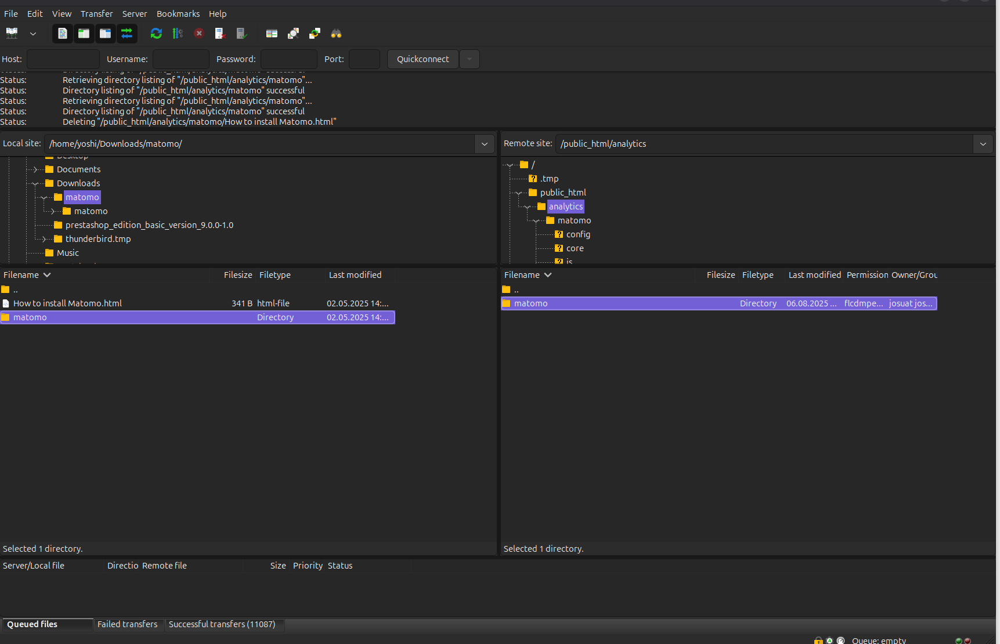
  
## Step 3 - Matomo installation wizard

* In your browser, navigate to the domain address and specify the Matomo directory: `https://example.de/matomo/`.
  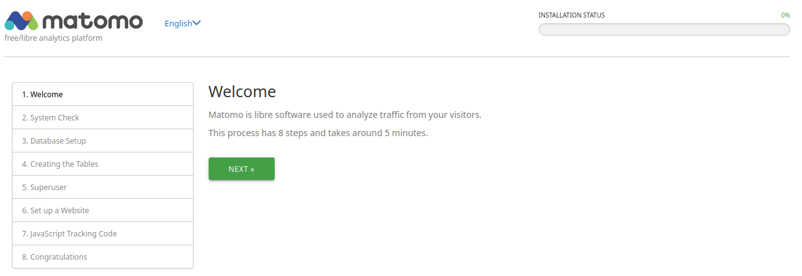
*You should now be on the installer's welcome page. You can select the language in the top right next to the Matomo logo.
* Click on `NEXT`, and you will be taken to the system check. Here, you will find a list of all the requirements for Matomo.
  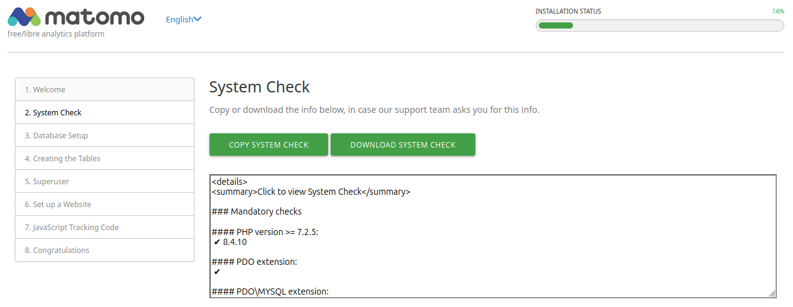
* By clicking on `NEXT`, you will be taken to the database setup. Here, you need to fill in the data from konsoleH:
  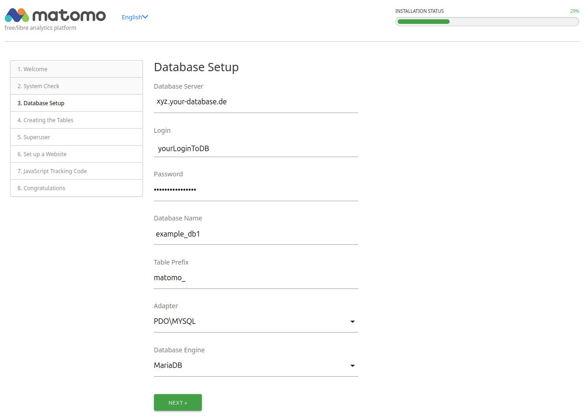
* Click on `NEXT` to check that the data is correct and that a connection to the database can be established:
  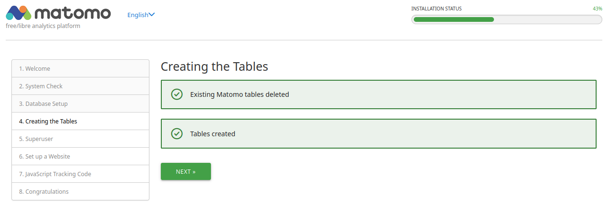
* On the next page, set your login details for the Matomo web interface. Please note the [best practices of Matomo](https://matomo.org/faq/on-premise/how-to-configure-matomo-for-security/).
  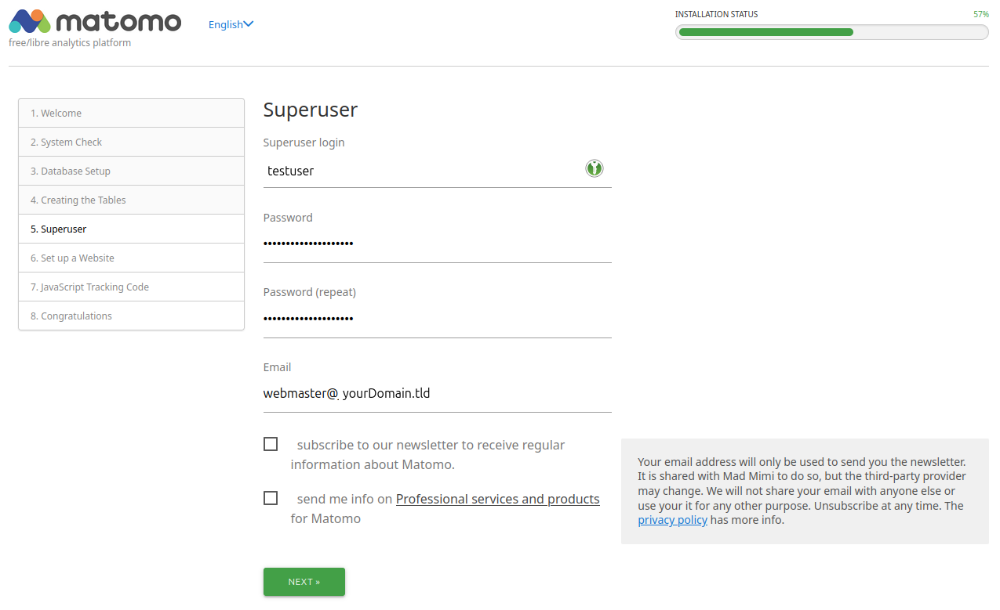
* On the following page, enter your website name, URL, and time zone.
  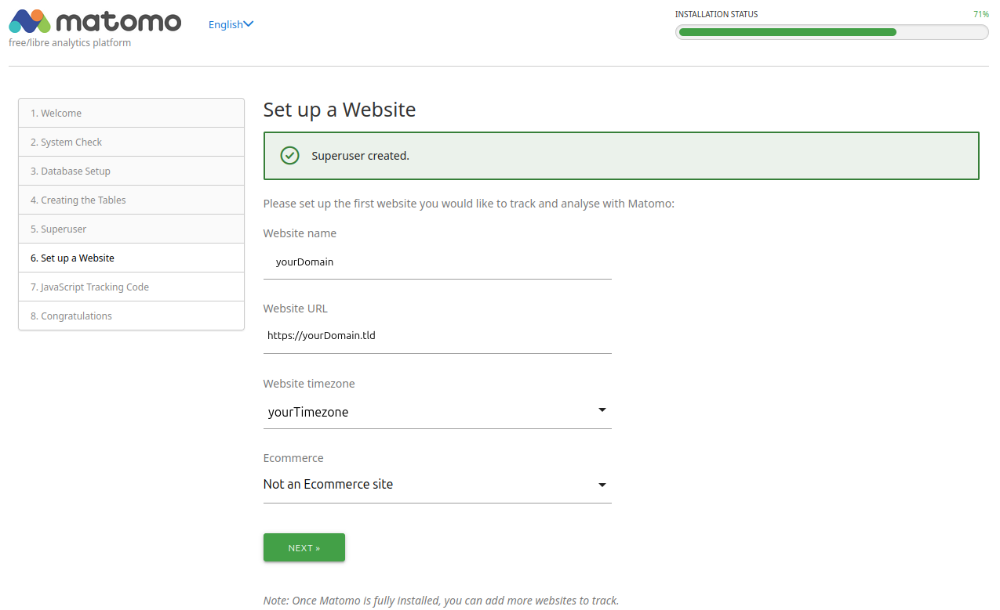
* Under 7., you will now find the Matomo tracking code, which you need to insert into the pages of your website or web shop. For some websites, blogs, CMSes, and web shops, a plugin already exists for this purpose. You can find a list of available plugins at: [https://matomo.org/guide/tracking-data/integrations/](https://matomo.org/guide/tracking-data/integrations/).
  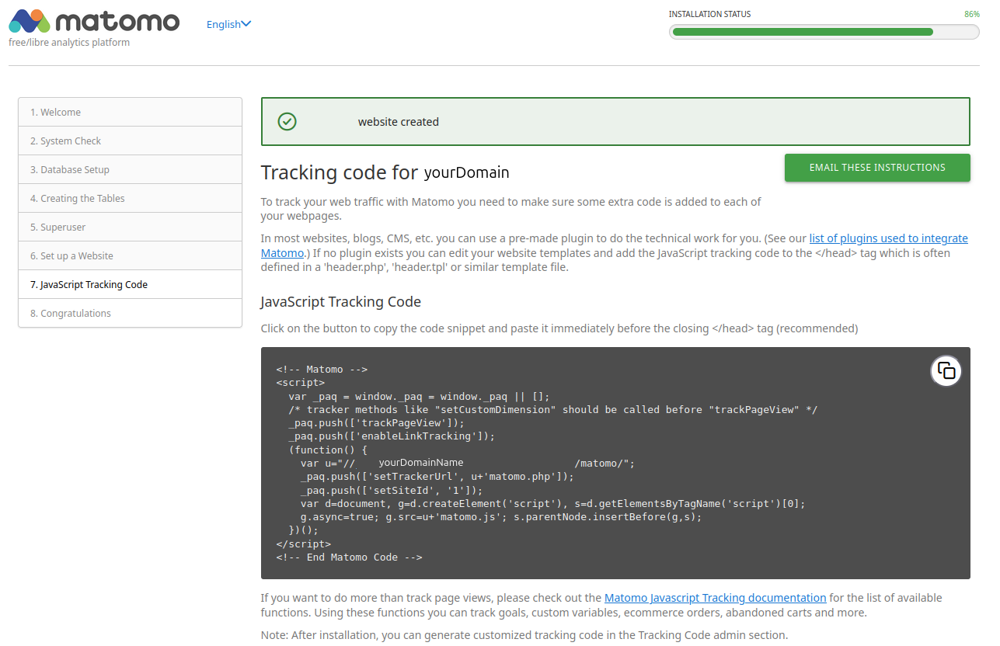
* On the last page, you will find an overview of additional possible steps, and you can access the administration interface of your Matomo installation by clicking on `CONTINUE TO MATOMO`.
  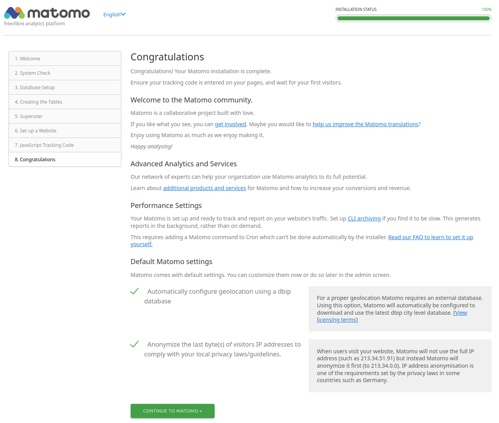
* Congratulations, you should now be done with the installation and setup of Matomo.

##### License: MIT

<!--
Contributor's Certificate of Origin
By making a contribution to this project, I certify that:
(a) The contribution was created in whole or in part by me and I have
    the right to submit it under the license indicated in the file; or
(b) The contribution is based upon previous work that, to the best of my
    knowledge, is covered under an appropriate license and I have the
    right under that license to submit that work with modifications,
    whether created in whole or in part by me, under the same license
    (unless I am permitted to submit under a different license), as
    indicated in the file; or
(c) The contribution was provided directly to me by some other person
    who certified (a), (b) or (c) and I have not modified it.
(d) I understand and agree that this project and the contribution are
    public and that a record of the contribution (including all personal
    information I submit with it, including my sign-off) is maintained
    indefinitely and may be redistributed consistent with this project
    or the license(s) involved.
Signed-off-by: Josua Eisenbraun <j.eisenbraun@pm.me>
-->