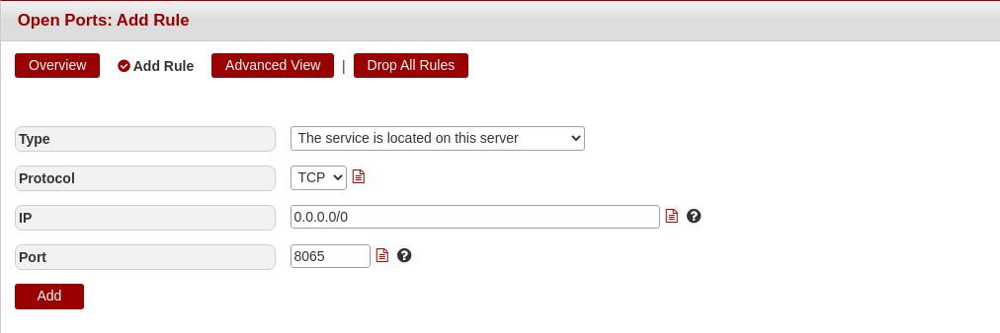
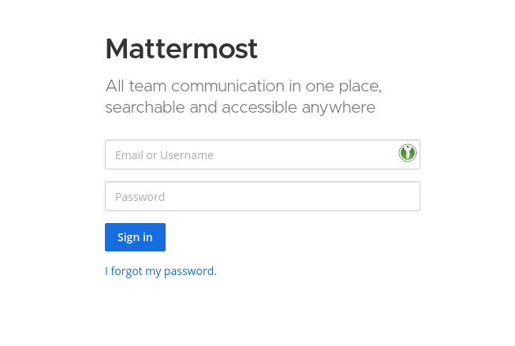

## Introduction

This tutorial will show you how to set up a Mattermost Server on a Managed Server.

**Prerequisites**

You will need:

* A Managed Server with SSH access
* A Processwatch exception for "mattermost" (-> You can request this through a support request via konsoleH)
* A MySQL Database (-> You can create one in konsoleH)

This is the example Data that is used throughout the tutorial. Please replace this with your own data:

* Database Name: `mattermost`
* MySQL Username: `holu`
* MySQL Password: `dbpassword`
* Domain: `example.com`

## Step 1 - Getting Mattermost

First you need to download Mattermost. You can get the most recent link from the [official download page](https://mattermost.com/deploy/).
In this case we will install version `6.0.2`:

```bash
wget https://releases.mattermost.com/6.0.2/mattermost-6.0.2-linux-amd64.tar.gz
```

After the download is finished, the archive must be extracted:

```bash
tar -xvzf mattermost*.tar.gz
```

If the extraction finished successfully, you can remove the archive:

```bash
rm mattermost*.tar.gz
```

Congratulations, you successfully downloaded mattermost to your server! :tada: In the next steps you will find out, how to set it up properly.

## Step 2 - Creating the data directory

Next we need to create a storage directory. This will contain all files and images that users post on Mattermost. The default directory is called `data`. If you want to use another directory for this, please change the path in the Mattermost configuration file.

```bash
cd mattermost
mkdir data
```

## Step 3 - Configuring Mattermost

Now that the file structure is prepared, you need to do some adjustments to the configuration file, to get Mattermost started.
The file can be found at `config/config.json`. You can open it with your favorite editor. In this example `nano` is used:

```bash
nano config/config.json
```

The first setting, that needs to be adjusted, is the `SiteURL` and `WebsocketURL`. Here you need to set the URL, that you want to run your mattermost installation on. For example:

```json
"SiteURL": "https://example.com",
"WebsocketURL": "wss://example.com"
```

Next you need to connect Mattermost with your MySQL Database (please replace the sample data):

```json
"SqlSettings": {
    "DriverName": "mysql",
    "DataSource": "holu:dbpassword@tcp(localhost:3306)/mattermost?charset=utf8mb4,utf8\u0026writeTimeout=30s",
```

This is everything that you need to change in the default configuration, to get Mattermost up and running. You can save and close the file.

## Step 3 - Testing your configuration

Now that you finished your configuration, you can test it by starting mattermost with the following command:

```bash
./bin/mattermost
```

If your configuration is correct, mattermost should now start normally. If there is any error, please make sure that there is no error in your configuration.

## Step 4 - Running Mattermost

The basic installation is now finished. You can start Mattermost in the background with:

```bash
nohup /<path-to-mattermost>/bin/mattermost &
```

The output of the process will get logged in a `nohup.out` file.

To restart Mattermost, if the server is rebooted, you can add a `@reboot` Cronjob in the Cronjob Manager advanced view:

```bash
@reboot /<path-to-mattermost>/bin/mattermost  > /dev/null 2>&1
```

## Step 5 - Accessing your Installation

If Mattermost is running, you have multiple ways to access it:

**Using the Port in the Browser directly**

For this to work, you need to open the port of your mattermost installation (default: `8065`) via konsoleH. After that, you can access it directly through the browser. For example `http://example.com:8065`



**Using Apache as a proxy**

Using Apache as a poxy enables you to reach mattermost without directly supplying the port in the address bar of your browser. To do this, please send a support request and ask for the installation of `mod_proxy_wstunnel` and the activation of the following VHost configuration:

```apacheconf
#Mattermost
ProxyPreserveHost On

# Set web sockets
RewriteEngine On
RewriteCond %{REQUEST_URI} /api/v[0-9]+/(users/)?websocket [NC]
RewriteCond %{HTTP:UPGRADE} ^WebSocket$ [NC]
RewriteCond %{HTTP:CONNECTION} \bUpgrade\b [NC]
RewriteRule .* ws://127.0.0.1:8065%{REQUEST_URI} [P,QSA,L]

<Location />
      Require all granted
      ProxyPass http://127.0.0.1:8065/
      ProxyPassReverse http://127.0.0.1:8065/
      ProxyPassReverseCookieDomain 127.0.0.1 example.com
</Location>
```

## Conclusion

Your installation and configuration of Mattermost is now finished. Happy chatting :tada:



##### License: MIT

<!--

Contributor's Certificate of Origin

By making a contribution to this project, I certify that:

(a) The contribution was created in whole or in part by me and I have
    the right to submit it under the license indicated in the file; or

(b) The contribution is based upon previous work that, to the best of my
    knowledge, is covered under an appropriate license and I have the
    right under that license to submit that work with modifications,
    whether created in whole or in part by me, under the same license
    (unless I am permitted to submit under a different license), as
    indicated in the file; or

(c) The contribution was provided directly to me by some other person
    who certified (a), (b) or (c) and I have not modified it.

(d) I understand and agree that this project and the contribution are
    public and that a record of the contribution (including all personal
    information I submit with it, including my sign-off) is maintained
    indefinitely and may be redistributed consistent with this project
    or the license(s) involved.

Signed-off-by: Lukas Heinrich, lukas@lukas-heinrich.com

-->
