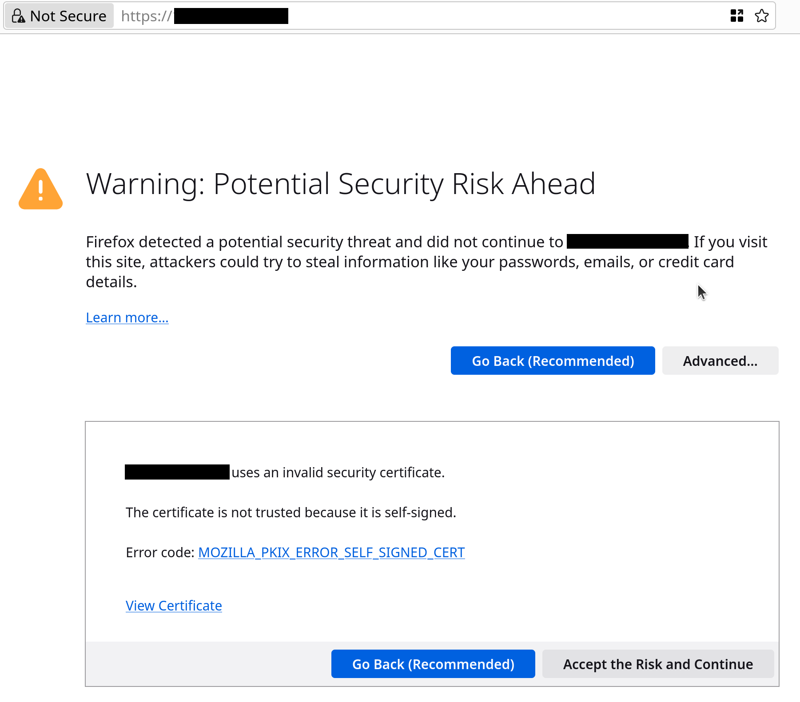
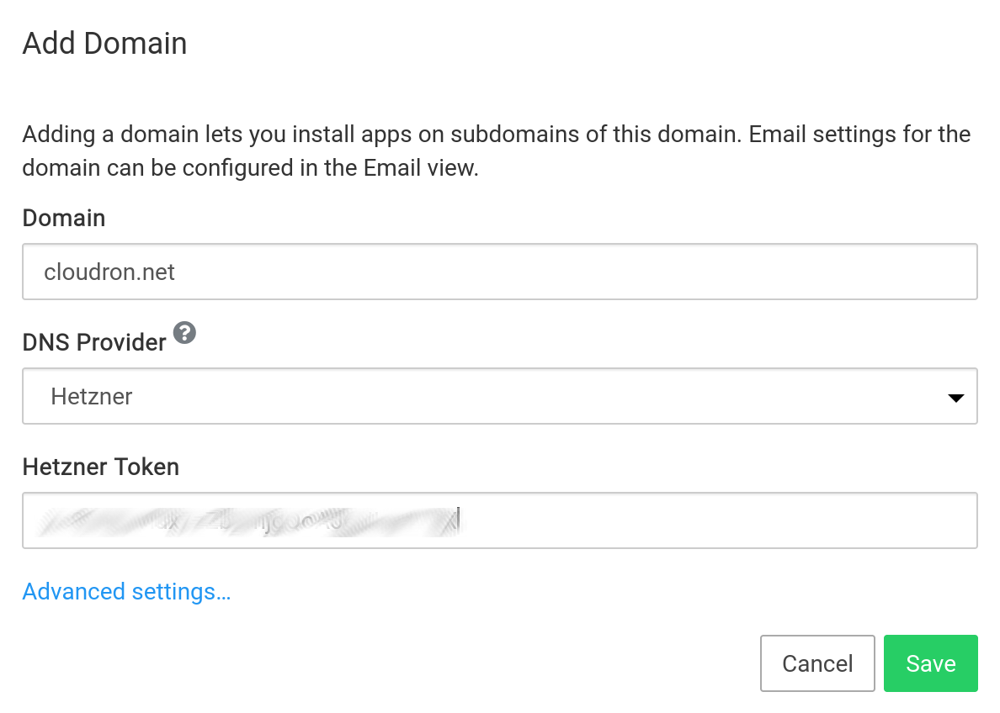
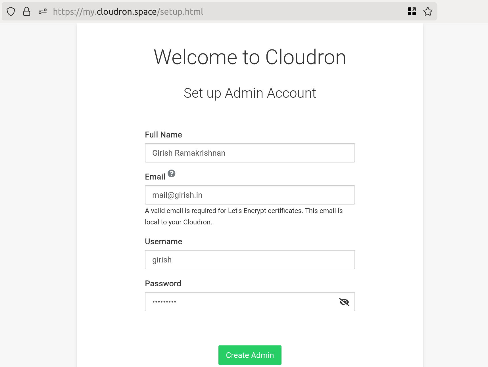
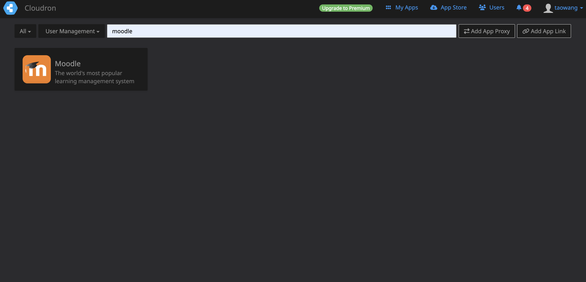
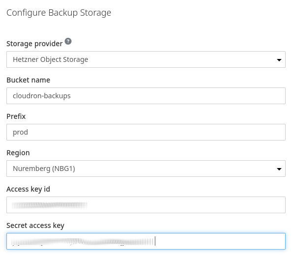

## Introduction

Moodle is a popular Learning Management System (LMS) that helps teachers and instructors create and manage online courses. Whether you're running a school, training center, or just want to create online courses, Moodle is an excellent choice. This tutorial will guide you through installing Moodle on your server and setting up automatic backups to keep your data safe.

### What You'll Learn
- How to install Moodle using Cloudron (a platform that makes server management easy)
- How to secure your Moodle installation with SSL certificates
- How to set up automated backups to protect your course data

### Prerequisites

Before we begin, you'll need:

- A server running Ubuntu 24.04 (x64)
- A domain name you own and can access

## Step 1 - Installing Cloudron

First, we'll install Cloudron, which will help us manage Moodle. Think of Cloudron as a helpful assistant that makes installing and managing web applications much easier.

1. Connect to your Ubuntu server and run these commands:
```bash
wget https://cloudron.io/cloudron-setup
chmod +x cloudron-setup
./cloudron-setup
```

> 💡 **Tip**: These commands download and run the Cloudron installation program.

## Step 2 - Accessing Cloudron for the First Time

Once Cloudron is installed, you'll need to access its interface:

1. Open your web browser
2. Go to `https://YOUR-SERVER-IP` (replace YOUR-SERVER-IP with your actual server's IP address)
3. You'll see a security warning - this is normal for new installations!

> ⚠️ **Don't worry about the security warning**: It appears because we haven't set up proper security certificates yet. This will be fixed automatically in the next steps.

To proceed:
- In Chrome: Click "Advanced" → "Proceed to site"
- In Firefox: Click "Advanced" → "Accept the Risk and Continue"



## Step 3 - Setting Up Your Domain

Now we'll connect your domain name to Cloudron:

Follow these steps to prepare your domain:
1. Make sure your domain uses Hetzner DNS (Robot nameservers)
2. [Set up your domain in Hetzner DNS Console](https://docs.hetzner.com/dns-console/dns/general/getting-started-dns/)
3. [Create a Hetzner API token](https://docs.hetzner.com/dns-console/dns/general/api-access-token/) (this lets Cloudron manage your domain settings)

> ⚠️ **Important**: Your domain must use Robot nameservers (`*.ns.hetzner.com`). If you're using KonsoleH nameservers (`*.your-server.de`), please switch to Robot nameservers first.

Enter your domain name (like `example.com`) in the Cloudron setup screen.



Select "Hetzner DNS" from the dropdown menu.

## Step 4 - Securing Your Installation

After domain setup, Cloudron will automatically:
1. Redirect you to `https://my.yourdomain.com`
2. Set up secure SSL certificates (you'll see a padlock icon in your browser)

Create your administrator account:
- Choose a username
- Enter your email address (must be a valid email address)
- Set a strong password



## Step 5 - Installing Moodle

Now for the exciting part - installing Moodle!

1. Click on "App Store" in the Cloudron dashboard
2. Create a free Cloudron.io account when prompted
   > 💡 **Good News**: Cloudron's free plan allows you to run up to 2 apps!
3. Find and click on Moodle in the app store
4. Click "Install"



Initial Moodle login credentials:
- Username: `admin`
- Password: `changeme123`
- Email: `admin@cloudron.local`

> ⚠️ **Important**: Change these default credentials immediately after logging in!

## Step 6 - Setting Up Automated Backups

Let's protect your Moodle data with automated backups:

Set up your storage:
- [Create a Bucket](https://docs.hetzner.com/storage/object-storage/getting-started/creating-a-bucket/) in Hetzner (your secure cloud storage space)
- [Generate S3 API keys](https://docs.hetzner.com/storage/object-storage/getting-started/generating-s3-keys/) for secure access

In Cloudron dashboard:
   - Go to backup settings
   - Select "Hetzner Object Storage"
   - Enter your S3 keys



Recommended backup settings:
- Format: tgz (better for most users)
- Backup Interval: Daily
- Retention Policy: 7 daily (keeps one backup per day for a week)

> 💡 **Pro Tip**: The tgz format is best unless you're storing huge amounts of data

## Maintaining Your Moodle Installation

### Updates

Cloudron will handle updates automatically, but it's recommended to disable auto-updates for Moodle. You must update plugins and themes first before updating Moodle itself. If you update Moodle first and the plugins and themes are not compatible with the new version, your Moodle instance may break.

### Plugins

Install only the plugins you absolutely need. Installing too many plugins can slow down your Moodle installation and make it harder to manage.

Always update your plugins and themes first before updating Moodle.

### Customization

Avoid modifying Moodle's source code directly. Instead, you can inject HTML, CSS, and JavaScript code in Moodle's Site Administration.

However, it's highly recommended to use a development instance to test your code first. For example, you can use the [Moodle demo instance](https://sandbox.moodledemo.net/).

## Conclusion

Congratulations! 🎉 You now have:
- A professionally installed Moodle system
- Automatic SSL security
- Daily backups of your data

Your Moodle installation is ready to host courses and support your students!

##### License: MIT

<!--

Contributor's Certificate of Origin

By making a contribution to this project, I certify that:

(a) The contribution was created in whole or in part by me and I have
    the right to submit it under the license indicated in the file; or

(b) The contribution is based upon previous work that, to the best of my
    knowledge, is covered under an appropriate license and I have the
    right under that license to submit that work with modifications,
    whether created in whole or in part by me, under the same license
    (unless I am permitted to submit under a different license), as
    indicated in the file; or

(c) The contribution was provided directly to me by some other person
    who certified (a), (b) or (c) and I have not modified it.

(d) I understand and agree that this project and the contribution are
    public and that a record of the contribution (including all personal
    information I submit with it, including my sign-off) is maintained
    indefinitely and may be redistributed consistent with this project
    or the license(s) involved.

Signed-off-by: Tao Wang taowang@riverhill.ai

-->
