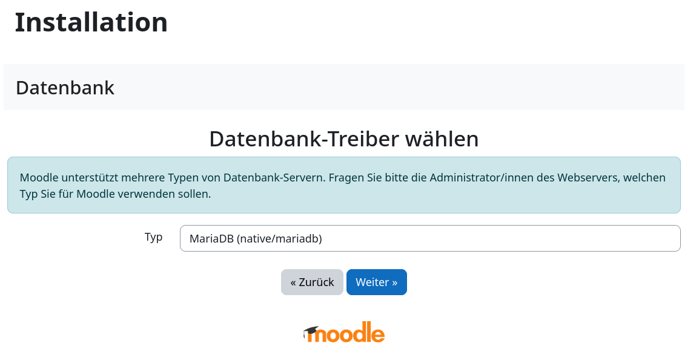

**Was ist Moodle?**
Moodle ist ein kostenloses Bildungssystem, mit dem man Online-Kurse erstellen und absolvieren kann.

**Beispiel-Benennungen**

* Benutzername: `moodlc`
* Hostname: `<wwwXXX>`
* Domain: `<example.com>`
* Subdomain: `<moodle.example.com>`
    

#### Moodle installieren

##### Schritt 1 - Moodle herunterladen

Um [Moodle](https://moodle.org/) herunterzuladen kann man entweder eine SSH- oder eine FTP-Verbindung verwenden. Die Zugangsdaten können in [konsoleH](https://konsoleh.hetzner.com/) unter `Zugangsdetails` > `Logindaten` eingesehen werden.


* **Option 1 - Über SSH-Verbindung**<br>
  Für diese Option ist mindestens [Webhosting L](https://www.hetzner.com/webhosting) nötig.
  
  * **1.1** <u>Datei herunterladen</u><br>
    Nachdem eine SSH-Verbindung hergestellt wurde, kann die Datei heruntergeladen werden.
    ```bash
    moodlc@<wwwXXX>:~$ wget https://packaging.moodle.org/stable500/moodle-latest-500.tgz
    ```
  
  * **1.2** <u>Datei entpacken</u><br>
    Nachdem die `tar.gz`-Datei heruntergeladen wurde, kann diese entpackt werden.
    ```bash
    moodlc@<wwwXXX>:~$ tar -xf moodle-latest-500.tgz
    ```
    Im aktuellen Ordner sollte jetzt der `moodle`-Ordner sichtbar sein.

  * **1.3** <u>Dateien verschieben</u><br>
    Der `moodle`-Ordner kann jetzt in den `public_html`-Ordner verschoben werden.
    ```bash
    moodlc@<wwwXXX>:~$ mv moodle ~/public_html
    ```

-----------

* **Option 2 - Über FTP-Verbindung**<br>
  
  * **1.1** <u>ZIP-Datei auf dem lokalen Gerät herunterladen</u><br>
    Öffnen Sie https://download.moodle.org/download.php/stable500/moodle-latest-500.zip, um die aktuellste Version herunterzuladen.
  
  * **1.2** <u>ZIP-Datei entpacken</u><br>
    * Öffnen Sie auf Ihrem lokalen Gerät den "Downloads"-Ordner. Dort sollte die Moodle-Datei liegen.
    * Wählen Sie die Moodle-Datei mit einem Rechtsklick aus.
    * Wählen Sie „Alle extrahieren“ (unter Windows) oder verwenden Sie das Entpackprogramm Ihres Systems.

  * **1.3** <u>Entpackte Dateien per FTP hochladen</u><br>
    Die Dateien müssen jetzt per FTP auf den Server kopiert werden. Wählen den `moodle`-Ordner auf dem lokalen Gerät aus und kopieren Sie diesen in den `public_html`-Ordner auf dem Server.

##### Schritt 2 - Startverzeichnis anpassen

* Öffnen Sie [konsoleH](https://konsoleh.hetzner.com/)
* Wählen sie `Konfiguration` > `Serverkonfiguration` aus
* Clicken sie den Ordner `moodle` unter `public_html` an.
* Gehen sie auf "Startverzeichnis setzen"
  

##### Schritt 3 - PHP-Einstellungen bearbeiten

* Bleiben sie in der KonsoleH
* Wählen Sie `Konfiguration` > `PHP-Konfiguration »` aus
* Unter "PHP-Einstellungen", stellen Sie `max_input_vars` auf 5000
* Scrollen Sie nach ganz unten und speichern Sie die Änderungen
  

##### Schritt 4 - Datenbank erstellen

* Bleiben sie in der KonsoleH
* Wählen sie Einstellungen > Datenbanken > MariaDB/MySQL
* Erstellen sie eine neue Datenbank (hinzufügen)
* Bestätigen sie die Erstellung (hinzufügen)
* Browser-Tab offen halten, um die Zugangsdaten später einzugeben.

##### Schritt 5 - Moodle installieren

Geben Sie im Webbrowser den Domainnamen ein (z.B. `moodle.example.com`). Dort sollte die Installationsseite für Moodle angezeigt werden. 

* Wählen Sie eine Sprache und klicken Sie anschließend auf `Weiter`.
  
* Setzen sie das Datenverzeichnis auf `/usr/home/moodlc/moodle` (mit ihrem Nutzernamen ersetzen).
  
* Wählen sie MariaDB als Datenbank aus.
  
* Trag die Datenbankdetails aus der KonsoleH ein.
  
* Bestätigen sie die Lizenz, Server-Überprüfung und Installtion (jeweils ganz unten).
* Geben Sie anschließend die Informationen für den neuen Admin-Login für Moodle ein.
  
* Danach können sie noch den Namen und Beschreibung der Webseite festlegen.
* Abschließend können sie die Webseite registrieren, dieser Schritt kann unten links übersprungen werden.

#### Nächste Schritte

Wenn alles wie erwartet funktioniert hat, können Sie jetzt mit Moodle loslegen! Über `https://moodle.example.com/my/courses.php` können Sie neue Artikel hinzufügen und die Seite so einrichten, wie Sie es brauchen. Über `https://moodle.example.com/my/` können Sie auf das Dashboard zugreifen und die Kurse sowie den Kalender sehen.

##### License: MIT

<!--

Contributor's Certificate of Origin

By making a contribution to this project, I certify that:

(a) The contribution was created in whole or in part by me and I have
    the right to submit it under the license indicated in the file; or

(b) The contribution is based upon previous work that, to the best of my
    knowledge, is covered under an appropriate license and I have the
    right under that license to submit that work with modifications,
    whether created in whole or in part by me, under the same license
    (unless I am permitted to submit under a different license), as
    indicated in the file; or

(c) The contribution was provided directly to me by some other person
    who certified (a), (b) or (c) and I have not modified it.

(d) I understand and agree that this project and the contribution are
    public and that a record of the contribution (including all personal
    information I submit with it, including my sign-off) is maintained
    indefinitely and may be redistributed consistent with this project
    or the license(s) involved.

Signed-off-by: Adrian Struwe <github@eskaan.de>

-->

