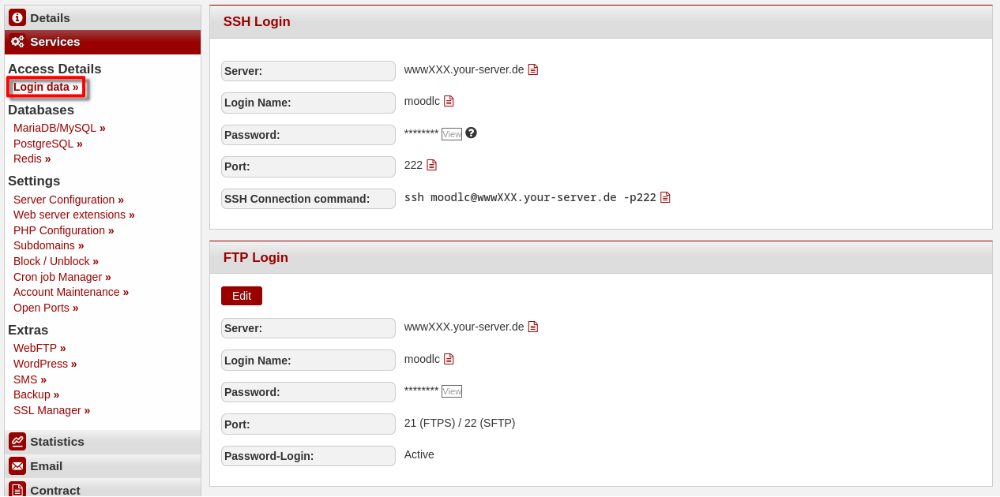
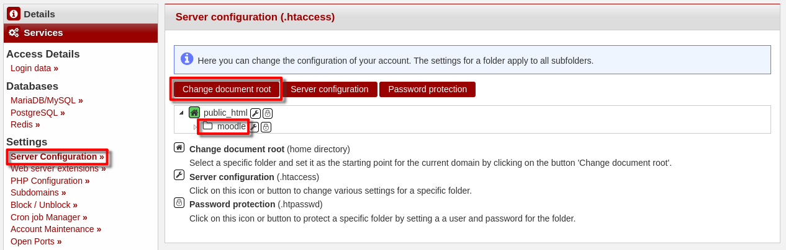
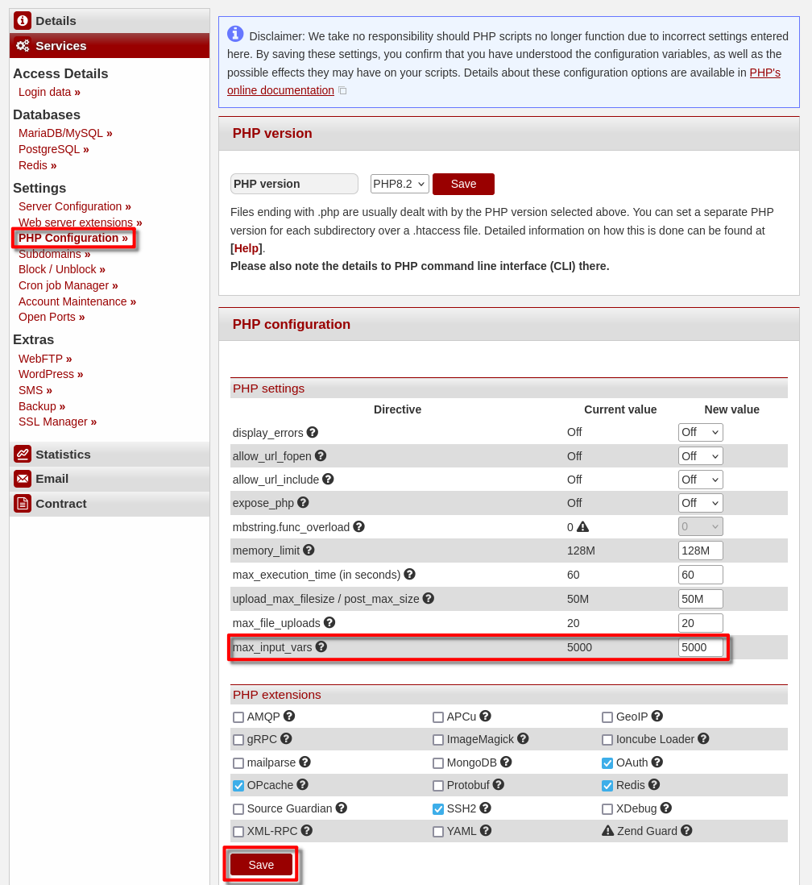
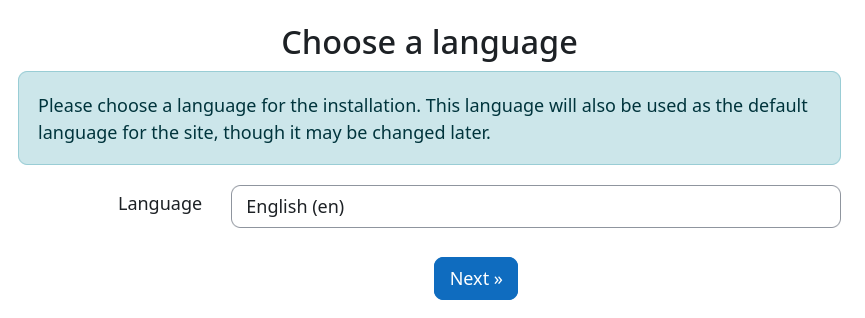
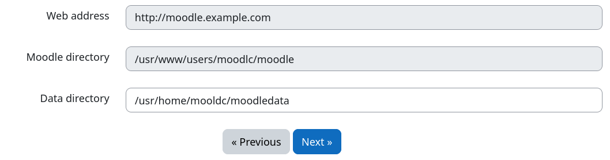
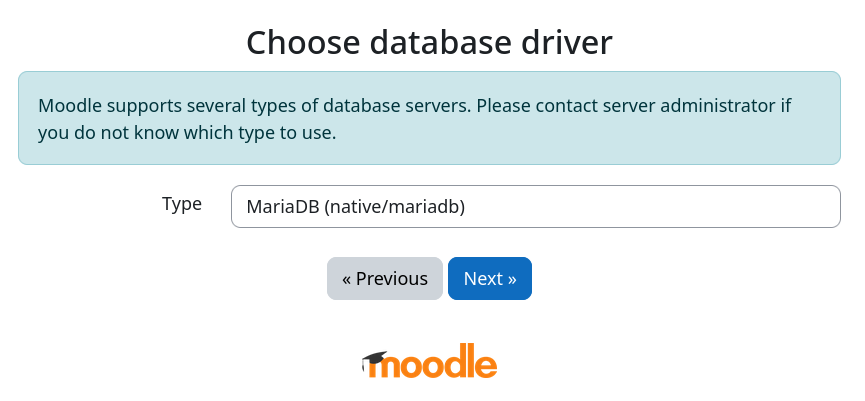
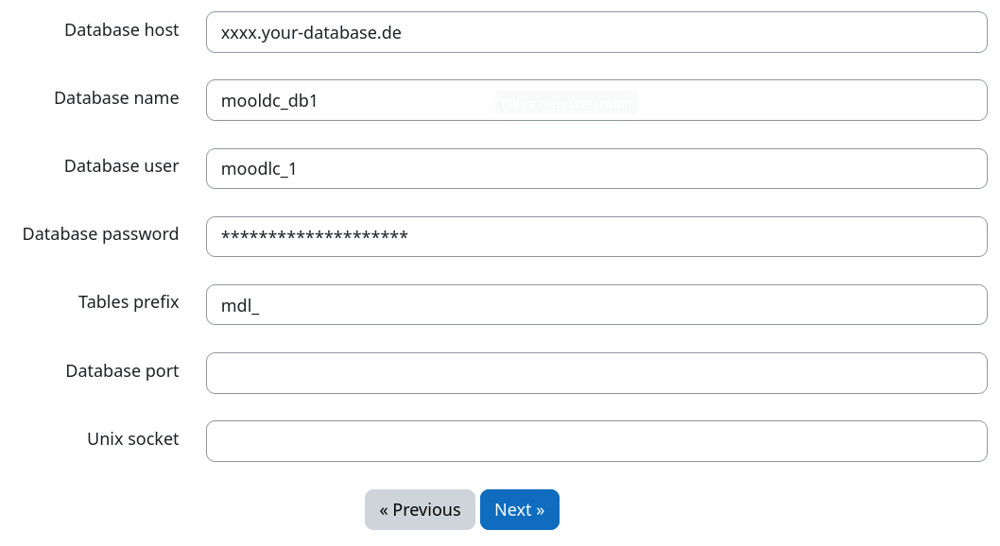
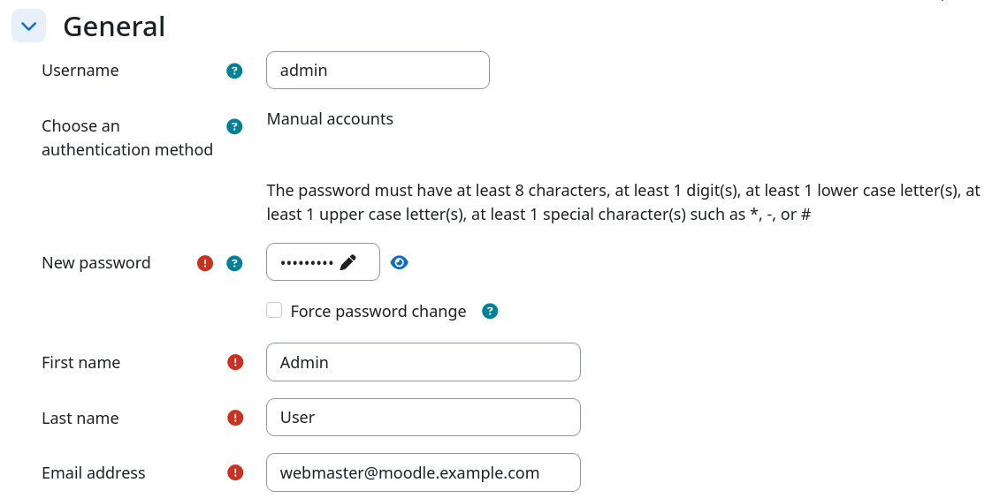

**What is Moodle?**
Moodle is a free online learning platform where you can create courses for students and they can graduate them.


**Information:**
This is a 3rd party application. We do not provide Moodle technical support, and we cannot guarantee that it will work properly. For Moodle support, please see https://moodle.org/

**Example terminology**
* Username: `moodlec`
* Hostname: `<wwwXXX>`
* Domain: `<example.com>`
* Subdomain: `<moodle.example.com>`

## Install Moodle

### Step 1 - Download moodle

To download [Moodle](https://moodle.org/) you either need a SSH- or FTP connection to the server. The login details can be found in the  [konsoleH](https://konsoleh.hetzner.com/) under `Access details`→`Login data`.


* **Option 1 - Via an SSH connection**<br>
  For this option, you need [Web Hosting L](https://www.hetzner.com/webhosting) or higher.

  * <u>Download the file</u><br>
    After you establish an SSH connection to your server, you can download the file directly into the `public_html` directory.
    ```bash
    moodlc@<wwwXXX>:~$ wget https://packaging.moodle.org/stable500/moodle-latest-500.tgz
    ```
  
  * <u>Unzip the file</u><br>
    Once the `tar.gz` file is downloaded, you can unzip it.
    ```bash
    moodlc@<wwwXXX>:~$ tar -xf moodle-latest-500.tgz
    ```
    The current directory should now include the `moodle` directory.

  * <u>Move the files</u><br>
    You can now move the directory into to the `public_html` directory.
    ```bash
    moodlc@<wwwXXX>:~$ mv moodle ~/public_html
    ```
    The `public_html` directory should now include the `moodle` directory.

-----------

* **Option 2 - Via an FTP connection**<br>
  
  * <u>Download the file on your local device</u><br>
    Open https://download.moodle.org/download.php/stable500/moodle-latest-500.zip to download the latest version.
  
  * <u>Unzip the file</u><br>
    * On your local device, open the "Downloads" directory. There, you should see the Moodle ZIP file.
    * Right-click on the Drupal file.
    * In the menu that opens, select "Extract Here" (Linux) or "Extract All" (Windows).
  
  * <u>Upload the unzipped files via FTP</u><br>
    You now need to copy the files on the server via FTP. The `moodle` directory should be in the "Downloads" directory. Select the directory on your local device and copy it to the `public_html` directory on the server.


### Step 2 - Changing the webroot

* Open [konsoleH](https://konsoleh.hetzner.com/)
* Go to `Settings` > `Server Configuration`
* Select the directory `moodle` beneath `public_html`.
* Click on "Change document root"
  

### Step 3 - Edit the PHP settings

* Stay in konsoleH.
* Go to `Settings` > `PHP Configuration`
* Scroll down to "PHP settings" and set the value of  `may_input_vars` to 5000
* Scroll to the bottom and save the changes
  

### Step 4 - Creating a database

* Stay in konsoleH.
* Select Services > MariaDB/MySQL
* Create a new Database (add)
* Confirm database creation (add)
* Keep the browser-tab open to enter the login credentials later.

### Step 5 - Installing Moodle

Open your website in the browser (i.e. `moodle.example.com`). There you should see the installation prompt for Moodle.

* Select a Language and click on `next`.
  
* set the Data directory to `/usr/home/moodlc/moodle` (replace with your username).
  
* Select MariaDB as database type.
  
* Inset your database login details from konsoleH.
  
* Confirm the license, server-check and installation (at the bottom respectively).
* Afterwards, enter your information for the new Moodle admin user.
  
* Then you can enter the name and description of your website.
* Finishing up, you can choose to register the site or skip this step at the bottom left.

## Next steps

If all works as expected, you can start using Moodle! Under `https://moodle.example.com/my/courses.php` you are able to create new courses and configure the site to your needs. Using `https://moodle.example.com/my/` you can access the dashboard to see the current available courses as well as the calendar.

##### License: MIT

<!--

Contributor's Certificate of Origin

By making a contribution to this project, I certify that:

(a) The contribution was created in whole or in part by me and I have
    the right to submit it under the license indicated in the file; or

(b) The contribution is based upon previous work that, to the best of my
    knowledge, is covered under an appropriate license and I have the
    right under that license to submit that work with modifications,
    whether created in whole or in part by me, under the same license
    (unless I am permitted to submit under a different license), as
    indicated in the file; or

(c) The contribution was provided directly to me by some other person
    who certified (a), (b) or (c) and I have not modified it.

(d) I understand and agree that this project and the contribution are
    public and that a record of the contribution (including all personal
    information I submit with it, including my sign-off) is maintained
    indefinitely and may be redistributed consistent with this project
    or the license(s) involved.

Signed-off-by: Adrian Struwe <github@eskaan.de>

-->

