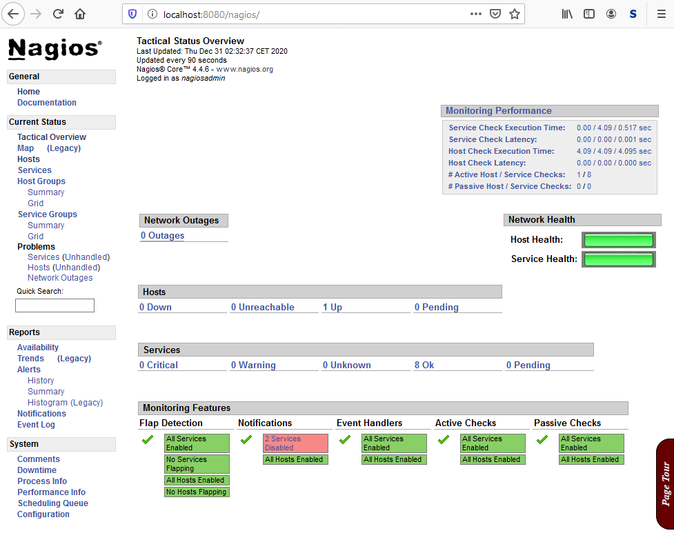

## Introduction

In this tutorial we will learn how to install a rootless Nagios Core monitoring system with a basic configuration on a Managed Server. Before we can run Nagios we need to compile our own versions of Apache and PHP since we can't use the preinstalled managed versions to get it to work. After the installation of Nagios and previously mentioned dependencies a few small adjustments in its configurations are necessary.

**Prerequisites**

- [Managed Server](https://www.hetzner.com/managed-server?country=ot) with enabled SSH access
- Hetzner Development Package (hos-dev) -> please ask the support

## Step 1 - Install Nagios Core and dependencies

First we need to download and and compile various sources.

Before we start, create a directory for the sources to keep the home directory clean.

```bash
cd
mkdir src
cd src
```

### Step 1.1 - Apache HTTP Server source installation

Download and compile the Apache sources.

- Always check [here](https://www.apache.org/) for newer stable versions

```bash
wget https://apache.org/dist/httpd/httpd-2.4.46.tar.bz2
wget https://apache.org/dist/apr/apr-1.7.0.tar.bz2
wget https://apache.org/dist/apr/apr-util-1.6.1.tar.bz2
tar xjvf httpd-2.4.46.tar.bz2
tar xjvf apr-1.7.0.tar.bz2
tar xjvf apr-util-1.6.1.tar.bz2
cp -r apr-1.7.0 httpd-2.4.46/srclib/apr
cp -r apr-util-1.6.1 httpd-2.4.46/srclib/apr-util
cd httpd-2.4.46
./configure --prefix=/usr/home/holu/nagios --with-included-apr --enable-so
make -j $(($(grep ^cpu\ cores /proc/cpuinfo | uniq | sed s/[^0-9]//g)+1))
make install
cd ..
```

### Step 1.2 - PHP 7.3 source installation

First install the dependency pkg-config and libxml2 using the Custom Software Installer.

```bash
software install pkg-config
software install libxml2
```

Next download and compile the PHP 7.3 sources.

- Always check [here](https://www.php.net/) for newer stable versions
- At the moment Nagios only works properly with PHP 7.3

```bash
wget https://www.php.net/distributions/php-7.3.25.tar.xz
tar xJvf php-7.3.25.tar.xz
cd php-7.3.25
./configure --prefix=/usr/home/holu/nagios --with-apxs2=/usr/home/holu/nagios/bin/apxs --with-config-file-path=/usr/home/holu/nagios/conf/
make -j $(($(grep ^cpu\ cores /proc/cpuinfo | uniq | sed s/[^0-9]//g)+1))
make install
cp php.ini-development /usr/home/holu/nagios/conf/php.ini
cd ..
```

### Step 1.3 - Nagios Core source installation

Everything is fine to compile Nagios now.

- Always check [here](https://sourceforge.net/projects/nagios/) for newer stable versions

```bash
wget https://downloads.sourceforge.net/project/nagios/nagios-4.x/nagios-4.4.6/nagios-4.4.6.tar.gz
tar xzvf nagios-4.4.6.tar.gz
cd nagios-4.4.6
./configure --prefix=/usr/home/holu/nagios/nagios --with-cgiurl=/nagios/cgi-bin --with-htmurl=/nagios/ --with-nagios-user=holu --with-nagios-group=holu --with-command-group=holu --with-httpd-conf=/usr/home/holu/nagios/conf
make all -j $(($(grep ^cpu\ cores /proc/cpuinfo | uniq | sed s/[^0-9]//g)+1))
make install
make install-commandmode
make install-config
make install-webconf
cp -r contrib/eventhandlers/ /usr/home/holu/nagios/nagios/libexec/
cd ..
```

### Step 1.4 - Monitoring Plugins source installation

Finally compile the Monitoring Plugins.

- Always check [here](https://www.monitoring-plugins.org/) for newer stable versions

```bash
wget https://www.monitoring-plugins.org/download/monitoring-plugins-2.3.tar.gz
tar xzvf monitoring-plugins-2.3.tar.gz
cd monitoring-plugins-2.3
./configure --prefix=/usr/home/holu/nagios/nagios --with-nagios-user=holu --with-nagios-group=holu
make -j $(($(grep ^cpu\ cores /proc/cpuinfo | uniq | sed s/[^0-9]//g)+1))
make install
```

## Step 2 - Basic configuration of Apache

In this step we will edit the configuration of Apache.

The main Apache configuration file can be found under
- `/usr/home/holu/nagios/conf/httpd.conf`

### Step 2.1 - Change the default Apache Port

Open the httpd.conf, search for "Listen 80" and replace the Port with any free Port >1024 (In this tutorial we use 8080). 

```
Listen 8080
```

### Step 2.2 - Enable PHP and CGI

Search and uncomment the line below to load the cgid module.

```
LoadModule cgid_module modules/mod_cgid.so
```

Extend the DirectoryIndex directive with index.php.

```
#
# DirectoryIndex: sets the file that Apache will serve if a directory
# is requested.
#
<IfModule dir_module>
    DirectoryIndex index.html index.php
</IfModule>
```

Add the following directive to the end of the file.

```
<FilesMatch \.php$>
    SetHandler application/x-httpd-php
</FilesMatch>
```

### Step 2.3 - Enable the Nagios webconfig

The following include enables the Nagios webconfig. Add it to the end of the file.

```
Include conf/nagios.conf
```

## Step 3 - Basic configuration of Nagios

In this step we will edit the Nagios webconfig for Apache, add an email contact for notifications and set a password for the BasicAuth which protects the WebGUI.

The Nagios webconfig file can be found under
- `/usr/home/holu/nagios/conf/nagios.conf`

The Nagios contact definitions file can be found under
- `/usr/home/holu/nagios/nagios/etc/objects/contacts.cfg` 

### Step 3.1 - Fix the Nagios webconfig

Unfortunately the default Alias directive in the Nagios webconfig does not work with Apache, but as solution it can be replaced with a symbolic link.  

Comment out the Alias directive and change the Directory directive for "/usr/home/holu/nagios/nagios/share" like the content below.

```
#Alias /nagios/ "/usr/home/holu/nagios/nagios/share"

<Directory "/usr/home/holu/nagios/htdocs/nagios">
```

Add a symbolic link

```bash
ln -s /usr/home/holu/nagios/nagios/share /usr/home/holu/nagios/htdocs/nagios
```

### Step 3.2 - Add a valid email address to contact definition

To receive email notifications and avoid undeliverable emails from your Nagios server you should replace the default address holu@localhost with a valid address.

```
###############################################################################
#
# CONTACTS
#
###############################################################################

# Just one contact defined by default - the Nagios admin (that's you)
# This contact definition inherits a lot of default values from the
# 'generic-contact' template which is defined elsewhere.

define contact {

    contact_name            nagiosadmin             ; Short name of user
    use                     generic-contact         ; Inherit default values from generic-contact template (defined above)
    alias                   Nagios Admin            ; Full name of user
    email                   monitor@example.com ; <<***** CHANGE THIS TO YOUR EMAIL ADDRESS ******
}
```

### Step 3.3 - Set a password for the WebGUI

Create a password database file for Apache BasicAuth. The user should always be "nagiosadmin".

```bash
htpasswd -c /usr/home/holu/nagios/nagios/etc/htpasswd.users nagiosadmin
```

## Step 4 - Post installation

### Step 4.1 - The first start

Start the services

```bash
/usr/home/holu/nagios/bin/apachectl start
/usr/home/holu/nagios/nagios/bin/nagios /usr/home/holu/nagios/nagios/etc/nagios.cfg &
```

If you want to run the processes as permanent services, please consider to ask the support for process releases of "nagios" and "httpd".

### Step 4.2 - Choose a way to access

The easiest way to access is a SSH tunnel from a local workstation.

```bash
ssh holu@dediX.your-server.de -p222 -L 8080:localhost:8080
```

Alternatively you can add a proxy rewrite rule to the .htaccess of the managed Apache.

```
RewriteEngine on
RewriteRule   ^(.*)  http://localhost:8080/$1 [P]
```

You can also add an incoming firewall rule to Port 8080/tcp in konsoleH. I strongly recommend to release only trusted IP adresses if you want to do it this way. 



## Conclusion

Now you have a solution to start your rootless Nagios Core monitoring system on a Managed Server. Please read the following documentation for further information.

- [Nagios Documentation](https://www.nagios.org/documentation/)
- [Apache Documentation](https://httpd.apache.org/docs/)
- [PHP Documentation](https://www.php.net/docs.php)

##### License: MIT

<!--

Contributor's Certificate of Origin

By making a contribution to this project, I certify that:

(a) The contribution was created in whole or in part by me and I have
    the right to submit it under the license indicated in the file; or

(b) The contribution is based upon previous work that, to the best of my
    knowledge, is covered under an appropriate license and I have the
    right under that license to submit that work with modifications,
    whether created in whole or in part by me, under the same license
    (unless I am permitted to submit under a different license), as
    indicated in the file; or

(c) The contribution was provided directly to me by some other person
    who certified (a), (b) or (c) and I have not modified it.

(d) I understand and agree that this project and the contribution are
    public and that a record of the contribution (including all personal
    information I submit with it, including my sign-off) is maintained
    indefinitely and may be redistributed consistent with this project
    or the license(s) involved.

Signed-off-by: [Alexander Knerlein alexanderknerlein@outlook.de]

-->
