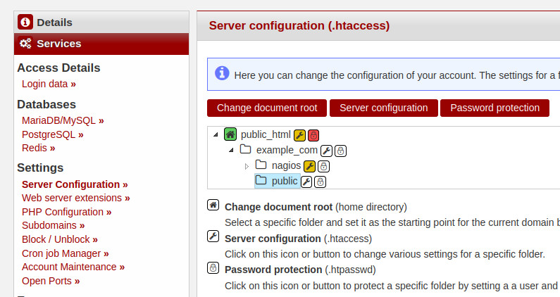
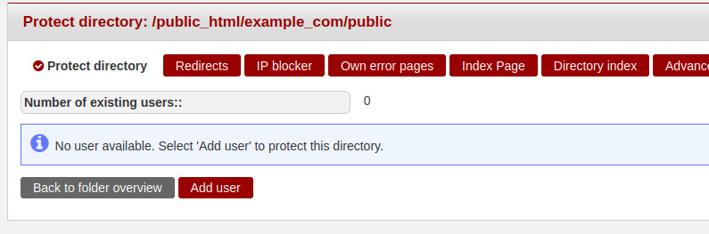
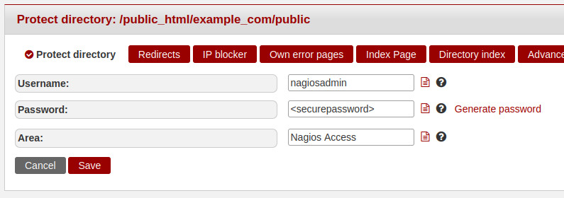
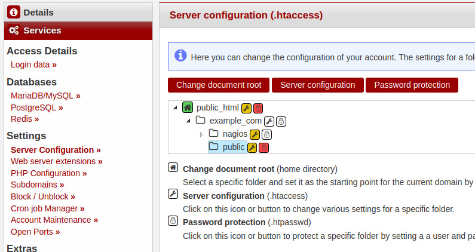
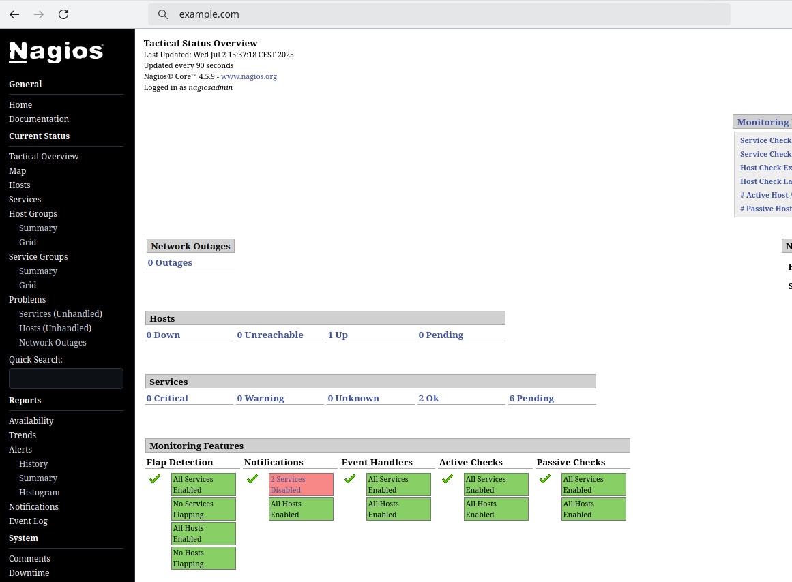

## Introduction

In this tutorial we will learn how to install a rootless Nagios Core monitoring system with a basic configuration on a Managed Server. Before we can run Nagios we need to compile it fronm source. After the installation of Nagios a few small special adjustments in its configurations are necessary to make it work with the Managed Server.

**Prerequisites**

- [Managed Server](https://www.hetzner.com/managed-server?country=ot) with enabled SSH access
- Hetzner Development Package (hos-dev) -> please ask the support

## Step 1 - Install Nagios Core and Monitoring Plugens

First we need to download and and compile various sources.

Before we start, create a directory for the sources to keep the home directory clean.

```bash
cd
mkdir src
cd src
```

### Step 1.1 - Nagios Core source installation and security preparation

Create a directory in public_html for installation and secure it with .htaccess.

```bash
mkdir -p /usr/www/users/holu/example_com/nagios
echo "Require all denied" > /usr/www/users/holu/example_com/nagios/.htaccess
```

Proceed with the compilation of Nagios.

- Always check [here](https://sourceforge.net/projects/nagios/) for newer stable versions

```bash
wget https://downloads.sourceforge.net/project/nagios/nagios-4.x/nagios-4.5.9/nagios-4.5.9.tar.gz
tar xzvf nagios-4.5.9.tar.gz
cd nagios-nagios-4.5.9
./configure --prefix=/usr/www/users/holu/example_com/nagios --with-cgiurl=/cgi-bin --with-htmurl=/ --with-nagios-user=holu --with-nagios-group=holu --with-command-group=holu
make all -j $(($(grep ^cpu\ cores /proc/cpuinfo | uniq | sed s/[^0-9]//g)+1))
make install
make install-commandmode
make install-config
cp -r contrib/eventhandlers/ /usr/www/users/holu/example_com/nagios/libexec/
cd ..
```

### Step 1.2 - Monitoring Plugins source installation

Finally compile the Monitoring Plugins.

- Always check [here](https://www.monitoring-plugins.org/) for newer stable versions

```bash
wget https://www.monitoring-plugins.org/download/monitoring-plugins-2.4.0.tar.gz
tar xzvf monitoring-plugins-2.4.0.tar.gz 
cd monitoring-plugins-2.4.0
./configure --prefix=/usr/www/users/holu/example_com/nagios --with-nagios-user=holu --with-nagios-group=holu
make -j $(($(grep ^cpu\ cores /proc/cpuinfo | uniq | sed s/[^0-9]//g)+1))
make install
```

## Step 2 - Basic configuration of Nagios

### Step 2.1 - Set a valid recipient email address to contacts.cfg for notifications

To receive email notifications and avoid undeliverable emails from your Nagios server you should replace the default recipient address with a valid address.

```bash
vim /usr/www/users/holu/example_com/nagios/etc/objects/contacts.cfg
```
Hit `i` to switch to "insert mode" and replace the nagiosadmin email `holu@localhost` with `recipient@example.com`:

```
###############################################################################
#
# CONTACTS
#
###############################################################################

# Just one contact defined by default - the Nagios admin (that's you)
# This contact definition inherits a lot of default values from the
# 'generic-contact' template which is defined elsewhere.

define contact {

    contact_name            nagiosadmin             ; Short name of user
    use                     generic-contact         ; Inherit default values from generic-contact template (defined above)
    alias                   Nagios Admin            ; Full name of user
    email                   recipient@example.com ; <<***** CHANGE THIS TO YOUR EMAIL ADDRESS ******
}
```

### Step 2.2 - Set a valid sender email address in commands.cfg for notifications

By default Nagios uses a default address to send email notifications. This may lead to blacklistings and spam detection of the emails. We will set a From/envelope-from with a valid address to avoid this. 

```bash
vim /usr/www/users/holu/example_com/nagios/etc/objects/commands.cfg
```

Hit `i` to switch to "insert mode" and add the `-r sender@example.com` between the `/usr/bin/mail` and the `-s` in the command_line for the command_names `notify-host-by-email` and `notify-service-by-email`:

```
################################################################################
#
# SAMPLE NOTIFICATION COMMANDS
#
# These are some example notification commands.  They may or may not work on
# your system without modification.  As an example, some systems will require
# you to use "/usr/bin/mailx" instead of "/usr/bin/mail" in the commands below.
#
################################################################################

define command {

    command_name    notify-host-by-email
    command_line    /usr/bin/printf "%b" "***** Nagios *****\n\nNotification Type: $NOTIFICATIONTYPE$\nHost: $HOSTNAME$\nState: $HOSTSTATE$\nAddress: $HOSTADDRESS$\nInfo: $HOSTOUTPUT$\n\nDate/Time: $LONGDATETIME$\n" | /usr/bin/mail -r sender@example.com -s "** $NOTIFICATIONTYPE$ Host Alert: $HOSTNAME$ is $HOSTSTATE$ **" $CONTACTEMAIL$
}


define command {

    command_name    notify-service-by-email
    command_line    /usr/bin/printf "%b" "***** Nagios *****\n\nNotification Type: $NOTIFICATIONTYPE$\n\nService: $SERVICEDESC$\nHost: $HOSTALIAS$\nAddress: $HOSTADDRESS$\nState: $SERVICESTATE$\n\nDate/Time: $LONGDATETIME$\n\nAdditional Info:\n\n$SERVICEOUTPUT$\n" | /usr/bin/mail -r sender@example.org -s "** $NOTIFICATIONTYPE$ Service Alert: $HOSTALIAS$/$SERVICEDESC$ is $SERVICESTATE$ **" $CONTACTEMAIL$
}
```

## Step 3 - Final preparation for webserver and go live

### Step 3.1 - Create public directory 

Create the public directory. Later it will contain all files and scripts for the Nagios web gui.

```bash
mkdir /usr/www/users/holu/example_com/public
```

### Step 3.2 - konsoleH settings for password protection and document root

Log into [konsoleH](https://konsoleh.hetzner.com), click on "Products", select your domain "example.com" and goto "Services" -> "Server Configuration". Now select the public directory in the list and click on the red button "Password protection".



Click on the red button "Add user".



For the password protection, please set the user "nagiosadmin" (literally), set a secure password and an Area/AuthName, then click on the red button "Save".



Go back to "Services" -> "Server Configuration", select the public directory in the list and click on the red button "Change document root".



### Step 3.3 - Add Symlinks for public directory

Create symbolic links to fill the public directory with the required content.

```bash
ln -s /usr/www/users/holu/example_com/nagios/share/* /usr/www/users/holu/example_com/public/
ln -s /usr/www/users/holu/example_com/nagios/sbin /usr/www/users/holu/example_com/public/cgi-bin
```

### Step 3.4 - Start Nagios service

Start the Nagios service in background.

```bash
/usr/www/users/holu/example_com/nagios/bin/nagios /usr/www/users/holu/example_com/nagios/etc/nagios.cfg &
```

If you want to run the process as permanent service, please consider to ask the support for process releases of `nagios`.

If you want to start Nagios automatically on server restart, please add a "@reboot" Cronjob in konsoleH ([Hetzner Docs: Cron Job Manager](https://docs.hetzner.com/konsoleh/account-management/configuration/cronmanager)).

### Step 3.5 - Test Nagios web gui

Open the website and login with the "nagiosadmin" user.



## Conclusion

Now you have a solution to start your rootless Nagios Core monitoring system on a Managed Server. Please read the following documentation for further information.

- [Nagios Documentation](https://www.nagios.org/documentation/)

##### License: MIT

<!--

Contributor's Certificate of Origin

By making a contribution to this project, I certify that:

(a) The contribution was created in whole or in part by me and I have
    the right to submit it under the license indicated in the file; or

(b) The contribution is based upon previous work that, to the best of my
    knowledge, is covered under an appropriate license and I have the
    right under that license to submit that work with modifications,
    whether created in whole or in part by me, under the same license
    (unless I am permitted to submit under a different license), as
    indicated in the file; or

(c) The contribution was provided directly to me by some other person
    who certified (a), (b) or (c) and I have not modified it.

(d) I understand and agree that this project and the contribution are
    public and that a record of the contribution (including all personal
    information I submit with it, including my sign-off) is maintained
    indefinitely and may be redistributed consistent with this project
    or the license(s) involved.

Signed-off-by: [Alexander Knerlein alexanderknerlein@outlook.de]

-->
