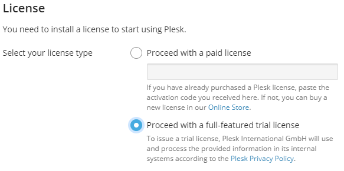
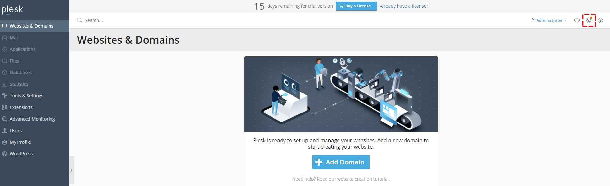

## Introduction

In this tutorial, I´m trying to give a quick overview of how to install Plesk on a Hetzner Cloud Server. Plesk is a hosting platform supporting you to run, automate and grow your websites and applications as needed. Plesk provides you with a simple GUI, making it more accessible to customize your server’s settings as necessary for your website or application to function at its best parameters.

## Step 1 - Order Server

First, login or sign up to [Hetzner Cloud Console](https://console.hetzner.cloud).

Select a project, then click on "Servers" and then on "Add Server".

On the next page, you can select the "Location" that suits you. I prefer Falkenstein as I´ve been there once and had the opportunity to visit that great DC.

For the "Image", you will need one that is supported by Plesk. All the latest software requirements can be found in the [Plesk release notes](https://docs.plesk.com/release-notes/obsidian/software-requirements/). Right now you can choose Ubuntu (currently only 18.04 is supported), Debian 10 or CentOS 8.

Then choose the "Type". This can be either "Standard" or "Dedicated". Based on the [Plesk hardware requirements](https://docs.plesk.com/release-notes/obsidian/hardware-requirements/) and the date of this tutorial, both server types are supported.

"Volume", "Network" and "Additional features" can be left untouched unless you need advanced customization.

For the "Name" I recommend you directly enter the right hostname, e.g. ```plsk01.domain.com```.

Then click on "Create & buy now". Within less than a minute you should receive an email from Hetzner indicating that your server is up and running.

## Step 2 - Login and install Plesk

If you already have a domain registered and it's connected to a DNS server, you should redirect the IP to the given IP. If you have no domain or DNS yet, you can also proceed.

Open the email you received from Hetzner and connect to the given IP, with the credentials included in the message. With the first login, you will be required to change your password.

After doing so, just type

```console
sh <(curl https://autoinstall.plesk.com/plesk-installer || wget -O - https://autoinstall.plesk.com/plesk-installer)
```

This will download and run the Plesk installer on your server.

You can now change the options within the installer or just use the default settings. The installation will take about 15 minutes.

After the installation, you will see a message like

                                   Congratulations!

        The installation has been finished. Plesk is now running on your server.

Now, copy the mentioned URL from this message and finalize the installation process. If you already have a license, you can paste it in the dedicated field. If you just want to test Plesk, feel free to select "Proceed with a full-featured trial license" on that page.

* Note: Hetzner currently doesn't offer Plesk licenses for their cloud servers.



After clicking on "Enter Plesk" the initializing of Plesk is done.

## Step 3 - First Steps

As your Plesk server is now up and running, you might ask yourself "what's next?"

The first step normally is to add a domain, which you want to host with Plesk and create your website on. I´m going to show you in a later tutorial how to use WordPress with Plesk. But of course, you could also create your website with any other tool or simply copy your already existing website to the server. In addition to that you can check the [Plesk getting started guide](https://docs.plesk.com/en-US/obsidian/quick-start-guide/read-me-first.74371/)

## Step 4- Advisor

Besides following the first steps, you can also check the Plesk advisor. It is found in the top right corner of the Plesk UI, in the shape of a little owl.



This advisor should help you not only to build, but also later to secure and run your website. It includes best practices for security, performance, SEO, updates and backups. The most urgent points are listed on the recommendation overview.

## Conclusion

And that is it - your Plesk instance is up and running, waiting to host your website on a sturdy and secured environment. Enjoy!

##### License: MIT

<!--

Contributor's Certificate of Origin

By making a contribution to this project, I certify that:

(a) The contribution was created in whole or in part by me and I have
    the right to submit it under the license indicated in the file; or

(b) The contribution is based upon previous work that, to the best of my
    knowledge, is covered under an appropriate license and I have the
    right under that license to submit that work with modifications,
    whether created in whole or in part by me, under the same license
    (unless I am permitted to submit under a different license), as
    indicated in the file; or

(c) The contribution was provided directly to me by some other person
    who certified (a), (b) or (c) and I have not modified it.

(d) I understand and agree that this project and the contribution are
    public and that a record of the contribution (including all personal
    information I submit with it, including my sign-off) is maintained
    indefinitely and may be redistributed consistent with this project
    or the license(s) involved.

Signed-off-by: Christian Hillenkötter

-->
