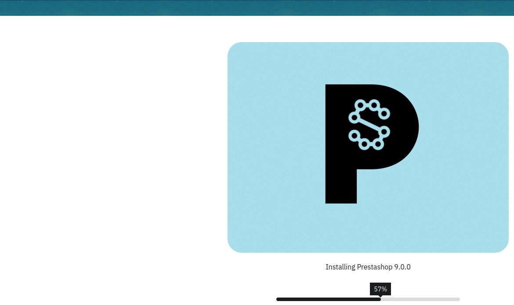
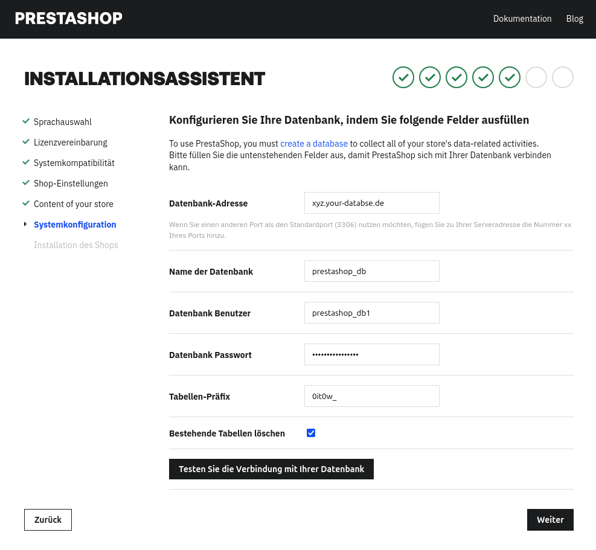

In diesem Tutorial wird erklärt wie man den Webshop PrestaShop installieren kann.

# Was ist PrestaShop?

PrestaShop ist eine Open-Source-E-Commerce-Plattform.

**Hinweis**

Wir stellen Dir lediglich die technische Möglichkeit zur Installation von PrestaShop zur Verfügung. Da es sich um eine sogenannte Drittanbieter-Software (3rd Party Application) handelt, können wir keine Gewährleistung für deren Funktionalität übernehmen und bieten keinen Support zu inhaltlichen oder technischen Fragen innerhalb von PrestaShop an.
Weitere Informationen und Hilfe erhältst Du unter: <https://prestashop.com>

# Beispiel-Benennungen

* Benutzername: `prestashop`
* Datenbankname: `prestashop_db`
* Datenbanknutzername: `prestashopuser`
* Datenbankpasswort: `abcde*1234#XYZ`
* Hostname / Datenbankhost: `<xyz.your-database.de>`
* Domain: `<example.com>`
* Subdomain: `<prestashop.example.com>`
* FTP-Client: `FileZilla`
* FTP/SSH-Nutzer: `exampleuser`
* Public SSH-Key: `id_<type>.pub`
+ Speichermenge: `256M`
* Verzeichnisse: `public_html`
* Terminal Commands: `CD`,`SCP`,`RM`

# Voraussetzungen

* Mindestens einen Level 4 Webhosting Account
* Aktiviertes SSL-Zertifikat für Deine Domain
* PHP-Version 7.2 oder höher für die neueste Version von PrestaShop
* Aktivierten FTP oder SSH-Zugang
* Gesetztes `allow_url_fopen` auf "On", sowie `PHP-Memory-Limit` von mindestens 256 MB
* Ggf. einen SSH-Key nach folgenden [Vorgaben](https://docs.hetzner.com/de/konsoleh/account-management/access-details/login-data#ssh-schlussel)
* Ggf. einen FTP-Client wie z.B. FileZilla

# PrestaShop installieren

## Schritt 1 - Vorbereitung für die Installation

### 1.1 Datenbank in der konsoleH anlegen

* Melde Dich mit deinen Zugangsdaten in der [konsoleH](https://konsoleh.hetzner.com/) an
* Gehe zu `Einstellungen` -> `Datenbanken` -> `MariaDB/MySQL »`
* Klicke unter `MariaDB/MySQL Datenbanken` auf `Hinzufügen`
  
* Falls Du möchtest, kannst Du nun den Namen der `Datenbank`, den `Login` und das `Passwort` anpassen
  
* Klicke auf `speichern` und oberhalb der Zugangsdaten zur Datenbank sollte nun die `Verbindungskennung` angezeigt werden
* Kopiere dir diese nun z.B. in eine Notiz auf Deinem Computer, Du benötigst sie Später für das Setup

### 1.2 PHP-Einstellungen in der konsoleH

* In der konsoleH navigiere zu `Einstellungen` -> `Konfiguration` -> `PHP-Konfiguration »`
  
* Wähle dort unter `PHP-Version` die aktuellste PHP-Version aus, PrestaShop benötigt mindestens `PHP 7.2`
* Klicke auf `speichern`
* Navigiere in derselben Seite zu den `PHP-Einstellungen` und überprüfe ob bei `allow_url_fopen` `on` und bei `memory_limit` mindestens `256M`steht
* Falls dort ein niedrigerer Wert steht, wähle im Feld rechts daneben `256` aus und klicke unten links in der Seite auf `speichern`

### 1.3 SSH-Key generieren

* Generiere nach den Angaben unter [https://docs.hetzner.com/de/konsoleh/account-management/access-details/login-data#sftp-mit-key-authentifizierung](https://docs.hetzner.com/de/konsoleh/account-management/access-details/login-data#sftp-mit-key-authentifizierung) und [https://community.hetzner.com/tutorials/howto-ssh-key/de](https://community.hetzner.com/tutorials/howto-ssh-key/de) ein SSH-Key-Paar
* Navigiere in der konsoleH zu `Einstellungen` -> `Zugangsdetails` -> `Logindaten »`
  

**Für die Installation über einen FTP-Client gehe nun wie folgt vor:**
* Lade dort unter `Öffentliche SFTP-Schlüssel` deinen Publickey `id_<type>.pub` hoch, indem du auf `Hinzufügen` klickst und im nachfolgenden Fenster den Inhalt reinkopierst
* Klicke dann auf `Hinzufügen` - nun sollte unter `Öffentliche SFTP-Schlüssel` -> `Schlüsseltyp` dein Publickey mit Kommentar erscheinen

**Für die Installation über SSH-Zugang gehe nun wie folgt vor:**

* Lade dort unter `Öffentliche SSH-Schlüssel` deinen Publickey `id_<type>.pub` hoch indem du auf `Hinzufügen` klickst und im nachfolgenden Fenster den Inhalt reinkopierst
* Klicke dann auf `Hinzufügen` - nun sollte unter `Öffentliche SSH-Schlüssel` -> `Schlüsseltyp` dein Publickey mit Kommentar erscheinen

## Schritt 2 - PrestaShop ins Webverzeichnis hochladen

### 2.1 Option 1 - Über SSH-Verbindung

* Lade Dir die aktuellste Version von PrestaShop von der offiziellen Webseite herunter: [https://prestashop.com/prestashop-offers/classic/](https://prestashop.com/prestashop-offers/classic/)
* Unter Linux kannst Du die ZIP-Datei über Dein Terminal per `unzip` oder einem Doppelklick in Deinem Dateimanager entpacken
* Unter Windows/MacOS kannst Du die ZIP-Datei per Doppelklick im Dateiexplorer entpacken
* Öffne nun ein Terminal und navigiere zum Verzeichnise, in den Du das PrestaShop Archiv entpackt hast:

  ```bash
  cd /pfadZuPrestashop/
  ```

* Navigiere in der konsoleH zu `Einstellungen` -> `Zugangsdetails` -> `Logindaten` und kopiere dir das `SSH-Verbindungskommando` per klick auf das rote Seiten Symbol
* Lade die benötigten Dateien auf dem Webhosting-Server hoch indem Du den kopierten command einfügst und folgendermaßen anpasst:

  ```bash
  scp index.php prestashop.zip testuser@wwwxyz.your-server.de:public_html/ -p 222
  ```

* Eventuell musst Du hier noch auf Deinen zuvor erstellten privaten SSH-Key verweisen. Füge dazu einfach die folgende Zeile an Deinen SCP Command an:

  ```bash
  -i <PfadZuDeinemSSH-Key/id_<type>
* Nun kannst Du mit der Installation von PrestaShop wie unter Schritt 3 beschrieben fortfahren
  
### 2.2 Option 2 - Über FTP-Client

* Lade Dir die aktuellste Version von PrestaShop von der offiziellen Webseite herunter: [https://prestashop.com/prestashop-offers/classic/](https://prestashop.com/prestashop-offers/classic/)
* Unter Linux kannst Du die ZIP-Datei über Dein Terminal per `unzip` oder einem Doppelklick in Deinem Dateimanager entpacken
* Unter Windows kannst Du die ZIP-Datei per Doppelklick im Dateiexplorer entpacken
* Öffne nun Deinen FTP-CLient, wir haben die Installation mit `FileZilla` durchgeführt
* Klicke auf `Datei` -> `Servermanager` -> `Neuer Server` und benenne den Server. Zum Beispiel: `PrestashopTest`
  
* Unter `Protokoll` wählst Du `SFTP-SSH File Transfer Protocol` aus, unter `Server` trägst Du den Webhosting-Server `wwwxyz.your-server.de` ein und unter `Port`: die `22`
* Unter `Verbindungsart` wälst Du `Schlüsseldatei` und unter `Benutzer` trägst Du Deinen Loginnamen aus der konsoleH ein
* Unter `Schlüsseldatei`klickst Du nun auf `Durchsuchen`
* Navigiere im folgenden Fenster nun zu dem Verzeichnis, in dem Du Dein SSH-Key-Paar abgelegt hast
* Wähle nun Deinen privaten Schlüssel aus:

  ```bash
  id_<type>
  ```

* Füge Diesen per Doppelklick zu dem Eintrag in `FileZilla` hinzu und verbinde dich mit deinem Verzeichnis auf dem Webhostingserver durch ein Klick auf `verbinden`
* Navigiere in `FileZilla` nun auf der linken Seite zu dem Verzeichnis, in dem Du die heruntergeladene Datei entpackt hast, und auf der rechten Seite in dein `public_html` Verzeichnis
* Ziehe nun die beiden Dateien `index.php` & `prestashop.zip` aus dem linken Fenster in das rechte Fenster und warte bis FileZilla die Übertragung abgschlossen hat
  
  
## Schritt 3 - PrestaShop Installations-Assistent

* Navigiere in deinem Browser zu Deiner Domain-Adresse in der Du die PrestaShop Dateien hochgeladen hast `https://example.de/`
  
* Warte nun einen Moment, bis der Installations-Assistent das Archiv entpackt hat
* Nun solltest Du auf der Willkommensseite des Installers landen, die Sprache kannst du unter `Continue the Installation in:` ändern.
  
* Klicke auf `Weiter` und du landest auf der Lizenzvereinbarung, setze hier das Häkchen bei `Ich akzeptiere die obenstehenden AGB`
  
* Auf der folgenden Seite musst Du nun Deinen Webseitennamen, Deine Logindaten für die Weboberfläche, sowie die Zeitzone angeben
  
* Mit einem Klick auf `Weiter` landest Du in der Vorkonfiguration Deines Prestashops
  
* Mit einem Klick auf `Weiter` landest Du in der Einrichtung der Datenbank. Hier musst Du die Daten aus der konsoleH eingeben:
  
* Klicke auf `Testen Sie die Verbindung mit Ihrer Datenbank` um zu überprüfen, ob die Daten richtig sind und eine Verbindung zur Datenbank hergestellt werden kann. Darunter sollte nun ein grünes Feld mit grünem Haken und der Schrift `Datenbank verbunden` erscheinen
* Klicke auf `Weiter` um die Einrichtung von PrestaShop abzuschließen. Der Assistent erstellt nun die nötigen Tabellen in der Datenbank, installiert alle benötigten Module sowie Plugins und nimmt noch abschließende Konfigurationen vor.
* Nun solltest Du Dich auf der letzten Seite des Assistenten befinden, dort wird Dir angezeigt, dass Du den Ordner `Install` unbedingt löschen musst:
  
* Am einfachsten erledigst Du das über den FTP-Client folgendermaßen:
  * wähle den Ordner `Install` per klick mit deiner rechten Maustaste aus und klicke dann auf `löschen`
  
* Per `SSH` funktioniert das folgendermaßen, beachte bitte jedoch dabei, dass Du diesen command nur im Installationsverzeichnis von PrestaShop ausführst und richtig kopierst, ansonsten kann es sein, dass Du andere Verzeichnisse mit dem gleichen Namen oder Dein gesamtes Webverzeichnis löscht. Wir übernehmen keine Haftung für gelöschte Daten!
  * Navigiere in das Installationsverzeichnis von PrestaShop:

    ```bash
    cd <PfadZumInstallationsVerzeichnis/>
    ```

  * Lösche den PrestaShop `Install` Ordner

  ```bash
  rm -fr Install/
  ```

* Nun solltest Du die Installation und Einrichtung von PrestaShop abgeschlossen haben und Dich in der Administrationsoberfläche Deines Webshops anmelden können.
