This tutorial explains how to install the PrestaShop web shop.

**What is PrestaShop?**

**Note**

We only provide you with the technical means to install PrestaShop. As this is third-party software (3rd Party Application), we cannot guarantee its functionality and do not offer support for content-related or technical questions within PrestaShop.
For further information and help, please visit: <https://prestashop.com>

**Example-Terminology**

* Username: `prestashop`
* Database name: `prestashop_db`
* Database username: `prestashopuser`
* Database password: `abcde*1234#XYZ`
* Hostname / Database host: `<xyz.your-database.de>`
* Domain: `<example.com>`
* Subdomain: `<prestashop.example.com>`
* FTP-Client: `FileZilla`
* FTP/SSH-User: `exampleuser`
* Public SSH-Key: `id_<type>.pub`
* Storage amount: `256M`
* Directories: `public_html`
* Terminal Commands: `CD`,`SCP`,`RM`

**Prerequisites**

* Minimum a Level 4 Web hosting Account
* Activated SSL-Certificate for your domain
* PHP-Version 7.2 or higher for the latest version of PrestaShop
* Activated FTP- or SSH-access
* Set `allow_url_fopen` to "On" `PHP-Memory-Limit` to at least 256 MB
* If necessary, generate an SSH key according to the following [specifications].(https://docs.hetzner.com/de/konsoleh/account-management/access-details/login-data#ssh-schlussel)
* If necessary an FTP-Client like for example: FileZilla

## Installing PrestaShop

### Step 1 - Preparing for installation

**1.1 Create database in konsoleH**

* Log in with your access data in [konsoleH](https://konsoleh.hetzner.com/)
* Navigate to `Services` -> `Databases` -> `MariaDB/MySQL »`
* Under `MariaDB/MySQL Databases` click on `Add`
  
* If you want, you can now customize the name of the `database`, the `login`, and the `password`
  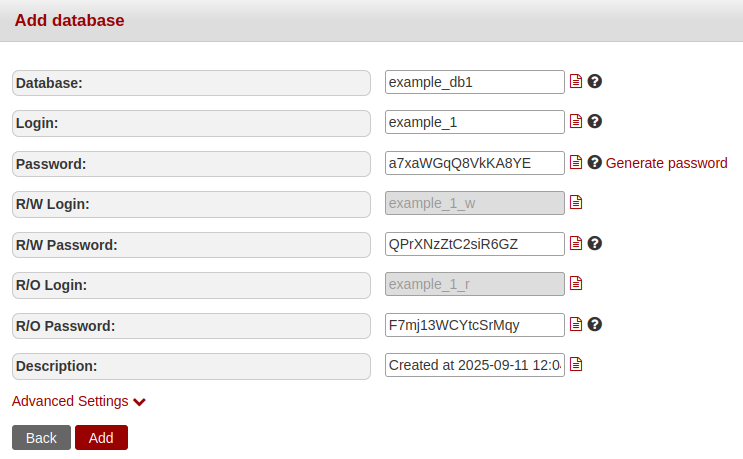
* Click on `Save` and the `Connection ID` should now be displayed above the database access data
* Now copy these into a note on your computer, for example. You will need them later for the setup.

**1.2 PHP-Settings in konsoleH**

* In konsoleH navigate to `Services` -> `Settings` -> `PHP Configuration »`
  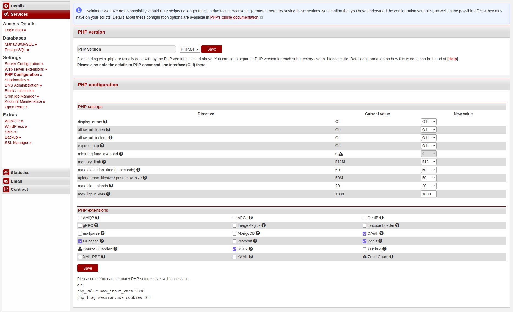
* Under `PHP-Version` select the latest PHP-Version, PrestaShop needs minimum `PHP 7.2`
* Click on `Save`
* On the same page navigate to the `PHP-settings` and verify that `allow_url_fopen` is set to `on` and the `memory_limit` minimum to `256M`
* If there is a lower value there, select `256` in the field to the right and click on `save` at the bottom left of the page.

**1.3 Generate SSH-Key**

* Generate an SSH-Key-Pair according to the following specifications [https://docs.hetzner.com/konsoleh/account-management/access-details/login-data#additional-ftp-users](https://docs.hetzner.com/konsoleh/account-management/access-details/login-data#additional-ftp-users) and [https://community.hetzner.com/tutorials/howto-ssh-key](https://community.hetzner.com/tutorials/howto-ssh-key)
* In konsoleH navigate to `Services` -> `Access Details` -> `Login data »`
  

**To install via an FTP client, proceed as follows:**

* Upload your public key `id_<type>.pub` there under `Public SSH Keys` by clicking on `Add` and copy the content into the following window
* Then click on `Add` — your public key with a comment should now appear under `Public SSH Keys` -> `Key Type`

### Step 2 - Upload PrestaShop to the web directory

* **Option 1 - Via SSH connection**

  * Download the latest version of PrestaShop from the official website: [https://prestashop.com/prestashop-offers/classic/](https://prestashop.com/prestashop-offers/classic/)
* On Linux, you can unzip the ZIP file using `unzip` in your terminal or by double-clicking it in your file manager
* On Windows/macOS, you can unzip the ZIP file by double-clicking it in your file manager
* Now open a terminal and navigate to the directory where you extracted the PrestaShop archive:

  ```bash
  cd /pathToPrestashop/
  ```

* In konsoleH, navigate to `Settings` -> `Access Details` -> `Login data` and copy the SSH connection command by clicking on the red page icon.
* Upload the required files to the web hosting server by pasting the copied command and adjust it as follows:

  ```bash
  scp index.php prestashop.zip testuser@wwwxyz.your-server.de:public_html/ -p 222
  ```

* You may need to refer to your previously created private SSH key here. To do this, simply add the following line to your SCP command:

  ```bash
  -i <PathToYourSSH-Key/id_<type>
* Now you can continue with the installation of PrestaShop as described in step 3
  
* **Option 2 - Via FTP-Client**

* Download the latest version of PrestaShop from the official website: [https://prestashop.com/prestashop-offers/classic/](https://prestashop.com/prestashop-offers/classic/)
* On Linux, you can unzip the ZIP file using `unzip` in your terminal or by double-clicking it in your file manager
* On Windows/macOS, you can unzip the ZIP file by double-clicking it in your file manager
* Now open your FTP client. We used `FileZilla` for the installation
* Click on `File` -> `Site Manager` -> `New site` and name the server. For example: `PrestashopTest`
  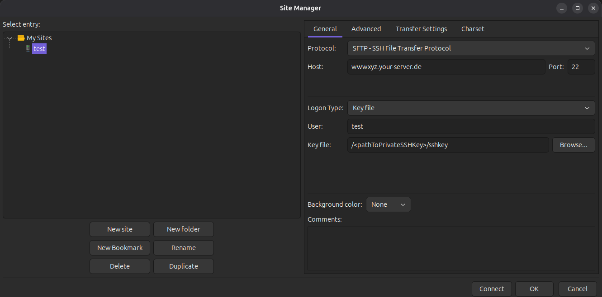
* Under `Protocol` select `SFTP-SSH File Transfer Protocol`, under `Host` enter your WebhostingServer `wwwxyz.your-server.de` and under `Port`: `22`
* Under `Logon Type` select `Key file` and under `User` enter your Login Name from konsoleH
* Under `Key file`click on `Browse`
* In the now open window navigate to the directory where you saved your SSH-Key-Pair
* Now select your private key:

  ```bash
  id_<type>
  ```

* Add it to `Filezilla` by double-clicking it and connect to the web directory on the Webhostingserver by clicking on `connect`
* In `FileZilla`, navigate to the directory on the left where you extracted the downloaded file and to your `public_html` directory on the right
* Now drag the two files `index.php` & `prestashop.zip` from the left window to the right window and wait until FileZilla has completed the transfer
  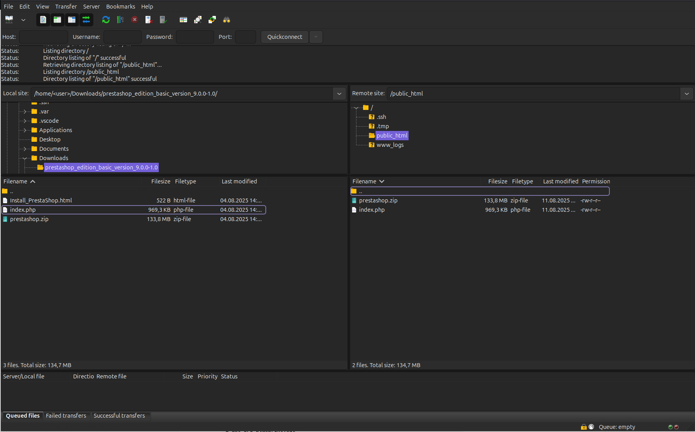
  
### Step 3 - PrestaShop Installation Wizard

* In your browser, navigate to the domain address where you uploaded the PrestaShop files `https://example.de/`
  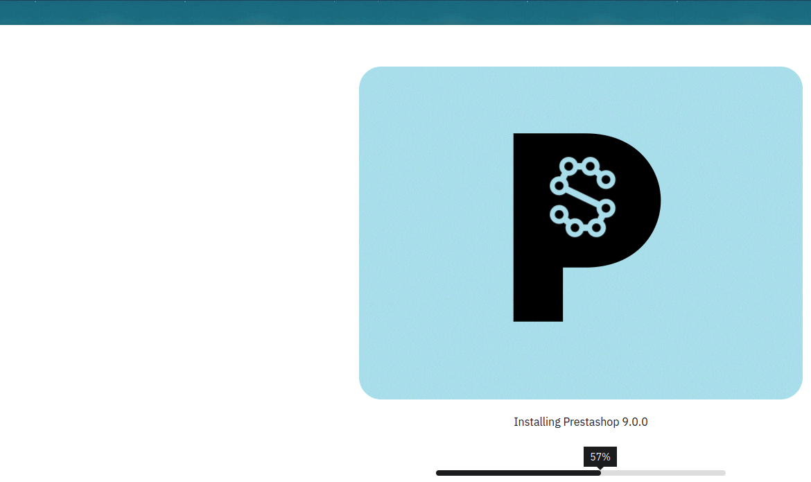
* Now wait a moment until the installation wizard has unpacked the archive
* You should now be on the installer's welcome page. You can select the language under `Continue the Installation in:`
  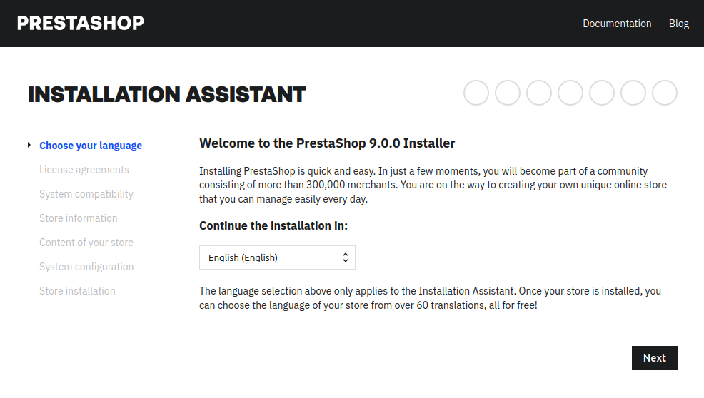
* Click on `Next` and you will be taken to the license agreement. Check the box `I agree to the above terms and conditions`
  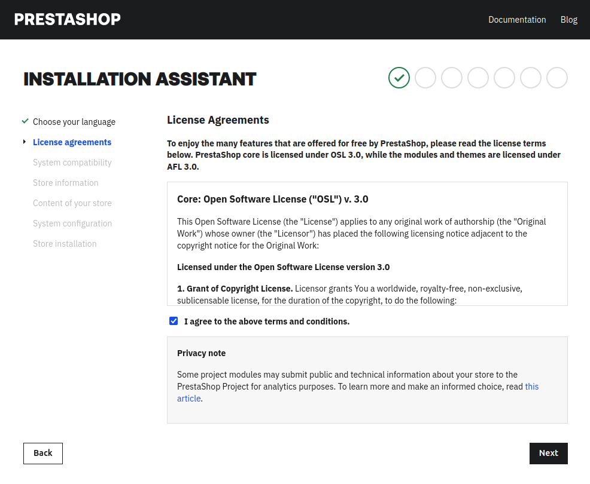
* On the following page, you have to enter your website name, your login details for the web interface, and your time zone
  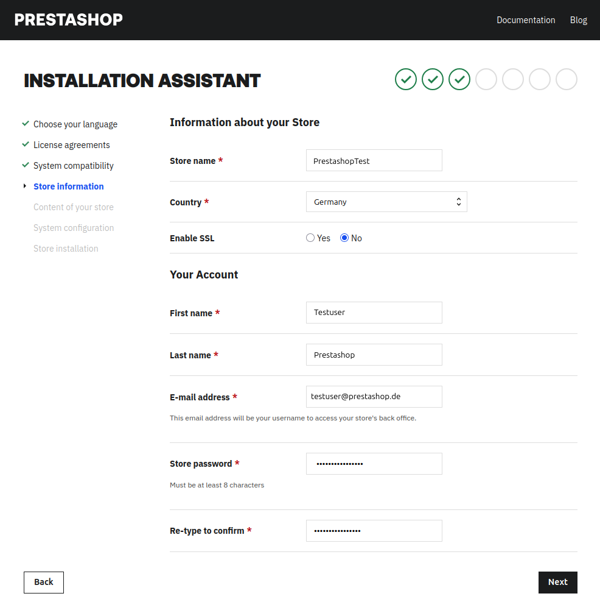
* By clicking on `Next` you will be taken to the pre-configuration of your PrestaShop
  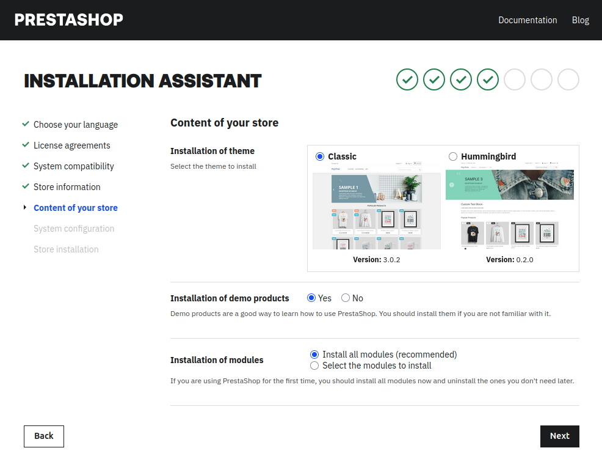
* By clicking `Next` you will be taken to setting up the database. Here you have to fill in the data from konsoleH:
  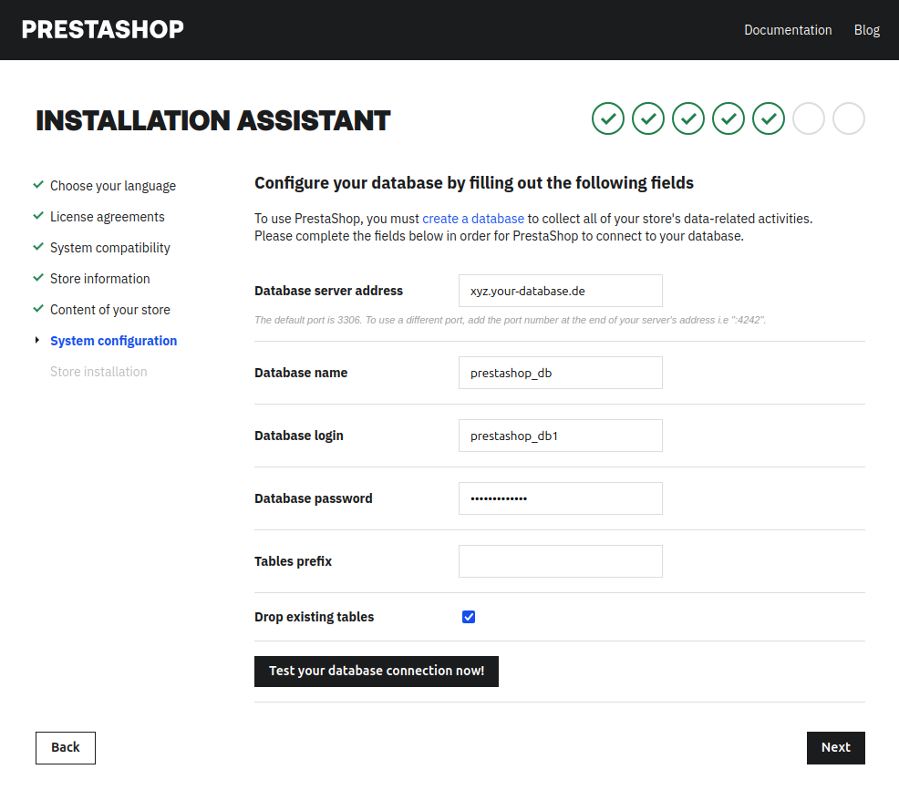
* Click on `Test you databse connection now` to check that the data is correct and that a connection to the database can be established. Below this, you should now see a green field with a green check mark and the text `Database connected`
* Click on `Next` to complete the PrestaShop setup. The wizard will now create the necessary tables in the database, install all the required modules and plugins, and make the final configurations.
* You should now be on the last page of the wizard, where you will be informed that you must delete the `Install` folder.
  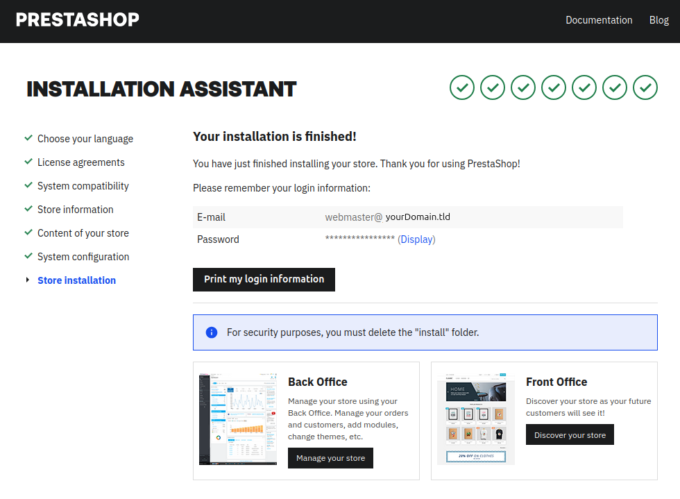
* The easiest way to do this is via the FTP-Client as follows:
  * Select the `Install` folder by right-clicking on it and then click on `Delete`.
  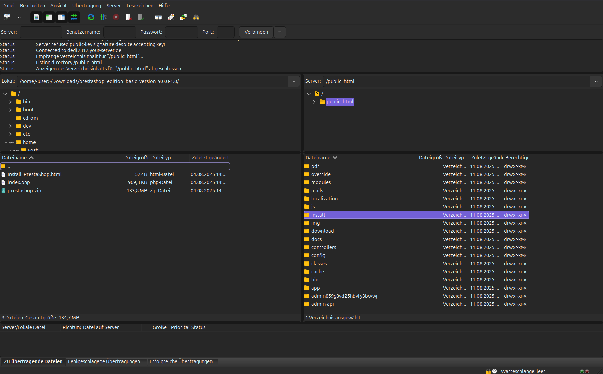
* This works as follows via `SSH`. Please note, however, that you should only execute this command in the PrestaShop installation directory and copy it correctly, otherwise you may delete other directories with the same name or your entire web directory. We accept no liability for deleted data!
  * Navigate to the installation directory of PrestaShop:

    ```bash
    cd <PathToInstallationDirectory/>
    ```

  * Delete the PrestaShop `Install` folder

  ```bash
  rm -fr Install/
  ```

* You should now have completed the installation and setup of PrestaShop and be able to log in to the administration interface of your online store.
