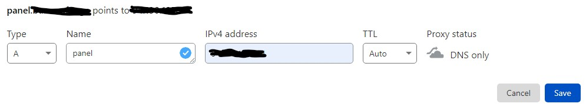

## Introduction

This tutorial will teach you how to install the Pterodactyl Panel with an unofficial installation script. If you need to uninstall Pterodactyl in the future, you can use the same installation script and select the option "uninstall".

**Disclaimer 1: I do not own this script, nor do I take responsibility for any damage done to your system. Taking a backup is recommended.**

**Disclaimer 2: This script is subject to change in the future. I will try and update this tutorial as often as I can.**

**Disclaimer 3: This tutorial is for installing both the panel and Wings on the same machine.**

**Prerequisites**

* Root access to a server with one of the following operating systems:
  * Ubuntu 20.04/22.04 `recommended`
  * CentOS 7, CenOS Stream 8/9
  * Debian 11/12
* You cannot have had Pterodactyl or anything related to it installed to this system before.

## Step 1 - Installing the panel

SSH into your server and make sure you are logged in as root. If you aren't, type `sudo su` and enter your root password. Then, run the script with the following command:

```bash
bash <(curl -s https://pterodactyl-installer.se)
```

### Step 1.1 - Choosing your installation option

You should see something that looks like this:

```bash
* Pterodactyl panel installation script @ v1.0.0
*
* Copyright (C) 2018 - 2023, Vilhelm Prytz, <vilhelm@prytznet.se>
* https://github.com/pterodactyl-installer/pterodactyl-installer
*
* This script is not associated with the official Pterodactyl Project.
*
* What would you like to do?
* [0] Install the panel
* [1] Install Wings
* [2] Install both [0] and [1] on the same machine (wings script runs after panel)
* [3] Install panel with canary version of the script (the versions that lives in master, may be broken!)
* [4] Install Wings with canary version of the script (the versions that lives in master, may be broken!)
* [5] Install both [3] and [4] on the same machine (wings script runs after panel)
* [6] Uninstall panel or wings with canary version of the script (the versions that lives in master, may be broken!)
* Input 0-6:
```

Unless you specifically want a different option, choose 2, which will install both the panel and Wings (the daemon).

### Step 1.2 - Configuring your MySQL database

Next, you will see the "Database configuration" screen that looks like this:

```bash
* Database configuration.
*
* This will be the credentials used for communication between the MySQL
* database and the panel. You do not need to create the database
* before running this script, the script will do that for you.
*
* Database name (panel):
* Database username (pterodactyl):
* Password (press enter to use randomly generated password): ************
* List of valid timezones here https://www.php.net/manual/en/timezones.php
* Select timezone [Europe/Stockholm]: Europe/London
```

| Option       | Note                              |
| ------------ | --------------------------------- |
| **Database name**<br>**Database username** | By pressing return and leaving the field empty, you accept the default values shown in parentheses. |
| **Password** | I would highly recommend you set your own more memorable password instead of leaving it as auto-generated, otherwise you won't be able to make databases in the panel. |
| **Timezone** | The timezone option uses the [PHP Timezones](https://www.php.net/manual/en/timezones.php) (e.g. for GMT, it would be `Europe/London`. For EST, it would be `America/New_York`. Check the website linked for more information). |
| **Email**    | The email address is used for setting up an SSL certificate with Let's Encrypt. Even if you aren't planning on using SSL, put your real email address in there anyway, just in case. |

### Step 1.3 - Initial account setup

Next, it will ask you for the details of the initial admin account that you will use to login to the website. I would recommend the username to be admin, but you can set everything else to whatever you want.

```bash
* Email address for the initial admin account: 
* Username for the initial admin account: admin
* First name for the initial admin account: 
* Last name for the initial admin account: 
* Password for the initial admin account: ************
```

### Step 1.4 - FQDN, Let's Encrypt and UFW

* **FQDN**<br>
  Next, you will be asked for an FQDN (Fully Qualified Domain Name). If you want to use a domain name, go to your DNS provider and add an A record for your domain and point it to your server's IP address. Your record should look like this:
  
  
  
  Make sure to do this before you enter the FQDN in the script. If you are using Cloudflare, make sure it isn't proxied otherwise you will have issues. If you just want to use an IP address, enter the IP of your server. Then, it will ask you if you want to use SSL (HTTPS) with Let's Encrypt. This **will not** work if you are using an IP address. If you are using an IP, make sure to say no whenever something mentioning SSL comes up (including Assume SSL).

<br>

* **UFW**<br>
  It will then ask you if you want it to automatically configure UFW. Say yes, unless you want to do it yourself. The ports you need to allow are: `22`, `80`, `8080`, `443` and `2022` (as well as `3306` if you want remote MySQL access). 

After this, you should be good to go. It will give you a summary of the options you chose, and then it will ask you if you want to continue the installation. Say yes. Now sit back and wait for the panel to install.

Once it is finished, visit your FQDN or IP address and the panel should be online. Don't do anything on it yet though. We still need to install Wings.

## Step 2 - Installing Wings

After the panel installation is complete, it will ask if you want to proceed to the installation of Wings.

During the installation of Wings, it will ask you about:

  | Option       | Note                              |
  | ------------ | --------------------------------- |
  | **UFW**      | » Say `yes`                       |
  | **user for database hosts** | » Say `yes`        |
  | **MySQL**    | » Say `no`                        |
  | **Database host username & password** | » You can use the default username and enter a password. Save the host username and the host password for future reference. |
  | **HTTPS**    | » Choose the same thing as you did before<br><blockquote><b>Note:</b> This <b>will not</b> work if you entered an IP address for the FQDN.</blockquote> |
  
It will ask you once again if you want to continue. Say yes. Now, sit back, and wait for Wings to install.

Once this has finished, your panel is up and running. Visit the FQDN or IP address in your web browser and you should see it there. If you don't, double-check the UFW status by running `ufw status`. Make sure that ports `22`, `80`, `8080`, `443` and `2022` are in the list. If they're not, type `ufw allow <port>`. If you're not root, add `sudo` in front of the command.

## Step 3 - Creating the first node and server

### Step 3.1 - Creating nodes

Visit the panel by entering the FQDN or IP address in your web browser and login using the credentials you set up earlier. Solve the CAPTCHA if it provides you with one, then you should see the panel with no servers.

First, you need to add a location. Locations are not really important unless you have multiple servers in different data centers all linked to the same panel. But in order to add nodes, you need at least one location.

Click the gear icon ⚙️ in the top right to open the admin section.

**To add a location:**

* Click "Locations" in the left menu. 
* Click "Create New" in the top right.
* Configure your node settings.<br>
  
  | Option                       | Note                              |
  | ---------------------------- | --------------------------------- |
  | **Short Code & Description** | You can choose anything you want. |

* Click "Create"

------

**To setup nodes:**

* Click "Nodes" in the left menu.
* Click "Create New" in the top right.
* Configure your node settings.<br>
  Before you start allocating resources, make sure to check your server's specifications, so you know how much you have to use.
  
  | Option                              | Note                              |
  | ----------------------------------- | --------------------------------- |
  | **Name & Description**              | You can choose anything you want. |
  | **FQDN**                            | This will be the domain name that you use to connect to your game servers. If this IP is different from the one you entered during setup, create another A record in your DNS provider to point to the server's IP. |
  | **Communicate Over SSL**            | For SSL or HTTP, set whatever you said before.<br>Select "Not Behind Proxy". |
  | **Total Memory & Total Disk Space** | In Linux, you can use `free -h` to check the total memory and `df -h` to check the disk space.<br>For "Over-Allocation", set 0 to disable server creation after the "Total Memory" or "Total Disk Space" you set is reached. |

  When everything is set, you can click "Create Node". This will take you to the "Allocation" tab where you can set the IP addresses that this node can use. 
  
  * Allocation tab<br>
    In the "Assign New Allocations" box on the right, enter your server's IP address and the ports you want to allocate separated by commas, or enter a range separated by a hyphen. Press "Submit". Make sure you allow these ports through your UFW by typing `ufw allow <port>` in the terminal. If you're not root, add `sudo` in front of the command. Next, switch to the "Configuration" tab.

  * Configuration tab<br>
    In the "Auto-Deploy" box on the right, press "Generate Token". Copy the command it gives you and paste it into your terminal. Then type `systemctl restart wings`. If you're not root, add `sudo` in front of the command. Your node should be activated.
    
* Check if the Node is activated.<br>
  Click "Nodes" in the left menu. You should see a green heart next to your node. If the heart is red, wait a little and keep refreshing the page. If it doesn't work, you can try and restart your server. If it also doesn't work, you may have to reinstall the panel. To use the uninstall script, enter `bash <(curl -s https://pterodactyl-installer.se)` and this time, select option "6".

### Step 3.2 - Creating servers

Next, you can create your servers.

* Click "Servers" in the left menu.
* Click "Create New" in the top right.
* Configure your node settings.<br>
  
  | Option                               | Note                              |
  | ------------------------------------ | --------------------------------- |
  | **Server Name & Server Description** | You can choose anything you want. |
  | **Server Owner**                     | Enter the first two letters of the email address or username that you entered for the initial admin account. Your account should show up. If you create new users later, you can do the same to assign a server to their account. I would recommend assigning every server to the Admin account. This way, you have complete control of every server registered in the panel. |
  | **Allocation Management**            | Select the Node and the IP & port that this server will use. |
  | **Application Feature Limits**       | You can set the values to whatever you want. This will allow owners of this server to create databases, backups and assign new allocations to the server. |
  | **Resource Management**              | Ignore "CPU Pinning" and "Block IO Weight".<br>Set "Swap" to `-1`.<br>For "Memory" and "Disk Space", you can set whatever you want (make sure it's within the limit of the node). |
  | **Nest Configuration**               | Pterodactyl uses their own terminology for games and server instances: Nests and Eggs.<br>**Nests** are groups of different versions of a game, for example Minecraft.<br>**Eggs** are the types of server instances, e.g. vanilla Minecraft, or BungeeCord. |
  | **Docker Image**                     | The docker image really depends on the game you're using. See if you can find the latest one. It is usually the one with the highest number. |
  
  When everything is set, you can click "Create Server". You should get a green confirmation message.

To exit the admin area, click the server rack icon in the top right corner. The gaming panel should now list your server and it will say "Installing". Keep refreshing the page until the "Installing" message disappears. When it is done, click on the server and press "Start". To join, enter your FQDN or IP address. If you used the default port of the game, you should not have to specify it. If you didn't use the default port of the game, add the port at the end of the address separated by a colon (e.g. `https://example.com:<port>`). If you are unable to join, double-check if you have entered the FQDN or IP address correctly as it is in the node's configuration. You can also check if UFW allows the port by typing `ufw status`. If it is not allowed, enter `ufw allow <port>`. If you're not root, add `sudo` in front of the command.

## Step 4 - Changing the panel's name (Optional)

If you want to change the name that displays in the top left corner of the panel, go to your admin area and select "Settings" in the left menu. There, you can change the "Company Name" to whatever you want. After you're done, press "Save". There's a whole plethora of settings you can change here, and in other aspects of the panel too, so give them a look sometime.

## Conclusion

Well done, you've successfully installed the panel!

If you have any issues with the script, join the [script's discord server](https://discord.com/invite/2zMdudJ). If you have any issues with the panel, join the [panel's discord server](https://discord.com/invite/pterodactyl). Please note that you should only use the panel's discord for panel-related issues after an otherwise successful installation of the panel, as no support is given by the developers for issues during installation potentially caused by the script.

Next, you can strengthen your firewall. It is recommended to setup a firewall that only allows access from specific IPs. This can help mitigate DDoS attacks.

##### License: MIT

<!--

Contributor's Certificate of Origin

By making a contribution to this project, I certify that:

(a) The contribution was created in whole or in part by me and I have
    the right to submit it under the license indicated in the file; or

(b) The contribution is based upon previous work that, to the best of my
    knowledge, is covered under an appropriate license and I have the
    right under that license to submit that work with modifications,
    whether created in whole or in part by me, under the same license
    (unless I am permitted to submit under a different license), as
    indicated in the file; or

(c) The contribution was provided directly to me by some other person
    who certified (a), (b) or (c) and I have not modified it.

(d) I understand and agree that this project and the contribution are
    public and that a record of the contribution (including all personal
    information I submit with it, including my sign-off) is maintained
    indefinitely and may be redistributed consistent with this project
    or the license(s) involved.

Signed-off-by: Hudson Knott (hudson@hudsonknott.co.uk)

-->
