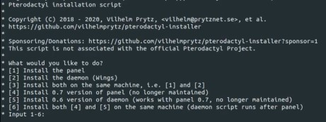
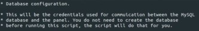

## Introduction

This tutorial will teach you how to install the Pterodactyl Panel with an unofficial installation script. Currently, there is no way to uninstall this completely without wiping your server, but an uninstall script is currently being worked on and will be finished in the near future.

**Disclaimer: I do not own this script, nor do I take resposibility for any damage done to your system. Taking a backup is recommended.**

**Disclaimer 2: This script is subject to change in the future. I will try and update this tutorial as often as I can**

**Disclaimer 3: This tutorial is for installing both the panel and Wings on the same machine.**

Example terminology that you can use in the tutorial:

* Username: `holu` (short for Hetzner OnLine User)
* Hostname: `<your_host>`
* Domain: `<example.com>`
* Subdomain: `<sub.example.com>`
* IP addresses (IPv4 and IPv6):
   * Server: `<10.0.0.1>` and `<2001:db8:1234::1>`
   * Gateway `<192.0.2.254>` and `<2001:db8:1234::ffff>`
   * Client private: `<198.51.100.1>` and `<2001:db8:9abc::1>`
   * Client public: `<203.0.113.1>` and `<2001:db8:5678::1>`

**Prerequisites**

* Root access to a server with one of the following operating systems: Ubuntu 18.04/20.04, CentOS 7/8 or Debian 9/10 (Ubuntu is recommended)
   * You cannot have had Pterodactyl or anything related to it installed to this system before.

## Step 1 - Installing the panel

SSH into your server and make sure you are logged in as root. If you aren't, type `sudo su` and enter your root password. Then, run the script with the following command:
```sh
bash <(curl -s https://pterodactyl-installer.se)
```

### Step 1.1 - Choosing your installation option

You should see something that looks like this:



Unless you specifically want a different option, choose 3 (or whatever the equivalent is of installing the panel and wings on the same machine, as it may change)

### Step 1.2 - Configuring your MySQL database

Next, you will see the Database configuration screen that looks like this:



By pressing return and leaving the field empty, you accept the default values shown in parentheses. I would highly recommend you set your own more memorable password instead of leaving it as auto-generated.

You will also be given other options such as the timezone and the email address. The timezone option uses the [PHP Timezones](https://www.php.net/manual/en/timezones.php) (e.g. for GMT, it would be `Europe/London` or for EST it would be `America/New_York`. Check the website linked for more information.). The email address is used for setting up an SSL certificate with Let's Encrypt. If you aren't planning on using SSL, put your real email address in there anyway, just in case.

### Step 1.3 - Initial account setup

Next, it will ask you for the details of the initial admin account that you will use to login to the website. I would recommend the username to be admin, but you can set everything else to whatever you want. The email address doesn't have to be real unless you enable sending emails to customers in the panel.

### Step 1.4 - FQDN, Let's Encrypt and UFW

Next, you will be asked for an FQDN (Fully Qualified Domain Name). If you want to use a domain name, go to your DNS provider and add an A record for your domain and point it to your server's IP address. Make sure to do this before you enter the FQDN in the script. If you are using Cloudflare, make sure it isn't proxied otherwise you will have issues. If you just want to use an IP address, enter the IP of your server. Then, it will ask you if you want to use SSL (HTTPS) with Let's Encrypt. This **will not** work if you are using an IP address; make sure to say no whenever something mentioning SSL comes up (including Assume SSL).

It will then ask you if you want it to automatically configure UFW. Say yes, unless you want to do it yourself. The ports you need to allow are: `22`, `80`, `8080`, `443` and `2022`. After this, you should be good to go. It will give you a summary of the options you chose, and then it will ask you if you want to continue the intallation. Say yes. Now, sit back, and wait for the panel to install. This usually takes between 5 and 10 minutes. If it asks you about running Composer as root, just press enter.

Once it is finished, visit your FQDN and the panel should be online. Don't do anything on it yet though, we still need to install Wings.

## Step 2 - Installing Wings

After the panel installation is complete, it will automatically install Wings. If it asks you if you want to install a MariaDB server on the daemon as well, say no. When it asks you about UFW, say yes. When it asks you about HTTPS, choose the same thing as you did before. Remember, this **will not** work if you entered an IP address for the FQDN. It will once again ask you if you want to continue. Say yes. Now, sit back, and wait for Wings to install.

Once this has finished, your panel is up and running. Visit the FQDN in your web browser and you should see it there. If you don't, make sure to check the UFW status by running `ufw status` or `sudo ufw status` if you aren't root. Make sure that ports `22`, `80`, `8080`, `443` and `2022` are in the list. If they're not, type `ufw allow (port)` or `sudo ufw allow (port)` if you aren't root.

## Step 3.1 - Location and Node setup

First, visit the panel by typing the FQDN in your web browser and login using the credentials you made earlier. Solve the CAPTCHA if it provides you with one, then you should see the panel with no servers. To go into the admin section, click the cog icon in the top right. Then click Locations on the left. Creating locations doesn't really matter unless you have multiple servers in different datacentres all linked to the same panel, but you need to create one anyway. Click Create in the top right. Call it whatever you want, and give it a description.

Next, click Nodes on the left. Click Create in the top left. This is where it gets a little complicated. Here, you can allocate resources. Make sure to check your server's specifications before you do this, so you know how much you have to use. You can choose the name and description, then go over on to the left. For Total Memory, enter however much you want (in MB) and set Memory Over-Allocation to 0. This will make it so you can't create a server if it would put the node over the memory limit you set before. Then do the same with Disk Space. In the bottom left, make sure to set Communicate over SSL to whatever you said for SSL before. Make sure that the setting under it is set to Not Behind Proxy. Above that, you can set the FQDN. This will be the domain name that you use to connect to your game servers. Use another A record in your DNS provider to point to the server's IP if it's different from the one you entered during setup. Then, it will bring you to the Allocations tab. This is where you set the IP addresses that this node can use. In the IP Address section, type your server's IP address and in the Ports section type the ports you want to allocate separated by commas, or enter a range separated by a hyphen and press Submit. Make sure you allow these ports through your UFW by typing `sudo ufw allow (port)` in the terminal.

Next, go to the Configuration tab and press Generate Token. Copy the command it gives you and paste it into your terminal. Then type `sudo systemctl restart wings`. Your node should be activated. To check, click Nodes again on the left. You should see a green heart next to your node. If the heart is red, wait a little and keep refreshing the page. If it still doesn't work, you may have to resintall the panel. Currently, the only way it to wipe your machine completely, but an uninstall script is being worked on.

### Step 3.2 - Server Creation

Next, you can create your servers. Go to the Servers tab on the left. Click Create in the top right. Give it a name and description. under where it says Owner, type the first two letters of the email address or username that you entered for the inital admin account. Your account should show up. If you create new users later, you can do the same to assign it to their account. I would recommend assigning every server you create to the Admin account too, just so you have complete control of every server registered in the panel. In Allocation Management, you can select the Node and the IP and port that this server will use. In Application Feature Limits, set the values to whatever you want. This will allow owners of this server to create databases, backups and assign new allocations to the server. Set these to whatever you want. In Resource Management, ignore CPU Pinning and Block IO weight, and set Swap to -1. You can set the memory and disk space to what you want too (make sure it's within the limit of the node). Pterodactyl uses their own terminology for games and server instances called Nests and Eggs. nests are groups of different versions of a game, for example Minecraft. Eggs are the types of server instances, e.g. vanilla Minecraft, or BungeeCord. Select the one for the game and version you want. For the docker image, it really depends on the game you're using. See if you can find the latest one, it's usually the one with the highest number. Once you have created it and the green confirmation message has appeared, click the server rack icon in the top right to exit the admin area. you should see your server there, and it will say Installing. Keep refreshing the page until the Installing message disappears, and then click on the server. You can start it, and then join it from your desired game using the FQDN you set in the node setup, with a colon and the port on the end if it's anything other than the game's default port. Check online for your desired game's default port. If you are unable to join, check you have entered the FQDN correctly as it is in the node's configuration. Also check if the port is allowed through UFW by typing `sudo ufw status`. If it is not allowed, type `sudo ufw allow (port)`.
### Step 3.1 - Changing your panel's name (Optional)

## Conclusion

A short conclusion summarizing what the user has done, and maybe suggesting different courses of action they can now take.

##### License: MIT

<!--

Contributor's Certificate of Origin

By making a contribution to this project, I certify that:

(a) The contribution was created in whole or in part by me and I have
    the right to submit it under the license indicated in the file; or

(b) The contribution is based upon previous work that, to the best of my
    knowledge, is covered under an appropriate license and I have the
    right under that license to submit that work with modifications,
    whether created in whole or in part by me, under the same license
    (unless I am permitted to submit under a different license), as
    indicated in the file; or

(c) The contribution was provided directly to me by some other person
    who certified (a), (b) or (c) and I have not modified it.

(d) I understand and agree that this project and the contribution are
    public and that a record of the contribution (including all personal
    information I submit with it, including my sign-off) is maintained
    indefinitely and may be redistributed consistent with this project
    or the license(s) involved.

Signed-off-by: [submitter's name and email address here]

-->
