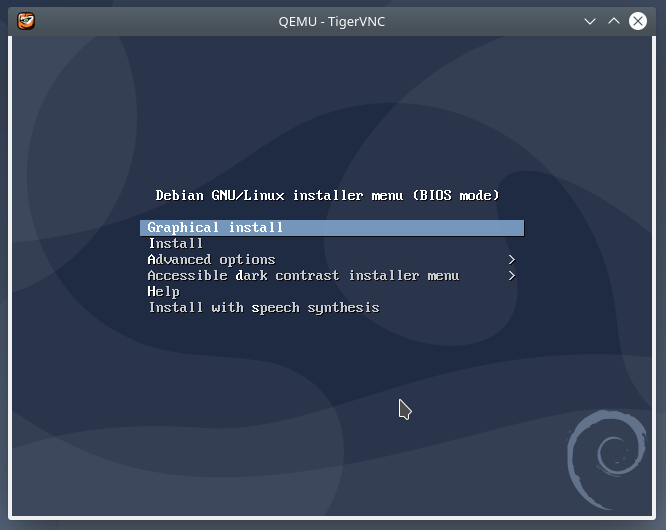

## Introduction

In this tutorial we will learn how to install QEMU on a Managed Server. With QEMU on a Managed Server you can run a guest operating system in emulation mode.

**Prerequisites**

- [Managed Server](https://www.hetzner.com/managed-server?country=ot) with enabled SSH access
- Hetzner Development Package (hos-dev) -> please ask the support

## Step 1 - Install QEMU and dependencies

We need to download and compile the source.

Before we start, create a directory for the sources to keep the home directory clean.

```bash
cd
mkdir src
cd src
```

### Step 1.1 - QEMU dependencies

First install the following dependencies using the Custom Software Installer.

```bash
software install pkg-config
software install ninja
software install glib
software install pixman
```

### Step 1.2 - QEMU source installation

Finally download and compile the QEMU sources.

- Always check [here](https://www.qemu.org/) for newer stable versions

```bash
wget https://download.qemu.org/qemu-5.2.0.tar.xz
tar xJvf qemu-5.2.0.tar.xz
cd qemu-5.2.0
./configure --prefix=/usr/home/holu/qemu
make -j $(($(grep ^cpu\ cores /proc/cpuinfo | uniq | sed s/[^0-9]//g)+1))
make install
cd ..
```

## Step 2 - Post Installation

### Step 2.1 - Start your first guest OS

Below there is an example how to create a qcow2 image and trigger the installation of a Debian guest OS from an ISO image. Networking inside of the guest should work without any further configurations.

```bash
/usr/home/holu/qemu/bin/qemu-img create -f qcow2 debguest.img 60G
wget https://cdimage.debian.org/debian-cd/current/amd64/iso-cd/debian-10.7.0-amd64-netinst.iso
/usr/home/holu/qemu/bin/qemu-system-x86_64 -hda debguest.img -cdrom debian-10.7.0-amd64-netinst.iso -m 8G
```

If your Qemu process gets killed, please consider to ask the support for process releases. Example: In the case of qemu-system-x86_64 the name of the process is "qemu-system-x86".

### Step 2.2 - Access the guest OS using VNC

By default a VNC server on Port 5900 will also start when you start a QEMU guest. You can use this VNC server to get graphical remote access to your guest. The easiest way to access it is a SSH tunnel from a local workstation.

```bash
ssh holu@dediX.your-server.de -p222 -L 5900:localhost:5900
```

You can now use any VNC client to connect to port 5900/tcp on the localhost of your workstation.



## Conclusion

Now you know a solution to how to run a guest OS on a Manged Server using QEMU. You can use such guests for small jobs that require a special environment for instance. Please also understand that this is only an emulator so the performance is not as good as KVM based QEMU guests. Please read the following documentation for further information.

- [QEMU Documentation](https://www.qemu.org/docs/master/)
- [QEMU Wiki](https://wiki.qemu.org/)

##### License: MIT

<!--

Contributor's Certificate of Origin

By making a contribution to this project, I certify that:

(a) The contribution was created in whole or in part by me and I have
    the right to submit it under the license indicated in the file; or

(b) The contribution is based upon previous work that, to the best of my
    knowledge, is covered under an appropriate license and I have the
    right under that license to submit that work with modifications,
    whether created in whole or in part by me, under the same license
    (unless I am permitted to submit under a different license), as
    indicated in the file; or

(c) The contribution was provided directly to me by some other person
    who certified (a), (b) or (c) and I have not modified it.

(d) I understand and agree that this project and the contribution are
    public and that a record of the contribution (including all personal
    information I submit with it, including my sign-off) is maintained
    indefinitely and may be redistributed consistent with this project
    or the license(s) involved.

Signed-off-by: [Alexander Knerlein alexanderknerlein@outlook.de]

-->
