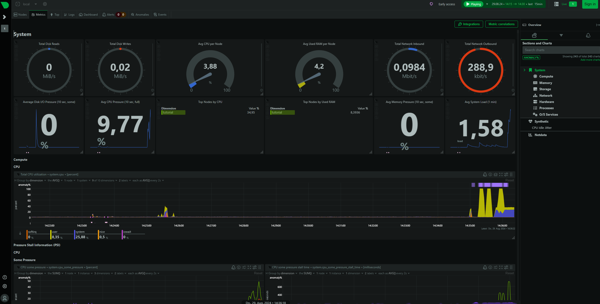

## Introduction

In this tutorial, we're going to install Netdata and learn how to prevent public access to its web interface, since Netdata doesn't provide authentication by itself.

Netdata is a distributed, real-time performance and health monitoring tool for systems and applications. It is a highly-optimized monitoring agent that can be installed on Linux servers.

**Prerequisites**

* A fresh CentOS or Ubuntu installation (almost all mainstream distributions are supported though)
* Access to the root user or a user with sudo permissions

**Example terminology**

* Domain: `example.com`
* Username: `holu`

## Step 1 - Install and configure Netdata

### Step 1.1 - Installation

In order to install the latest version of Netdata, you can use a bash script provided by Netdata.

> There are alternative methods of installation which you can check out on [the Netdata website](https://learn.netdata.cloud/docs/agent/packaging/installer/#alternative-methods).

Simply run the following in your terminal:

```bash
bash <(curl -Ss https://get.netdata.cloud/kickstart.sh)
```

Example output:

```shellsession
 --- Using /tmp/netdata-kickstart-X3dtqRNrP9 as a temporary directory. ---
 --- Checking for existing installations of Netdata... ---
 --- No existing installations of netdata found, assuming this is a fresh install. ---
 --- Attempting to install using native packages... ---
 --- Checking for availability of repository configuration package. ---
[/tmp/netdata-kickstart-X3dtqRNrP9]$ /usr/bin/curl --fail -q -sSL --connect-timeout 10 --retry 3 --output /tmp/netdata-kickstart-X3dtqRNrP9/netdata-repo-edge_3-2+ubuntu24.04_all.deb https://repo.netdata.cloud/repos/repoconfig/ubuntu/noble/netdata-repo-edge_3-2+ubuntu24.04_all.deb
 OK

Root privileges required to run env apt-get update
[/tmp/netdata-kickstart-X3dtqRNrP9]$ sudo env apt-get update
[sudo] password for holu:
```

You should see something like the example output above. If you're not running the script as root, it'll ask you for your sudo password.

After providing the sudo password, it'll let you know what necessary dependencies are missing, so you can install them by entering `y`.

```shellsession
The following additional packages will be installed:
  debian-keyring
The following NEW packages will be installed:
  debian-keyring netdata-repo-edge
0 upgraded, 2 newly installed, 0 to remove and 106 not upgraded.
Need to get 31.3 MB/31.3 MB of archives.
After this operation, 33.1 MB of additional disk space will be used.
Do you want to continue? [Y/n] y

The following NEW packages will be installed:
  libbson-1.0-0t64 libmongoc-1.0-0t64 libmongocrypt0 libnetfilter-acct1 libsnappy1v5 libutf8proc3 netdata netdata-plugin-apps
  netdata-plugin-chartsd netdata-plugin-debugfs netdata-plugin-ebpf netdata-plugin-go netdata-plugin-network-viewer netdata-plugin-nfacct
  netdata-plugin-perf netdata-plugin-pythond netdata-plugin-slabinfo netdata-plugin-systemd-journal
0 upgraded, 18 newly installed, 0 to remove and 107 not upgraded.
Need to get 45.2 MB of archives.
After this operation, 152 MB of additional disk space will be used.
Do you want to continue? [Y/n] y

```

Once done, Netdata is automatically started and enabled on systemd. Check the status via systemctl:

```bash
sudo systemctl status netdata
```

If it is not running yet, you can start it with:

```bash
sudo systemctl enable netdata
sudo systemctl start netdata
```

You can now access Netdata web interface via:

```http
<your_host>:19999
```

### Step 1.2 - Configuration

Now we need to make sure Netdata only listens on `127.0.0.1` since we don't want the web interface to be accessible on the internet.

Open the `/etc/netdata/netdata.conf` file with an editor of your choice.

> If the file is still empty, you can download the latest version of this file, using:
> ```bash
> sudo wget -O /etc/netdata/netdata.conf http://localhost:19999/netdata.conf
> ```

```bash
sudo nano /etc/netdata/netdata.conf
```

Find the `[web]` section and uncomment the `bind to` setting. Replace it with the following:

```
bind to = 127.0.0.1
```

Now, apply the change:

```bash
sudo systemctl restart netdata
sudo systemctl status netdata
```

After the restart, you can no longer access the Netdata web interface at `<your_host>:19999`.

## Step 2 - Install and configure NGINX

In this step, we will install NGINX to set up a reverse proxy so we're able to access the Netdata web interface securely.

### Step 2.1 - Installation

You can install NGINX and apache2-utils by running the following commands:
(apache2-utils is needed for the second part of this step)

* Debian/Ubuntu:
  ```bash
  sudo apt install nginx apache2-utils
  ```

* Redhat/CentOS/Fedora:
  ```bash
  sudo yum install nginx httpd-tools
  ```

Your NGINX setup should be good to go.

```bash
nginx -version
sudo systemctl status nginx
```

If it is not running yet, you can start it with:

```bash
sudo systemctl enable nginx
sudo systemctl start nginx
```

### Step 2.2 - Setup Authentication

Run this command to create a username-password pair:

> Replace `holu` with a username of your choice.

```bash
sudo htpasswd -c /etc/nginx/.htpasswd holu
```

Press Enter and type the password for holu at the prompts.

Confirm that the username-password pair has been created by running:

```bash
cat /etc/nginx/.htpasswd
```

### Step 2.3 - Configuration

Open your NGINX configuration file (`nginx.conf`) and find the `http` block. Your `nginx.conf` file is usually located in `/usr/local/nginx/conf`, `/etc/nginx`, or `/usr/local/etc/nginx`-

Add the following lines into your `http` block:

> Replace `example.com` with your own domain.

```nginx
        upstream backend {
                server 127.0.0.1:19999;
                keepalive 64;
        }

        server {
                listen 80;
                # Uncomment the line below for IPv6
                #listen [::]:80;
                server_name example.com;

                auth_basic "Protected";
                auth_basic_user_file /etc/nginx/.htpasswd;

                location / {
                        proxy_set_header X-Forwarded-Host $host;
                        proxy_set_header X-Forwarded-Server $host;
                        proxy_set_header X-Forwarded-For $proxy_add_x_forwarded_for;
                        proxy_pass http://backend;
                        proxy_http_version 1.1;
                        proxy_pass_request_headers on;
                        proxy_set_header Connection "keep-alive";
                        proxy_store off;
                }
        }
```

Save the configuration file and close it. Then verify the configuration to check if everything is OK.

```bash
sudo nginx -t
```

Go ahead and reload NGINX if there was no error:

```bash
sudo systemctl reload nginx
```

Open your browser and navigate to the public IP of your server or `<example.com>`. Use your username-password pair to access the web interface.



## Conclusion

In this tutorial we installed Netdata and used NGINX to set up a reverse proxy so we're able to prevent public access to the Netdata web interface.

##### License: MIT

<!--

Contributor's Certificate of Origin

By making a contribution to this project, I certify that:

(a) The contribution was created in whole or in part by me and I have
    the right to submit it under the license indicated in the file; or

(b) The contribution is based upon previous work that, to the best of my
    knowledge, is covered under an appropriate license and I have the
    right under that license to submit that work with modifications,
    whether created in whole or in part by me, under the same license
    (unless I am permitted to submit under a different license), as
    indicated in the file; or

(c) The contribution was provided directly to me by some other person
    who certified (a), (b) or (c) and I have not modified it.

(d) I understand and agree that this project and the contribution are
    public and that a record of the contribution (including all personal
    information I submit with it, including my sign-off) is maintained
    indefinitely and may be redistributed consistent with this project
    or the license(s) involved.

Signed-off-by: [Amir Keshavarz amirkekh@gmail.com]

-->
